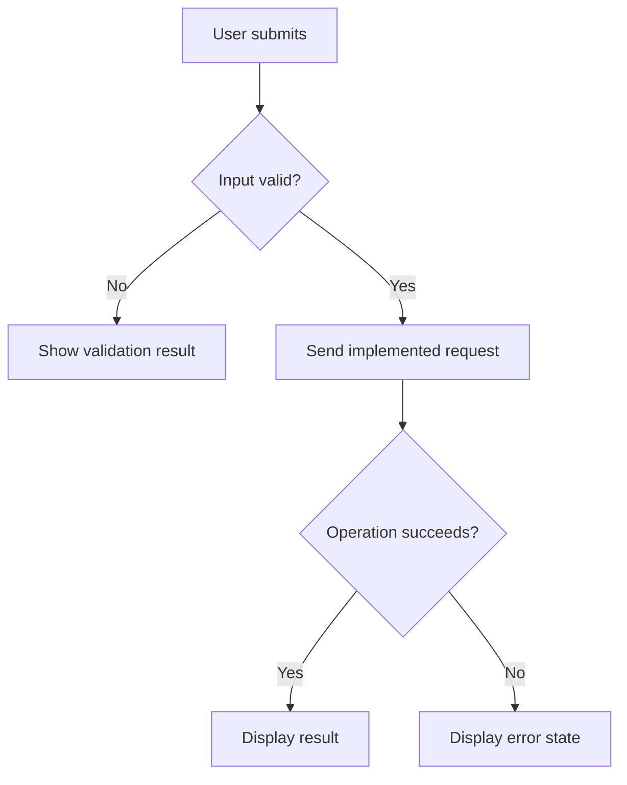

# Storybook Specification Format

Use the smallest subset of this outline that completely explains the implemented feature. Keep an overview and its supporting details near each other; do not create empty or ceremonial sections.

## Recommended hierarchy

```text
Specifications
├── Overview
└── <Module or feature>
    ├── Overview
    ├── Screen and user flow
    ├── Behavior, validation, and errors
    ├── API, DTO, and data access
    └── Traceability and diagrams
```

Use one page for a small feature. Split the last four areas only where a single page would become difficult to scan.

## Feature overview

State, based on evidence:

- **Purpose:** What outcome the feature provides.
- **Users:** Only roles or audiences confirmed by UI, authorization, copy, or implementation context.
- **Entry point:** Route, navigation item, linked screen, or other implemented trigger.
- **Main flow:** `Open → provide conditions → validate → execute → process → display result` adjusted to the actual flow.
- **Related components:** Relevant screens, API/handlers, DTOs, services, tables, and external services.

## Screen and fields

For each material screen or surface, describe its purpose, entry condition, primary actions, navigation/exit, and implemented loading, empty, error, and success states.

Use a table for meaningful controls:

| Field/action | Type | Required | Editable | Default | Validation | Purpose |
| --- | --- | --- | --- | --- | --- | --- |
| Example filter | Select | Yes | Yes | None | Selection required | Narrows the result |

Omit obvious controls and attributes that are not implemented or do not affect behavior.

## Flow, user stories, and acceptance criteria

Show the user’s real path with important success, validation-error, processing-error, cancellation, and retry branches only where implemented or meaningful.

Write user stories for distinct user goals, not individual fields or buttons:

```text
US-01 — <goal>

As a <confirmed user>
I want <observed capability>
So that <evidenced outcome>.
```

Use `Given / When / Then` acceptance criteria for observable behavior. Where the audience or intent is not confirmed, state that rather than inventing it.

## Validation and errors

Capture validation and user-meaningful failures in one primary table:

| Field / condition | Rule | Trigger | User-visible result | Implemented at |
| --- | --- | --- | --- | --- |

Mark the implementation layer precisely: UI, API/DTO, business logic, or database constraint. Document technical exceptions only when they change the flow or user result.

## Technical behavior

Describe business processing in actual execution order. Capture only material conditions, for example:

```text
If a primary key is available, compare by primary key.
Otherwise, use the configured comparison key.
```

Document transformation as `input → transformation → output` when it helps explain a contract or result.

For each relevant API, include method, path, purpose, authentication/authorization if confirmed, request and response shapes, validation, and meaningful error cases. List only DTO fields that participate in the feature.

For database access, include only used tables and material columns:

| Table | Column | Used for | Read/write |
| --- | --- | --- | --- |

Note relationships, joins, filters, sorting, pagination, transactions, and indexes only where they affect implemented behavior or performance.

## Diagrams

Add Mermaid flowcharts for nontrivial decisions and outcome paths. Add sequence diagrams for important cross-boundary interactions. Match actual architecture and omit decorative detail.



## Traceability

Link each responsibility to its implementation:

| Responsibility | Implementation |
| --- | --- |
| Screen | `path/to/Screen.tsx` |
| Request contract | `path/to/dto.ts` |
| Processing | `path/to/service.ts:method` |
| Data access | `path/to/repository.ts:method` |

For high-impact logic, add a requirement-to-code table:

| Requirement / observed behavior | UI | API/DTO | Logic | Data |
| --- | --- | --- | --- | --- |

State `Not confirmed from current implementation` for unavailable evidence instead of filling a gap with a guess.
