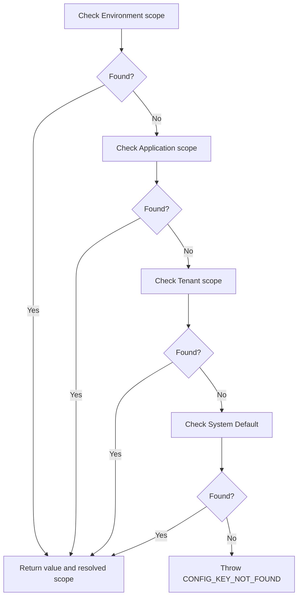
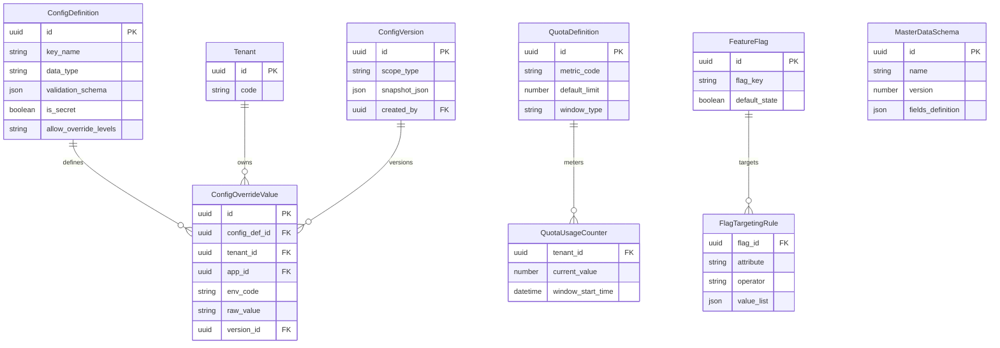
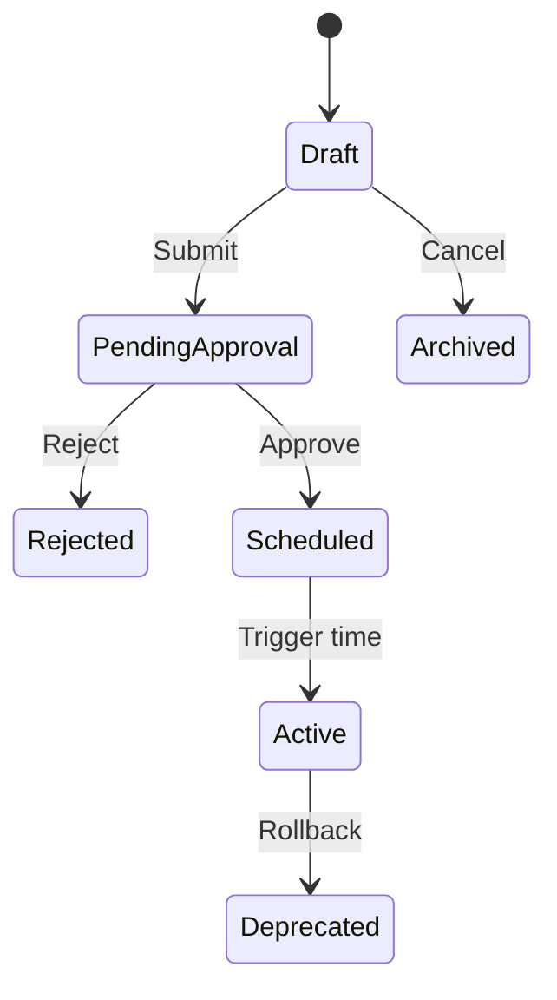

import { Meta } from '@storybook/addon-docs/blocks';
import { Badge, Card } from '../components/ui';
import { DocumentationTable } from './DocumentationTable';

<Meta title="Proposals/Configuration Platform" />

# Configuration Platform Proposal

## Proposed scope hierarchy and complexity mitigation

Tài liệu này mô tả kiến trúc mục tiêu cho nền tảng cấu hình đa tenant của
Flexi. Đây là **đề xuất thiết kế và backlog**, không phải mô tả hành vi đã được
triển khai trong production.

<div className="grid grid-cols-1 gap-md md:grid-cols-4">
  <Card>
    <div className="flex flex-col gap-sm">
      <Badge tone="neutral">Level 0</Badge>
      <strong>System Default</strong>
      <span className="font-body-sm text-body-sm text-on-surface-variant">
        Giá trị mặc định thấp nhất của toàn nền tảng.
      </span>
    </div>
  </Card>
  <Card>
    <div className="flex flex-col gap-sm">
      <Badge tone="neutral">Level 1</Badge>
      <strong>Tenant</strong>
      <span className="font-body-sm text-body-sm text-on-surface-variant">
        Giá trị áp dụng cho toàn bộ tenant.
      </span>
    </div>
  </Card>
  <Card>
    <div className="flex flex-col gap-sm">
      <Badge tone="warning">Level 2</Badge>
      <strong>Application</strong>
      <span className="font-body-sm text-body-sm text-on-surface-variant">
        Giá trị riêng của một ứng dụng trong tenant.
      </span>
    </div>
  </Card>
  <Card>
    <div className="flex flex-col gap-sm">
      <Badge tone="success">Level 3</Badge>
      <strong>Environment</strong>
      <span className="font-body-sm text-body-sm text-on-surface-variant">
        Giá trị ưu tiên cao nhất cho một môi trường.
      </span>
    </div>
  </Card>
</div>

Thứ tự phân giải là `Environment → Application → Tenant → System Default`.
Để giới hạn configuration sprawl:

- **Scope lock:** `allow_override_levels` trên System definition khai báo rõ
  tầng nào được override từng key.
- **Inheritance tracing:** kết quả luôn gồm `effective_value` và
  `resolved_scope`, giúp truy vết nguồn của giá trị.
- **Strict type inheritance:** override không được thay đổi kiểu dữ liệu hoặc
  validation rule đã khai báo ở System level.

## 1. Objectives and scope

### In scope

- Dynamic configuration management với schema-driven validation.
- Multi-tier inheritance và effective-value resolution.
- Envelope-encrypted secret management, rotation và KMS/Vault degradation.
- Distributed quota engine với atomic reservation và usage metering.
- Schema-versioned master data và bảo vệ reference integrity.
- Scheduled release, approval, feature flag và append-only audit.

### Out of scope

- GraphQL configuration API; contract đề xuất chỉ dùng REST.
- Hard real-time video/audio streaming configuration engine.

## 2. Actors and permissions

<DocumentationTable
  columns={[
    { id: 'actor', header: 'Actor', width: 'w-1/5' },
    { id: 'description', header: 'Mô tả', width: 'w-1/4' },
    { id: 'permissions', header: 'Quyền chính', width: 'w-1/3' },
    { id: 'scope', header: 'Scope', width: 'w-1/5' },
  ]}
  rows={[
    {
      id: 'system-admin',
      actor: 'System Admin',
      description: 'Quản lý global catalog và platform quota.',
      permissions: (
        <>
          <code>config.system.manage</code>, <code>secret.system.manage</code>
        </>
      ),
      scope: 'Global / System',
    },
    {
      id: 'tenant-admin',
      actor: 'Tenant Admin',
      description: 'Quản lý tenant default và tenant secret.',
      permissions: (
        <>
          <code>config.tenant.manage</code>, <code>approval.tenant.review</code>
        </>
      ),
      scope: 'Tenant',
    },
    {
      id: 'app-owner',
      actor: 'App Owner',
      description: 'Cấu hình ứng dụng cụ thể trong tenant.',
      permissions: (
        <>
          <code>config.app.write</code>, <code>feature_flag.manage</code>
        </>
      ),
      scope: 'Application',
    },
    {
      id: 'env-admin',
      actor: 'DevOps / Env Admin',
      description:
        'Quản lý override theo môi trường như Staging và Production.',
      permissions: (
        <>
          <code>config.env.write</code>, <code>secret.env.write</code>
        </>
      ),
      scope: 'Environment',
    },
    {
      id: 'auditor',
      actor: 'Auditor',
      description: 'Kiểm tra append-only log và configuration drift.',
      permissions: (
        <>
          <code>audit.read</code>, <code>config.read_history</code>
        </>
      ),
      scope: 'All scopes, read-only',
    },
    {
      id: 'system-service',
      actor: 'System Service',
      description: 'Machine actor đọc effective value tại runtime.',
      permissions: (
        <>
          <code>config.effective.read</code>, <code>quota.reserve</code>
        </>
      ),
      scope: 'Runtime service',
    },
  ]}
/>

## 3. Functional requirements

### Core configuration engine

- **[MVP] Schema Catalog:** khai báo key, mô tả, kiểu `string`, `number`,
  `boolean`, `json`, `enum`, `secret`, `reference`, default value và các tầng
  được override.
- **[MVP] Effective Resolution:** REST endpoint trả về toàn bộ key/value đã
  phân giải theo thứ tự precedence.
- **[Prod-Ready] Dynamic Redis Cache Invalidation:** Pub/Sub flush versioned
  cache key trên các instance trong vòng 500 ms sau mutation.
- **[Enterprise] Scheduled Activation:** stage thay đổi theo thời điểm tương
  lai và tự rollback nếu activation thất bại.

### Secrets and KMS engine

- **[MVP] Envelope Encryption:** AES-256-GCM dùng Data Encryption Key (DEK),
  DEK được wrap bởi Master Encryption Key (MEK) qua KMS/Vault.
- **[Prod-Ready] Secret Rotation:** rotation DEK/MEK thủ công hoặc tự động mà
  không làm gián đoạn runtime application.
- **[Enterprise] Zero-Downtime KMS Fallback:** in-memory fallback và circuit
  breaker khi KMS/Vault không truy cập được.

### Quota engine and usage metering

- **[MVP] Static Quota Limits:** quota theo tenant/application và time window.
- **[Prod-Ready] Atomic Reservation:** Redis Lua script thực hiện reservation
  nguyên tử để tránh race condition.
- **[Enterprise] Usage Metering and Billing Export:** aggregate bất đồng bộ và
  đẩy usage sang worker queue cho billing pipeline.

### Master data management

- **[MVP] Schema Definition:** master-data table có primitive type và index
  parameter.
- **[Prod-Ready] Schema Versioning:** migration cho thay đổi tương thích ngược.
- **[Enterprise] Referential Safeguards:** chặn xóa hoặc structural mutation
  khi record đang được workflow hoặc dynamic table sử dụng.

### Governance and operations

- **[Prod-Ready] Version Control and Rollback:** snapshot theo thời điểm, delta
  comparison và rollback.
- **[Enterprise] Bulk Import/Export and Change Approval:** JSON/YAML bulk
  operation có schema validation và peer review bắt buộc cho Production.

## 4. Business rules and technical trade-offs

### Precedence resolution



### KMS failure and decrypted-secret caching

- Plaintext secret **không bao giờ** được lưu trong Redis hoặc ghi xuống disk.
- Cache plaintext chỉ tồn tại trong memory của Node.js process, TTL tối đa 60
  giây.
- Khi KMS/Vault down, hệ thống ưu tiên availability và có thể trả last cached
  value trong grace period tối đa 30 phút.
- Khi grace period hết hạn, request cần secret bị từ chối bằng `503 Service
Unavailable`.

### Concurrent quota reservation

Token Bucket chạy trong Redis Lua script. Request gọi `EVALSHA`; Redis decrement
nguyên tử và trả `GRANTED` nếu còn token, hoặc `EXCEEDED` kèm
`retry_after_ms` nếu quota đã hết. Redis là single point of failure của quota
enforcement; mitigation đề xuất là Redis Sentinel hoặc Cluster.

### Master-data reference integrity

- Record đang được tham chiếu chỉ được soft-delete bằng
  `status: 'DEPRECATED'`.
- Structural change bắt buộc tăng schema version, ví dụ `v1 → v2`.
- Dynamic table gắn với `v1` tiếp tục đọc `v1` cho đến khi được migrate rõ ràng.

## 5. Conceptual data model



`app_id` và `env_code` là optional trên override. Mô hình trên là conceptual;
tên bảng, kiểu cột, constraint và index cuối cùng phải được chốt trong thiết kế
persistence.

## 6. Abstract API contracts

### Resolve effective configurations

`GET /api/v1/configs/effective`

Headers: `X-Tenant-ID`, `X-App-ID` (optional), `X-Env-Code` (optional).

```json
{
  "data": {
    "db.max_connections": {
      "value": 50,
      "data_type": "number",
      "resolved_from": "ENVIRONMENT",
      "version": 12
    },
    "integration.stripe.api_key": {
      "value": "REDACTED_SECRET",
      "data_type": "secret",
      "resolved_from": "TENANT",
      "version": 3
    }
  }
}
```

### Reserve quota

`POST /api/v1/quotas/reserve`

```json
{
  "metric_code": "API_REQUESTS_PER_MINUTE",
  "requested_tokens": 1
}
```

Response `200 OK`:

```json
{
  "status": "ALLOWED",
  "remaining_tokens": 499,
  "reset_in_ms": 12400
}
```

### Submit configuration draft for review

`POST /api/v1/configs/change-requests`

```json
{
  "scope_level": "ENVIRONMENT",
  "env_code": "PRODUCTION",
  "changes": [{ "key_name": "payment.gateway.timeout", "value": "5000" }],
  "scheduled_at": "2026-09-01T00:00:00Z"
}
```

## 7. Lifecycle and state machine



<DocumentationTable
  columns={[
    { id: 'state', header: 'State', width: 'w-1/4' },
    { id: 'meaning', header: 'Ý nghĩa', width: 'w-3/4' },
  ]}
  rows={[
    {
      id: 'draft',
      state: 'Draft',
      meaning: 'Được developer/admin chỉnh sửa, chưa commit.',
    },
    {
      id: 'pending',
      state: 'Pending Approval',
      meaning: 'Khóa chỉnh sửa và chờ reviewer ký duyệt.',
    },
    {
      id: 'scheduled',
      state: 'Scheduled',
      meaning: 'Đã duyệt, chờ target time trong worker queue.',
    },
    {
      id: 'active',
      state: 'Active',
      meaning: 'Giá trị production đang phục vụ runtime query.',
    },
  ]}
/>

## 8. Validation and error cases

<DocumentationTable
  columns={[
    { id: 'category', header: 'Category', width: 'w-1/6' },
    { id: 'trigger', header: 'Trigger', width: 'w-1/3' },
    { id: 'code', header: 'Error code', width: 'w-1/4' },
    { id: 'handling', header: 'Response', width: 'w-1/4' },
  ]}
  rows={[
    {
      id: 'validation',
      category: 'Validation',
      trigger: 'Value không đạt JSON Schema trong catalog.',
      code: <code>ERR_CONFIG_INVALID_SCHEMA</code>,
      handling: '422 với chi tiết schema deviation.',
    },
    {
      id: 'precedence',
      category: 'Precedence',
      trigger: 'Override tại tầng không nằm trong allow_override_levels.',
      code: <code>ERR_OVERRIDE_LEVEL_DISALLOWED</code>,
      handling: '400 và danh sách tầng hợp lệ.',
    },
    {
      id: 'secret',
      category: 'Secret',
      trigger: 'MEK unreachable và local cache đã hết hạn.',
      code: <code>ERR_KMS_UNAVAILABLE_NOCACHE</code>,
      handling: '503 qua circuit breaker.',
    },
    {
      id: 'quota',
      category: 'Quota',
      trigger: 'Token Bucket capacity bằng 0.',
      code: <code>ERR_QUOTA_EXCEEDED</code>,
      handling: '429 kèm Retry-After.',
    },
    {
      id: 'master-data',
      category: 'Master Data',
      trigger: 'Xóa schema version đang được dynamic table sử dụng.',
      code: <code>ERR_MASTER_DATA_IN_USE</code>,
      handling: '409 và danh sách referencing entity ID.',
    },
  ]}
/>

## 9. Security and tenant isolation

- Mọi PostgreSQL read/write của configuration override phải có `tenant_id`
  filter, hoặc dùng PostgreSQL schema riêng theo provisioning tier.
- Logger và observability pipeline thay mọi field có `is_secret: true` bằng
  `[REDACTED_SECRET]` trước serialization.
- Standard effective-list endpoint không trả plaintext secret. Chỉ dedicated
  single-secret endpoint có RBAC `secret.read_decrypted` mới được phép trả giá
  trị giải mã.
- Nightly encrypted dump của configuration và envelope key được lưu trên S3
  multi-region cô lập.
- Khi MEK bị hỏng, break-glass CLI offline có thể re-wrap DEK bằng cold-storage
  backup key.

## 10. Audit and observability

Mọi thay đổi cấu hình sinh immutable record trong append-only PostgreSQL table
hoặc dedicated event stream.

<DocumentationTable
  columns={[
    { id: 'field', header: 'Audit field', width: 'w-1/3' },
    { id: 'rule', header: 'Quy tắc', width: 'w-2/3' },
  ]}
  rows={[
    {
      id: 'timestamp',
      field: <code>timestamp</code>,
      rule: 'Thời điểm mutation.',
    },
    {
      id: 'tenant',
      field: <code>tenant_id</code>,
      rule: 'Tenant chịu tác động.',
    },
    {
      id: 'actor',
      field: <code>actor_id</code>,
      rule: 'Danh tính actor thực hiện.',
    },
    {
      id: 'scope',
      field: <code>scope</code>,
      rule: 'Tầng cấu hình bị thay đổi.',
    },
    {
      id: 'key',
      field: <code>key_name</code>,
      rule: 'Configuration key bị thay đổi.',
    },
    {
      id: 'old',
      field: <code>old_value_hash</code>,
      rule: 'SHA-256 hash; không lưu secret plaintext/ciphertext.',
    },
    {
      id: 'new',
      field: <code>new_value_hash</code>,
      rule: 'SHA-256 hash; không lưu secret plaintext/ciphertext.',
    },
    { id: 'ip', field: <code>client_ip</code>, rule: 'Địa chỉ IP nguồn.' },
  ]}
/>

Audit log online được đề xuất giữ 90 ngày. Worker bất đồng bộ export Parquet
sang cloud storage cho enterprise retention 365 ngày.

## 11. Acceptance criteria

### AC-01 — Precedence overriding

**Given** System default `max_items = 10` và Tenant override
`max_items = 25`  
**When** service đọc effective configuration với `X-Tenant-ID: T1` và không có
environment code  
**Then** response trả `max_items = 25` và `resolved_from: "TENANT"`.

### AC-02 — Concurrent quota enforcement

**Given** tenant chỉ còn một token trong rate-limit bucket  
**When** hai request đồng thời gọi `/quotas/reserve`  
**Then** đúng một request nhận `ALLOWED` (`200`) và request còn lại nhận
`EXCEEDED` (`429`).

### AC-03 — KMS outage resilience

**Given** decrypted secret còn 30 giây TTL trong process memory và KMS/Vault
offline  
**When** application yêu cầu secret trong thời gian đó  
**Then** service trả cached secret mà không phát sinh lỗi `500` hoặc `503`.

## 12. Dependencies

<DocumentationTable
  columns={[
    { id: 'dependency', header: 'Dependency', width: 'w-1/4' },
    { id: 'purpose', header: 'Vai trò', width: 'w-3/4' },
  ]}
  rows={[
    {
      id: 'postgres',
      dependency: 'PostgreSQL',
      purpose: 'Lưu catalog, scope, schema version và audit log.',
    },
    {
      id: 'redis',
      dependency: 'Redis',
      purpose: 'Effective-config cache và Lua-based quota engine.',
    },
    {
      id: 'kms',
      dependency: 'AWS KMS / HashiCorp Vault',
      purpose: 'Wrap và unwrap encryption keys.',
    },
    {
      id: 'auth',
      dependency: 'Flexi Auth Module',
      purpose: 'Nguồn tenant identity và RBAC role.',
    },
  ]}
/>

## 13. Open decisions

<DocumentationTable
  columns={[
    { id: 'area', header: 'Khu vực', width: 'w-1/4' },
    { id: 'decision', header: 'Quyết định cần chốt', width: 'w-1/2' },
    { id: 'tradeoff', header: 'Trade-off', width: 'w-1/4' },
  ]}
  rows={[
    {
      id: 'flags',
      area: 'Feature flags',
      decision:
        'Hỗ trợ client-side evaluation qua OpenFeature SDK hay chỉ server-side API?',
      tradeoff: 'Latency và system complexity.',
    },
    {
      id: 'master-data',
      area: 'Master data',
      decision:
        'Lưu JSONB trong Core DB hay provision vào relational schema riêng của tenant?',
      tradeoff: 'Analytics xuyên tenant và isolation sâu.',
    },
    {
      id: 'approval',
      area: 'Approval policy',
      decision:
        'Enterprise tenant cần multi-step approval tùy biến hay một approver cố định?',
      tradeoff: 'Governance và workflow complexity.',
    },
  ]}
/>

## 14. Implementation backlog

### Epic 1 — Scope hierarchy and effective-value engine

- <Badge tone="success">MVP</Badge> Tạo schema cho `ConfigDefinition` và
  `ConfigOverrideValue` hỗ trợ các scope level.
- <Badge tone="success">MVP</Badge> Xây resolution engine theo thứ tự
  `Environment → Application → Tenant → System`.
- <Badge tone="warning">Prod-Ready</Badge> Thêm Redis Pub/Sub invalidation cho
  resolved cache.
- <Badge tone="success">MVP</Badge> Validator cho `string`, `number`, `boolean`,
  `json`.
- <Badge tone="warning">Prod-Ready</Badge> Validate `allow_override_levels` khi
  tạo override.

### Epic 2 — Secret management and KMS integration

- <Badge tone="success">MVP</Badge> AES-256-GCM envelope encryption tích hợp AWS
  KMS hoặc Vault.
- <Badge tone="success">MVP</Badge> Mask secret trên logger và default REST
  response.
- <Badge tone="warning">Prod-Ready</Badge> Short-lived in-memory secret cache
  với TTL tối đa 60 giây.
- <Badge tone="neutral">Enterprise</Badge> Circuit breaker và KMS grace-period
  fallback.
- <Badge tone="neutral">Enterprise</Badge> Background job tự động rotate DEK.

### Epic 3 — Distributed quota and metering

- <Badge tone="success">MVP</Badge> Static quota check theo tenant.
- <Badge tone="warning">Prod-Ready</Badge> Atomic Token Bucket bằng Redis Lua.
- <Badge tone="neutral">Enterprise</Badge> Usage-metering producer đẩy token
  consumption event vào worker queue.

### Epic 4 — Governance, versioning and master data

- <Badge tone="warning">Prod-Ready</Badge> Append-only snapshot history và
  point-in-time rollback.
- <Badge tone="neutral">Enterprise</Badge> Change Request workflow từ Draft đến
  Scheduled Activation.
- <Badge tone="success">MVP</Badge> CRUD API cho Master Data Schema và simple
  record storage.
- <Badge tone="warning">Prod-Ready</Badge> Master Data schema versioning và
  soft-delete reference lock.
