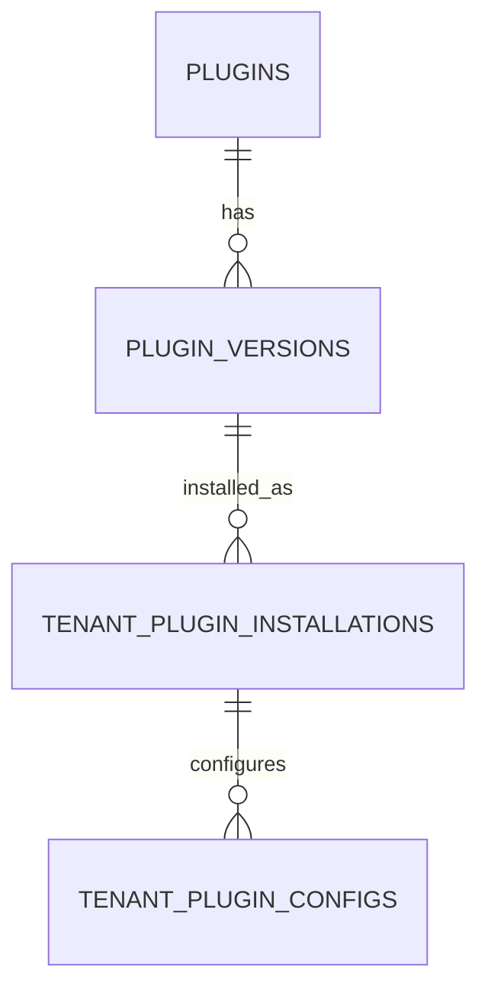
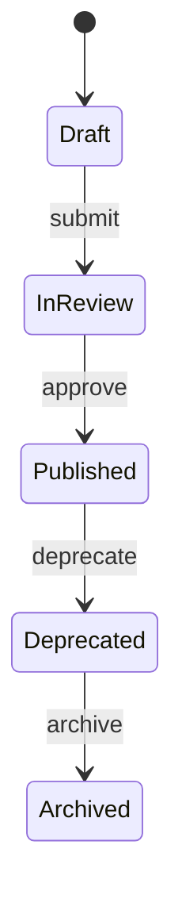
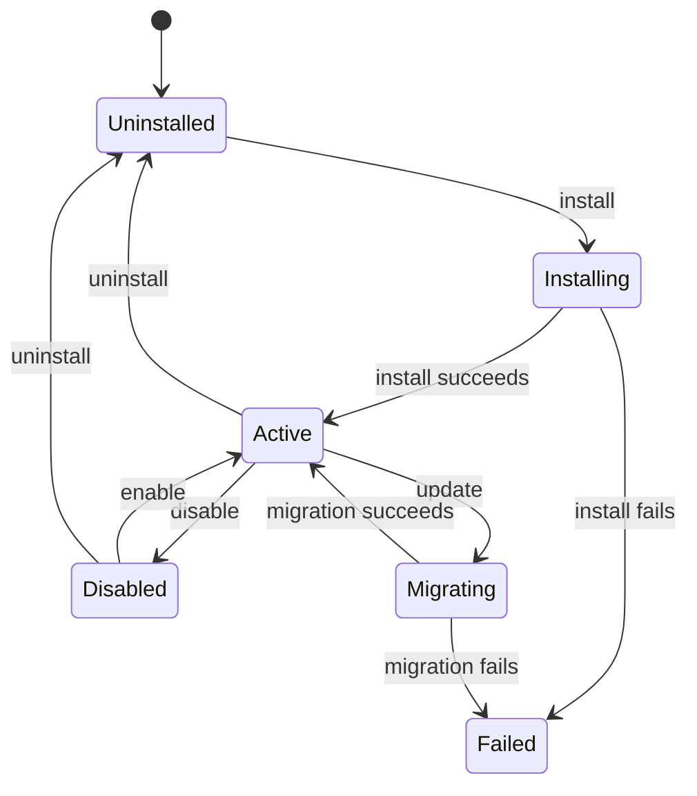
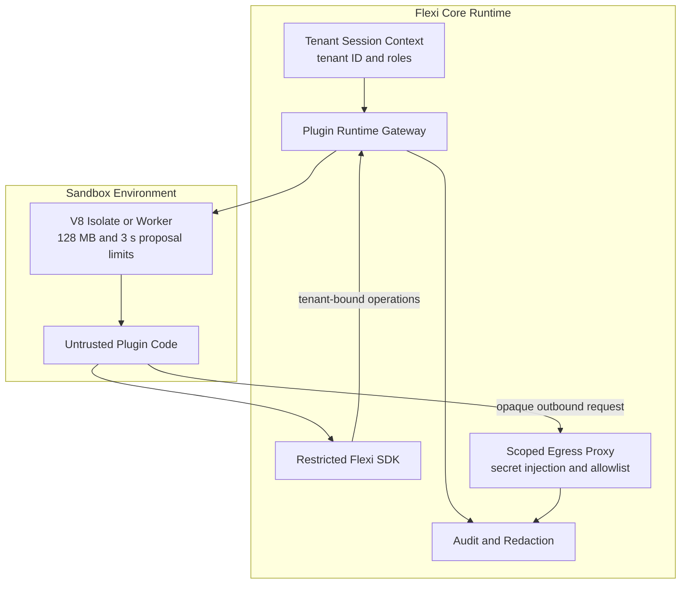
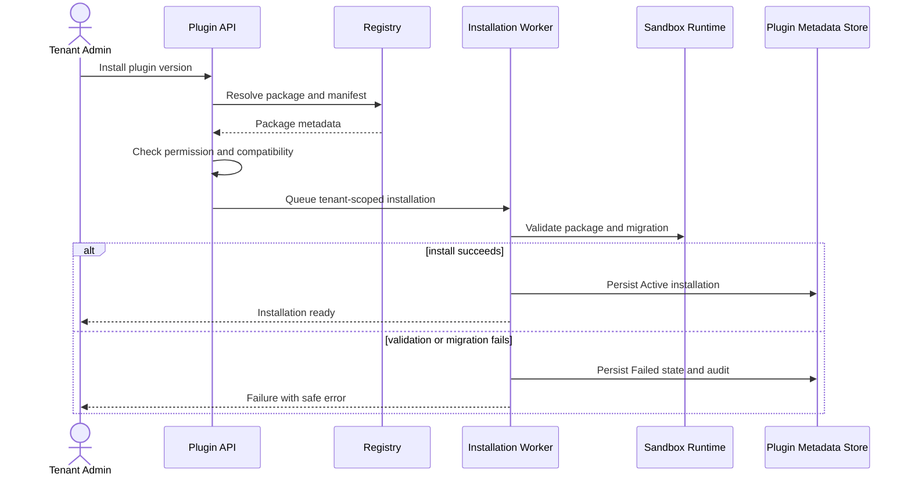
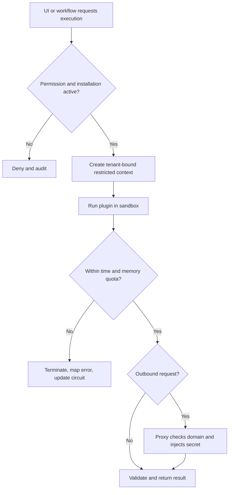

import { Meta } from '@storybook/addon-docs/blocks';
import { Badge, Card } from '../components/ui';
import { DocumentationTable } from './DocumentationTable';

<Meta title="Proposals/Extension Engine" />

# Extension Engine Architecture Proposal

## Cơ chế mở rộng an toàn cho nền tảng Flexi

Tài liệu này mô tả **kiến trúc mục tiêu và backlog đề xuất** cho Extension
Engine, cho phép tích hợp plugin frontend và backend mà vẫn bảo vệ độ tin cậy
của Flexi và tính cô lập dữ liệu giữa các tenant.

  <Card>
    

      <Badge tone="warning">Proposed</Badge>
      <strong>Chưa được triển khai</strong>
      
        Repo hiện chưa có plugin module, API, UI, shared contract hoặc data
        model cho Extension Engine.
      
    

  </Card>
  <Card>
    

      <Badge tone="success">Non-negotiable</Badge>
      <strong>Tenant isolation</strong>
      
        Plugin chỉ truy cập dữ liệu qua Flexi SDK với tenant context do core
        cung cấp; không được nhận database client trực tiếp.
      
    

  </Card>
  <Card>
    

      <Badge tone="neutral">Phased delivery</Badge>
      <strong>MVP → Private → Enterprise</strong>
      
        Registry, extension points, sandbox và security controls được mở rộng
        theo ba giai đoạn có chủ đích.
      
    

  </Card>

> **Trạng thái tài liệu:** Proposal. Các contract, permission, giới hạn tài
> nguyên, lifecycle và backlog bên dưới chưa phải cam kết production. Mọi mục
> chưa có bằng chứng trong code được xem là **Not confirmed from current
> implementation**.

## 1. Mục tiêu và phạm vi theo giai đoạn

<DocumentationTable
  columns={[
    { id: 'capability', header: 'Năng lực', width: 'w-1/5' },
    { id: 'mvp', header: 'Giai đoạn 1 — MVP', width: 'w-1/4' },
    { id: 'private', header: 'Giai đoạn 2 — Production-ready', width: 'w-1/4' },
    { id: 'enterprise', header: 'Giai đoạn 3 — Enterprise', width: 'w-1/4' },
  ]}
  rows={[
    {
      id: 'registry',
      capability: 'Registry scope',
      mvp: 'Internal Registry; System Admin upload ZIP/tarball.',
      private: 'Private Tenant Marketplace; tenant chọn và cài từ kho nội bộ.',
      enterprise:
        'Public Marketplace; external developer publish và thương mại hóa.',
    },
    {
      id: 'extension-points',
      capability: 'Extension points',
      mvp: 'Workflow Action, Dynamic Field Type, Validation Function.',
      private: 'Page Component, Connector, Theme, Template.',
      enterprise: 'Toàn bộ extension point và Custom API Trigger.',
    },
    {
      id: 'sandbox',
      capability: 'Sandbox execution',
      mvp: (
        <>
          V8 isolate bằng <code>isolated-vm</code> và timeout cơ bản.
        </>
      ),
      private: 'Web Worker hoặc iframe UI sandbox; circuit breaker.',
      enterprise: 'WASM, container sandbox hoặc micro-VM.',
    },
    {
      id: 'security',
      capability: 'An toàn và bảo mật',
      mvp: 'Kiểm tra manifest tĩnh và RBAC cơ bản.',
      private: 'Digital signature và scoped network proxy.',
      enterprise: 'Automated AST security scanning và egress firewall.',
    },
    {
      id: 'installation',
      capability: 'Cài đặt và migration',
      mvp: 'Global scope; tenant enable/disable.',
      private: 'Tenant-level scope và automated data schema migration.',
      enterprise: 'Rolling upgrade, canary deployment và auto rollback.',
    },
  ]}
/>

### Ngoài phạm vi MVP

- Public marketplace, billing và publisher monetization.
- Arbitrary frontend module loading ngoài sandbox đã được chọn.
- Direct database, environment-variable hoặc unrestricted network access.
- Dedicated micro-VM cho từng tenant.
- Automated schema migration không có guardrail hoặc approval policy.

## 2. Actors và permissions đề xuất

<DocumentationTable
  columns={[
    { id: 'actor', header: 'Actor', width: 'w-1/5' },
    { id: 'permissions', header: 'Permissions', width: 'w-2/5' },
    { id: 'responsibility', header: 'Trách nhiệm', width: 'w-2/5' },
  ]}
  rows={[
    {
      id: 'system-admin',
      actor: 'System Admin',
      permissions: (
        <>
          <code>plugin:system:publish</code>, <code>plugin:system:approve</code>
          , <code>plugin:system:install_global</code>
        </>
      ),
      responsibility:
        'Publish vào system registry, approve public listing và quản lý global availability.',
    },
    {
      id: 'tenant-admin',
      actor: 'Tenant Admin',
      permissions: (
        <>
          <code>plugin:tenant:browse</code>, <code>plugin:tenant:install</code>,{' '}
          <code>plugin:tenant:uninstall</code>,{' '}
          <code>plugin:tenant:configure</code>
        </>
      ),
      responsibility: 'Chọn, cài, gỡ và cấu hình plugin trong đúng tenant.',
    },
    {
      id: 'developer',
      actor: 'Plugin Developer',
      permissions: (
        <>
          <code>plugin:dev:upload</code>, <code>plugin:dev:view_logs</code>
        </>
      ),
      responsibility:
        'Nộp release kèm manifest và xem sandbox log của plugin mình sở hữu.',
    },
    {
      id: 'tenant-user',
      actor: 'Tenant User',
      permissions: <code>plugin:runtime:execute</code>,
      responsibility:
        'Khởi chạy tính năng plugin thông qua UI hoặc workflow được phép.',
    },
  ]}
/>

Permission names, role mapping và ownership rules đều **chưa được xác nhận từ
implementation hiện tại**.

## 3. Functional requirements

### 3.1 Plugin Manifest Engine

Tệp `flexi-plugin.json` là contract khai báo của một release. Manifest mục
tiêu chứa:

- Metadata: `id`, `version`, `author`.
- Extension points và entry point tương ứng.
- Scoped permissions và allowed outbound domains.
- Required configuration và secret placeholders.
- Dependencies và khoảng phiên bản core trong `flexiVersion`.

Manifest phải được validate trước khi package được unpack hoặc thực thi. JSON
Schema, canonical package layout và ownership của plugin ID là contract cần
chốt trong giai đoạn thiết kế chi tiết.

### 3.2 Quản lý vòng đời plugin

- Cài đặt, configuration, runtime state và failure state được quản lý độc lập
  theo tenant.
- Update chỉ chuyển active version sau khi compatibility check và migration
  thành công.
- Uninstall dọn tài nguyên do plugin sở hữu theo retention policy; “dọn sạch”
  không được hiểu là xóa dữ liệu không thể khôi phục nếu chưa có approval.
- Migration failure phải giữ hoặc khôi phục version hoạt động trước đó; chiến
  lược transaction/compensation chưa được xác nhận.

### 3.3 Extension points

<DocumentationTable
  columns={[
    { id: 'point', header: 'Extension point', width: 'w-1/4' },
    { id: 'surface', header: 'Bề mặt', width: 'w-1/5' },
    { id: 'contract', header: 'Contract mục tiêu', width: 'w-3/5' },
  ]}
  rows={[
    {
      id: 'page-theme',
      point: 'Page Component & Theme',
      surface: 'Frontend',
      contract:
        'Render UI tùy biến trong host surface với sandbox, capability grant và versioned UI SDK.',
    },
    {
      id: 'field-type',
      point: 'Dynamic Table Field Type',
      surface: 'Frontend + Backend',
      contract:
        'Khai báo renderer, serializer và validation cho kiểu dữ liệu mới.',
    },
    {
      id: 'workflow',
      point: 'Workflow Trigger / Action / Validation',
      surface: 'Backend runtime',
      contract:
        'Thực thi logic không tin cậy trong sandbox với timeout và memory quota.',
    },
    {
      id: 'connector',
      point: 'Connector',
      surface: 'Backend + Proxy',
      contract:
        'Kết nối REST/OAuth2 qua scoped egress proxy; plugin không nhận plaintext secret.',
    },
  ]}
/>

## 4. Business rules và security invariants

<DocumentationTable
  columns={[
    { id: 'rule', header: 'Quy tắc', width: 'w-1/4' },
    { id: 'behavior', header: 'Hành vi bắt buộc', width: 'w-1/2' },
    { id: 'failure', header: 'Kết quả khi vi phạm', width: 'w-1/4' },
  ]}
  rows={[
    {
      id: 'tenant-isolation',
      rule: 'Tenant isolation',
      behavior: (
        <>
          Không inject database client. Mọi data call đi qua Flexi SDK đã bind
          <code> tenant_id</code> từ session context.
        </>
      ),
      failure: 'Deny request, audit security event và không chạy plugin code.',
    },
    {
      id: 'compatibility',
      rule: 'SemVer compatibility',
      behavior: (
        <>
          Core version phải nằm trong khoảng <code>flexiVersion</code> của
          manifest.
        </>
      ),
      failure: 'Fail fast trước install hoặc activation.',
    },
    {
      id: 'circuit-breaker',
      rule: 'Failure isolation',
      behavior:
        'Quá 5 crash/resource failures trong một phút sẽ mở circuit breaker.',
      failure: (
        <>
          Chuyển runtime state sang <code>DEGRADED</code> và từ chối execution
          mới.
        </>
      ),
    },
    {
      id: 'secret-redaction',
      rule: 'Secret redaction',
      behavior:
        'Sandbox chỉ nhận placeholder hoặc opaque reference; proxy inject secret ở network layer.',
      failure: 'Deny egress, redact log và ghi audit event.',
    },
  ]}
/>

Ngưỡng `5 lần/phút` là giá trị proposal. Loại lỗi nào được tính vào circuit
breaker, cửa sổ trượt và điều kiện recovery cần được chốt trước implementation.

## 5. Conceptual data model

<DocumentationTable
  columns={[
    { id: 'entity', header: 'Entity', width: 'w-1/5' },
    { id: 'attributes', header: 'Thuộc tính chính', width: 'w-2/5' },
    { id: 'purpose', header: 'Mục đích', width: 'w-1/4' },
    { id: 'scope', header: 'Scope', width: 'w-1/6' },
  ]}
  rows={[
    {
      id: 'plugins',
      entity: 'Plugins',
      attributes: <code>id, name, type, publisher_id, is_official</code>,
      purpose: 'Danh mục và publisher identity của plugin.',
      scope: 'Global',
    },
    {
      id: 'versions',
      entity: 'PluginVersions',
      attributes: (
        <code>
          id, plugin_id, version, manifest_json, package_url, signature
        </code>
      ),
      purpose: 'Immutable release package, manifest và signature.',
      scope: 'Global',
    },
    {
      id: 'installations',
      entity: 'TenantPluginInstallations',
      attributes: (
        <code>id, tenant_id, plugin_version_id, status, installed_at</code>
      ),
      purpose: 'Version và lifecycle state của plugin trong một tenant.',
      scope: 'Tenant',
    },
    {
      id: 'configs',
      entity: 'TenantPluginConfigs',
      attributes: (
        <code>id, installation_id, config_key, encrypted_value, is_secret</code>
      ),
      purpose: 'Configuration và encrypted secret theo installation.',
      scope: 'Tenant',
    },
  ]}
/>

Đây là mô hình khái niệm, chưa phải Prisma schema. Cần bổ sung unique keys,
foreign-key behavior, version immutability, installation history, publisher
model, audit linkage và retention policy trong technical design.

## 6. REST API contract mục tiêu

API backend hiện dùng global prefix `/api`; các path dưới đây đã bao gồm prefix
đó. Response envelope phải tuân theo convention chung của Flexi nếu được triển
khai.

<DocumentationTable
  columns={[
    { id: 'method', header: 'Method', width: 'w-1/12' },
    { id: 'endpoint', header: 'Endpoint', width: 'w-1/3' },
    { id: 'role', header: 'Actor', width: 'w-1/5' },
    { id: 'purpose', header: 'Mục đích', width: 'w-2/5' },
  ]}
  rows={[
    {
      id: 'upload',
      method: 'POST',
      endpoint: <code>/api/v1/admin/plugins/upload</code>,
      role: 'System Admin / Developer',
      purpose:
        'Upload package, parse manifest; verify signature khi capability này được đưa vào phase tương ứng.',
    },
    {
      id: 'browse',
      method: 'GET',
      endpoint: <code>/api/v1/tenant/plugins</code>,
      role: 'Tenant Admin',
      purpose:
        'Liệt kê catalog khả dụng và installation state của tenant hiện tại.',
    },
    {
      id: 'install',
      method: 'POST',
      endpoint: <code>/api/v1/tenant/plugins/:id/install</code>,
      role: 'Tenant Admin',
      purpose: 'Cài version tương thích và chạy migration theo policy.',
    },
    {
      id: 'config',
      method: 'PUT',
      endpoint: <code>/api/v1/tenant/plugins/:id/config</code>,
      role: 'Tenant Admin',
      purpose: 'Cập nhật configuration và secret của tenant.',
    },
    {
      id: 'status',
      method: 'PATCH',
      endpoint: <code>/api/v1/tenant/plugins/:id/status</code>,
      role: 'Tenant Admin',
      purpose: 'Enable hoặc disable installation.',
    },
    {
      id: 'execute',
      method: 'POST',
      endpoint: <code>/api/v1/runtime/plugins/execute</code>,
      role: 'Tenant User',
      purpose: 'Dispatch action hoặc validation đến sandbox runtime.',
    },
  ]}
/>

Request DTO, response DTO, idempotency, pagination, upload size, content type,
authorization guard và exact error envelope đều **chưa được xác nhận từ
implementation hiện tại**.

## 7. Lifecycle và state machine

### Global plugin version

### Tenant installation

`DEGRADED` được business rule sử dụng nhưng chưa có trong tenant installation
state machine. Cần quyết định đây là runtime health state độc lập hay một
installation status trước khi định nghĩa enum và transition.

## 8. Validation và error cases

<DocumentationTable
  columns={[
    { id: 'condition', header: 'Điều kiện', width: 'w-1/4' },
    { id: 'rule', header: 'Rule mục tiêu', width: 'w-2/5' },
    { id: 'result', header: 'Kết quả', width: 'w-1/3' },
  ]}
  rows={[
    {
      id: 'manifest',
      condition: 'Manifest parse error',
      rule: (
        <>
          Bắt buộc có <code>id</code>, <code>version</code> và{' '}
          <code>extensionPoints</code>; JSON phải khớp schema.
        </>
      ),
      result: 'Từ chối upload trước unpack/execute.',
    },
    {
      id: 'signature',
      condition: 'Signature verification failed',
      rule: 'Package signature phải khớp registered publisher public key.',
      result: 'Từ chối publish/install; ghi security audit.',
    },
    {
      id: 'timeout',
      condition: 'Sandbox timeout',
      rule: 'Validation Function hoặc Workflow Action tối đa 3.000 ms.',
      result: <code>PLUGIN_EXECUTION_TIMEOUT</code>,
    },
    {
      id: 'memory',
      condition: 'Memory quota exceeded',
      rule: 'V8 isolate tối đa 128 MB.',
      result: <code>PLUGIN_MEMORY_LIMIT_EXCEEDED</code>,
    },
    {
      id: 'compatibility',
      condition: 'Core version incompatible',
      rule: (
        <>
          Current core version nằm ngoài manifest <code>flexiVersion</code>.
        </>
      ),
      result: 'Từ chối install/activate trước runtime.',
    },
  ]}
/>

Timeout và RAM limit là budget đề xuất, chưa được benchmark. Source proposal
dùng cả `PLUGIN_EXECUTION_TIMEOUT` và `PLUGIN_TIMEOUT` cho cùng một lỗi; tài
liệu chưa tự chọn một mã để tránh che khuất mâu thuẫn contract.

## 9. Security architecture và tenant isolation

### Frontend isolation

- Dynamic modules được load trong iframe với `sandbox="allow-scripts"` hoặc
  một cơ chế cô lập được stakeholder phê duyệt.
- Shadow DOM chỉ cô lập CSS; tự nó không phải security boundary cho JavaScript.
- Plugin không được đọc cookie, local storage hoặc DOM của host application.
- Host giao tiếp qua versioned message contract, validate origin, message type
  và payload; exact IPC contract là open design item.

### Backend isolation

- Backend JavaScript mục tiêu chạy trong V8 isolate; không expose `fs`,
  `child_process`, `net`, process environment hoặc database client.
- Flexi SDK bridge chỉ cung cấp capability đã grant và tự động bind tenant
  context của request hiện tại.
- Runtime áp dụng deadline, memory quota, cancellation và structured error
  mapping tại boundary.

### Network và secret safety

- Manifest phải khai báo domain allowlist trước khi plugin được phép egress.
- Secret dùng placeholder như `{'{{secrets.API_KEY}}'}` hoặc opaque reference.
- Egress proxy inject secret ngay trước khi gửi request; sandbox không nhận
  plaintext.
- Redirect, DNS rebinding, private IP range và response-size policy cần được
  đưa vào threat model chi tiết.

## 10. Audit và observability

<DocumentationTable
  columns={[
    { id: 'area', header: 'Bề mặt', width: 'w-1/5' },
    { id: 'minimum', header: 'Dữ liệu tối thiểu', width: 'w-2/5' },
    { id: 'behavior', header: 'Hành vi mục tiêu', width: 'w-2/5' },
  ]}
  rows={[
    {
      id: 'audit',
      area: 'Audit log',
      minimum: (
        <code>
          tenant_id, plugin_id, version, actor_id, action, timestamp, ip_address
        </code>
      ),
      behavior:
        'Ghi install, update, config mutation, enable/disable, uninstall và runtime security failure.',
    },
    {
      id: 'logs',
      area: 'Plugin logs',
      minimum: 'Plugin, tenant, execution ID, severity và structured message.',
      behavior:
        'Redact token, password, secret và PII trước central log storage.',
    },
    {
      id: 'metrics',
      area: 'Runtime metrics',
      minimum: 'Latency, timeout, error rate, CPU, memory và circuit state.',
      behavior:
        'Phân rã theo plugin và tenant nhưng kiểm soát metric cardinality.',
    },
  ]}
/>

Regex-only redaction không bảo đảm xóa mọi secret/PII. Threat model cần kết hợp
structured logging, field allowlist, entropy/pattern detection và output-size
limit.

## 11. Luồng nghiệp vụ mục tiêu

### Install và activate

Queue names, transaction boundaries, polling/callback behavior và rollback
mechanism chưa được xác nhận.

### Runtime execution

## 12. Acceptance criteria đề xuất

### AC-01 — Cài đặt và cô lập dữ liệu tenant

- **Given** Tenant A và Tenant B cùng tồn tại trên Flexi.
- **And** Tenant Admin A được cấp quyền cài plugin.
- **When** Tenant A cài `Custom PDF Generator` phiên bản `1.0.0` thành công.
- **Then** chỉ Tenant A nhìn thấy và sử dụng extension points của installation.
- **And** menu, configuration, runtime state và dữ liệu của Tenant B không thay
  đổi.
- **And** mọi data operation của plugin mang tenant context của Tenant A và
  không thể chỉ định tenant khác.

### AC-02 — Sandbox timeout không ảnh hưởng Flexi Core

- **Given** Plugin X có action chạy vòng lặp vô hạn.
- **When** workflow của Tenant A gọi action đó.
- **Then** runtime dừng execution tại deadline `3.000 ms` theo sai số kỹ thuật
  được chốt khi benchmark.
- **And** workflow nhận lỗi timeout chuẩn hóa.
- **And** failure được ghi log/audit và cập nhật circuit breaker.
- **And** Flexi Core tiếp tục phục vụ request khác.

> **Open contract:** Source proposal gọi lỗi ở scenario này là
> `PLUGIN_TIMEOUT`, trong khi validation table gọi là
> `PLUGIN_EXECUTION_TIMEOUT`. Chỉ một mã canonical được phép tồn tại khi triển
> khai.

### AC-03 — Secret không xuất hiện trong sandbox hoặc log

- **Given** Tenant Admin đã cấu hình `API_KEY` cho một connector plugin.
- **When** plugin gửi request đến domain có trong allowlist.
- **Then** sandbox chỉ xử lý opaque secret reference.
- **And** proxy inject secret ở network boundary.
- **And** plaintext secret không xuất hiện trong plugin result, exception,
  audit log hoặc application log.

## 13. Dependencies và readiness

<DocumentationTable
  columns={[
    { id: 'dependency', header: 'Dependency mục tiêu', width: 'w-1/3' },
    { id: 'purpose', header: 'Mục đích', width: 'w-2/5' },
    { id: 'current', header: 'Trạng thái quan sát được', width: 'w-1/4' },
  ]}
  rows={[
    {
      id: 'nestjs',
      dependency: 'NestJS runtime integration',
      purpose: 'Registry, lifecycle API, runtime gateway và dependency wiring.',
      current: 'NestJS đã có; plugin module chưa có.',
    },
    {
      id: 'isolate',
      dependency: <code>isolated-vm</code>,
      purpose: 'Backend JavaScript sandbox cho MVP.',
      current: 'Chưa có trong workspace dependencies.',
    },
    {
      id: 'queue',
      dependency: 'BullMQ / Redis',
      purpose: 'Async install, migration và background execution.',
      current: 'BullMQ đã có cho tenant provisioning; plugin queue chưa có.',
    },
    {
      id: 'kms',
      dependency: 'KMS / envelope encryption',
      purpose: 'Mã hóa secret theo tenant và proxy-time injection.',
      current: 'Not confirmed from current implementation.',
    },
    {
      id: 'frontend-sandbox',
      dependency: 'Iframe / Worker host and versioned IPC SDK',
      purpose: 'Cô lập dynamic Page Component, Theme và renderer.',
      current: 'Not confirmed from current implementation.',
    },
  ]}
/>

## 14. Open decisions

<DocumentationTable
  columns={[
    { id: 'decision', header: 'Quyết định', width: 'w-1/4' },
    { id: 'optionA', header: 'Phương án A', width: 'w-1/4' },
    { id: 'optionB', header: 'Phương án B', width: 'w-1/4' },
    { id: 'criterion', header: 'Tiêu chí chốt', width: 'w-1/4' },
  ]}
  rows={[
    {
      id: 'ui-isolation',
      decision: 'UI extension architecture',
      optionA: 'Iframe sandbox: boundary rõ, integration UI khó hơn.',
      optionB:
        'Module Federation / dynamic import: UX mượt hơn, trust boundary yếu hơn.',
      criterion:
        'Threat model, CSP, IPC ergonomics, design-system compatibility và performance.',
    },
    {
      id: 'enterprise-runtime',
      decision: 'Enterprise sandbox topology',
      optionA: 'Shared isolate pool: utilization tốt, blast radius lớn hơn.',
      optionB: 'Dedicated micro-VM per tenant: isolation mạnh, chi phí cao.',
      criterion: 'Tenant tier, compliance, cold-start SLO và unit economics.',
    },
    {
      id: 'migration',
      decision: 'Schema migration approval',
      optionA: 'Tự động khi compatibility checks pass.',
      optionB: 'Tenant Admin duyệt trước khi chạy.',
      criterion:
        'Rollback guarantee, destructive-change detection và maintenance window.',
    },
    {
      id: 'degraded',
      decision: <code>DEGRADED</code>,
      optionA: 'Installation lifecycle state.',
      optionB: 'Runtime health state độc lập.',
      criterion:
        'Recovery transition, UI behavior và version/install semantics.',
    },
    {
      id: 'timeout-code',
      decision: 'Canonical timeout error',
      optionA: <code>PLUGIN_EXECUTION_TIMEOUT</code>,
      optionB: <code>PLUGIN_TIMEOUT</code>,
      criterion: 'Shared error taxonomy và backward compatibility.',
    },
  ]}
/>

## 15. Backlog decomposition

### Epic 1 — Plugin Core Engine & Manifest Resolver

- **Feature 1.1 — Manifest Parsing & Validation**
  - Story 1.1.1: Xây JSON Schema validator cho `flexi-plugin.json`.
  - Story 1.1.2: Kiểm tra SemVer giữa plugin và Flexi Core.
- **Feature 1.2 — V8 Sandbox Runtime**
  - Story 1.2.1: Tích hợp isolate cho backend action.
  - Story 1.2.2: Xây restricted Bridge SDK cho logger và context reader.

### Epic 2 — Tenant Plugin Lifecycle Management

- **Feature 2.1 — Tenant Installation Engine**
  - Story 2.1.1: Cài/gỡ plugin với tenant-scoped state và idempotency.
  - Story 2.1.2: Enable/disable tức thời và đồng bộ runtime cache.
- **Feature 2.2 — Secret Management & Scoped Proxy**
  - Story 2.2.1: UI/API cấu hình secret mã hóa theo tenant.
  - Story 2.2.2: Egress proxy map opaque reference sang secret tại network
    boundary.

### Epic 3 — Security, Failure Isolation & Marketplace

- **Feature 3.1 — Circuit Breaker & Resource Control**
  - Story 3.1.1: Theo dõi và enforce CPU/RAM/deadline budget.
  - Story 3.1.2: Mở circuit breaker và chuyển runtime health khi vượt ngưỡng.
- **Feature 3.2 — Digital Signature Verification**
  - Story 3.2.1: Xác thực PKI signature trước khi unpack package.

Mỗi story cần bổ sung threat model, API/shared contract, unit/e2e test, tenant
isolation test, operational metric và rollback behavior trước sprint planning.

## 16. Implementation traceability

<DocumentationTable
  columns={[
    { id: 'responsibility', header: 'Trách nhiệm', width: 'w-1/3' },
    { id: 'evidence', header: 'Bằng chứng hiện tại', width: 'w-2/3' },
  ]}
  rows={[
    {
      id: 'backend-catalog',
      responsibility: 'Backend module catalog',
      evidence: (
        <>
          <code>apps/backend/src/app.module.ts</code> chưa import plugin module.
        </>
      ),
    },
    {
      id: 'frontend-route',
      responsibility: 'Frontend entry point',
      evidence: (
        <>
          <code>apps/frontend/src/router.tsx</code> chưa khai báo plugin route
          hoặc marketplace UI.
        </>
      ),
    },
    {
      id: 'data-model',
      responsibility: 'Persistence model',
      evidence: (
        <>
          <code>apps/backend/prisma/schema.prisma</code> chưa có bốn entity
          plugin đề xuất.
        </>
      ),
    },
    {
      id: 'tenant-foundation',
      responsibility: 'Tenant isolation foundation',
      evidence: (
        <>
          <code>apps/backend/src/tenancy</code> và tenant schema provisioning đã
          tồn tại; restricted plugin SDK chưa có.
        </>
      ),
    },
    {
      id: 'queue-foundation',
      responsibility: 'Async worker foundation',
      evidence: (
        <>
          <code>apps/backend/package.json</code> đã có BullMQ; chưa có plugin
          installation/runtime worker.
        </>
      ),
    },
    {
      id: 'sandbox-runtime',
      responsibility: 'Sandbox runtime',
      evidence: (
        <>
          <code>isolated-vm</code> không có trong workspace dependency manifest
          hiện tại.
        </>
      ),
    },
  ]}
/>

## Kết luận kiến trúc

Định hướng proposal phù hợp với nền tảng multi-tenant của Flexi ở mức nguyên
tắc: tenant context phải được core kiểm soát, workload không tin cậy cần
sandbox, secret chỉ được sử dụng qua proxy và failure phải bị giới hạn blast
radius. Tuy nhiên, thiết kế chưa đủ để implementation cho đến khi chốt UI
security boundary, IPC/message contract, migration rollback, package trust
chain, canonical lifecycle/error enums và threat model cho egress.
