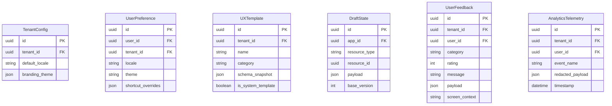
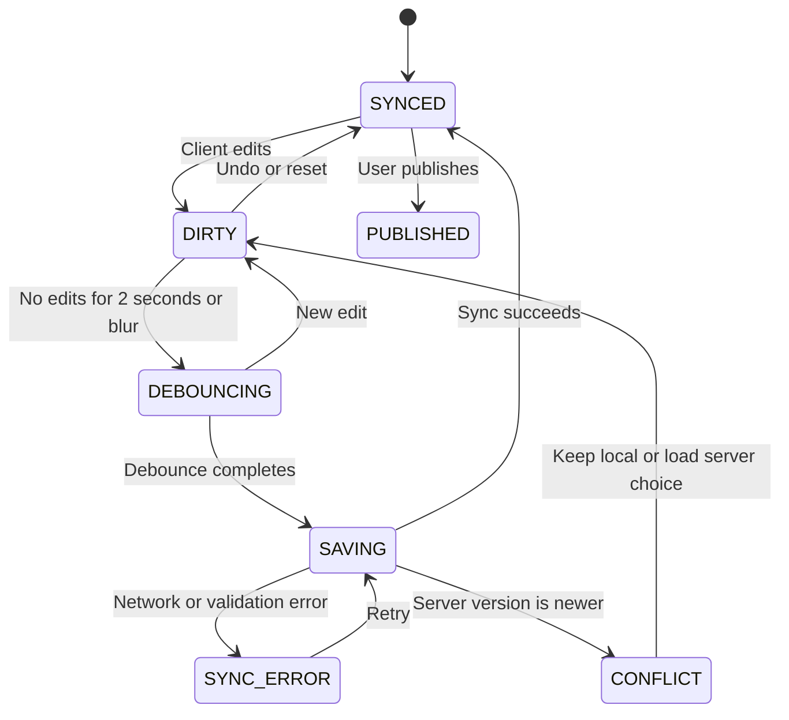

import { Meta } from '@storybook/addon-docs/blocks';
import { Badge, Card } from '../components/ui';
import { DocumentationTable } from './DocumentationTable';

<Meta title="Proposals/Platform UX Requirements" />

# Platform UX Requirements

<Card className="mb-lg">
  <div className="mb-sm flex flex-wrap items-center gap-sm">
    <Badge tone="warning">Target requirements</Badge>
    <Badge tone="neutral">Chưa được implementation xác nhận</Badge>
  </div>
  <p className="m-0">
    Tài liệu này mô tả UX mục tiêu cho Builder và Runtime của Flexi, phục vụ
    Non-technical Maker và Developer trong bối cảnh enterprise. Các contract,
    permission, entity và backlog bên dưới là đề xuất thiết kế; chúng không phải
    mô tả API hay hành vi production hiện có.
  </p>
</Card>

## 1. Mục tiêu và phạm vi

Tối ưu trải nghiệm thiết kế và vận hành ứng dụng, giảm thời gian từ ý tưởng đến
sản phẩm cho Maker, đồng thời cung cấp công cụ có độ chính xác cao cho
Developer.

<DocumentationTable
  columns={[
    { id: 'tier', header: 'Phân tầng', width: 'w-1/5' },
    { id: 'scope', header: 'Phạm vi mục tiêu', width: 'w-4/5' },
  ]}
  rows={[
    {
      id: 'mvp',
      tier: <Badge tone="primary">MVP</Badge>,
      scope:
        'First-run tour; tạo Sample App một click; System Template Gallery; autosave debounce và navigation guard; responsive preview Desktop/Tablet/Mobile; Command Palette; keyboard navigation cơ bản theo WCAG 2.1 AA; i18n tĩnh cho Builder và Runtime.',
    },
    {
      id: 'production',
      tier: <Badge tone="success">Production-ready</Badge>,
      scope:
        'Undo/Redo 30 bước; Contextual Help và interactive empty states; tenant-scoped Global Resource Finder; actionable errors; screen-reader compliance; product analytics, in-app feedback và quản lý bản dịch nội dung động.',
    },
    {
      id: 'enterprise',
      tier: <Badge tone="neutral">Enterprise / Advanced</Badge>,
      scope:
        'Template Gallery theo tenant; co-authoring presence; remap keyboard shortcuts; offline draft sync qua IndexedDB.',
    },
  ]}
/>

## 2. Actors và permissions mục tiêu

Permission code trong bảng là contract đề xuất và chưa được xác nhận trong
permission catalog hiện tại.

<DocumentationTable
  columns={[
    { id: 'actor', header: 'Actor', width: 'w-1/5' },
    { id: 'role', header: 'Vai trò UX', width: 'w-2/5' },
    { id: 'access', header: 'Quyền UX cốt lõi', width: 'w-2/5' },
  ]}
  rows={[
    {
      id: 'platform-admin',
      actor: 'Platform Admin',
      role: 'Quản trị hệ thống Flexi.',
      access: 'Quản lý System Templates và xem analytics toàn hệ thống.',
    },
    {
      id: 'tenant-admin',
      actor: 'Tenant Admin',
      role: 'Quản trị tổ chức hoặc doanh nghiệp.',
      access: 'Quản lý Tenant Templates, locale mặc định và branding.',
    },
    {
      id: 'developer',
      actor: 'Developer',
      role: 'Builder nâng cao sử dụng script, SQL hoặc custom CSS.',
      access: (
        <>
          <code>builder:edit</code>, <code>builder:publish</code>, Code/Query
          Editor và Debugger Console.
        </>
      ),
    },
    {
      id: 'maker',
      actor: 'Non-tech Maker',
      role: 'Builder kéo-thả sử dụng UI và workflow có sẵn.',
      access: (
        <>
          <code>builder:edit</code>, <code>builder:publish</code>, Visual
          Builder và Form Builder.
        </>
      ),
    },
    {
      id: 'end-user',
      actor: 'End-user',
      role: 'Người dùng cuối của ứng dụng đã tạo.',
      access: (
        <>
          <code>runtime:access</code>; chỉ thao tác trên Runtime đã publish.
        </>
      ),
    },
  ]}
/>

## 3. Yêu cầu chức năng

### Onboarding và hỗ trợ

- **First-run onboarding:** wizard ba bước sau provisioning: chọn Maker hoặc
  Developer; chọn tạo mới, Sample App hoặc Template; sau đó tour qua Canvas,
  Left Tree, Inspector và Top Bar.
- **Sample Application:** cung cấp CRM hoặc Task Management hoàn chỉnh với dữ
  liệu, pages và workflows mẫu.
- **Template Gallery:** duyệt, tìm kiếm, preview và nhân bản ứng dụng từ thư
  viện mẫu.
- **Contextual Help:** drawer bên phải tự đổi nội dung theo component hoặc
  workflow node đang được chọn.

### Builder experience và safety

- **Responsive Canvas:** chuyển giữa Desktop `1440px`, Tablet `768px` và Mobile
  `375px`; hỗ trợ fluid mode và custom breakpoint.
- **Autosave:** lưu `DRAFT` sau 2 giây không có thao tác hoặc khi blur khỏi
  trường nhập liệu.
- **Unsaved-change Guard:** chặn chuyển route hoặc đóng tab khi draft chưa đồng
  bộ thành công với server.
- **Undo/Redo:** lưu tối đa 30 thao tác trong phiên; hỗ trợ `Cmd+Z` và
  `Cmd+Shift+Z`.

### Navigation và discovery

- **Command Palette:** `Cmd+K` hoặc `Ctrl+K` tìm Page, Workflow, Dynamic Table,
  Cron Job và chạy system command như tạo bảng hoặc publish app.
- **Global Resource Finder:** tìm kiếm full-text, lọc theo loại tài nguyên và
  luôn giới hạn theo tenant.

### Accessibility và localization

- **WCAG 2.1 AA:** contrast tối thiểu `4.5:1`, focus indicator dùng
  `focus-visible`, không keyboard trap và thông báo trạng thái qua `aria-live`.
- **Builder i18n:** đổi ngôn ngữ giao diện giữa tiếng Anh và tiếng Việt.
- **Runtime i18n:** quản lý từ điển đa ngôn ngữ cho label và dữ liệu động của
  ứng dụng.

## 4. Quy tắc nghiệp vụ mục tiêu

<DocumentationTable
  columns={[
    { id: 'rule', header: 'Rule', width: 'w-1/6' },
    { id: 'name', header: 'Tên', width: 'w-1/4' },
    { id: 'requirement', header: 'Yêu cầu', width: 'w-7/12' },
  ]}
  rows={[
    {
      id: 'br-01',
      rule: 'BR-01',
      name: 'Tenant Scope Lock',
      requirement:
        'Command Palette, Global Finder và template nội bộ phải lọc cứng theo tenant_id; không được lộ dữ liệu giữa tenant.',
    },
    {
      id: 'br-02',
      rule: 'BR-02',
      name: 'Draft Execution',
      requirement:
        'Autosave chỉ ghi phiên bản DRAFT và không thay đổi PUBLISHED đang phục vụ End-user.',
    },
    {
      id: 'br-03',
      rule: 'BR-03',
      name: 'Conflict Resolution',
      requirement:
        'Nếu server draft mới hơn client, dừng autosave và mở Conflict Modal trước khi ghi tiếp.',
    },
    {
      id: 'br-04',
      rule: 'BR-04',
      name: 'Secret Masking',
      requirement:
        'API key, OAuth token, password và dữ liệu nhạy cảm trong configuration hoặc visual log phải hiển thị dạng ********.',
    },
  ]}
/>

## 5. Mô hình dữ liệu khái niệm

Đây là các entity mục tiêu, chưa tương ứng với Prisma model đã được triển khai.



`UXTemplate.tenant_id` được phép rỗng với system template. Quan hệ, index,
retention policy và cascade behavior chưa được xác nhận.

## 6. API capabilities đề xuất

Các endpoint sau là contract-level proposal; backend hiện chưa cung cấp chúng.

```yaml
# Search index cho Command Palette và Global Finder
GET /api/v1/ux/search?q={query}&type={optional_resource_type}
Response: 200 OK
data:
  - id: string
    type: PAGE | WORKFLOW | DYNAMIC_TABLE | CRON
    title: string
    url_path: string
    updated_at: timestamp

# Autosave draft với optimistic concurrency
PUT /api/v1/builder/apps/{app_id}/drafts
Request:
  resource_type: PAGE
  resource_id: string
  base_version: 12
  delta_payload: {}
Response: 200 OK | 409 Conflict with server draft

# Tạo ứng dụng từ template hoặc sample
POST /api/v1/templates/{template_id}/instantiate
Request:
  target_app_name: string
Response: 201 Created with app_id

# Gửi feedback
POST /api/v1/ux/feedback
Request:
  category: BUG | FEATURE_REQUEST
  message: string
  screen_context: string
  metadata: {}
Response: 201 Created
```

Authentication, DTO validation, pagination, rate limit và error envelope chưa
được xác định trong proposal này.

## 7. Lifecycle autosave và publish



Publish chỉ được bắt đầu từ snapshot đã đồng bộ. Cách xử lý khi người dùng
chọn giữ bản local tại trạng thái `CONFLICT` cần được chốt cùng contract API.

## 8. Validation và lỗi

<DocumentationTable
  columns={[
    { id: 'case', header: 'Kịch bản', width: 'w-1/5' },
    { id: 'cause', header: 'Nguyên nhân', width: 'w-1/4' },
    {
      id: 'resolution',
      header: 'UX và actionable resolution',
      width: 'w-7/12',
    },
  ]}
  rows={[
    {
      id: 'network',
      case: 'Autosave fail',
      cause: 'Mất kết nối khi đang chỉnh sửa.',
      resolution:
        'Warning toast: “Đã ngắt kết nối. Bản nháp được lưu cục bộ.” và action “Thử lại”. Loại storage phụ thuộc quyết định OD-03.',
    },
    {
      id: 'conflict',
      case: 'Version conflict (409)',
      cause: 'Server có phiên bản mới hơn.',
      resolution:
        'Conflict Modal cho phép ghi bản local lên server hoặc tải bản server và huỷ thay đổi local; mỗi lựa chọn phá huỷ dữ liệu phải xác nhận rõ.',
    },
    {
      id: 'node-config',
      case: 'Invalid node config',
      cause: 'Sai cú pháp JavaScript hoặc formula trong Inspector.',
      resolution:
        'Node có error indicator; Inspector chỉ rõ dòng lỗi và gợi ý cú pháp hợp lệ.',
    },
    {
      id: 'in-use',
      case: 'Delete in-use resource',
      cause: 'Dynamic Table đang được Workflow tham chiếu.',
      resolution:
        'Chặn xoá, liệt kê các Workflow phụ thuộc và cung cấp action điều hướng tới từng Workflow.',
    },
  ]}
/>

## 9. Security và tenant isolation

- Backend phải lấy tenant scope từ JWT đã xác thực; client không được gửi
  `tenant_id` như nguồn sự thật cho Command Palette, Template Manager hoặc Help
  Search.
- Telemetry sanitizer phải loại giá trị của field `password`, `secret` và
  `token` trước khi gửi.
- Nếu dùng browser storage, key phải chứa tenant, user và app, ví dụ
  `flexi_{tenant_id}_{user_id}_{app_id}`. Prefix giúp tránh collision nhưng
  không thay thế encryption, expiry hoặc cleanup khi logout.

## 10. Audit và observability

<DocumentationTable
  columns={[
    { id: 'area', header: 'Khu vực', width: 'w-1/4' },
    { id: 'events', header: 'Dữ liệu mục tiêu', width: 'w-3/4' },
  ]}
  rows={[
    {
      id: 'telemetry',
      area: 'UX telemetry',
      events:
        'Command Palette usage; onboarding completion; Undo/Redo count; elapsed time from app creation to first publish.',
    },
    {
      id: 'audit',
      area: 'Audit log',
      events: (
        <>
          <code>APP_PUBLISHED</code>, <code>TEMPLATE_INSTANTIATED</code>,{' '}
          <code>APP_ROLLBACK</code> cùng <code>user_id</code>,{' '}
          <code>tenant_id</code>, timestamp, client IP và resource ID.
        </>
      ),
    },
  ]}
/>

Retention, consent, data residency và quyền opt-out của analytics là quyết định
còn thiếu trước khi triển khai enterprise.

## 11. Acceptance criteria mục tiêu

### AC-01 — Autosave và navigation guard

- **Given** Maker đang sửa một page và trạng thái là `DIRTY` hoặc đang sync.
- **When** Maker chuyển sang Workflow, dùng browser Back hoặc đóng tab.
- **Then** hệ thống cảnh báo thay đổi chưa đồng bộ và cung cấp lựa chọn ở lại
  hoặc tiếp tục rời trang.

### AC-02 — Command Palette tenant isolation

- **Given** User A thuộc CompanyX và User B thuộc CompanyY.
- **When** User A mở `Cmd+K` và tìm `Orders`.
- **Then** kết quả chỉ chứa resource User A được phép xem trong CompanyX và
  không chứa resource của CompanyY.

### AC-03 — Keyboard navigation

- **Given** người dùng chỉ sử dụng `Tab`, `Shift+Tab`, `Enter` và `Space`.
- **When** họ điều hướng qua Canvas và Left Sidebar.
- **Then** mọi control có focus indicator rõ ràng, không có keyboard trap, và
  control phù hợp kích hoạt được bằng `Enter` hoặc `Space`.

## 12. Phụ thuộc đề xuất

<DocumentationTable
  columns={[
    { id: 'group', header: 'Nhóm', width: 'w-1/4' },
    { id: 'current', header: 'Đã có bằng chứng', width: 'w-1/3' },
    {
      id: 'proposed',
      header: 'Đề xuất, chưa cài đặt/xác nhận',
      width: 'w-5/12',
    },
  ]}
  rows={[
    {
      id: 'frontend',
      group: 'Frontend',
      current: 'React 18, Vite, React Router, i18next và UI primitives nội bộ.',
      proposed: 'Radix UI hoặc Headless UI; Lucide Icons; Monaco Editor.',
    },
    {
      id: 'state',
      group: 'State và storage',
      current: 'React local state và localStorage cho auth/i18n.',
      proposed:
        'Zustand hoặc Redux Toolkit; TanStack Query; IndexedDB cho offline draft.',
    },
    {
      id: 'backend',
      group: 'Search infrastructure',
      current: 'PostgreSQL và Redis trong hạ tầng dự án.',
      proposed:
        'PostgreSQL Full-Text Search hoặc Redis Search cho tenant-scoped index.',
    },
  ]}
/>

## 13. Quyết định còn mở

<DocumentationTable
  columns={[
    { id: 'decision', header: 'ID / quyết định', width: 'w-1/4' },
    { id: 'optionA', header: 'Lựa chọn A', width: 'w-1/4' },
    { id: 'optionB', header: 'Lựa chọn B', width: 'w-1/4' },
    { id: 'recommendation', header: 'Đề xuất và trade-off', width: 'w-1/4' },
  ]}
  rows={[
    {
      id: 'od-01',
      decision: 'OD-01 — Co-authoring',
      optionA: 'Exclusive page lock.',
      optionB: 'Real-time multiplayer bằng CRDT/OT.',
      recommendation:
        'Chọn A cho MVP để giảm độ phức tạp; B cần protocol, presence và conflict semantics riêng.',
    },
    {
      id: 'od-02',
      decision: 'OD-02 — Dynamic i18n',
      optionA: 'Chỉ dịch static label.',
      optionB: 'Dịch cả dynamic data rows.',
      recommendation:
        'Chọn A cho MVP; B tác động trực tiếp tới schema và query model của Dynamic Tables.',
    },
    {
      id: 'od-03',
      decision: 'OD-03 — Offline draft',
      optionA: 'LocalStorage với dung lượng hạn chế.',
      optionB: 'IndexedDB cho payload lớn.',
      recommendation:
        'Dùng IndexedDB từ Production-ready; cần quota, migration, expiry và cleanup policy.',
    },
  ]}
/>

### Xung đột contract cần thống nhất

Đặc tả Page Builder hiện có đề xuất autosave mỗi 10 giây, Undo/Redo 50 thao tác
và breakpoint Desktop trên 1024px. Tài liệu này lần lượt yêu cầu 2 giây, 30
thao tác và preview cố định 1440/768/375px. Các con số này chưa thể đồng thời là
nguồn sự thật; stakeholder cần chốt một contract trước khi triển khai.

## 14. Backlog đề xuất

<DocumentationTable
  columns={[
    { id: 'epic', header: 'Epic', width: 'w-1/4' },
    { id: 'feature', header: 'Feature', width: 'w-1/4' },
    { id: 'stories', header: 'Stories', width: 'w-1/2' },
  ]}
  rows={[
    {
      id: 'draft-autosave',
      epic: 'Builder Core UX & Safety',
      feature: 'Draft & Autosave',
      stories:
        'Theo dõi isDirty; debounce 2 giây gọi draft API; route/tab guard; xử lý retry và version conflict.',
    },
    {
      id: 'history',
      epic: 'Builder Core UX & Safety',
      feature: 'Undo / Redo',
      stories:
        'History stack 30 thao tác; Cmd+Z và Cmd+Shift+Z; xác định semantics khi autosave hoặc conflict.',
    },
    {
      id: 'onboarding',
      epic: 'Onboarding & Templates',
      feature: 'First-run & Sample App',
      stories:
        'Wizard chào mừng; role-based path; clone schema/data/workflows; retry và rollback khi instantiate lỗi.',
    },
    {
      id: 'templates',
      epic: 'Onboarding & Templates',
      feature: 'Template Gallery',
      stories:
        'Catalog và category filter; preview; tenant-scoped instantiate; system/tenant ownership.',
    },
    {
      id: 'palette',
      epic: 'Navigation & Accessibility',
      feature: 'Command Palette',
      stories:
        'Keyboard-first modal; tenant-scoped search; resource navigation; permission-filtered system commands.',
    },
    {
      id: 'wcag',
      epic: 'Navigation & Accessibility',
      feature: 'WCAG 2.1 AA',
      stories:
        'ARIA semantics/live regions; contrast audit; end-to-end keyboard flow; focus restoration after dialogs.',
    },
  ]}
/>

## 15. Hiện trạng và traceability

<DocumentationTable
  columns={[
    { id: 'capability', header: 'Capability', width: 'w-1/4' },
    { id: 'status', header: 'Hiện trạng', width: 'w-1/4' },
    { id: 'evidence', header: 'Bằng chứng', width: 'w-1/2' },
  ]}
  rows={[
    {
      id: 'foundation',
      capability: 'UI foundation và EN/VI i18n',
      status: <Badge tone="success">Có triển khai nền tảng</Badge>,
      evidence: (
        <>
          <code>apps/frontend/src/components/ui</code>,{' '}
          <code>apps/frontend/src/i18n/index.ts</code> và locale JSON.
        </>
      ),
    },
    {
      id: 'accessibility',
      capability: 'Accessibility primitives',
      status: <Badge tone="warning">Có một phần</Badge>,
      evidence:
        'Một số màn hình có aria-live và semantic status; chưa có bằng chứng audit WCAG toàn Builder/Runtime.',
    },
    {
      id: 'pages',
      capability: 'Pages / Builder',
      status: <Badge tone="neutral">Placeholder</Badge>,
      evidence: (
        <>
          <code>apps/backend/src/modules/pages/pages.controller.ts</code>,{' '}
          <code>pages.service.ts</code> và <code>prisma/schema.prisma</code> chỉ
          xác nhận route trạng thái cùng metadata Page sơ bộ.
        </>
      ),
    },
    {
      id: 'target-features',
      capability: 'Autosave, publish, templates, search, feedback và telemetry',
      status: <Badge tone="neutral">Chưa xác nhận</Badge>,
      evidence:
        'Không tìm thấy UI, controller, DTO, service hoặc persistence tương ứng trong implementation hiện tại.',
    },
  ]}
/>

Định hướng ưu tiên là cân bằng sự đơn giản cho Maker với độ chính xác cho
Developer. Trước khi lập Sprint cho Epic 1 và 2, cần chốt ba open decisions,
thống nhất các contract đang xung đột và bổ sung threat/privacy review cho
tenant search, offline draft và telemetry.
