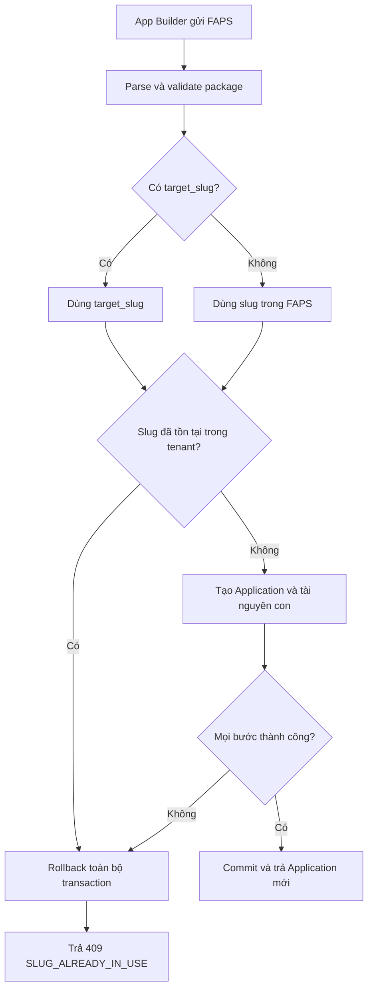

import { Meta } from '@storybook/addon-docs/blocks';
import { DocumentationTable } from '../DocumentationTable';

<Meta title="Specifications/Application Management" />

# Application Management

## Trạng thái specification gate

Trang này ghi lại **target contract đã được quyết định** cho Application
Management. Module, API, DTO, database model, transaction import và UI tương ứng
chưa tồn tại trong implementation hiện tại; vì vậy các hành vi bên dưới là yêu
cầu cho backlog, chưa phải hành vi production.

Quyết định xử lý import trùng slug đã được chốt: mặc định trả conflict, không tự
đổi tên và không ghi đè. Người gọi chỉ có thể đổi định danh một cách chủ động
bằng `target_slug`. Toàn bộ import phải chạy trong một database transaction.

## Mục tiêu và phạm vi

Application là aggregate root đóng gói vòng đời và các tài nguyên low-code của
một tenant: Pages, Dynamic Tables, Queries, Workflows, Connections, Assets,
Secrets, Releases và dependency graph. Mỗi Application thuộc đúng một tenant;
mọi định danh, quyền và thao tác import/export đều bị giới hạn trong tenant đó.

<DocumentationTable
  columns={[
    { id: 'scope', header: 'Phạm vi', width: 'w-1/4' },
    { id: 'items', header: 'Nội dung', width: 'w-3/4' },
  ]}
  rows={[
    {
      id: 'mvp',
      scope: 'MVP',
      items:
        'CRUD và state machine Application; slug unique theo tenant; App RBAC; environment default; secret masking; FAPS import/export; dependency lock; publish snapshot.',
    },
    {
      id: 'production',
      scope: 'Production-ready',
      items:
        'Dependency graph đầy đủ, templates, release/rollback, clone và impact analysis trước archive/delete.',
    },
    {
      id: 'enterprise',
      scope: 'Enterprise / Advanced',
      items:
        'Promotion Dev → Staging → Production, audit diff, custom domain và SSL.',
    },
    {
      id: 'out',
      scope: 'Ngoài MVP',
      items:
        'Real-time co-editing/CRDT, public cross-tenant marketplace và custom domain binding.',
    },
  ]}
/>

## Actors và phân quyền

Tenant Admin có toàn quyền trong tenant. App Owner quản trị vòng đời, thành viên,
secrets và release. App Builder được sửa tài nguyên, import/export và xem Draft
nhưng không quản lý thành viên, ownership hoặc xóa app. App Viewer/Operator chỉ
xem hoặc vận hành theo quyền được cấp; End-User chỉ dùng bản đã publish.

Riêng import, actor mục tiêu của Story 4.1.3 là **App Builder** hoặc vai trò cao
hơn có quyền import. Permission code và guard cụ thể là **Not confirmed from
current implementation**.

## Ranh giới và quy tắc cốt lõi

<DocumentationTable
  columns={[
    { id: 'area', header: 'Khu vực', width: 'w-1/4' },
    { id: 'rule', header: 'Quy tắc mục tiêu', width: 'w-3/4' },
  ]}
  rows={[
    {
      id: 'tenant',
      area: 'Tenant isolation',
      rule: 'Application và mọi tài nguyên con chỉ được đọc/ghi trong tenant context đã xác thực; cross-tenant lookup không được làm lộ sự tồn tại của tài nguyên.',
    },
    {
      id: 'slug',
      area: 'Định danh',
      rule: 'app_id là UUID bất biến. slug chỉ gồm a-z, 0-9 và dấu gạch ngang, unique theo cặp (tenant_id, slug).',
    },
    {
      id: 'environment',
      area: 'Environment',
      rule: 'Cấu hình được scope bằng (app_id, environment_code); MVP luôn dùng environment_code = default để giữ đường nâng cấp multi-environment.',
    },
    {
      id: 'dependency',
      area: 'Dependency',
      rule: 'HARD dependency chặn xóa mặc định. force=true chỉ dành cho App Owner hoặc Tenant Admin và chuyển tham chiếu bị gãy sang UNBOUND có cảnh báo.',
    },
    {
      id: 'secret',
      area: 'Secrets / export',
      rule: 'Secret được mã hóa khi lưu và bị xóa hoặc thay bằng ${SECRET_NEED_INPUT} khi export. FAPS không chứa row data của Dynamic Tables.',
    },
    {
      id: 'quota',
      area: 'Quota MVP',
      rule: 'Tối đa 50 active apps/tenant; mỗi app tối đa 100 Pages, 50 Dynamic Tables và 50 Workflows.',
    },
  ]}
/>

## Import FAPS: atomicity và slug resolution

`POST /api/v1/apps/import` tạo một Application mới từ FAPS. Việc parse,
validate, resolve slug và tạo toàn bộ aggregate phải nằm trong **một database
transaction**. Chỉ commit sau khi Application, Pages, Tables, Workflows và các
liên kết phụ thuộc đều hợp lệ và được tạo thành công.

Slug hiệu lực được xác định như sau:

1. Nếu request có `target_slug`, validate và dùng giá trị này thay slug trong
   FAPS cho Application mới.
2. Nếu không có `target_slug`, dùng slug gốc trong FAPS.
3. Kiểm tra slug hiệu lực trong tenant hiện tại trước khi tạo bất kỳ tài nguyên
   nào.
4. Nếu slug đã tồn tại, trả `409 Conflict` và rollback toàn bộ transaction.

Hệ thống không overwrite app hiện có và không tự sinh hậu tố như `-1`. Quy tắc
này tránh thay đổi URL routing hoặc static link mà người dùng không biết.



### Request contract

Request mang file FAPS và trường tùy chọn `target_slug`. Wire format (multipart
hay dạng khác), tên field chứa file, giới hạn dung lượng, media type, response
success và permission code là **Not confirmed from current implementation**.

<DocumentationTable
  columns={[
    { id: 'field', header: 'Trường', width: 'w-1/5' },
    { id: 'required', header: 'Bắt buộc', width: 'w-1/5' },
    { id: 'validation', header: 'Validation', width: 'w-1/4' },
    { id: 'purpose', header: 'Mục đích', width: 'w-2/5' },
  ]}
  rows={[
    {
      id: 'faps',
      field: 'FAPS file',
      required: 'Có',
      validation: 'Đúng package schema/version được hỗ trợ.',
      purpose: 'Nguồn cấu hình Application và tài nguyên con.',
    },
    {
      id: 'target-slug',
      field: 'target_slug',
      required: 'Không',
      validation: 'URL-friendly và unique trong tenant hiện tại.',
      purpose:
        'Chủ động thay slug gốc khi import; không sửa package nguồn và không bật overwrite.',
    },
  ]}
/>

### Error contract khi trùng slug

```json
{
  "type": "https://flexi.io/errors/import-slug-conflict",
  "title": "Application Import Conflict",
  "status": 409,
  "detail": "An application with slug 'hr-system' already exists in this tenant.",
  "code": "SLUG_ALREADY_IN_USE",
  "meta": {
    "conflicting_slug": "hr-system",
    "suggested_action": "Provide a 'target_slug' parameter in the request to rename during import."
  }
}
```

Payload trên là mô tả **nội dung** lỗi, không phải shape trên wire. ADR-004 đã
chốt: envelope `{ success, data, error }` áp dụng cho mọi endpoint, không nhúng
Problem Details vào `error` và không có ngoại lệ theo endpoint. Trên wire, điều
kiện này là `409` với `error.code = "SLUG_ALREADY_IN_USE"` — dùng lại code đã có
ở `TenantsService`, không đặt tên mới `APP_IMPORT_SLUG_CONFLICT`: đây là vi phạm
uniqueness của slug trong phạm vi tenant, không phải optimistic-locking conflict
(code cho loại đó là `REVISION_CONFLICT`). `type`/`title`/`detail` không lên
wire; `conflicting_slug` và `suggested_action` là khoá mở rộng do registry #78
khai báo cho code này.

## Lifecycle và API capability mục tiêu

Lifecycle là `DRAFT → ACTIVE → ARCHIVED → DELETED`; restore đưa ARCHIVED về
trạng thái hoạt động phù hợp. DRAFT chưa phục vụ end-user, ACTIVE có ít nhất một
release, ARCHIVED ngắt public routes/schedules và giữ dữ liệu read-only, DELETED
là soft-delete trước khi retention worker hard-delete.

<DocumentationTable
  columns={[
    { id: 'api', header: 'API mục tiêu', width: 'w-2/5' },
    { id: 'purpose', header: 'Mục đích', width: 'w-3/5' },
  ]}
  rows={[
    {
      id: 'create',
      api: 'POST /api/v1/apps',
      purpose: 'Tạo app trống hoặc từ template.',
    },
    {
      id: 'list',
      api: 'GET /api/v1/apps',
      purpose: 'List theo tenant, pagination/filter/search.',
    },
    {
      id: 'detail',
      api: 'GET /api/v1/apps/{id-or-slug}',
      purpose: 'Metadata, members và resource summary.',
    },
    {
      id: 'update',
      api: 'PATCH /api/v1/apps/{id}',
      purpose: 'Sửa metadata hoặc slug.',
    },
    {
      id: 'archive',
      api: 'POST /api/v1/apps/{id}/archive',
      purpose: 'Archive app và ngưng schedules.',
    },
    {
      id: 'restore',
      api: 'POST /api/v1/apps/{id}/restore',
      purpose: 'Khôi phục app đã archive.',
    },
    {
      id: 'delete',
      api: 'DELETE /api/v1/apps/{id}',
      purpose: 'Soft-delete bởi Owner/Admin.',
    },
    {
      id: 'dependencies',
      api: 'GET /api/v1/apps/{id}/resources/{resourceId}/dependencies',
      purpose: 'Impact/dependency lookup.',
    },
    {
      id: 'export',
      api: 'POST /api/v1/apps/{id}/export',
      purpose: 'Xuất FAPS đã redact secrets.',
    },
    {
      id: 'import',
      api: 'POST /api/v1/apps/import',
      purpose: 'Import nguyên tử để tạo app mới.',
    },
    {
      id: 'release',
      api: 'POST /api/v1/apps/{id}/releases',
      purpose: 'Đóng băng snapshot và publish.',
    },
  ]}
/>

## Story 4.1.3 — Import Service with Validation & Slug Resolution

**As an App Builder**, I want import từ FAPS thất bại an toàn khi slug xung
đột và có thể chủ động cung cấp slug mới, so that không có aggregate dở dang và
không có URL routing bị đổi tên ngoài ý muốn.

### Acceptance criteria

**Scenario A — Conflict không có override**

- **Given** FAPS chứa slug `hr-system` và tenant hiện tại đã có app với slug đó.
- **When** App Builder gửi request import không kèm `target_slug`.
- **Then** hệ thống trả `409 Conflict` với code `SLUG_ALREADY_IN_USE`.
- **And** không có Application, Page, Table, Workflow hoặc dependency nào từ
  package được ghi vào database.

**Scenario B — Override chủ động bằng slug hợp lệ**

- **Given** cùng FAPS và tenant đã có app `hr-system`.
- **When** App Builder gửi request với `target_slug = hr-system-v2` và slug này
  chưa tồn tại trong tenant.
- **Then** hệ thống tạo thành công Application mới với slug `hr-system-v2`.
- **And** toàn bộ tài nguyên con tham chiếu Application mới trong cùng
  transaction.

**Scenario C — target_slug cũng xung đột**

- **Given** tenant đã có cả `hr-system` và `hr-system-v2`.
- **When** request import truyền `target_slug = hr-system-v2`.
- **Then** hệ thống trả cùng error contract 409 với
  `meta.conflicting_slug = hr-system-v2` và không ghi dữ liệu.

**Scenario D — Lỗi khi tạo tài nguyên con**

- **Given** package vượt qua kiểm tra slug nhưng một tài nguyên con không hợp lệ
  hoặc không thể persist.
- **When** import đang tạo aggregate.
- **Then** transaction rollback Application và mọi tài nguyên đã tạo trước lỗi;
  không để lại partial import.

## Implementation backlog

Story 4.1.3 thay thế mô tả cũ “Schema Parser, Validation & Dependency
Re-linking” bằng phạm vi kiểm thử được sau:

1. Parse và validate FAPS schema/version.
2. Resolve slug từ `target_slug` hoặc slug trong package.
3. Kiểm tra uniqueness trong tenant và map conflict sang `409 SLUG_ALREADY_IN_USE`
   trong envelope chuẩn (ADR-004).
4. Tạo Application, resources và dependency links trong một transaction.
5. Rollback mọi write khi bất kỳ bước nào lỗi.
6. Thêm unit/integration/e2e tests cho bốn scenario ở trên, gồm concurrent
   requests tranh cùng slug.

Database unique constraint `(tenant_id, slug)` vẫn là hàng rào cuối cùng chống
race condition. Service phải map unique-constraint violation sang cùng
`SLUG_ALREADY_IN_USE`; pre-check một mình không đủ đảm bảo atomicity.

## Bằng chứng và khoảng trống implementation hiện tại

<DocumentationTable
  columns={[
    { id: 'surface', header: 'Bề mặt', width: 'w-1/3' },
    { id: 'evidence', header: 'Đối chiếu code hiện tại', width: 'w-2/3' },
  ]}
  rows={[
    {
      id: 'backend',
      surface: 'Backend module/API',
      evidence:
        'Không có apps controller/service, import endpoint, FAPS parser hoặc transaction orchestration.',
    },
    {
      id: 'database',
      surface: 'Prisma persistence',
      evidence:
        'Không có Application, AppMember, AppEnvironmentVariable, AppResource, AppDependency hoặc AppRelease model.',
    },
    {
      id: 'shared',
      surface: 'Shared contract',
      evidence:
        'Không có Application/FAPS DTO hay target_slug. Code SLUG_ALREADY_IN_USE đã có ở TenantsService và được dùng lại (ADR-004 mục 6).',
    },
    {
      id: 'frontend',
      surface: 'Frontend',
      evidence:
        'Không có navigation, route, import form, conflict handling hoặc retry-with-target-slug flow.',
    },
  ]}
/>

Implementation locations cho contract mới là **Not confirmed from current
implementation**. Khi Story 4.1.3 được triển khai, trang này phải được cập nhật
với đường dẫn DTO/controller/service, transaction boundary, migration/index và
tests thực tế.
