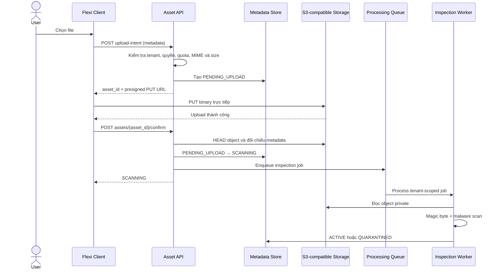
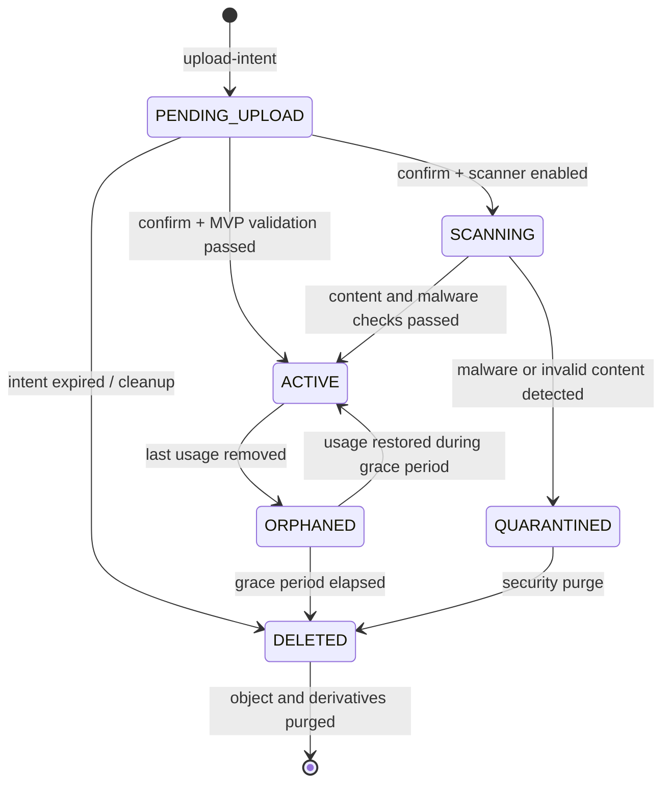

import { Meta } from '@storybook/addon-docs/blocks';
import { DocumentationTable } from '../DocumentationTable';

<Meta title="Specifications/Asset & File Management" />

# Asset & File Management

## Trạng thái specification gate

Trang này ghi lại **kiến trúc và target contract chưa được triển khai** cho phân
hệ Asset & File Management. Tại thời điểm đối chiếu, repository chưa có
`AssetsModule`, asset controller/service, route Media Library, DTO/shared type,
Prisma model hoặc migration tương ứng. Các endpoint, entity, trạng thái, giới
hạn và quyền bên dưới là yêu cầu cho backlog, không phải hành vi production đã
được xác nhận.

Repo đã có BullMQ-compatible infrastructure, tenant context và RBAC làm nền
tảng kỹ thuật, nhưng queue hiện chỉ phục vụ tenant provisioning và Dynamic
Tables DDL. Việc tái sử dụng hạ tầng đó cho file processing vẫn là **Not
confirmed from current implementation**.

## Mục tiêu và ranh giới

Phân hệ quản lý hai loại dữ liệu có profile phân phối và bảo mật khác nhau.
Không dùng chung một chính sách truy cập mặc định cho cả hai loại.

<DocumentationTable
  columns={[
    { id: 'scope', header: 'Loại asset', width: 'w-1/4' },
    { id: 'examples', header: 'Ví dụ', width: 'w-1/4' },
    { id: 'delivery', header: 'Phân phối', width: 'w-1/4' },
    { id: 'security', header: 'Mặc định bảo mật', width: 'w-1/4' },
  ]}
  rows={[
    {
      id: 'content',
      scope: 'Content Asset',
      examples: 'Ảnh, icon, CSS, font và banner của Page Builder.',
      delivery: 'CDN, cache dài hạn và tối ưu cho tốc độ đọc.',
      security:
        'PUBLIC khi được phép publish; không chứa dữ liệu nghiệp vụ nhạy cảm.',
    },
    {
      id: 'business',
      scope: 'Business File',
      examples: 'Hợp đồng, hóa đơn và file đính kèm Dynamic Table.',
      delivery: 'Signed URL ngắn hạn; không đi qua public cache mặc định.',
      security:
        'PRIVATE, kiểm tra RBAC, tenant và quyền trên record trước mỗi lần cấp URL.',
    },
  ]}
/>

### Phân kỳ mục tiêu

<DocumentationTable
  columns={[
    { id: 'phase', header: 'Giai đoạn', width: 'w-1/5' },
    { id: 'capabilities', header: 'Capability mục tiêu', width: 'w-4/5' },
  ]}
  rows={[
    {
      id: 'mvp',
      phase: 'MVP',
      capabilities:
        'Direct upload bằng S3 presigned URL; metadata tracking; MIME/size validation cơ bản; File field cho Dynamic Tables; private/public cơ bản.',
    },
    {
      id: 'production',
      phase: 'Production-ready',
      capabilities:
        'Malware scan bất đồng bộ; thumbnail; SHA-256 deduplication; orphan cleanup; processing queue; audit logging.',
    },
    {
      id: 'enterprise',
      phase: 'Enterprise',
      capabilities:
        'Multi-region/data residency; custom CDN domain theo tenant; retention tự động; quota nâng cao; file versioning.',
    },
  ]}
/>

## Actors và phân quyền mục tiêu

Tên role và permission code cụ thể chưa tồn tại cho phân hệ này. Bảng sau là
ma trận trách nhiệm mục tiêu; implementation phải ánh xạ sang permission catalog
và `PermissionsGuard` thay vì kiểm tra tên role trực tiếp.

<DocumentationTable
  columns={[
    { id: 'actor', header: 'Actor', width: 'w-1/5' },
    { id: 'permissions', header: 'Trách nhiệm mục tiêu', width: 'w-2/5' },
    { id: 'boundary', header: 'Phạm vi', width: 'w-2/5' },
  ]}
  rows={[
    {
      id: 'system-admin',
      actor: 'System Admin',
      permissions: 'Quản lý storage quota, provider và storage class.',
      boundary: 'Toàn hệ thống; phải dùng permission scope SYSTEM.',
    },
    {
      id: 'tenant-admin',
      actor: 'Tenant Admin',
      permissions: 'Cấu hình MIME allowlist, xem dung lượng và retention rule.',
      boundary: 'Tenant hiện tại.',
    },
    {
      id: 'app-builder',
      actor: 'App Builder',
      permissions: 'Upload/quản lý Content Asset và cấu hình File field.',
      boundary: 'Application được cấp quyền trong tenant hiện tại.',
    },
    {
      id: 'end-user',
      actor: 'End User',
      permissions:
        'Upload/download Business File gắn với Dynamic Table record.',
      boundary: 'Tenant, table và record được RBAC/record policy cho phép.',
    },
    {
      id: 'worker',
      actor: 'System Worker',
      permissions: 'Scan, tạo thumbnail, đánh dấu orphan và purge object.',
      boundary:
        'Service identity; job phải mang tenant context có thể kiểm chứng.',
    },
  ]}
/>

## Luồng upload mục tiêu

### MVP — direct upload bằng presigned URL

1. Client gửi metadata tới `upload-intent`.
2. API xác thực actor, tenant, scope, quyền, quota, MIME allowlist và size limit.
3. API tạo metadata ở `PENDING_UPLOAD` và trả presigned `PUT` URL ngắn hạn.
4. Client gửi binary trực tiếp tới S3-compatible storage; NestJS không proxy
   nội dung file.
5. Client gọi `confirm`; API phải xác minh object tồn tại và metadata object
   khớp intent trước khi chấp nhận.
6. MVP không có scanner có thể chuyển sang `ACTIVE` sau validation cơ bản.
   Khi scanner được bật, confirm phải chuyển sang `SCANNING` và chỉ worker mới
   được kích hoạt file.



### Production-ready — xử lý hậu upload

<DocumentationTable
  columns={[
    { id: 'step', header: 'Bước', width: 'w-1/5' },
    { id: 'input', header: 'Điều kiện vào', width: 'w-1/5' },
    { id: 'processing', header: 'Xử lý mục tiêu', width: 'w-2/5' },
    { id: 'result', header: 'Kết quả', width: 'w-1/5' },
  ]}
  rows={[
    {
      id: 'inspect',
      step: 'Inspection',
      input: 'Object đã confirm.',
      processing: 'Đọc magic bytes, đối chiếu MIME khai báo và quét malware.',
      result: 'Cho phép tiếp tục hoặc QUARANTINED.',
    },
    {
      id: 'hash',
      step: 'Hash / deduplicate',
      input: 'File vượt qua inspection.',
      processing: 'Tính SHA-256 và tìm hash trong cùng tenant.',
      result: 'Tái sử dụng object hoặc giữ object mới.',
    },
    {
      id: 'optimize',
      step: 'Optimization',
      input: 'Content Asset dạng ảnh.',
      processing: 'Resize, chuyển WebP và tạo thumb/medium/large.',
      result: 'Các rendition có metadata riêng.',
    },
    {
      id: 'activate',
      step: 'Activation',
      input: 'Mọi policy bắt buộc đã pass.',
      processing: 'Commit trạng thái và thông tin processing.',
      result: 'ACTIVE và có thể được cấp access URL.',
    },
  ]}
/>

## Business rules mục tiêu

### Quota và giới hạn

- Mỗi tenant có `storage_max_bytes`. Từ 90% hệ thống cảnh báo Tenant Admin;
  từ 100% API chặn upload intent mới.
- Giới hạn kích thước phải cấu hình theo nhóm MIME/scope. Giá trị ví dụ từ
  tài liệu nguồn là image 10 MB và document 50 MB; giá trị production cuối
  cùng chưa được stakeholders xác nhận.
- Quota cần được reserve tại lúc tạo intent và reconcile khi confirm/expire để
  nhiều upload song song không vượt trần.
- Deduplication không được làm lộ cho tenant A rằng tenant B có cùng nội dung;
  key deduplicate tối thiểu phải gồm `tenant_id` và hash.

### MIME và nội dung

- Extension và `Content-Type` từ client chỉ là dữ liệu khai báo, không phải
  bằng chứng định dạng.
- Worker phải nhận diện magic bytes. Sai lệch đáng ngờ hoặc malware làm file
  chuyển `QUARANTINED`, thu hồi khả năng cấp URL và ghi audit event.
- Allowlist phải được kiểm tra ở intent để fail sớm và kiểm tra lại sau upload
  bằng nội dung thực tế.

### Access URL

- Business File chỉ được cấp signed URL sau khi kiểm tra tenant, quyền và
  record usage tại thời điểm yêu cầu.
- Thời hạn mặc định đề xuất là 15 phút; đây chưa phải config đã tồn tại.
- Content Asset chỉ dùng public/CDN URL sau khi `ACTIVE` và visibility là
  `PUBLIC`. Upload URL và object đang scan luôn private.
- Log, metric label và error payload không được chứa query signature, bearer
  token hoặc storage credential.

## Lifecycle và state machine mục tiêu



`DELETED` trong metadata biểu thị terminal tombstone; purge object có thể xảy
ra bất đồng bộ. Không cấp access URL cho `PENDING_UPLOAD`, `SCANNING`,
`QUARANTINED`, `ORPHANED` hoặc `DELETED`. Việc có cho restore `ORPHANED` về
`ACTIVE` là hệ quả cần thiết nếu usage được khôi phục trong grace period, nhưng
API restore cụ thể là **Not confirmed from current implementation**.

<DocumentationTable
  columns={[
    { id: 'status', header: 'Trạng thái', width: 'w-1/5' },
    { id: 'meaning', header: 'Ý nghĩa', width: 'w-2/5' },
    { id: 'access', header: 'Khả năng truy cập', width: 'w-2/5' },
  ]}
  rows={[
    {
      id: 'pending',
      status: 'PENDING_UPLOAD',
      meaning: 'Intent đã tạo; binary chưa được confirm.',
      access: 'Không.',
    },
    {
      id: 'scanning',
      status: 'SCANNING',
      meaning: 'Object đang được kiểm tra bất đồng bộ.',
      access: 'Không.',
    },
    {
      id: 'active',
      status: 'ACTIVE',
      meaning: 'Các kiểm tra bắt buộc đã pass.',
      access: 'Có, theo visibility và authorization.',
    },
    {
      id: 'quarantined',
      status: 'QUARANTINED',
      meaning: 'Nội dung vi phạm hoặc đáng ngờ.',
      access: 'Không; chỉ security workflow được xử lý.',
    },
    {
      id: 'orphaned',
      status: 'ORPHANED',
      meaning: 'Không còn usage và đang trong grace period.',
      access: 'Không cấp URL mới.',
    },
    {
      id: 'deleted',
      status: 'DELETED',
      meaning: 'Đã hết retention; chờ hoặc đã purge object.',
      access: 'Không.',
    },
  ]}
/>

## Conceptual data model

Các bảng dưới đây là schema mục tiêu, chưa có trong
`apps/backend/prisma/schema.prisma`. Implementation phải quyết định chúng nằm ở
control-plane schema hay tenant schema trước khi tạo migration; không được lưu
đồng thời ở hai nơi mà thiếu source of truth.

### `file_metadata`

<DocumentationTable
  columns={[
    { id: 'field', header: 'Trường', width: 'w-1/4' },
    { id: 'type', header: 'Kiểu mục tiêu', width: 'w-1/4' },
    { id: 'purpose', header: 'Mục đích / constraint', width: 'w-1/2' },
  ]}
  rows={[
    {
      id: 'id',
      field: 'id',
      type: 'UUIDv4',
      purpose: 'Primary key và asset identity công khai.',
    },
    {
      id: 'tenant-id',
      field: 'tenant_id',
      type: 'UUIDv4',
      purpose: 'Bắt buộc, indexed; boundary cho mọi query và storage key.',
    },
    {
      id: 'app-id',
      field: 'app_id',
      type: 'UUIDv4 nullable',
      purpose: 'Application context khi asset thuộc Page Builder/app.',
    },
    {
      id: 'scope',
      field: 'scope',
      type: 'Enum',
      purpose: 'CONTENT_ASSET hoặc BUSINESS_FILE.',
    },
    {
      id: 'provider',
      field: 'storage_provider',
      type: 'String/enum',
      purpose: 'AWS_S3, MINIO hoặc provider đã đăng ký.',
    },
    {
      id: 'key',
      field: 'storage_key',
      type: 'String',
      purpose: 'Object key nội bộ; không trả trực tiếp thay access URL.',
    },
    {
      id: 'name',
      field: 'original_name',
      type: 'String',
      purpose:
        'Tên hiển thị đã sanitize; không dùng nguyên trạng để authorize.',
    },
    {
      id: 'mime',
      field: 'mime_type',
      type: 'String',
      purpose:
        'MIME đã xác minh; MIME client khai báo cần lưu riêng nếu cần audit.',
    },
    {
      id: 'size',
      field: 'size_bytes',
      type: 'BigInt',
      purpose: 'Kích thước object đã xác minh và quota accounting.',
    },
    {
      id: 'hash',
      field: 'file_hash',
      type: 'String nullable',
      purpose: 'SHA-256 sau processing; index cùng tenant nếu deduplicate.',
    },
    {
      id: 'visibility',
      field: 'visibility',
      type: 'Enum',
      purpose: 'PUBLIC hoặc PRIVATE; BUSINESS_FILE bắt buộc PRIVATE.',
    },
    {
      id: 'status',
      field: 'status',
      type: 'Enum',
      purpose: 'Lifecycle state hiện tại.',
    },
    {
      id: 'creator',
      field: 'created_by',
      type: 'UUIDv4',
      purpose:
        'Actor tạo intent; service identity cần representation riêng nếu có.',
    },
    {
      id: 'timestamps',
      field: 'created_at, updated_at',
      type: 'Timestamp',
      purpose:
        'Audit/lifecycle timestamps; retention có thể cần orphaned_at/deleted_at riêng.',
    },
  ]}
/>

### `file_versions` — Enterprise

<DocumentationTable
  columns={[
    { id: 'field', header: 'Trường', width: 'w-1/4' },
    { id: 'type', header: 'Kiểu mục tiêu', width: 'w-1/4' },
    { id: 'purpose', header: 'Mục đích / constraint', width: 'w-1/2' },
  ]}
  rows={[
    { id: 'id', field: 'id', type: 'UUIDv4', purpose: 'Primary key.' },
    {
      id: 'file',
      field: 'file_id',
      type: 'UUIDv4 FK',
      purpose: 'Tham chiếu file_metadata.id.',
    },
    {
      id: 'version',
      field: 'version_number',
      type: 'Integer',
      purpose: 'Unique và tăng dần trong một file.',
    },
    {
      id: 'key',
      field: 'storage_key',
      type: 'String',
      purpose: 'Object key của version.',
    },
    {
      id: 'size',
      field: 'size_bytes',
      type: 'BigInt',
      purpose: 'Quota và download metadata.',
    },
    {
      id: 'creator',
      field: 'created_by',
      type: 'UUIDv4',
      purpose: 'Actor tạo version.',
    },
  ]}
/>

### `file_usages`

<DocumentationTable
  columns={[
    { id: 'field', header: 'Trường', width: 'w-1/4' },
    { id: 'type', header: 'Kiểu mục tiêu', width: 'w-1/4' },
    { id: 'purpose', header: 'Mục đích / constraint', width: 'w-1/2' },
  ]}
  rows={[
    { id: 'id', field: 'id', type: 'UUIDv4', purpose: 'Primary key.' },
    {
      id: 'file',
      field: 'file_id',
      type: 'UUIDv4 FK',
      purpose: 'Asset được sử dụng.',
    },
    {
      id: 'target-type',
      field: 'target_type',
      type: 'String/enum',
      purpose: 'DYNAMIC_TABLE_RECORD hoặc PAGE_BLOCK.',
    },
    {
      id: 'target-id',
      field: 'target_id',
      type: 'UUIDv4',
      purpose:
        'Record/block đích; polymorphic integrity phải được service bảo đảm.',
    },
    {
      id: 'field-name',
      field: 'field_name',
      type: 'String',
      purpose: 'Field hoặc property chứa asset reference.',
    },
  ]}
/>

Nên có unique constraint phù hợp trên usage identity để retry không tạo liên
kết trùng. Xóa usage cuối cùng phải đổi file sang `ORPHANED` trong cùng
transaction logic hoặc bằng outbox/event có khả năng retry; chi tiết chưa được
chốt trong implementation.

## API capability contracts mục tiêu

Các path bên dưới giữ nguyên contract đầu vào. Backend hiện dùng global prefix
`/api`, trong khi tài liệu đề xuất `/api/v1`; strategy versioning và response
envelope phải được chốt trước khi implementation.

### Khởi tạo upload

`POST /api/v1/assets/upload-intent`

<DocumentationTable
  columns={[
    { id: 'field', header: 'Request field', width: 'w-1/4' },
    { id: 'required', header: 'Bắt buộc', width: 'w-1/6' },
    { id: 'validation', header: 'Validation mục tiêu', width: 'w-7/12' },
  ]}
  rows={[
    {
      id: 'filename',
      field: 'filename',
      required: 'Có',
      validation: 'Không rỗng; sanitize khi hiển thị và khi tạo key.',
    },
    {
      id: 'mime',
      field: 'mime_type',
      required: 'Có',
      validation:
        'Nằm trong allowlist hiệu lực cho tenant/scope; xác minh lại sau upload.',
    },
    {
      id: 'size',
      field: 'size_bytes',
      required: 'Có',
      validation: 'Số nguyên dương; không vượt limit và quota còn lại.',
    },
    {
      id: 'scope',
      field: 'scope',
      required: 'Có',
      validation:
        'CONTENT_ASSET hoặc BUSINESS_FILE; actor có quyền trên scope.',
    },
    {
      id: 'app',
      field: 'app_id',
      required: 'Không',
      validation:
        'Thuộc tenant hiện tại và actor có quyền trên app khi được truyền.',
    },
  ]}
/>

Response mục tiêu:

```json
{
  "asset_id": "uuid",
  "upload_url": "https://storage.example/presigned-put",
  "expires_at": "2026-08-26T10:15:00.000Z",
  "headers_required": {
    "Content-Type": "application/pdf"
  }
}
```

`upload_url` và signature phải được redaction khỏi log. API không được nhận
binary ở endpoint này.

### Xác nhận upload

`POST /api/v1/assets/{asset_id}/confirm`

API phải tenant-scope lookup, xác minh trạng thái là `PENDING_UPLOAD`, HEAD
object, so sánh size/content metadata có thể kiểm tra và làm thao tác idempotent
cho retry hợp lệ. Response mục tiêu:

```json
{
  "asset_id": "uuid",
  "status": "SCANNING"
}
```

`ACTIVE` chỉ hợp lệ khi deployment dùng MVP validation đồng bộ và không yêu cầu
scan bất đồng bộ. Khi production scanner được bật, confirm không được trả
`ACTIVE` trước kết quả worker.

### Cấp URL truy cập

`GET /api/v1/assets/{asset_id}/download-url`

```json
{
  "download_url": "https://storage.example/signed-get",
  "expires_at": "2026-08-26T10:15:00.000Z"
}
```

API chỉ cấp URL khi asset là `ACTIVE`. Với Business File, authorization phải
đi qua `file_usages` tới app/table/record thay vì chỉ kiểm tra actor thuộc cùng
tenant. Content Asset public có thể trả CDN URL không hết hạn; khi đó
`expires_at` cần nullable hoặc contract response riêng — điểm này chưa được
chốt trong tài liệu nguồn.

### Lỗi có ý nghĩa với client

<DocumentationTable
  columns={[
    { id: 'condition', header: 'Điều kiện', width: 'w-1/3' },
    { id: 'result', header: 'Kết quả mục tiêu', width: 'w-1/3' },
    { id: 'layer', header: 'Lớp kiểm tra', width: 'w-1/3' },
  ]}
  rows={[
    {
      id: 'permission',
      condition: 'Không có quyền trên scope/app/record.',
      result: 'Từ chối mà không làm lộ asset cross-tenant.',
      layer: 'Guard + business authorization.',
    },
    {
      id: 'quota',
      condition: 'Quota đã hết hoặc reservation làm vượt quota.',
      result: 'Không tạo intent.',
      layer: 'Business logic + atomic quota accounting.',
    },
    {
      id: 'size',
      condition: 'Size khai báo hoặc size thực vượt giới hạn.',
      result: 'Reject intent hoặc quarantine/delete object.',
      layer: 'DTO/business + confirm/worker.',
    },
    {
      id: 'mime',
      condition: 'MIME không được phép hoặc magic bytes sai lệch.',
      result: 'Reject sớm hoặc QUARANTINED.',
      layer: 'Business + worker.',
    },
    {
      id: 'expired',
      condition: 'Intent hoặc presigned URL hết hạn.',
      result: 'Không confirm; cleanup metadata/object nếu có.',
      layer: 'Business + lifecycle worker.',
    },
    {
      id: 'state',
      condition: 'Asset chưa ACTIVE khi xin download URL.',
      result: 'Không cấp URL; trả trạng thái an toàn.',
      layer: 'Business logic.',
    },
    {
      id: 'storage',
      condition: 'Storage/queue tạm lỗi.',
      result: 'Không báo upload thành công giả; operation retry-safe.',
      layer: 'Service + queue worker.',
    },
  ]}
/>

HTTP status, error code và cách bọc trong global `{ success, data, error }` là
**Not confirmed from current implementation**.

## Storage, CDN và tenant isolation

Object key mục tiêu:

```text
tenants/{tenant_id}/{scope}/{YYYY}/{MM}/{asset_id}/{sanitized_filename}
```

Bucket name là config của provider, không phải một phần dữ liệu do client gửi.
API phải tự dựng toàn bộ key từ tenant context và asset metadata; không chấp
nhận raw `storage_key` từ client.

<DocumentationTable
  columns={[
    { id: 'option', header: 'Mô hình', width: 'w-1/4' },
    { id: 'advantages', header: 'Ưu điểm', width: 'w-3/8' },
    { id: 'costs', header: 'Đánh đổi', width: 'w-3/8' },
  ]}
  rows={[
    {
      id: 'single',
      option: 'Single bucket + tenant prefix',
      advantages:
        'Vận hành đơn giản, chi phí khởi tạo thấp; đề xuất cho MVP/Production-ready.',
      costs:
        'Policy và ứng dụng phải bảo đảm tenant isolation ở mọi đường đọc/ghi.',
    },
    {
      id: 'multi',
      option: 'Bucket riêng theo tenant',
      advantages:
        'Isolation hạ tầng mạnh và phù hợp deployment dedicated/compliance.',
      costs: 'Provisioning, quota, lifecycle và giới hạn bucket phức tạp hơn.',
    },
  ]}
/>

- Content Asset `PUBLIC` đi qua CDN chung hoặc custom domain theo tenant sau
  khi publish.
- Business File bypass public cache hoặc dùng signed CDN URL với origin access
  control nghiêm ngặt.
- IAM/service credential phải giới hạn được prefix hoặc bucket của tenant/job.
- Multi-region và data residency cần chọn region từ tenant policy trước khi
  dựng storage key/provider; không copy cross-region ngầm.

## Retention, orphan cleanup và xóa

Khi record hoặc page bỏ liên kết, xóa `file_usages`. Nếu không còn usage, asset
chuyển `ORPHANED` và ghi mốc bắt đầu grace period. Worker chỉ purge sau khi:

1. Grace period đã hết.
2. Asset vẫn không có usage.
3. Không có legal hold/retention override hiệu lực.
4. Object, rendition và version đều được xác định trong đúng tenant boundary.

Grace period đề xuất là 30 ngày nhưng chưa được stakeholders xác nhận. Purge
phải idempotent: object đã không còn không được làm job thất bại vĩnh viễn;
metadata chỉ chuyển terminal sau khi các object bắt buộc đã được xử lý hoặc lỗi
được ghi để retry.

## Audit và observability

### Audit events bắt buộc theo target contract

<DocumentationTable
  columns={[
    { id: 'event', header: 'Event', width: 'w-1/3' },
    { id: 'when', header: 'Thời điểm ghi', width: 'w-2/3' },
  ]}
  rows={[
    {
      id: 'intent',
      event: 'FILE_UPLOAD_INTENT',
      when: 'Sau khi intent hợp lệ được tạo hoặc gồm outcome nếu policy yêu cầu audit cả lần bị từ chối.',
    },
    {
      id: 'download',
      event: 'FILE_DOWNLOADED',
      when: 'Khi cấp access URL; việc client tải object thực tế cần storage/CDN access log để chứng minh.',
    },
    {
      id: 'deleted',
      event: 'FILE_DELETED',
      when: 'Khi lifecycle delete/purge đạt terminal outcome.',
    },
    {
      id: 'quarantine',
      event: 'FILE_QUARANTINED',
      when: 'Khi worker phát hiện malware hoặc content mismatch.',
    },
    {
      id: 'denied',
      event: 'ACCESS_DENIED',
      when: 'Khi authorization từ chối upload/download/delete có giá trị security.',
    },
  ]}
/>

Audit payload tối thiểu nên có actor/service identity, tenant, asset id, action,
outcome, timestamp và correlation id; không chứa presigned query, bearer token
hoặc access key.

### Metrics mục tiêu

- Tổng bytes logical và physical theo tenant, scope và status.
- Tỷ lệ upload/confirm lỗi theo nhóm nguyên nhân, không label theo asset id.
- Thời gian chờ queue và thời gian scan.
- Số file `PENDING_UPLOAD`, `SCANNING`, `QUARANTINED`, `ORPHANED` quá SLA.
- Số lần purge/retry và storage provider error.

## Acceptance criteria mục tiêu

### AC-01 — Upload Business File hợp lệ

**Given** người dùng có quyền ghi vào record thuộc tenant A, file nằm trong
allowlist/size limit và quota reservation còn đủ.

**When** người dùng tạo intent cho `hopdong.pdf` 15 MB, upload binary qua
presigned URL và confirm object thành công.

**Then** metadata đi qua `PENDING_UPLOAD`; nếu scanner được bật thì chuyển
`SCANNING`, và chỉ chuyển `ACTIVE` sau khi MIME thực tế và malware scan đều
pass. Người dùng chỉ nhận download URL sau khi authorization được kiểm tra lại.

### AC-02 — Quarantine file giả mạo định dạng

**Given** người dùng đổi tên nội dung executable thành `avatar.png`.

**When** worker đối chiếu magic bytes và chạy malware policy.

**Then** asset chuyển `QUARANTINED`, không thể nhận access URL, Tenant Admin
nhận cảnh báo theo notification policy và audit có `FILE_QUARANTINED` mà không
lộ secret.

### AC-03 — Chặn vượt quota

**Given** tenant đã dùng hoặc reserve 100% quota.

**When** client gọi `upload-intent` mới.

**Then** API từ chối trước khi tạo presigned URL, không tăng reservation và trả
lỗi có thể hiển thị cho người dùng.

### AC-04 — Cách ly cross-tenant

**Given** asset thuộc tenant A và actor chỉ có session của tenant B.

**When** actor đoán `asset_id` và yêu cầu download URL.

**Then** API không cấp URL, không query object ngoài tenant boundary và không
làm lộ metadata hoặc sự tồn tại của asset.

### AC-05 — Orphan cleanup an toàn

**Given** usage cuối cùng bị xóa và asset đã ở `ORPHANED` quá grace period.

**When** cleanup worker chạy.

**Then** worker kiểm tra lại usage/retention, purge đúng object và derivatives,
đánh dấu `DELETED` theo operation idempotent và ghi audit outcome.

## External dependencies mục tiêu

<DocumentationTable
  columns={[
    { id: 'capability', header: 'Capability', width: 'w-1/4' },
    { id: 'candidates', header: 'Ứng viên', width: 'w-1/3' },
    { id: 'status', header: 'Trạng thái trong repo', width: 'w-5/12' },
  ]}
  rows={[
    {
      id: 'storage',
      capability: 'S3-compatible storage',
      candidates: 'AWS S3, MinIO, Cloudflare R2',
      status: 'Chưa có asset storage adapter/config được xác nhận.',
    },
    {
      id: 'image',
      capability: 'Image processing',
      candidates: 'Sharp',
      status: 'Chưa có dependency/pipeline được xác nhận.',
    },
    {
      id: 'malware',
      capability: 'Malware scanning',
      candidates: 'ClamAV hoặc VirusTotal API',
      status: 'Chưa có integration được xác nhận.',
    },
    {
      id: 'queue',
      capability: 'Async processing',
      candidates: 'BullMQ-compatible queue',
      status:
        'Hạ tầng BullMQ đã có cho module khác; asset queue/worker chưa có.',
    },
    {
      id: 'cdn',
      capability: 'CDN delivery',
      candidates: 'CloudFront hoặc CDN tương thích',
      status: 'Chưa có asset CDN config được xác nhận.',
    },
  ]}
/>

## Quyết định kiến trúc còn mở

<DocumentationTable
  columns={[
    { id: 'decision', header: 'Quyết định', width: 'w-1/3' },
    { id: 'proposal', header: 'Đề xuất hiện tại', width: 'w-1/3' },
    { id: 'impact', header: 'Cần chốt vì', width: 'w-1/3' },
  ]}
  rows={[
    {
      id: 'bucket',
      decision: 'Single bucket hay bucket riêng theo tenant?',
      proposal:
        'Single bucket + tenant prefix cho cloud; multi-bucket cho Enterprise dedicated/on-prem.',
      impact:
        'Ảnh hưởng provisioning, IAM, quota, residency và migration path.',
    },
    {
      id: 'retention',
      decision: 'Grace period mặc định 7, 30 hay 90 ngày?',
      proposal: '30 ngày.',
      impact: 'Ảnh hưởng khả năng phục hồi, chi phí và compliance.',
    },
    {
      id: 'scan-ux',
      decision: 'Có cho dùng file trước khi scan xong?',
      proposal:
        'Business File bắt buộc đợi ACTIVE; Content Asset cũng nên đợi policy bắt buộc trước khi publish.',
      impact: 'Cân bằng latency với rủi ro phát tán nội dung chưa kiểm tra.',
    },
    {
      id: 'schema',
      decision: 'Metadata nằm ở control-plane hay tenant schema?',
      proposal: 'Chưa có quyết định trong tài liệu nguồn.',
      impact:
        'Ảnh hưởng transaction với Dynamic Tables, tenant purge và query isolation.',
    },
    {
      id: 'versioning',
      decision: 'API dùng /api hay /api/v1 và response envelope nào?',
      proposal: 'Chưa có quyết định trong implementation.',
      impact: 'Ảnh hưởng consistency với API hiện tại và client contract.',
    },
  ]}
/>

## Breakdown backlog

<DocumentationTable
  columns={[
    { id: 'epic', header: 'Epic', width: 'w-1/4' },
    { id: 'feature', header: 'Feature', width: 'w-1/4' },
    { id: 'stories', header: 'Stories mục tiêu', width: 'w-1/2' },
  ]}
  rows={[
    {
      id: 'upload',
      epic: 'Core storage & isolation',
      feature: 'Presigned upload pipeline',
      stories:
        'Implement upload-intent với quota reservation; implement confirm idempotent và object verification.',
    },
    {
      id: 'isolation',
      epic: 'Core storage & isolation',
      feature: 'Tenant storage security',
      stories:
        'Implement tenant-scoped key builder, provider adapter và least-privilege policy.',
    },
    {
      id: 'inspection',
      epic: 'Processing & security',
      feature: 'Async inspection',
      stories:
        'Tạo asset queue/worker; tích hợp magic-byte/malware check; quarantine và audit.',
    },
    {
      id: 'optimization',
      epic: 'Processing & security',
      feature: 'Content optimization',
      stories:
        'Tạo rendition và WebP bằng image processor; quản lý derivative metadata/lifecycle.',
    },
    {
      id: 'file-field',
      epic: 'Runtime integration',
      feature: 'Dynamic Table File field',
      stories:
        'Thêm shared field contract và React upload UI; lưu/xóa usage cùng record lifecycle.',
    },
    {
      id: 'governance',
      epic: 'Runtime integration',
      feature: 'Lifecycle & governance',
      stories: 'Orphan cleanup; quota dashboard; audit view; retention policy.',
    },
  ]}
/>

## Implementation gap và traceability

<DocumentationTable
  columns={[
    { id: 'responsibility', header: 'Trách nhiệm', width: 'w-1/3' },
    { id: 'evidence', header: 'Evidence hiện tại', width: 'w-2/3' },
  ]}
  rows={[
    {
      id: 'backend-module',
      responsibility: 'Asset API/module',
      evidence: (
        <>
          Không có trong <code>apps/backend/src/app.module.ts</code> hoặc{' '}
          <code>apps/backend/src/modules</code>.
        </>
      ),
    },
    {
      id: 'models',
      responsibility: 'File metadata/version/usage persistence',
      evidence: (
        <>
          Không có model tương ứng trong{' '}
          <code>apps/backend/prisma/schema.prisma</code>.
        </>
      ),
    },
    {
      id: 'contracts',
      responsibility: 'DTO và shared contract',
      evidence: (
        <>
          Không có asset/file contract trong{' '}
          <code>packages/shared-types/src</code>.
        </>
      ),
    },
    {
      id: 'frontend',
      responsibility: 'Media Library và File field UI',
      evidence: (
        <>
          Không có route/screen asset trong{' '}
          <code>apps/frontend/src/router.tsx</code>; File field chưa được xác
          nhận.
        </>
      ),
    },
    {
      id: 'tenancy',
      responsibility: 'Tenant context và RBAC foundation',
      evidence: (
        <>
          Có nền tảng tại <code>apps/backend/src/tenancy</code> và permission
          models trong <code>apps/backend/prisma/schema.prisma</code>; asset
          permission codes/guards chưa tồn tại.
        </>
      ),
    },
    {
      id: 'queue',
      responsibility: 'Async worker foundation',
      evidence: (
        <>
          BullMQ được cấu hình trong <code>apps/backend/src/modules/queue</code>{' '}
          và dùng bởi tenant/Dynamic Tables; asset processor chưa tồn tại.
        </>
      ),
    },
    {
      id: 'page-builder',
      responsibility: 'Content Asset consumer',
      evidence: (
        <>
          <code>apps/frontend/src/docs/specifications/page-builder.mdx</code>{' '}
          ghi asset integration là chưa được xác nhận từ implementation.
        </>
      ),
    },
  ]}
/>

### Definition of done cho implementation đầu tiên

- Có migration/model với tenant indexes và constraint lifecycle cần thiết.
- Có shared request/response contract, DTO validation và global envelope nhất
  quán với API hiện tại.
- Upload intent, confirm và access URL đều tenant-scoped, permission-checked,
  idempotent nơi cần thiết và có unit/e2e tests cho cross-tenant denial.
- Storage adapter không log secret; presigned URL hết hạn ngắn và object mặc
  định private.
- Quota reservation chống race; confirm kiểm tra object thực; intent bỏ dở
  được cleanup.
- Nếu bật async scan, chỉ worker được chuyển `SCANNING` sang `ACTIVE` hoặc
  `QUARANTINED`; job retry không tạo duplicate usage/rendition.
- Dynamic Table File field và Page Builder chỉ tham chiếu `asset_id`, không lưu
  raw storage key hoặc presigned URL lâu dài.
- Có Storybook stories cho upload, progress, scanning, success, quota error,
  quarantine và permission denied khi UI được triển khai.
- `pnpm lint`, test backend liên quan, frontend build và Storybook build đều
  pass trước khi đánh dấu capability đã triển khai.
