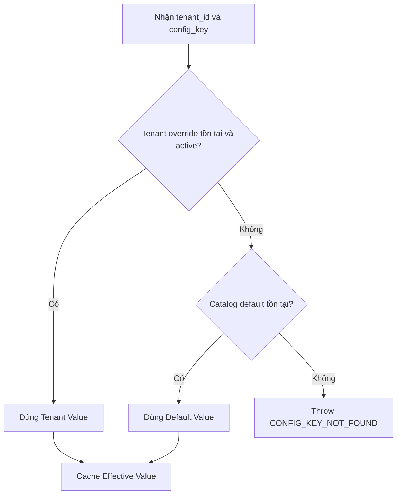

import { Meta } from '@storybook/addon-docs/blocks';
import { Badge, Card } from '../../components/ui';
import { DocumentationTable } from '../DocumentationTable';

<Meta title="Specifications/Core System Configuration" />

# Core System Configuration Engine

## Phạm vi và trạng thái

Tài liệu này đặc tả contract mục tiêu cho bộ máy cấu hình tập trung của nền
tảng low-code: System Catalog, Tenant Override, phân giải Effective Value,
secret, quota, master data, validation và audit. Đây là yêu cầu thiết kế được
cung cấp, **không phải mô tả một chức năng production đã hoàn tất**.

<div className="grid grid-cols-1 gap-md md:grid-cols-3">
  <Card>
    <div className="flex flex-col gap-sm">
      <Badge tone="success">Đã có</Badge>
      <p className="font-body-sm text-body-sm text-on-surface-variant">
        Tenant provisioning tạo <code>system_settings</code> dạng key/value và
        seed bốn giá trị mặc định.
      </p>
    </div>
  </Card>
  <Card>
    <div className="flex flex-col gap-sm">
      <Badge tone="warning">Có một phần</Badge>
      <p className="font-body-sm text-body-sm text-on-surface-variant">
        Có permission <code>settings.manage</code>, Redis URL và rate limit cho
        auth; chưa được nối thành Configuration Engine.
      </p>
    </div>
  </Card>
  <Card>
    <div className="flex flex-col gap-sm">
      <Badge tone="neutral">Chưa có</Badge>
      <p className="font-body-sm text-body-sm text-on-surface-variant">
        Catalog, override, effective-value API, cache invalidation, secret,
        quota, master data và audit cấu hình.
      </p>
    </div>
  </Card>
</div>

Endpoint hiện tại duy nhất là `GET /api/settings`, trả về
`{ success: true, data: { status: 'not-implemented' } }`. Module `settings`
không có trong navigation đang công bố; frontend vì vậy chưa có màn hình quản
trị cấu hình. Actor, route mutation, DTO và permission matrix chi tiết cho
System Admin/Tenant Admin chưa được xác nhận từ implementation hiện tại.

## Mục tiêu chức năng

Configuration Engine phải cung cấp một nguồn cấu hình thống nhất cho runtime,
cho phép System Admin quản lý giá trị mặc định và Tenant được override những
key có scope phù hợp. Mỗi lần đọc phải trả về giá trị hiệu lực theo đúng thứ tự
ưu tiên, đồng thời bảo vệ secret, kiểm soát quota và lưu dấu mọi mutation.

Luồng chính mục tiêu:

`Khai báo catalog → validate → lưu giá trị → phát sự kiện invalidation → runtime phân giải override/default → cache kết quả`

## 1. Catalog Schema Specification

System Catalog lưu metadata và giá trị mặc định toàn hệ thống. Tenant Override
chỉ lưu giá trị đè cho một `tenant_id` và một `config_key`; metadata kiểu dữ
liệu, scope, secret và validation vẫn lấy từ catalog.

<DocumentationTable
  columns={[
    { id: 'field', header: 'Tên trường', width: 'w-1/6' },
    { id: 'type', header: 'Kiểu dữ liệu', width: 'w-1/6' },
    { id: 'required', header: 'Bắt buộc', width: 'w-1/6' },
    { id: 'rule', header: 'Mô tả và quy tắc', width: 'w-1/2' },
  ]}
  rows={[
    {
      id: 'config-key',
      field: <code>config_key</code>,
      type: 'String',
      required: 'Có',
      rule: (
        <>
          Unique key, tối đa 128 ký tự. Dùng namespace phân tách bằng dấu chấm;
          từng segment dùng snake_case, ví dụ{' '}
          <code>quota.api_rate_limit_rps</code>.
        </>
      ),
    },
    {
      id: 'data-type',
      field: <code>data_type</code>,
      type: 'Enum',
      required: 'Có',
      rule: (
        <>
          <code>STRING</code>, <code>NUMBER</code>, <code>BOOLEAN</code>,{' '}
          <code>JSON</code>, <code>SECRET</code> hoặc <code>ENUM</code>.
        </>
      ),
    },
    {
      id: 'default-value',
      field: <code>default_value</code>,
      type: 'Text / JSON',
      required: 'Có',
      rule: 'Giá trị mặc định toàn hệ thống do System Admin thiết lập.',
    },
    {
      id: 'scope',
      field: <code>scope</code>,
      type: 'Enum',
      required: 'Có',
      rule: (
        <>
          <code>SYSTEM</code> chỉ cho sửa ở mức hệ thống; <code>TENANT</code>{' '}
          cho phép tenant override.
        </>
      ),
    },
    {
      id: 'is-secret',
      field: <code>is_secret</code>,
      type: 'Boolean',
      required: 'Có',
      rule: (
        <>
          <code>true</code> yêu cầu mã hóa at-rest và redaction trên API/UI.
        </>
      ),
    },
    {
      id: 'validation-rule',
      field: <code>validation_rule</code>,
      type: 'JSON Schema',
      required: 'Không',
      rule: 'Regex, min/max, enum list hoặc JSON Schema dùng để validate input.',
    },
    {
      id: 'is-editable',
      field: <code>is_editable</code>,
      type: 'Boolean',
      required: 'Có',
      rule: (
        <>
          <code>false</code> là read-only, chỉ được cập nhật qua
          database/migration.
        </>
      ),
    },
  ]}
/>

### Mô hình persistence mục tiêu

<DocumentationTable
  columns={[
    { id: 'store', header: 'Bảng / store', width: 'w-1/4' },
    { id: 'identity', header: 'Định danh', width: 'w-1/4' },
    { id: 'purpose', header: 'Mục đích', width: 'w-1/2' },
  ]}
  rows={[
    {
      id: 'catalog',
      store: <code>system_config_catalog</code>,
      identity: <code>config_key</code>,
      purpose: 'Metadata và default value toàn hệ thống.',
    },
    {
      id: 'override',
      store: <code>tenant_config_overrides</code>,
      identity: (
        <>
          <code>tenant_id</code> + <code>config_key</code>
        </>
      ),
      purpose: 'Giá trị đè, trạng thái active và timestamps của từng tenant.',
    },
    {
      id: 'audit',
      store: <code>system_config_audit_logs</code>,
      identity: <code>audit_id</code>,
      purpose: 'Dấu vết append-only cho mọi mutation cấu hình.',
    },
  ]}
/>

Tên bảng và các cột bổ sung của hai bảng đầu là contract mục tiêu; chưa có
Prisma model/migration tương ứng. Bảng tenant-local `system_settings` hiện tại
chỉ có `id`, `key`, `value`, timestamps và unique constraint trên `key`; nó
không thể hiện `data_type`, `scope`, secret, validation hay override status.

## 2. Dynamic Scope và Effective Value

Runtime phân giải một cặp `tenant_id`/`config_key` theo thứ tự cố định:



Không được fallback sang override inactive. Với key scope `SYSTEM`, engine bỏ
qua tenant override kể cả khi có dữ liệu lỗi tồn tại; mutation tạo override
phải bị reject từ trước.

**Precedence này là hai tầng, và ADR-001 đã chốt nó ở lại hai tầng.** Không có
scope `ENVIRONMENT`, không có tầng thứ ba, và `getEffectiveValue(tenant_id,
config_key)` giữ nguyên hai tham số. Lý do không phải là hoãn: Configuration
Engine phân giải config **của platform** theo trục `system → tenant`, còn config
app-scoped phân giải theo trục `(app_id, environment_code)` (xem
`application-management.mdx`). Đó là hai trục khác nhau; ép environment thành
tầng thứ ba sẽ tạo ra câu hỏi "override cấp tenant có đè lên giá trị cấp
environment của một app không" — một câu hỏi không có câu trả lời đúng. Chi
tiết ở `docs/adr/ADR-001-environment-owner-cardinality.md` mục 4.

### Cache contract

- Cache key: `cfg:{tenant_id}:{config_key}`.
- TTL: 24 giờ tính từ lần ghi cache.
- Cache chỉ là lớp tăng tốc; database vẫn là source of truth.
- Update/delete ở System hoặc Tenant scope phải publish Redis Pub/Sub event để
  invalidation ngay, không chờ TTL.
- Tenant mutation chỉ xóa cache của tenant/key tương ứng.
- System default mutation phải xóa mọi cache tenant của key đó, vì mọi tenant
  không có override đang kế thừa default.
- Delete/reset tenant override phải xóa cache để lần đọc kế tiếp fallback về
  default.

Environment schema hiện chỉ khai báo `REDIS_URL` dạng optional; các BullMQ queue
đang dùng PostgreSQL backend. Configuration Engine chưa có Redis cache service,
Pub/Sub channel, payload sự kiện hay cơ chế fan-out invalidation.

## 3. Secret Handling và Security

Mọi key có `is_secret = true` **hoặc** `data_type = SECRET` phải đi qua cùng
một policy bảo mật, không phụ thuộc nơi ghi là catalog default hay tenant
override.

<DocumentationTable
  columns={[
    { id: 'stage', header: 'Giai đoạn', width: 'w-1/5' },
    { id: 'required', header: 'Contract bắt buộc', width: 'w-3/5' },
    { id: 'status', header: 'Hiện trạng', width: 'w-1/5' },
  ]}
  rows={[
    {
      id: 'write',
      stage: 'Ghi database',
      required:
        'Mã hóa đối xứng AES-256-GCM trước persistence; lưu đủ IV/nonce, auth tag và ciphertext.',
      status: <Badge tone="neutral">Chưa triển khai</Badge>,
    },
    {
      id: 'key',
      stage: 'Quản lý khóa',
      required:
        'Master key do AWS KMS hoặc HashiCorp Vault quản lý; không hard-code và không lưu cạnh ciphertext.',
      status: <Badge tone="neutral">Chưa xác nhận</Badge>,
    },
    {
      id: 'read',
      stage: 'Read/List API',
      required: (
        <>
          <code>old_value: "********"</code> và <code>has_value: true</code>;
          không trả plaintext.
        </>
      ),
      status: <Badge tone="neutral">Chưa triển khai</Badge>,
    },
    {
      id: 'runtime',
      stage: 'Runtime decrypt',
      required:
        'Chỉ internal runtime service được gọi API decrypt chuyên biệt qua mTLS.',
      status: <Badge tone="neutral">Chưa triển khai</Badge>,
    },
    {
      id: 'audit-secret',
      stage: 'Audit',
      required:
        'Cả old_value và new_value luôn được mask; không ghi plaintext vào log hoặc event.',
      status: <Badge tone="neutral">Chưa triển khai</Badge>,
    },
  ]}
/>

Cache plaintext secret, thời gian sống của decrypted value, key rotation,
envelope encryption, quyền gọi decrypt và hành vi khi KMS/Vault unavailable
chưa được contract hiện tại định nghĩa; cần chốt trước implementation.

## 4. Master Data và Quota Engine

### Master Data Module

Module quản lý danh mục tĩnh như quốc gia, tiền tệ và phòng ban. Core schema
được mô tả bằng JSON Schema; mỗi tenant có thể mở rộng thêm custom fields mà
không làm thay đổi core schema. Engine phải validate cả core fields và phần
extension trước khi ghi.

Tenant provisioning hiện seed bảng `categories` gồm `id`, `name`,
`description`, timestamps. Đây chỉ là dữ liệu bootstrap cố định, chưa phải
Master Data Module có schema động, extension theo tenant, CRUD API hoặc version
schema.

### Quota catalog khởi tạo

```json
{
  "quota.max_db_storage_mb": { "type": "NUMBER", "default": 5120 },
  "quota.api_rate_limit_rps": { "type": "NUMBER", "default": 100 },
  "quota.max_active_users": { "type": "NUMBER", "default": 50 }
}
```

<DocumentationTable
  columns={[
    { id: 'quota', header: 'Quota', width: 'w-1/4' },
    { id: 'enforcement', header: 'Enforcement mục tiêu', width: 'w-1/2' },
    { id: 'current', header: 'Đối chiếu hiện tại', width: 'w-1/4' },
  ]}
  rows={[
    {
      id: 'rate',
      quota: <code>quota.api_rate_limit_rps</code>,
      enforcement: (
        <>
          <span>Redis Leaky Bucket theo </span>
          <code>tenant_id</code>
          <span>; vượt ngưỡng trả </span>
          <code>429 Too Many Requests</code>.
        </>
      ),
      current:
        'Auth login/refresh dùng in-memory Throttler theo client, không phải quota tenant.',
    },
    {
      id: 'storage',
      quota: <code>quota.max_db_storage_mb</code>,
      enforcement: (
        <>
          <span>
            Worker kiểm tra định kỳ; 90% gửi alert, 100% chặn WRITE bằng{' '}
          </span>
          <code>403</code>.
        </>
      ),
      current: <Badge tone="neutral">Chưa triển khai</Badge>,
    },
    {
      id: 'users',
      quota: <code>quota.max_active_users</code>,
      enforcement:
        'Kiểm tra trước mutation làm tăng số active user của tenant.',
      current: <Badge tone="neutral">Chưa triển khai</Badge>,
    },
  ]}
/>

Định nghĩa chính xác của “active user”, thuật toán leaky bucket, cửa sổ đo,
alert transport, lịch worker và danh sách thao tác WRITE bị chặn chưa được xác
nhận từ implementation hiện tại.

## 5. Input Validation Rules

Validation mutation phải chạy sau khi tải catalog metadata và trước khi mã hóa,
persistence, audit hoặc invalidation.

<DocumentationTable
  columns={[
    { id: 'order', header: 'Thứ tự', width: 'w-1/12' },
    { id: 'condition', header: 'Điều kiện', width: 'w-1/4' },
    { id: 'rule', header: 'Quy tắc', width: 'w-5/12' },
    { id: 'result', header: 'Kết quả lỗi', width: 'w-1/4' },
  ]}
  rows={[
    {
      id: 'editable',
      order: '1',
      condition: <code>is_editable = false</code>,
      rule: 'Không cho phép mutation qua API ở bất kỳ scope nào.',
      result: <code>CONFIG_NOT_EDITABLE</code>,
    },
    {
      id: 'scope',
      order: '2',
      condition: (
        <>
          <span>Tenant mutation và </span>
          <code>scope = SYSTEM</code>
        </>
      ),
      rule: 'Reject tenant override trước khi xử lý value.',
      result: <code>CONFIG_SCOPE_VIOLATION</code>,
    },
    {
      id: 'type',
      order: '3',
      condition: 'Mọi mutation',
      rule: (
        <>
          <span>Input phải khớp </span>
          <code>data_type</code>
          <span> đã khai báo.</span>
        </>
      ),
      result: <code>CONFIG_TYPE_MISMATCH</code>,
    },
    {
      id: 'json',
      order: '4',
      condition: <code>data_type = JSON</code>,
      rule: (
        <>
          <span>Validate bằng JSON Schema trong </span>
          <code>validation_rule</code>
          <span>.</span>
        </>
      ),
      result: <code>CONFIG_VALIDATION_FAILED</code>,
    },
    {
      id: 'number',
      order: '4',
      condition: <code>data_type = NUMBER</code>,
      rule: 'Kiểm tra min/max range.',
      result: <code>CONFIG_VALIDATION_FAILED</code>,
    },
    {
      id: 'string',
      order: '4',
      condition: <code>data_type = STRING</code>,
      rule: (
        <>
          <span>Kiểm tra regex pattern trong </span>
          <code>validation_rule</code>
          <span>.</span>
        </>
      ),
      result: <code>CONFIG_VALIDATION_FAILED</code>,
    },
    {
      id: 'enum',
      order: '4',
      condition: <code>data_type = ENUM</code>,
      rule: 'Giá trị phải thuộc enum list được khai báo.',
      result: <code>CONFIG_VALIDATION_FAILED</code>,
    },
  ]}
/>

Các error code trên được chuẩn hóa trong tài liệu để làm acceptance contract;
chưa có shared enum/DTO hoặc exception mapping tương ứng trong repository.

## 6. Audit Trail Logging

Mọi `CREATE`, `UPDATE`, `DELETE` và `OVERRIDE_RESET` phải ghi một record bất
biến vào `system_config_audit_logs`. Audit và mutation dữ liệu phải có semantics
all-or-nothing; không được báo mutation thành công nếu không ghi được audit.

<DocumentationTable
  columns={[
    { id: 'field', header: 'Trường', width: 'w-1/4' },
    { id: 'type', header: 'Kiểu / quy tắc', width: 'w-3/4' },
  ]}
  rows={[
    { id: 'audit-id', field: <code>audit_id</code>, type: 'UUIDv4.' },
    {
      id: 'tenant-id',
      field: <code>tenant_id</code>,
      type: 'String, nullable ở System scope.',
    },
    {
      id: 'actor-id',
      field: <code>actor_id</code>,
      type: 'UUID của người thực hiện.',
    },
    {
      id: 'action',
      field: <code>action</code>,
      type: (
        <>
          <code>CREATE</code>, <code>UPDATE</code>, <code>DELETE</code> hoặc{' '}
          <code>OVERRIDE_RESET</code>.
        </>
      ),
    },
    {
      id: 'config-key',
      field: <code>config_key</code>,
      type: 'Key bị thay đổi.',
    },
    {
      id: 'old-value',
      field: <code>old_value</code>,
      type: 'Text; luôn mask nếu là secret.',
    },
    {
      id: 'new-value',
      field: <code>new_value</code>,
      type: 'Text; luôn mask nếu là secret.',
    },
    {
      id: 'ip-address',
      field: <code>ip_address</code>,
      type: 'Địa chỉ IP nguồn.',
    },
    {
      id: 'user-agent',
      field: <code>user_agent</code>,
      type: 'User-Agent của request.',
    },
    {
      id: 'created-at',
      field: <code>created_at</code>,
      type: 'Timestamp UTC, không cập nhật sau khi tạo.',
    },
  ]}
/>

`TenantOnboardingAuditLog` hiện là audit append-only dành riêng cho onboarding,
không thay thế audit cấu hình và không có payload ở trên. Chính sách retention,
partitioning, quyền đọc/export và bảo vệ database khỏi `UPDATE`/`DELETE` chưa
được định nghĩa.

## Acceptance criteria mục tiêu

### AC-01 — Phân giải override

**Given** catalog có key scope `TENANT` và tenant có override active  
**When** runtime đọc key với đúng `tenant_id`  
**Then** engine trả tenant value và cache tại `cfg:{tenant_id}:{config_key}`.

### AC-02 — Fallback default

**Given** catalog có key và tenant không có override active  
**When** runtime đọc key  
**Then** engine trả default value của catalog.

### AC-03 — Key không tồn tại

**Given** key không có trong catalog  
**When** runtime đọc key  
**Then** engine trả lỗi `CONFIG_KEY_NOT_FOUND` và không tạo cache value.

### AC-04 — Scope protection

**Given** catalog key có scope `SYSTEM`  
**When** Tenant actor gửi mutation override  
**Then** request bị reject với `CONFIG_SCOPE_VIOLATION`, không ghi override,
audit hay invalidation event.

### AC-05 — Secret redaction

**Given** key là secret và đã có giá trị  
**When** actor gọi Read/List API  
**Then** response chỉ biểu diễn `********` và `has_value: true`; plaintext,
nonce, auth tag và ciphertext không xuất hiện trong response.

### AC-06 — Cache invalidation

**Given** effective value đang được cache  
**When** default hoặc override liên quan được update/delete/reset thành công  
**Then** cache bị invalidation ngay và lần đọc kế tiếp resolve từ source of
truth mới.

### AC-07 — Audit bất biến

**Given** một mutation hợp lệ  
**When** persistence thành công  
**Then** hệ thống ghi đúng một audit record với actor/request metadata và mask
secret; record không thể sửa hoặc xóa qua API ứng dụng.

### AC-08 — Quota enforcement

**Given** tenant đã đạt rate/storage limit  
**When** request tương ứng được thực hiện  
**Then** rate limit trả `429`, storage WRITE trả `403`, và read operation không
bị block bởi storage quota.

## Quyết định còn mở

<DocumentationTable
  columns={[
    { id: 'area', header: 'Khu vực', width: 'w-1/4' },
    { id: 'decision', header: 'Cần chốt trước implementation', width: 'w-3/4' },
  ]}
  rows={[
    {
      id: 'api',
      area: 'API/RBAC',
      decision:
        'Endpoint, DTO, actor-to-permission mapping và HTTP status/error envelope.',
    },
    {
      id: 'storage',
      area: 'Persistence',
      decision:
        'Tên bảng cuối cùng, serialized value format, active flag, indexes, FK và transaction boundary.',
    },
    {
      id: 'secret',
      area: 'Secret',
      decision:
        'KMS hay Vault, key rotation/version, envelope encryption, cache plaintext và failure policy.',
    },
    {
      id: 'cache',
      area: 'Cache',
      decision:
        'Pub/Sub channel/event schema, invalidation toàn tenant theo key và chống stale write.',
    },
    {
      id: 'quota',
      area: 'Quota',
      decision:
        'Usage counters, active-user semantics, worker schedule, alert channel và WRITE operation taxonomy.',
    },
    {
      id: 'master-data',
      area: 'Master Data',
      decision:
        'Core/extension schema merge, schema versioning, migration và conflict rules.',
    },
    {
      id: 'audit',
      area: 'Audit',
      decision:
        'Retention, partition, export, access control và database-level immutability.',
    },
  ]}
/>

## Traceability hiện tại

<DocumentationTable
  columns={[
    { id: 'responsibility', header: 'Trách nhiệm', width: 'w-2/5' },
    {
      id: 'implementation',
      header: 'Implementation / bằng chứng',
      width: 'w-3/5',
    },
  ]}
  rows={[
    {
      id: 'stub-api',
      responsibility: 'Settings status endpoint',
      implementation: (
        <>
          <code>apps/backend/src/modules/settings/settings.controller.ts</code>,{' '}
          <code>settings.service.ts</code>
        </>
      ),
    },
    {
      id: 'module',
      responsibility: 'Đăng ký SettingsModule',
      implementation: <code>apps/backend/src/app.module.ts</code>,
    },
    {
      id: 'seed',
      responsibility: 'Tenant-local settings bootstrap',
      implementation: (
        <code>
          apps/backend/src/modules/tenants/tenant-seed.service.ts:bootstrapSeed
        </code>
      ),
    },
    {
      id: 'permission',
      responsibility: 'Permission quản lý settings',
      implementation: (
        <>
          <code>apps/backend/src/modules/tenants/tenant-seed.service.ts</code> —{' '}
          <code>settings.manage</code>
        </>
      ),
    },
    {
      id: 'frontend',
      responsibility: 'Navigation công bố',
      implementation: (
        <>
          <code>apps/frontend/src/modules.ts</code> — Settings chưa nằm trong{' '}
          <code>MODULE_NAV_ITEMS</code>
        </>
      ),
    },
    {
      id: 'env',
      responsibility: 'Redis configuration nền tảng',
      implementation: (
        <>
          <code>apps/backend/src/config/env.validation.ts</code> —{' '}
          <code>REDIS_URL</code>
        </>
      ),
    },
    {
      id: 'auth-limit',
      responsibility: 'Rate limit hiện có',
      implementation: (
        <>
          <code>apps/backend/src/modules/auth/auth.module.ts</code> — in-memory,
          chỉ login/refresh
        </>
      ),
    },
    {
      id: 'schema',
      responsibility: 'Control-plane persistence',
      implementation: (
        <>
          <code>apps/backend/prisma/schema.prisma</code> — chưa có config
          catalog/override/audit model
        </>
      ),
    },
  ]}
/>
