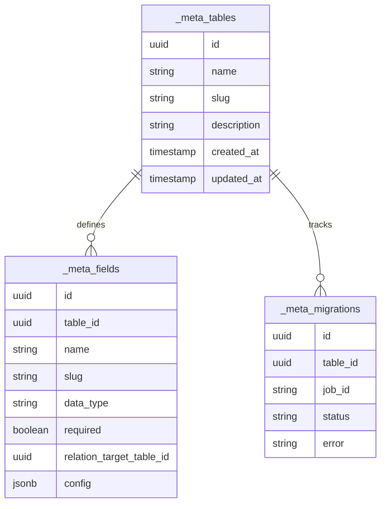
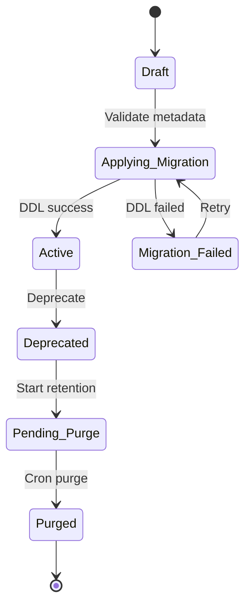
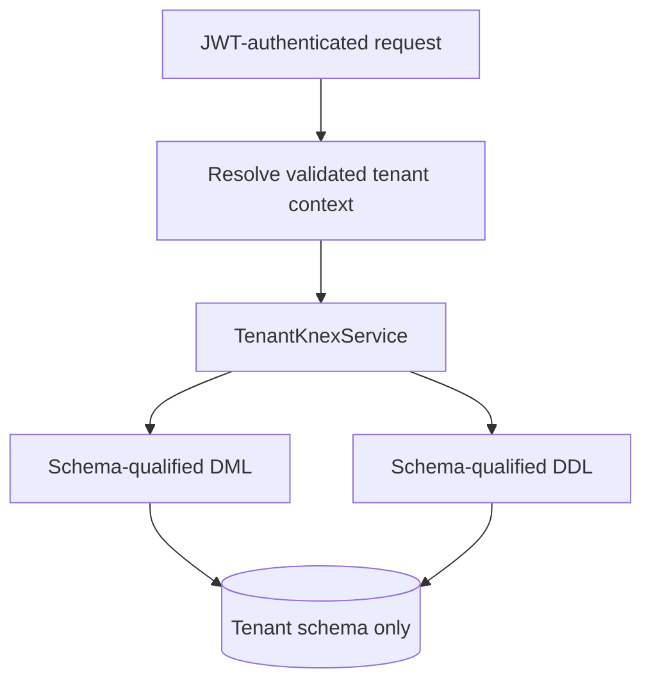

import { Meta } from '@storybook/addon-docs/blocks';
import { Badge, Card } from '../../components/ui';
import { DocumentationTable } from '../DocumentationTable';

<Meta title="Specifications/Data Modeling & Query Builder" />

# Data Modeling & Query Builder

## Mục tiêu, phạm vi và trạng thái

Tài liệu này mô tả contract mục tiêu cho nền tảng Data Modeling và Query
Builder của Flexi trên PostgreSQL theo mô hình schema-per-tenant. Người dùng có
thể định nghĩa cấu trúc dữ liệu động và thao tác dữ liệu mà không truy cập trực
tiếp database.

Đây là đặc tả đích kết hợp với đối chiếu implementation ngày 26/08/2026;
những capability chưa có được ghi rõ và không được xem là cam kết đã hoàn tất.

<div className="grid grid-cols-1 gap-md md:grid-cols-3">
  <Card>
    <div className="flex flex-col gap-sm">
      <Badge tone="success">Đã có</Badge>
      <p className="font-body-sm text-body-sm text-on-surface-variant">
        Catalog UI, tạo bảng, sửa field, DDL bất đồng bộ, CRUD row, relation
        1:N, exact filter, single sort và offset pagination.
      </p>
    </div>
  </Card>
  <Card>
    <div className="flex flex-col gap-sm">
      <Badge tone="warning">Có một phần</Badge>
      <p className="font-body-sm text-body-sm text-on-surface-variant">
        Schema isolation, type validation, expand/backfill/cutover, timeout,
        quota bảng/field/payload/page size và migration log.
      </p>
    </div>
  </Card>
  <Card>
    <div className="flex flex-col gap-sm">
      <Badge tone="neutral">Chưa có</Badge>
      <p className="font-body-sm text-body-sm text-on-surface-variant">
        Query AST lồng nhau, cursor pagination, N:M, formula/lookup/aggregate,
        index builder, RLS/FLS, bulk ops, FTS, named query và EXPLAIN preview.
      </p>
    </div>
  </Card>
</div>

Luồng hiện có:

`Mở /dynamic-tables → xem catalog → tạo bảng hoặc sửa field → validate → enqueue DDL → polling job → tải lại metadata → thao tác row`

### Phân loại phạm vi mục tiêu

<DocumentationTable
  columns={[
    { id: 'scope', header: 'Phân nhóm', width: 'w-1/6' },
    { id: 'capabilities', header: 'Capability', width: 'w-5/12' },
    { id: 'tradeoff', header: 'Rationale và trade-off', width: 'w-5/12' },
  ]}
  rows={[
    {
      id: 'mvp',
      scope: <Badge tone="success">MVP</Badge>,
      capabilities: (
        <>
          Primitive fields; 1:N bằng physical FK; single-column index và unique
          constraint; system fields và soft delete; nested filter, sort,
          keyset/offset pagination, single-level join; physical DDL theo tenant
          schema.
        </>
      ),
      tradeoff:
        'Giữ type constraint và hiệu năng index native. Đổi lại, physical DDL cần kiểm soát lock và migration chặt hơn EAV/JSONB.',
    },
    {
      id: 'production',
      scope: <Badge tone="warning">Production-ready</Badge>,
      capabilities:
        'Formula, lookup, aggregate, N:M, composite index, RLS/FLS, bulk mutation/import/export, aggregation, group by, full-text search, named query và EXPLAIN preview.',
      tradeoff:
        'Phục vụ workload enterprise nhưng tăng độ phức tạp của AST compiler, authorization và worker CPU.',
    },
    {
      id: 'enterprise',
      scope: <Badge tone="neutral">Enterprise / v2</Badge>,
      capabilities:
        'Field versioning, automatic migration rollback, materialized aggregate, tenant PITR và cross-app query federation.',
      tradeoff:
        'Tăng chi phí vận hành và yêu cầu xử lý nhất quán sự kiện, snapshot và recovery.',
    },
  ]}
/>

## Actors và permissions mục tiêu

- **Platform Admin:** quản lý quota, guardrail và giám sát slow query toàn hệ
  thống.
- **Tenant Admin:** quản lý schema, security policy, storage và query quota của
  tenant.
- **App Builder:** tạo/sửa bảng, thiết kế named query, calculated field và UI
  gắn với data model.
- **End User:** CRUD dữ liệu và chạy named query trong phạm vi RLS/FLS.
- **API Client:** tích hợp REST bằng client credentials, scope và rate limit.

Implementation hiện tại xác thực JWT và kiểm tra permission code chi tiết theo
route. Mapping các actor ở trên sang role cụ thể, client credentials, RLS/FLS
và policy-based permission chưa được xác nhận.

<DocumentationTable
  columns={[
    { id: 'permission', header: 'Capability', width: 'w-1/4' },
    { id: 'platform', header: 'Platform Admin' },
    { id: 'tenant', header: 'Tenant Admin' },
    { id: 'builder', header: 'App Builder' },
    { id: 'endUser', header: 'End User' },
    { id: 'apiClient', header: 'API Client' },
  ]}
  rows={[
    {
      id: 'ddl',
      permission: 'Manage dynamic schema',
      platform: 'Retention / override',
      tenant: 'Có',
      builder: 'Có',
      endUser: 'Không',
      apiClient: 'Không',
    },
    {
      id: 'policies',
      permission: 'Manage RLS / FLS',
      platform: 'Không',
      tenant: 'Có',
      builder: 'Có',
      endUser: 'Không',
      apiClient: 'Không',
    },
    {
      id: 'raw-query',
      permission: 'Execute raw Query Builder',
      platform: 'Không',
      tenant: 'Có',
      builder: 'Có',
      endUser: 'Không',
      apiClient: 'Theo scope',
    },
    {
      id: 'named-query',
      permission: 'Execute named query',
      platform: 'Không',
      tenant: 'Có',
      builder: 'Có',
      endUser: 'Theo policy',
      apiClient: 'Theo policy',
    },
    {
      id: 'crud',
      permission: 'Direct row mutation',
      platform: 'Không',
      tenant: 'Có',
      builder: 'Có',
      endUser: 'Theo RLS',
      apiClient: 'Theo RLS',
    },
    {
      id: 'bulk',
      permission: 'Bulk import / export',
      platform: 'Không',
      tenant: 'Có',
      builder: 'Theo policy',
      endUser: 'Không',
      apiClient: 'Theo policy',
    },
  ]}
/>

## Functional requirements

### Data model và field type

<DocumentationTable
  columns={[
    { id: 'area', header: 'Nhóm', width: 'w-1/5' },
    { id: 'target', header: 'Contract mục tiêu', width: 'w-2/5' },
    { id: 'current', header: 'Implementation hiện tại', width: 'w-2/5' },
  ]}
  rows={[
    {
      id: 'primitive',
      area: 'Primitive fields',
      target:
        'Text, Number, Boolean, Date, DateTime, Select, Multi-Select, JSON và Attachment.',
      current: (
        <>
          <Badge tone="success">Đã có phần lõi</Badge> <code>STRING</code>,{' '}
          <code>TEXT</code>, <code>NUMBER</code>, <code>BOOLEAN</code>,{' '}
          <code>DATE</code>, <code>DATETIME</code>, <code>JSON</code>,{' '}
          <code>EMAIL</code>, <code>URL</code> và <code>SELECT</code>. Chưa có
          Multi-Select/Attachment.
        </>
      ),
    },
    {
      id: 'relation',
      area: 'Relationships',
      target:
        '1:N bằng FK; N:M bằng junction table sys_rel_{table1}_{table2} với unique pair.',
      current: (
        <>
          <Badge tone="warning">Có một phần</Badge> <code>RELATION</code> tạo
          physical FK 1:N và resolve bằng join; chưa có N:M.
        </>
      ),
    },
    {
      id: 'indexes',
      area: 'Constraints và index',
      target: 'Unique, single-column index và composite index tối đa bốn cột.',
      current: <Badge tone="neutral">Chưa có public builder/API</Badge>,
    },
    {
      id: 'calculated',
      area: 'Calculated fields',
      target:
        'Formula từ AST, lookup qua relation và COUNT/SUM/AVG/MIN/MAX bằng trigger hoặc worker.',
      current: <Badge tone="neutral">Chưa triển khai</Badge>,
    },
  ]}
/>

### Query Builder và execution

Filter mục tiêu hỗ trợ nhóm `AND`/`OR` lồng nhau có depth guardrail và các
operator `=`, `!=`, `>`, `>=`, `<`, `<=`, `IN`, `NOT IN`, `LIKE`, `ILIKE`,
`IS NULL`, `IS NOT NULL`, `BETWEEN`. Full-text search dùng `tsvector` và
`pg_trgm`. Named query đóng gói AST thành endpoint ổn định, nhận parameter và
ép kiểu output schema.

Hiện tại `GET /api/tables/:tableId/rows` chỉ hỗ trợ:

- exact-match filter dạng object, `null` được chuyển thành `IS NULL`;
- một `sortBy`/`sortDirection`, luôn thêm `id ASC` để ổn định thứ tự;
- offset pagination, mặc định 50 row và page size tối đa 100;
- relation được resolve bằng left join; chưa có AST, nested boolean group,
  cursor, aggregate, FTS, named query hay query cost preview.

## Business rules và guardrails

### Schema migration

- Đổi label/description không nên kích hoạt DDL.
- Cast tương thích có thể chạy trực tiếp; cast không tương thích phải dùng
  biểu thức cast hoặc shadow column → batch copy/cast → cutover.
- Table/column có dữ liệu không được purge tức thời; contract mục tiêu dùng
  trạng thái `Pending_Deletion` trong 30 ngày.
- Implementation hiện tại đổi type bằng add shadow → backfill → cutover trong
  DDL job. Remove field hiện tạo `DROP COLUMN` job; soft-delete metadata và
  retention 30 ngày **chưa triển khai**.
- DDL worker đặt `lock_timeout` mặc định 5.000ms và `statement_timeout` mặc
  định 30.000ms bằng `SET LOCAL` trong transaction; job retry mặc định ba lần.

### Query guardrail

<DocumentationTable
  columns={[
    { id: 'guardrail', header: 'Guardrail', width: 'w-1/4' },
    { id: 'target', header: 'Contract mục tiêu', width: 'w-3/8' },
    { id: 'current', header: 'Hiện trạng', width: 'w-3/8' },
  ]}
  rows={[
    {
      id: 'timeout',
      guardrail: 'Statement timeout',
      target: '3.000ms cho UI; 30.000ms cho worker.',
      current: 'DDL worker có timeout 30.000ms; DML/UI timeout chưa xác nhận.',
    },
    {
      id: 'row-limit',
      guardrail: 'Row limit',
      target: 'Tối đa 1.000 row cho query UI đồng bộ.',
      current: 'Page size mặc định 50, tối đa 100; chưa có AST query cap.',
    },
    {
      id: 'join-depth',
      guardrail: 'Join depth',
      target: 'Tối đa ba cấp join.',
      current: 'Resolve relation trực tiếp; chưa có traversal nhiều cấp.',
    },
    {
      id: 'plan-cost',
      guardrail: 'Execution plan cost',
      target: 'EXPLAIN và reject khi vượt ngưỡng cấu hình.',
      current: <Badge tone="neutral">Chưa triển khai</Badge>,
    },
    {
      id: 'growth',
      guardrail: 'Schema growth',
      target: 'Giới hạn theo quota tenant.',
      current:
        'Mặc định 50 bảng/tenant, 100 field/bảng, payload mutation 65.536 byte.',
    },
  ]}
/>

## Entity model

Metadata runtime hiện nằm trong tenant schema, không dùng các bảng
`sys_tables`, `sys_fields`, `sys_indexes`, `sys_relationships` của mô hình khái
niệm ban đầu.



`_meta_fields.relation_target_table_id` tham chiếu metadata của target table.
Physical table và FK được tạo trong cùng tenant schema. Index catalog và
relationship catalog tách riêng chưa tồn tại trong implementation hiện tại.

## API contract

### API hiện có

<DocumentationTable
  columns={[
    { id: 'api', header: 'API', width: 'w-1/3' },
    { id: 'permission', header: 'Permission', width: 'w-1/4' },
    { id: 'behavior', header: 'Hành vi', width: 'w-5/12' },
  ]}
  rows={[
    {
      id: 'list-table',
      api: <code>GET /api/tables</code>,
      permission: <code>dynamic-tables.tables.read</code>,
      behavior: 'Danh sách metadata theo offset page.',
    },
    {
      id: 'table-detail',
      api: <code>GET /api/tables/:tableId</code>,
      permission: <code>dynamic-tables.tables.read</code>,
      behavior: 'Table metadata và toàn bộ field definition.',
    },
    {
      id: 'create-table',
      api: <code>POST /api/tables</code>,
      permission: <code>dynamic-tables.tables.create</code>,
      behavior: (
        <>
          Validate, enqueue DDL và trả <code>202 {'{ jobId }'}</code>.
        </>
      ),
    },
    {
      id: 'edit-field',
      api: <code>PATCH /api/tables/:tableId/fields</code>,
      permission: <code>dynamic-tables.fields.update</code>,
      behavior: 'Batch add/remove/modify field, trả DDL job id.',
    },
    {
      id: 'job',
      api: <code>GET /api/tables/jobs/:jobId</code>,
      permission: <code>dynamic-tables.jobs.read</code>,
      behavior: 'pending, processing, completed hoặc failed.',
    },
    {
      id: 'rows',
      api: <code>POST/GET/PATCH/DELETE /api/tables/:tableId/rows</code>,
      permission: <code>dynamic-tables.rows.*</code>,
      behavior: 'CRUD row theo runtime metadata và route permission.',
    },
  ]}
/>

Body tạo bảng hiện tại:

```json
{
  "name": "Orders",
  "description": "Quản lý đơn hàng",
  "fields": [
    { "name": "Code", "dataType": "STRING", "required": true },
    { "name": "Total amount", "dataType": "NUMBER" }
  ]
}
```

### API mục tiêu chưa triển khai

<DocumentationTable
  columns={[
    { id: 'api', header: 'API đề xuất', width: 'w-2/5' },
    { id: 'purpose', header: 'Mục đích', width: 'w-2/5' },
    { id: 'status', header: 'Trạng thái', width: 'w-1/5' },
  ]}
  rows={[
    {
      id: 'ast-query',
      api: <code>POST /api/v1/data/:tableSlug/query</code>,
      purpose:
        'Select, nested where, sort, cursor/offset pagination và join bằng AST.',
      status: <Badge tone="neutral">Chưa triển khai</Badge>,
    },
    {
      id: 'bulk-mutation',
      api: <code>POST /api/v1/data/:tableSlug/bulk-mutation</code>,
      purpose: 'Batch insert/update/delete trong transaction.',
      status: <Badge tone="neutral">Chưa triển khai</Badge>,
    },
    {
      id: 'preview',
      api: <code>POST /api/v1/metadata/queries/preview-explain</code>,
      purpose: 'Trả generated SQL và EXPLAIN plan mà không mutation dữ liệu.',
      status: <Badge tone="neutral">Chưa triển khai</Badge>,
    },
  ]}
/>

Ví dụ AST mục tiêu:

```json
{
  "select": ["id", "code", "total_amount", "customer.name"],
  "where": {
    "and": [
      { "field": "status", "operator": "EQ", "value": "COMPLETED" },
      { "field": "total_amount", "operator": "GTE", "value": 100000 }
    ]
  },
  "sort": [{ "field": "created_at", "direction": "DESC" }],
  "pagination": { "type": "CURSOR", "limit": 50, "cursor": "..." }
}
```

## Lifecycle

Lifecycle mục tiêu:



Implementation hiện tại chỉ công bố trạng thái job `pending`, `processing`,
`completed`, `failed` và migration log `pending`, `completed`, `failed`.
`Draft`, `Active`, `Deprecated`, `Pending_Purge`, rollback và purge cron chưa
được thể hiện trong metadata/API.

## Validation và error cases

<DocumentationTable
  columns={[
    { id: 'scenario', header: 'Kịch bản', width: 'w-1/4' },
    { id: 'layer', header: 'Layer', width: 'w-1/6' },
    { id: 'target', header: 'Kết quả mục tiêu', width: 'w-1/4' },
    { id: 'current', header: 'Đối chiếu hiện tại', width: 'w-1/3' },
  ]}
  rows={[
    {
      id: 'type',
      scenario: 'Field type mismatch',
      layer: 'Runtime schema validation',
      target: <code>400 BAD_REQUEST</code>,
      current: 'Đã validate type, required, min/max, length và SELECT enum.',
    },
    {
      id: 'unique',
      scenario: 'Unique violation',
      layer: 'Database',
      target: <code>409 CONFLICT</code>,
      current: 'Dynamic unique/index definition chưa có public API.',
    },
    {
      id: 'fk',
      scenario: 'Foreign key missing',
      layer: 'Database',
      target: <code>422 UNPROCESSABLE_ENTITY</code>,
      current: <code>400 VALIDATION_ERROR</code>,
    },
    {
      id: 'lock',
      scenario: 'Schema locked',
      layer: 'DDL worker / lock',
      target: <code>423 LOCKED</code>,
      current:
        'Có PostgreSQL advisory lock cho quota admission và lock timeout cho DDL; chưa có Redis distributed lock/error 423 contract.',
    },
    {
      id: 'cost',
      scenario: 'Query cost exceeded',
      layer: 'Guardrail engine',
      target: <code>422 UNPROCESSABLE_ENTITY</code>,
      current: <Badge tone="neutral">Chưa triển khai</Badge>,
    },
    {
      id: 'fls',
      scenario: 'Field read denied',
      layer: 'Security compiler',
      target: (
        <>
          <code>200 OK</code> và strip field
        </>
      ),
      current: <Badge tone="neutral">Chưa triển khai</Badge>,
    },
  ]}
/>

## Security và tenant isolation

Mỗi request dynamic-table lấy tenant context từ JWT đã verify. Backend dùng
`TenantKnexService.withSchema(...)` để schema-qualify query và DDL; không dùng
session-level `SET search_path`, tránh rò rỉ context khi PgBouncer tái sử dụng
connection. System actor không có tenant context nên không thể dùng API này.



Contract RLS mục tiêu chèn security predicate vào `WHERE`. Contract FLS loại
field không có quyền đọc khỏi `SELECT` và field không có quyền ghi khỏi
`UPDATE SET`. Hai lớp này và policy expression compiler chưa được triển khai;
route-level RBAC hiện tại không thay thế RLS/FLS.

## Audit và observability

Contract mục tiêu yêu cầu audit append-only cho mọi DDL/DML. Field có
`is_sensitive=true` phải hash hoặc thay bằng `***REDACTED***` trước khi lưu.

```json
{
  "audit_id": "uuid",
  "tenant_id": "tenant-uuid",
  "actor_id": "user-uuid",
  "action": "DATA_UPDATE",
  "target_table": "app_orders",
  "record_id": "record-uuid",
  "changes": {
    "status": { "old": "PENDING", "new": "PAID" },
    "credit_card": { "old": "***REDACTED***", "new": "***REDACTED***" }
  },
  "timestamp": "2026-08-26T11:48:56Z"
}
```

Metrics mục tiêu:

- `flexi_query_execution_duration_seconds` theo tenant;
- `flexi_ddl_migration_total` theo kết quả;
- `flexi_slow_queries_total` cho query trên 1.000ms.

Migration log `_meta_migrations` đã có, nhưng append-only audit DDL/DML,
sensitive-field metadata/redaction và các metrics trên chưa được xác nhận từ
implementation hiện tại.

## Acceptance criteria mục tiêu

### AC-01 — Tenant isolation

**Given** Tenant A và Tenant B cùng có table `customers`  
**When** user Tenant A đọc row của table tương ứng  
**Then** query phải schema-qualify vào tenant A và không thể đọc row Tenant B.

Implementation hiện dùng `tableId` và schema-qualified query thay vì endpoint
theo `tableSlug`; thuộc tính isolation của scenario đã được thể hiện trong
service và test tenancy.

### AC-02 — Chặn query vượt cost

**Given** query lọc fuzzy trên cột lớn chưa có index  
**When** estimated plan cost vượt ngưỡng tenant  
**Then** API trả `422` và khuyến nghị tạo index mà không chạy query.

<Badge tone="neutral">Chưa triển khai EXPLAIN cost guardrail</Badge>

### AC-03 — Field-Level Security

**Given** role Staff không được đọc field `salary`  
**When** query yêu cầu `name` và `salary`  
**Then** compiler loại `salary` và response không chứa key này.

<Badge tone="neutral">Chưa triển khai FLS compiler</Badge>

## Dependencies

<DocumentationTable
  columns={[
    { id: 'dependency', header: 'Dependency', width: 'w-1/4' },
    { id: 'target', header: 'Vai trò mục tiêu', width: 'w-1/2' },
    { id: 'current', header: 'Hiện trạng', width: 'w-1/4' },
  ]}
  rows={[
    {
      id: 'postgres',
      dependency: 'PostgreSQL 15+',
      target: 'Schema-per-tenant, JSONB, pg_trgm, tsvector và physical DDL.',
      current: 'Đã dùng PostgreSQL/Knex cho tenant DDL và DML.',
    },
    {
      id: 'queue',
      dependency: 'BullMQ-compatible queue',
      target: 'DDL, import/export và aggregate jobs.',
      current: 'Đã dùng BullMQ API cho DDL worker.',
    },
    {
      id: 'redis',
      dependency: 'Redis 7+',
      target: 'Metadata cache và distributed locks.',
      current:
        'DDL admission dùng PostgreSQL advisory lock; Redis role này chưa có.',
    },
    {
      id: 'storage',
      dependency: 'S3-compatible storage',
      target: 'Attachment và bulk export artifacts.',
      current: <Badge tone="neutral">Chưa xác nhận</Badge>,
    },
  ]}
/>

## Open decisions

1. **Materialized aggregate:** trigger đồng bộ cho real-time consistency hay
   worker bất đồng bộ cho write throughput và eventual consistency.
2. **Số field tối đa:** implementation đang mặc định 100 field/bảng và cho
   phép cấu hình bằng environment; stakeholder cần xác nhận đây có phải product
   limit hay chỉ operational guardrail.
3. **Hard delete và compliance:** Tenant Admin được purge chủ động hay bắt buộc
   chờ retention 30 ngày; cần xác định ngoại lệ GDPR/right-to-be-forgotten.
4. **Tenant schema routing:** contract ban đầu đề xuất `SET search_path`, nhưng
   implementation chủ đích schema-qualify từng query để an toàn với connection
   pooling. Giữ implementation hiện tại làm chuẩn trừ khi có bằng chứng khác.
5. **Error semantics:** thống nhất `422` mục tiêu cho missing FK với
   `400 VALIDATION_ERROR` đang triển khai.

## Backlog breakdown

<DocumentationTable
  columns={[
    { id: 'epic', header: 'Epic', width: 'w-1/4' },
    { id: 'delivered', header: 'Đã có / có một phần', width: 'w-3/8' },
    { id: 'remaining', header: 'Còn lại', width: 'w-3/8' },
  ]}
  rows={[
    {
      id: 'modeling',
      epic: 'Dynamic Data Modeling',
      delivered:
        'Tenant metadata, physical create/alter, primitive fields, 1:N relation, expand/backfill/cutover và DDL job polling.',
      remaining:
        'Index/unique builder, N:M, soft-delete retention, calculated fields, schema version và rollback.',
    },
    {
      id: 'query',
      epic: 'High-performance Query Builder',
      delivered:
        'Exact filters, single sort, offset pagination và relation join.',
      remaining:
        'AST compiler, nested AND/OR, operator set, cursor pagination, FTS, aggregate, named query và preview.',
    },
    {
      id: 'security',
      epic: 'Security, guardrails và observability',
      delivered:
        'JWT tenant context, route RBAC, schema qualification, DDL timeouts, growth limits và migration log.',
      remaining:
        'RLS/FLS, query cost guardrail, tenant rate/storage quota, audit redaction và Prometheus metrics.',
    },
  ]}
/>

## Traceability

<DocumentationTable
  columns={[
    { id: 'responsibility', header: 'Trách nhiệm', width: 'w-1/3' },
    { id: 'implementation', header: 'Implementation', width: 'w-2/3' },
  ]}
  rows={[
    {
      id: 'ui',
      responsibility: 'Catalog, builder và row UI',
      implementation: (
        <>
          <code>apps/frontend/src/pages/DynamicTablesPage.tsx</code>,{' '}
          <code>DynamicTableRowsPage.tsx</code>,{' '}
          <code>components/dynamic-tables/*</code>
        </>
      ),
    },
    {
      id: 'client',
      responsibility: 'Frontend API contract',
      implementation: <code>apps/frontend/src/lib/dynamic-tables-api.ts</code>,
    },
    {
      id: 'routes',
      responsibility: 'Backend routes và permission',
      implementation: (
        <>
          <code>
            apps/backend/src/modules/dynamic-tables/tables.controller.ts
          </code>
          , <code>rows.controller.ts</code>
        </>
      ),
    },
    {
      id: 'dto',
      responsibility: 'Static DDL request validation',
      implementation: (
        <>
          <code>dto/create-table.dto.ts</code>,{' '}
          <code>dto/update-field.dto.ts</code>
        </>
      ),
    },
    {
      id: 'logic',
      responsibility: 'Metadata, guardrail, validation và row CRUD',
      implementation: <code>dynamic-tables.service.ts</code>,
    },
    {
      id: 'worker',
      responsibility: 'DDL, timeout và migration log',
      implementation: <code>ddl-worker.ts</code>,
    },
    {
      id: 'tenancy',
      responsibility: 'Tenant-scoped data access',
      implementation: (
        <code>apps/backend/src/tenancy/tenant-knex.service.ts</code>
      ),
    },
    {
      id: 'shared',
      responsibility: 'Field enum, response và permission contracts',
      implementation: (
        <>
          <code>packages/shared-types/src/enums.ts</code>,{' '}
          <code>entities.ts</code>, <code>permissions.ts</code>
        </>
      ),
    },
  ]}
/>
