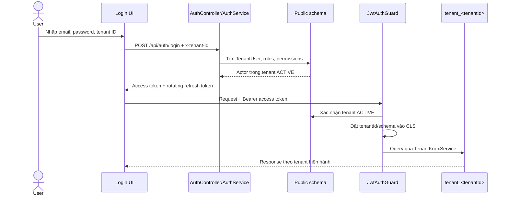
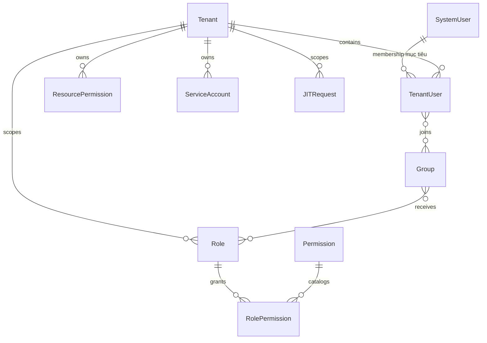
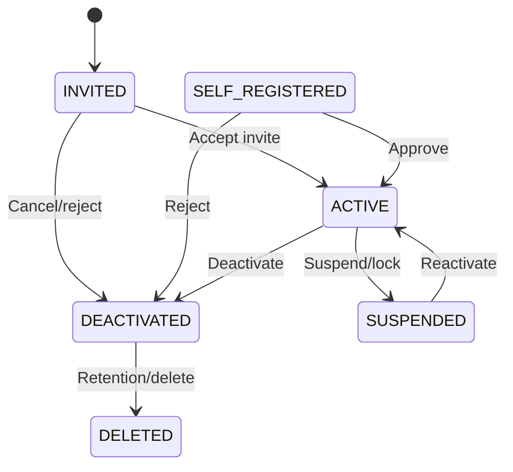

import { Meta } from '@storybook/addon-docs/blocks';
import { Badge, Card } from '../../components/ui';
import { DocumentationTable } from '../DocumentationTable';

<Meta title="Specifications/IAM/Multi-tenant Architecture" />

# IAM multi-tenant

## Phạm vi và cách đọc

Trang này đối chiếu thiết kế IAM multi-tenant mục tiêu với implementation hiện
tại của Flexi. Các capability có nhãn **Mục tiêu** hoặc **Chưa triển khai** là
yêu cầu/backlog được cung cấp, không phải contract production đang hoạt động.

  <Card>
    

      <Badge tone="success">Đã có</Badge>
      

        Tenant/System identity, password login, JWT, refresh-token rotation,
        route RBAC và schema-per-tenant.
      

    

  </Card>
  <Card>
    

      <Badge tone="warning">Có một phần</Badge>
      

        User lifecycle, role catalog, First Admin onboarding và audit mới phục
        vụ một số flow hiện có.
      

    

  </Card>
  <Card>
    

      <Badge tone="neutral">Chưa có</Badge>
      

        MFA, account lockout, service account, RLS/FLS, SSO, SCIM, impersonation
        và JIT access. Tenant switch không nằm trong kế hoạch — ADR-009 đã loại
        bỏ nó.
      

    

  </Card>

## Kiến trúc hiện tại đã xác nhận

Flexi đang dùng hai loại actor. `SystemUser` hoạt động ở control plane;
`TenantUser` thuộc đúng một tenant. Mỗi actor có một `AuthAccount` chứa email
và password hash. Email không unique toàn cục, vì vậy cùng một email có thể là
những account độc lập ở nhiều tenant và có mật khẩu khác nhau.

Tenant login được chọn bằng header `x-tenant-id`; system login không gửi
header này. Access token của tenant chứa đúng một `tenantId`. JWT guard xác
thực token, kiểm tra tenant còn `ACTIVE`, rồi đặt `tenantId` và schema đã kiểm
tra vào CLS context. Mọi truy vấn runtime của Dynamic Tables đi qua
`TenantKnexService` và schema `tenant_<tenantId>`.

ADR-009 chốt đúng hình dạng này làm mục tiêu chứ không phải làm trạng thái tạm:
identity là tenant-local, email unique theo tenant, và token không mang khái
niệm "active tenant" tách rời vì mỗi account chỉ thuộc một tenant. Phần còn
thiếu là chỗ đặt ràng buộc — `tenantId` phải nằm trên chính `AuthAccount` và
uniqueness phải do index đảm nhiệm, thay vì do service layer kiểm tra trước khi
ghi.

### Nền tảng bảo mật hiện có

<DocumentationTable
  columns={[
    { id: 'area', header: 'Khu vực', width: 'w-1/5' },
    { id: 'current', header: 'Implementation hiện tại', width: 'w-2/5' },
    {
      id: 'gap',
      header: 'Khoảng trống so với thiết kế mục tiêu',
      width: 'w-2/5',
    },
  ]}
  rows={[
    {
      id: 'identity',
      area: 'Identity',
      current:
        'AuthAccount tách khỏi SystemUser/TenantUser; một account chỉ đại diện một actor theo invariant ở service.',
      gap: 'ADR-009 chốt identity tenant-local, đúng theo repository hiện tại. Global User bị loại. Việc còn lại: đưa tenantId lên AuthAccount và ép unique (tenantId, email) ở tầng DB.',
    },
    {
      id: 'session',
      area: 'Session',
      current: (
        <>
          Access token mặc định <code>15m</code>; refresh token mặc định{' '}
          <code>7d</code>, rotate và lưu SHA-256 hash trong PostgreSQL.
        </>
      ),
      gap: 'Chưa dùng Redis session/blacklist và chưa có giao diện quản lý thiết bị hoặc revoke access token tức thì.',
    },
    {
      id: 'authorization',
      area: 'Authorization',
      current:
        'Role → RolePermission → Permission; guard yêu cầu đủ mọi permission gắn trên route.',
      gap: 'Chưa có resource ACL, group/team inheritance, RLS, FLS hoặc UI quản trị custom role.',
    },
    {
      id: 'isolation',
      area: 'Tenant isolation',
      current:
        'Identity/control plane ở public schema; runtime Dynamic Tables ở schema riêng, lấy context duy nhất từ JWT đã verify.',
      gap: 'Switch-tenant endpoint đã bị ADR-009 loại khỏi scope, kéo theo ERR_TENANT_MISMATCH cho luồng session. Đổi tenant nghĩa là đăng nhập lại.',
    },
    {
      id: 'audit',
      area: 'Audit',
      current: 'Có onboarding audit append-only và LogEntry tổng quát.',
      gap: 'Chưa có audit queue/contract bắt buộc cho mọi hành động IAM, impersonation và thay đổi quyền.',
    },
  ]}
/>

## Permission taxonomy

Thiết kế mục tiêu đề xuất mã quyền:
`[domain]:[resource_type]:[action]:[scope_or_modifier]`, với domain
`platform`, `tenant`, `app` và `data`. Scope/modifier là tùy chọn.

<DocumentationTable
  columns={[
    { id: 'code', header: 'Mã quyền mục tiêu', width: 'w-1/3' },
    { id: 'meaning', header: 'Ý nghĩa', width: 'w-5/12' },
    { id: 'status', header: 'Đối chiếu hiện tại', width: 'w-1/4' },
  ]}
  rows={[
    {
      id: 'tenant-create',
      code: <code>platform:tenant:create</code>,
      meaning: 'Tạo tenant trên platform.',
      status: (
        <>
          Gần nhất: <code>system.tenants.onboard</code>
        </>
      ),
    },
    {
      id: 'user-invite',
      code: <code>tenant:user:invite</code>,
      meaning: 'Mời user vào tenant hiện hành.',
      status: <Badge tone="neutral">Chưa triển khai</Badge>,
    },
    {
      id: 'page-publish',
      code: <code>app:page:publish</code>,
      meaning: 'Xuất bản một page.',
      status: <Badge tone="neutral">Chưa triển khai</Badge>,
    },
    {
      id: 'workflow-execute',
      code: <code>app:workflow:execute</code>,
      meaning: 'Kích hoạt workflow.',
      status: <Badge tone="neutral">Chưa triển khai</Badge>,
    },
    {
      id: 'row-read',
      code: <code>data:table_orders:read:row_level</code>,
      meaning: 'Đọc orders sau khi áp dụng row policy.',
      status: (
        <>
          Hiện chỉ có <code>dynamic-tables.rows.read</code> ở cấp route.
        </>
      ),
    },
    {
      id: 'field-update',
      code: <code>data:table_customers:update:field_salary</code>,
      meaning: 'Cho phép cập nhật field salary.',
      status: <Badge tone="neutral">Chưa triển khai</Badge>,
    },
  ]}
/>

**Quyết định cần chốt:** catalog hiện dùng dot notation như
`system.tenants.read` và `dynamic-tables.rows.update`. Việc chuyển sang colon
notation là breaking change cho migration, seed, decorator, JWT và test; cần
một canonical catalog cùng chiến lược migrate/alias trước khi triển khai.

Ngoài public RBAC dùng cho xác thực, provisioning còn seed bảng
`roles`/`permissions` bên trong từng tenant schema với các mã như
`entities.read`. Chưa có implementation chứng minh catalog tenant-schema này
tham gia `PermissionsGuard`; hai catalog cần được hợp nhất hoặc phân định vai
trò rõ ràng.

## Actors mục tiêu

<DocumentationTable
  columns={[
    { id: 'actor', header: 'Actor', width: 'w-1/5' },
    { id: 'target', header: 'Năng lực mục tiêu', width: 'w-2/5' },
    { id: 'current', header: 'Hiện trạng', width: 'w-2/5' },
  ]}
  rows={[
    {
      id: 'platform-admin',
      actor: 'Platform Super Admin',
      target: 'Tenant lifecycle, quota, support impersonation.',
      current:
        'SystemUser + SYSTEM permissions quản lý tenant; không có bypass super-admin, quota hoặc impersonation.',
    },
    {
      id: 'owner',
      actor: 'Tenant Owner',
      target: 'Billing, SSO/SCIM, ownership transfer và toàn quyền tenant.',
      current: 'Không có owner invariant hoặc system role tương ứng.',
    },
    {
      id: 'tenant-admin',
      actor: 'Tenant Admin',
      target: 'User, custom role, team và tài nguyên tenant.',
      current:
        'First Admin được gán role Tenant Admin khi onboarding; chưa có UI/API IAM chung.',
    },
    {
      id: 'builder',
      actor: 'App Builder / Developer',
      target: 'Dynamic Tables, Pages, Workflows và Cron.',
      current:
        'Không có actor/role chuẩn hóa; Dynamic Tables hiện kiểm tra permission cấp route.',
    },
    {
      id: 'member',
      actor: 'End User / Member',
      target: 'Dùng ứng dụng theo RBAC/RLS/FLS.',
      current:
        'Có TenantUser và role Member trong tenant seed; RLS/FLS chưa có.',
    },
    {
      id: 'machine',
      actor: 'Service Account / API Key',
      target: 'CI/CD, webhook và machine-to-machine integration.',
      current: <Badge tone="neutral">Chưa triển khai</Badge>,
    },
  ]}
/>

## Capability roadmap

<DocumentationTable
  columns={[
    { id: 'phase', header: 'Phân kỳ đề xuất', width: 'w-1/6' },
    { id: 'capability', header: 'Capability', width: 'w-5/12' },
    { id: 'current', header: 'Trạng thái từ code', width: 'w-5/12' },
  ]}
  rows={[
    {
      id: 'mvp-auth',
      phase: 'MVP',
      capability: 'Email/password, JWT và refresh token.',
      current: 'Đã có; refresh token hash ở PostgreSQL, không phải Redis.',
    },
    {
      id: 'mvp-tenant',
      phase: 'MVP',
      capability: 'Tenant isolation.',
      current:
        'Isolation đã có cho Dynamic Tables. Tenant switch bị ADR-009 loại khỏi scope, không còn là capability MVP.',
    },
    {
      id: 'mvp-onboarding',
      phase: 'MVP',
      capability: 'Invite/direct creation và basic roles.',
      current:
        'Có First Admin setup riêng; chưa có onboarding user tổng quát hoặc role management API.',
    },
    {
      id: 'mvp-machine',
      phase: 'MVP',
      capability: 'API key và service account.',
      current: <Badge tone="neutral">Chưa triển khai</Badge>,
    },
    {
      id: 'production-auth',
      phase: 'Production-ready',
      capability: 'Session management, lockout, recovery và TOTP MFA.',
      current:
        'Có refresh rotation/replay kill-switch; các capability còn lại chưa có.',
    },
    {
      id: 'production-users',
      phase: 'Production-ready',
      capability: 'Self-registration, approval và ownership transfer.',
      current: <Badge tone="neutral">Chưa triển khai</Badge>,
    },
    {
      id: 'enterprise-data',
      phase: 'Enterprise',
      capability: 'RLS và FLS cho Dynamic Tables.',
      current: <Badge tone="neutral">Chưa triển khai</Badge>,
    },
    {
      id: 'enterprise-identity',
      phase: 'Enterprise',
      capability: 'SAML/OIDC, SCIM, impersonation và JIT.',
      current:
        'JWT payload dành trước impersonatedBy nhưng không gán. ADR-009 giữ impersonation khả thi dưới identity tenant-local: token tenant-scoped phát mới, không cần membership.',
    },
  ]}
/>

## Business rules mục tiêu

Các rule dưới đây cần được stakeholder xác nhận và triển khai trước khi được
dùng làm contract production.

<DocumentationTable
  columns={[
    { id: 'rule', header: 'Rule', width: 'w-1/5' },
    { id: 'target', header: 'Hành vi mục tiêu', width: 'w-1/2' },
    { id: 'current', header: 'Hiện trạng', width: 'w-3/10' },
  ]}
  rows={[
    {
      id: 'lockout',
      rule: 'Account lockout',
      target: '5 lần sai trong 15 phút → khóa 15 phút và gửi security email.',
      current:
        'Login/refresh có throttle nhưng không đếm sai theo account và không có lockedUntil.',
    },
    {
      id: 'impersonation',
      rule: 'Impersonation',
      target:
        'Tenant opt-in hoặc JIT approval; tối đa 60 phút; chặn SSO, Billing và Owner transfer.',
      current:
        'Chưa có endpoint, policy, token hoặc audit flow. ADR-009 chốt cơ chế: token tenant-scoped phát mới với impersonatedBy, TTL <= 15 phút theo SRS, không kèm refresh token.',
    },
    {
      id: 'switch',
      rule: 'Tenant switch',
      target:
        'Bị loại bởi ADR-009. Không có active tenant tách rời, không có POST /auth/switch-tenant.',
      current:
        'Mỗi tenant token mang đúng một tenantId, và đó cũng là tenant duy nhất của account. Đổi tenant là đăng nhập lại với x-tenant-id khác.',
    },
    {
      id: 'transfer',
      rule: 'Ownership transfer',
      target:
        'Chuyển Pages, Workflows và Dynamic Tables sang assignee trước khi xóa/vô hiệu user.',
      current: 'Chưa có ownership contract chung hoặc user delete API.',
    },
    {
      id: 'rls',
      rule: 'RLS',
      target: 'Áp dụng JSON rule theo current user/department vào query.',
      current:
        'Dynamic row query chỉ được cô lập theo tenant và permission cấp route.',
    },
    {
      id: 'fls',
      rule: 'FLS',
      target: 'Read loại bỏ field bị cấm; write trả ERR_FIELD_ACCESS_DENIED.',
      current: 'Không có FieldPermission hoặc response redaction theo field.',
    },
  ]}
/>

## Data model mục tiêu

<DocumentationTable
  columns={[
    { id: 'target', header: 'Khái niệm mục tiêu', width: 'w-1/4' },
    { id: 'purpose', header: 'Mục đích', width: 'w-3/8' },
    { id: 'current', header: 'Đối chiếu Prisma hiện tại', width: 'w-3/8' },
  ]}
  rows={[
    {
      id: 'identity',
      target: 'SystemUser + TenantUser',
      purpose:
        'Identity tenant-local: AuthAccount thuộc đúng một tenant, hoặc thuộc control plane (ADR-009).',
      current:
        'TenantUser trỏ tới AuthAccount độc lập, đúng theo ADR-009. Còn thiếu cột AuthAccount.tenantId và unique (tenantId, email) để ràng buộc nằm ở DB thay vì ở service.',
    },
    {
      id: 'tenant',
      target: 'Tenant',
      purpose: 'Status, schema và quota config.',
      current:
        'Có id/name/slug/status; schema được derive từ id, chưa có quotaConfig.',
    },
    {
      id: 'rbac',
      target: 'Role, Permission, RolePermission',
      purpose: 'RBAC tenant/system.',
      current:
        'Đã có trong public schema; Role chưa có code/isSystemRole, Permission dùng scope SYSTEM/TENANT.',
    },
    {
      id: 'group',
      target: 'Group, GroupUser, GroupRole',
      purpose: 'Team phân cấp và kế thừa role.',
      current: 'Không có model tương ứng.',
    },
    {
      id: 'resource',
      target: 'ResourcePermission',
      purpose: 'ACL theo App/Page/Workflow/Table.',
      current: 'Không có model tương ứng.',
    },
    {
      id: 'fine-grained',
      target: 'FieldPermission, RowPolicy',
      purpose: 'FLS/RLS cho Dynamic Tables.',
      current: 'Không có model tương ứng.',
    },
    {
      id: 'machine',
      target: 'ApiKey, ServiceAccount',
      purpose: 'Machine identity, scope và secret expiry.',
      current: 'Không có model tương ứng.',
    },
    {
      id: 'jit',
      target: 'JITRequest',
      purpose: 'Approval và quyền tạm thời.',
      current: 'Không có model tương ứng.',
    },
  ]}
/>

## API capability contracts mục tiêu

API đang chạy dùng prefix `/api`; một số tenant-management API có thêm
`/v1`, nhưng auth hiện là `/api/auth/*`. Các endpoint dưới đây giữ nguyên
contract đề xuất để lập backlog; chỉ các endpoint có nhãn **Đã có** mới được
xác nhận từ controller hiện tại.

<DocumentationTable
  columns={[
    { id: 'area', header: 'Nhóm', width: 'w-1/6' },
    { id: 'api', header: 'Contract đề xuất', width: 'w-5/12' },
    { id: 'status', header: 'Hiện trạng', width: 'w-5/12' },
  ]}
  rows={[
    {
      id: 'login',
      area: 'Auth',
      api: <code>POST /api/v1/auth/login</code>,
      status: (
        <>
          <Badge tone="success">Đã có tương đương</Badge>{' '}
          <code>POST /api/auth/login</code>; chưa có MFA challenge.
        </>
      ),
    },
    {
      id: 'mfa',
      area: 'Auth',
      api: <code>POST /api/v1/auth/mfa/verify</code>,
      status: <Badge tone="neutral">Chưa triển khai</Badge>,
    },
    {
      id: 'switch',
      area: 'Auth',
      api: <code>POST /api/v1/auth/switch-tenant</code>,
      status: <Badge tone="neutral">Không xây (ADR-009)</Badge>,
    },
    {
      id: 'impersonate',
      area: 'Auth',
      api: <code>POST /api/v1/auth/impersonate</code>,
      status: <Badge tone="neutral">Chưa triển khai</Badge>,
    },
    {
      id: 'users',
      area: 'Users',
      api: (
        <>
          <code>POST /users/invite</code>, <code>POST /users/register</code>,{' '}
          <code>DELETE /users/:id</code>
        </>
      ),
      status: 'Chỉ có First Admin setup flow riêng; chưa có UsersController.',
    },
    {
      id: 'roles',
      area: 'RBAC',
      api: <code>GET/POST /api/v1/roles</code>,
      status: 'Có persistence và guard; chưa có role-management controller.',
    },
    {
      id: 'jit',
      area: 'JIT',
      api: (
        <>
          <code>POST /jit/request</code> và <code>POST /jit/:id/approve</code>
        </>
      ),
      status: <Badge tone="neutral">Chưa triển khai</Badge>,
    },
    {
      id: 'service',
      area: 'Machine',
      api: (
        <>
          <code>POST /service-accounts</code> và <code>POST /api-keys</code>
        </>
      ),
      status: <Badge tone="neutral">Chưa triển khai</Badge>,
    },
  ]}
/>

## Lifecycle và lỗi mục tiêu

State machine này chưa được thể hiện bằng enum hoặc constraint thống nhất.
`TenantUser.status` hiện là string mặc định `active`; First Admin dùng tạm
`pending_setup`. Lifecycle invite/self-registration/locked/deleted chưa có.

<DocumentationTable
  columns={[
    { id: 'condition', header: 'Điều kiện mục tiêu', width: 'w-2/5' },
    { id: 'response', header: 'Response đề xuất', width: 'w-3/10' },
    { id: 'current', header: 'Hiện trạng', width: 'w-3/10' },
  ]}
  rows={[
    {
      id: 'tenant-mismatch',
      condition: 'JWT tenant A truy cập tài nguyên tenant B.',
      response: <code>403 ERR_TENANT_MISMATCH</code>,
      current:
        'Dynamic data route không nhận tenant B từ request; context chỉ đến từ JWT, nên nhánh lỗi này chưa tồn tại.',
    },
    {
      id: 'last-owner',
      condition: 'Xóa hoặc hạ role owner cuối cùng.',
      response: <code>422 ERR_LAST_OWNER_REQUIRED</code>,
      current: 'Chưa có owner invariant.',
    },
    {
      id: 'quota',
      condition: 'Vượt quota user/API key.',
      response: <code>402/409 ERR_QUOTA_EXCEEDED</code>,
      current: 'Chưa có quota persistence/check.',
    },
    {
      id: 'field-read',
      condition: 'Đọc field bị FLS cấm.',
      response: (
        <>
          <code>200</code> và loại field khỏi payload
        </>
      ),
      current: 'Chưa triển khai redaction.',
    },
    {
      id: 'field-write',
      condition: 'Ghi field bị FLS cấm.',
      response: <code>403 ERR_FIELD_ACCESS_DENIED</code>,
      current: 'Chưa triển khai policy check.',
    },
  ]}
/>

## Security, secrets và observability

- Public schema lưu identity/control-plane; runtime Dynamic Tables nằm trong
  schema `tenant_<tenantId>`. Không có fallback ngầm về `public` khi thiếu
  tenant context.
- Password hiện được hash bằng bcrypt. Thiết kế mục tiêu cho phép Argon2id
  hoặc bcrypt work factor 12; thuật toán/cost production cần được chốt trong
  security baseline.
- Refresh token raw không được lưu; backend lưu SHA-256 hash. API-key secret
  chỉ-hiển-thị-một-lần là yêu cầu mục tiêu chưa triển khai.
- Log redaction tổng quát đã có tài liệu/implementation liên quan, nhưng chưa
  xác nhận một audit queue bắt buộc cho toàn bộ IAM.
- Audit mục tiêu cần lưu actor type, tenant, action, target, IP, user agent,
  status và before/after snapshot; security notification cần bao phủ IP lạ,
  SSO change, impersonation và chuỗi login thất bại.

## Acceptance criteria mục tiêu

### AC-01 — Chuyển ownership trước khi xóa user

**Given** User A sở hữu 3 Workflows và 2 Dynamic Tables trong Tenant X.

**When** Admin xóa User A và chọn User B đang active trong cùng tenant.

**Then** hệ thống chuyển toàn bộ `owner_id` sang User B trong cùng transaction,
đổi User A sang `DELETED` và revoke mọi refresh token của User A. Nếu một bước
thất bại, toàn bộ thay đổi phải rollback.

### AC-02 — FLS loại dữ liệu nhạy cảm khỏi response

**Given** User C không có quyền đọc field `ssn` của bảng `customers`.

**When** User C gọi API đọc rows của `customers`.

**Then** API trả `200 OK` và không object nào trong response chứa key `ssn`.

Hai acceptance criteria này chưa có implementation hoặc test thực thi trong
repository hiện tại.

## Thứ tự triển khai đề xuất

1. **Core IAM:** identity model đã chốt ở ADR-009 (tenant-local); còn lại là
   permission taxonomy, migration đưa `tenantId` lên `AuthAccount` cùng unique
   `(tenantId, email)`, Users/Role APIs và invariant last owner. Membership đa
   tenant và tenant switch đã bị loại khỏi scope.
2. **Security hardening:** session inventory/revoke, account lockout, recovery,
   MFA, audit contract và notification.
3. **Machine access:** ServiceAccount/API key, secret one-time display, scope,
   expiry và rotation.
4. **Fine-grained access:** ResourcePermission, RLS rule evaluator và FLS
   enforcement ở cả read/write path.
5. **Enterprise federation:** OIDC/SAML, SCIM, impersonation có consent và JIT
   access có expiry worker.

## Quyết định còn mở

<DocumentationTable
  columns={[
    { id: 'decision', header: 'Quyết định', width: 'w-1/4' },
    { id: 'options', header: 'Lựa chọn', width: 'w-3/8' },
    {
      id: 'evidence',
      header: 'Ảnh hưởng / bằng chứng hiện tại',
      width: 'w-3/8',
    },
  ]}
  rows={[
    {
      id: 'identity',
      decision: 'Identity architecture',
      options:
        'Đã chốt: identity độc lập theo tenant (ADR-009). Global User + membership bị loại.',
      evidence:
        'Code hiện tại đã là identity độc lập, nên quyết định giữ nguyên hướng đi và bổ sung ràng buộc DB. Xét lại chỉ khi có persona đa tenant thật; đường đi khi đó là thêm lớp Person, mô tả trong ADR-009.',
    },
    {
      id: 'rls',
      decision: 'RLS execution',
      options: 'Parse JSON rule ở NestJS hoặc PostgreSQL native RLS.',
      evidence:
        'Dynamic Tables hiện build query bằng Knex theo schema tenant; chưa có policy engine ở cả hai tầng.',
    },
    {
      id: 'permission',
      decision: 'Permission notation',
      options:
        'Giữ dot notation, chuyển colon notation hoặc hỗ trợ alias có thời hạn.',
      evidence:
        'Shared catalog, migrations, seed, JWT và decorators hiện đều dùng dot notation.',
    },
    {
      id: 'session-store',
      decision: 'Session revocation store',
      options:
        'Tiếp tục PostgreSQL refresh-token rows hoặc thêm Redis state/blacklist.',
      evidence:
        'PostgreSQL rotation/replay detection đang chạy; access token không thể revoke tức thì.',
    },
  ]}
/>

## Traceability

<DocumentationTable
  columns={[
    { id: 'responsibility', header: 'Trách nhiệm', width: 'w-1/3' },
    {
      id: 'implementation',
      header: 'Implementation / trạng thái',
      width: 'w-2/3',
    },
  ]}
  rows={[
    {
      id: 'identity-data',
      responsibility: 'Identity, tenant, RBAC và refresh-token persistence',
      implementation: <code>apps/backend/prisma/schema.prisma</code>,
    },
    {
      id: 'auth-api',
      responsibility: 'Login, refresh, logout và me',
      implementation: (
        <>
          <code>apps/backend/src/modules/auth/auth.controller.ts</code>,{' '}
          <code>auth.service.ts</code>, <code>auth.types.ts</code>
        </>
      ),
    },
    {
      id: 'guards',
      responsibility: 'JWT tenant context và route permission',
      implementation: (
        <>
          <code>modules/auth/guards/jwt-auth.guard.ts</code>,{' '}
          <code>permissions.guard.ts</code>
        </>
      ),
    },
    {
      id: 'catalog',
      responsibility: 'Public permission catalog',
      implementation: <code>packages/shared-types/src/permissions.ts</code>,
    },
    {
      id: 'tenant-routing',
      responsibility: 'Schema routing và query boundary',
      implementation: (
        <>
          <code>apps/backend/src/tenancy/resolve-tenant-schema.ts</code>,{' '}
          <code>tenant-context.ts</code>, <code>tenant-knex.service.ts</code>
        </>
      ),
    },
    {
      id: 'frontend-session',
      responsibility: 'Frontend session bootstrap, storage và retry',
      implementation: (
        <>
          <code>apps/frontend/src/auth/AuthContext.tsx</code>,{' '}
          <code>apps/frontend/src/lib/api-client.ts</code>
        </>
      ),
    },
    {
      id: 'tenant-seed',
      responsibility: 'Tenant-schema default roles/permissions',
      implementation: (
        <code>apps/backend/src/modules/tenants/tenant-seed.service.ts</code>
      ),
    },
    {
      id: 'missing',
      responsibility:
        'Users/Role management, MFA, service account, RLS/FLS, SSO/SCIM, impersonation và JIT (switch tenant đã bị ADR-009 loại)',
      implementation: 'Not confirmed from current implementation.',
    },
  ]}
/>
