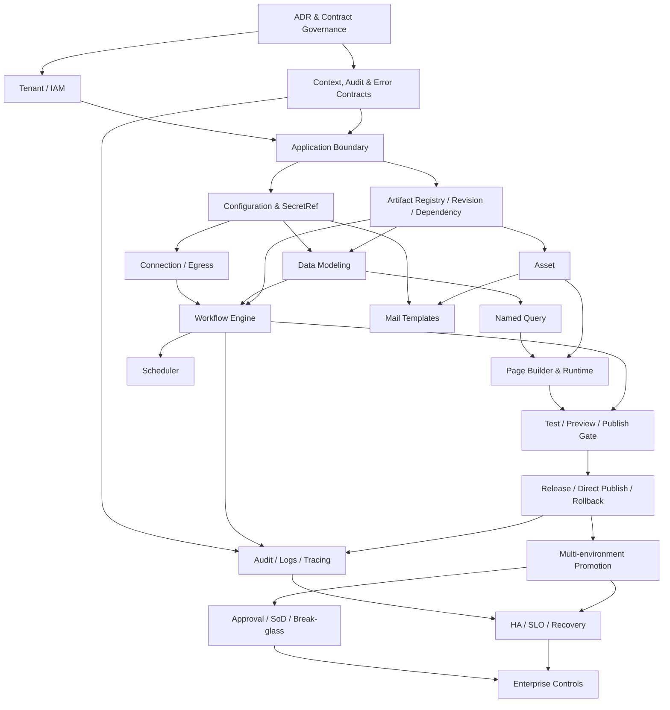

import { Meta } from '@storybook/addon-docs/blocks';
import { Badge, Card } from '../../components/ui';
import { DocumentationTable } from '../DocumentationTable';

<Meta title="Specifications/Product Capability Model/Roadmap & Backlog" />

# Roadmap và implementation backlog hợp nhất

<Card className="mb-lg">
  

    <Badge tone="primary">Dependency ordered</Badge>
    <Badge tone="warning">Không phải lịch cam kết</Badge>
  

  

    Roadmap này sắp theo điều kiện tiên quyết kỹ thuật và product gate. Thời
    gian, đội ngũ, commercial packaging và ngày phát hành chỉ được lập sau khi
    các ADR blocking có owner và due date.
  

</Card>

## Nguyên tắc sequencing

1. Security boundary và contract governance đi trước mọi public builder/runtime.
2. Application, revision và dependency graph đi trước Page/Workflow canvas.
3. Data/Query/Connection/Asset tạo primitives để builders có thể hoàn thành
   một vertical slice thật.
4. Test gate đi trước Publish; observability đi cùng execution, không thêm sau.
5. Multi-environment promotion, approval và HA chỉ mở rộng khi single-scope
   release/rollback đã deterministic. ADR-001 đã chốt single-scope đó là
   **một environment mặc định cho mỗi Application** (`environment_code =
default`); ADR-002 đã chốt topology để mở rộng lên nhiều environment
   (**Hybrid**: PROD tách cluster riêng, DEV/STG chung một cluster non-prod).
6. Một phase chỉ đạt gate khi có test failure path, tenant isolation, RBAC,
   redaction, audit và recovery phù hợp; demo happy path không đủ.

## Dependency diagram

## Phased roadmap

<DocumentationTable
  columns={[
    { id: 'phase', header: 'Phase', width: 'w-[14%]' },
    { id: 'outcome', header: 'Outcome', width: 'w-1/4' },
    { id: 'capabilities', header: 'Capabilities', width: 'w-1/3' },
    { id: 'entry', header: 'Entry dependency', width: 'w-[14%]' },
    { id: 'exit', header: 'Exit gate', width: 'w-[15%]' },
  ]}
  rows={[
    {
      id: 'foundation',
      phase: 'Foundation / Gate 0',
      outcome: 'Một vocabulary và boundary có thể implementation nhất quán.',
      capabilities:
        'ADR blocking; API/error/permission registry; ExecutionContext; audit/redaction; Application/Environment ownership.',
      entry: 'Stakeholder architecture workshop.',
      exit: 'ADR-001…008 approved; contract owners và compatibility policy được chỉ định. Đã có: ADR-001 (Environment thuộc Application, MVP một environment mặc định).',
    },
    {
      id: 'mvp-a',
      phase: 'Low-code MVP — A',
      outcome: 'Tạo workspace an toàn và artifacts có version/dependency.',
      capabilities:
        'Tenant/IAM hardening; Application; default scope (một environment_code = default cho mỗi app, ADR-001); Configuration/SecretRef; Artifact Registry; Audit baseline.',
      entry: 'Gate 0.',
      exit: 'App isolation, optimistic locking, immutable revision và SecretRef tests pass.',
    },
    {
      id: 'mvp-b',
      phase: 'Low-code MVP — B',
      outcome: 'Tạo data và integration primitives có thể tái sử dụng.',
      capabilities:
        'Dynamic Tables app scope; Named Query; HTTP Connection/Operation; Asset upload/reference.',
      entry: 'MVP-A contracts.',
      exit: 'Model→query và connection→operation vertical tests; SSRF/quota/isolation gates pass.',
    },
    {
      id: 'mvp-c',
      phase: 'Low-code MVP — C',
      outcome: 'Builder tạo Page và Workflow thực thi được.',
      capabilities:
        'Page canvas/runtime; Workflow DAG/manual-table-webhook; safe expressions; queue execution; basic run history.',
      entry: 'MVP-B primitives.',
      exit: 'Page/Workflow pin revision; runtime re-authorizes; retry/dedupe and unknown outcome tested.',
    },
    {
      id: 'mvp-d',
      phase: 'Low-code MVP — D',
      outcome: 'Test, publish, monitor và rollback end-to-end.',
      capabilities:
        'Query test, Page preview, Workflow dry-run, publish gate, immutable Release, direct deployment, rollback, correlated telemetry.',
      entry: 'MVP-C runtime.',
      exit: 'Chín E2E acceptance scenarios pass; no partial release; rollback drill succeeds.',
    },
    {
      id: 'v1-a',
      phase: 'Production-ready v1 — A',
      outcome: 'Vận hành có kiểm soát và chịu lỗi.',
      capabilities:
        'Scheduler; retries/DLQ/circuit breaker; centralized logs/metrics/alerts; asset processing; Mail Templates; quota engine.',
      entry: 'MVP-D active release.',
      exit: 'SLO/alert runbook, restart recovery, capacity and security tests approved.',
    },
    {
      id: 'v1-b',
      phase: 'Production-ready v1 — B',
      outcome: 'Promotion giữa môi trường với governance.',
      capabilities:
        'Target environment topology; diff; approval; schema migration preflight; SoD; break-glass; backup/restore.',
      entry: 'V1-A operational baseline.',
      exit: 'Staging→production promotion and rollback game day; maker-checker and audit evidence pass.',
    },
    {
      id: 'v2',
      phase: 'Enterprise v2',
      outcome: 'Quản trị, scale và extensibility cấp enterprise.',
      capabilities:
        'Advanced RLS/FLS/ABAC; HA topology; canary/A-B; long-running workflow/human task; Git sync; Wiki/dynamic i18n; compliance export; advanced collaboration.',
      entry: 'Production-ready v1 SLO stable.',
      exit: 'Plan-specific compliance, DR, performance and governance gates signed off.',
    },
  ]}
/>

## Epic → Feature → Story

Mỗi story bên dưới là product/architecture slice. Team implementation phải bổ
sung estimate, owner, test cases, migration và rollout/rollback notes; không
chia nhỏ theo frontend/backend nếu việc đó làm mất end-to-end outcome.

### Epic 0 — Platform Contract Governance

**Feature 0.1 — Domain vocabulary và ownership**

- **Story 0.1.1:** Duyệt aggregate map cho Tenant, Application, Environment,
  Release và User identity/membership.
- **Story 0.1.2:** Duyệt state dimensions cho revision, runtime, retirement,
  release, deployment và execution.
- **Story 0.1.3:** Thiết lập owner và compatibility policy cho shared contracts.

**Feature 0.2 — REST, permission và error governance**

- **Story 0.2.1:** Chốt API base/versioning và wire error envelope.
- **Story 0.2.2:** Chốt permission grammar, scope hierarchy và catalog workflow.
- **Story 0.2.3:** Tạo canonical error registry cùng alias/migration policy.

### Epic 1 — Secure Tenant and Application Control Plane

**Feature 1.1 — IAM và tenant isolation hardening**

- **Story 1.1.1:** Chuẩn hóa trusted ExecutionContext cho HTTP và worker.
- **Story 1.1.2:** Hoàn thiện membership lifecycle, session revoke và last-owner
  invariant.
- **Story 1.1.3:** Xây isolation test harness chạy cho public DB, tenant schema,
  cache, queue và object key.

**Feature 1.2 — Application workspace**

- **Story 1.2.1:** Tạo/list/update/archive/restore Application với stable ID và
  tenant-scoped slug.
- **Story 1.2.2:** Quản lý App Owner/member bằng permissions, không hard-code role.
- **Story 1.2.3:** Import/export Application package nguyên tử, redact Secret và
  không chứa row data.

### Epic 2 — Configuration, Secret and Audit Foundation

**Feature 2.1 — Typed configuration resolution**

- **Story 2.1.1:** Định nghĩa catalog schema, override scope và effective-value
  precedence. Không còn chờ ADR Environment: ADR-001 giữ precedence đúng **hai
  tầng** (`tenant override active → catalog default → CONFIG_KEY_NOT_FOUND`,
  scope `SYSTEM`/`TENANT`). Không có scope `ENVIRONMENT`, không đổi cache key
  `cfg:{tenant_id}:{config_key}`, không migration catalog phát sinh.
- **Story 2.1.2:** Cache/invalidation có version và chống stale read sau update.
- **Story 2.1.3:** Quota catalog và usage contract cho users/apps/storage/jobs.

**Feature 2.2 — Secret lifecycle và redaction**

- **Story 2.2.1:** Write/rotate/revoke Secret bằng KMS/Vault adapter đã chọn.
- **Story 2.2.2:** Resolve SecretRef just-in-time cho Connection/Workflow/Mail.
- **Story 2.2.3:** Chạy redaction test corpus trên response, error, log, audit,
  export và test fixture.

**Feature 2.3 — Audit and correlation**

- **Story 2.3.1:** Phát AuditEvent append-only cho mọi privileged/lifecycle write.
- **Story 2.3.2:** Propagate correlation/trace qua REST, queue và worker.

### Epic 3 — Artifact Registry, Versioning and Dependency Engine

**Feature 3.1 — Common artifact contract**

- **Story 3.1.1:** Chuẩn hóa ResourceRef, schemaVersion, checksum và optimistic
  concurrency token.
- **Story 3.1.2:** Tách mutable Draft khỏi immutable Published revision.
- **Story 3.1.3:** Xây compatibility/migration policy cho artifact schema.

**Feature 3.2 — Dependency and impact analysis**

- **Story 3.2.1:** Persist HARD/SOFT DependencyEdge với binding path.
- **Story 3.2.2:** Validate dependency graph trước destructive change/publish.
- **Story 3.2.3:** Cung cấp diff/impact API và UI summary an toàn.

### Epic 4 — Data Modeling and Named Query

**Feature 4.1 — Application-scoped Dynamic Tables**

- **Story 4.1.1:** Gắn Table/Field metadata vào Application và schema revision.
- **Story 4.1.2:** Giữ DDL queue idempotent, lock-bounded và observable.
- **Story 4.1.3:** Phát row change event có before/after và tenant/app context.

**Feature 4.2 — Query contract**

- **Story 4.2.1:** Tạo parameterized Named Query với typed input/output schema.
- **Story 4.2.2:** Thêm query test sandbox, timeout, pagination và cost guardrail.
- **Story 4.2.3:** Áp policy row/field và pin compatible query revision cho
  Published consumers.

### Epic 5 — Connections, External API and Assets

**Feature 5.1 — Connector and Connection**

- **Story 5.1.1:** Tạo HTTP connector/connection với SecretRef và named operation.
- **Story 5.1.2:** Áp DNS/redirect-aware SSRF protection cho Test và Execute.
- **Story 5.1.3:** Thêm timeout, rate limit, circuit state, safe mapping và health.

**Feature 5.2 — Asset lifecycle**

- **Story 5.2.1:** Initiate/confirm direct upload với quota và tenant/app object key.
- **Story 5.2.2:** Validate content, quarantine và xử lý hậu upload bất đồng bộ.
- **Story 5.2.3:** Track usage, signed access URL, version và orphan cleanup an toàn.

### Epic 6 — Page Builder and Runtime

**Feature 6.1 — Declarative authoring**

- **Story 6.1.1:** Page list/create và Flat Node Map canvas với component registry.
- **Story 6.1.2:** Inspector, safe binding/expression và typed Query/action selection.
- **Story 6.1.3:** Save Draft/autosave bằng optimistic locking và conflict UX.

**Feature 6.2 — Preview and runtime**

- **Story 6.2.1:** Signed preview pin tenant/page/draft version và noindex.
- **Story 6.2.2:** Publish immutable PageRevision và atomically switch route pointer.
- **Story 6.2.3:** Runtime renderer re-authorize mọi data/action và xử lý unknown
  component/schema migration fail closed.

### Epic 7 — Workflow Automation

**Feature 7.1 — DAG authoring and validation**

- **Story 7.1.1:** Workflow list/designer với manual, table và webhook triggers.
- **Story 7.1.2:** Dynamic Table, named HTTP, notification và If/Else actions.
- **Story 7.1.3:** Validate cycle, limits, types, bindings và dependencies khi save/publish.

**Feature 7.2 — Revision-pinned execution**

- **Story 7.2.1:** Queue worker tái dựng delegated context và pin WorkflowRevision.
- **Story 7.2.2:** Run/Step/Attempt history với bounded/redacted payload.
- **Story 7.2.3:** Trigger dedupe, action retry và manual resolution cho unknown outcome.

### Epic 8 — Test, Preview and Publish Gate

**Feature 8.1 — Safe test execution**

- **Story 8.1.1:** Query test auto-rollback và fixture policy.
- **Story 8.1.2:** Workflow dry-run mặc định mock outbound side effect.
- **Story 8.1.3:** Page preview chọn mock/real data với explicit permission.

**Feature 8.2 — Publish validation**

- **Story 8.2.1:** Aggregate schema, dependency, secret binding và policy issues.
- **Story 8.2.2:** Block CRITICAL, cho warning override chỉ khi có permission/lý do.
- **Story 8.2.3:** Persist gate report vào Release candidate để audit/reproduce.

### Epic 9 — Release, Publish and Rollback

**Feature 9.1 — Immutable release packaging**

- **Story 9.1.1:** Compose ReleaseManifest từ exact artifact revisions/checksums.
- **Story 9.1.2:** Validate completeness/compatibility và required SecretRefs.
- **Story 9.1.3:** Package/sign manifest, cấm mutation và secret/row payload.

**Feature 9.2 — Direct deployment và rollback**

- **Story 9.2.1:** Preflight và atomically switch active release pointer.
- **Story 9.2.2:** Poll/stream safe deployment progress bằng correlation ID.
- **Story 9.2.3:** Rollback về known manifest với reason, audit và recovery test.

### Epic 10 — Production Operations

**Feature 10.1 — Scheduler and resilient execution**

- **Story 10.1.1:** Schedule definition với IANA timezone, DST và misfire policy.
- **Story 10.1.2:** Distributed ownership/lock, overlap policy và restart recovery.
- **Story 10.1.3:** DLQ, retry tooling, quotas và operator runbook.

**Feature 10.2 — Observability and SLO**

- **Story 10.2.1:** Canonical telemetry pipeline và searchable redacted log view.
- **Story 10.2.2:** Metrics/alerts cho API, queue, run, connector và deployment.
- **Story 10.2.3:** SLO, capacity test, noisy-neighbor test và incident linkage.

**Feature 10.3 — Mail and content delivery**

- **Story 10.3.1:** Versioned/localized Mail Template với variable schema.
- **Story 10.3.2:** Preview/test send và provider binding bằng SecretRef.
- **Story 10.3.3:** Delivery status, retry/idempotency và PII-safe observability.

### Epic 11 — Multi-environment Release Governance

**Feature 11.1 — Environment and promotion**

- **Story 11.1.1:** Provision topology Hybrid theo ADR-002 và bind config/secrets riêng. Phạm vi là bước 1–4 của ADR-001 mục 7: dựng bảng `environments` và backfill hàng `default`, đặt `default` thành **PROD** (không phải DEV), tạo DEV rỗng rồi seed bằng snapshot artifact (không row data, không secret value), rồi đổi tên schema thành `tenant_<tenantId>_<envCode>`. ADR-002 bổ sung vào cùng story: dựng `data_clusters` + `tenant_data_placements`, đổi `TenantKnexService` thành pool registry theo cluster, thêm choke point `resolveTenantCluster()`, và chuyển `UserDeletionService.hardDelete()` sang saga có compensation **trong cùng lần đổi tên schema** (nó đang là transaction span `public` + tenant schema, không tồn tại được khi hai schema ở hai cluster). Ownership model và topology đều đã chốt — story này không chọn lại.
- **Story 11.1.2:** Diff source/target release, data/schema preflight và version drift.
- **Story 11.1.3:** Promote immutable manifest; không copy secret value.

**Feature 11.2 — Approval and emergency controls**

- **Story 11.2.1:** Change Request với Maker/Reviewer/Publisher permissions.
- **Story 11.2.2:** Enforce separation of duties và approval evidence.
- **Story 11.2.3:** Break-glass có expiry, reason, alert và post-incident review.

### Epic 12 — Enterprise Scale and Governance

**Feature 12.1 — Advanced isolation and deployment**

- **Story 12.1.1:** RLS/FLS/ABAC và delegated policy evaluation.
- **Story 12.1.2:** HA/DR topology, regional/data residency policy và restore drills.
- **Story 12.1.3:** Canary/A-B rollout với automated health gate.

**Feature 12.2 — Advanced automation and collaboration**

- **Story 12.2.1:** Long-running Workflow, pause/resume, human task và compensation.
- **Story 12.2.2:** Git sync/import governance và signed provenance.
- **Story 12.2.3:** Advanced change collaboration/merge sau khi optimistic locking
  baseline ổn định.

**Feature 12.3 — Knowledge and localization**

- **Story 12.3.1:** Wiki versioning, visibility, sanitized render và tenant search.
- **Story 12.3.2:** Dynamic i18n catalog, fallback và release snapshot.
- **Story 12.3.3:** Localized Page/Mail/Wiki dependency and missing-locale gate.

## Release gates theo phase

<DocumentationTable
  columns={[
    { id: 'gate', header: 'Gate', width: 'w-1/6' },
    { id: 'product', header: 'Product/BA evidence', width: 'w-[28%]' },
    { id: 'engineering', header: 'Engineering evidence', width: 'w-[28%]' },
    {
      id: 'operations',
      header: 'Security/operations evidence',
      width: 'w-[28%]',
    },
  ]}
  rows={[
    {
      id: 'mvp',
      gate: 'Low-code MVP',
      product:
        'Create→model→build→connect→workflow→test→publish→monitor→rollback usable by target actors.',
      engineering:
        'Version/dependency contracts, E2E tests and deterministic rollback.',
      operations:
        'Isolation/RBAC/redaction/audit negative tests; basic dashboards and runbooks.',
    },
    {
      id: 'v1',
      gate: 'Production-ready v1',
      product:
        'Approval/promotion, schedules, mail and operational workflows complete.',
      engineering:
        'Load/failure/restart/migration tests; backward-compatible contracts.',
      operations:
        'SLO/alerts, backup/restore drill, KMS rotation, DLQ and incident procedures.',
    },
    {
      id: 'v2',
      gate: 'Enterprise v2',
      product:
        'Enterprise policy, compliance and advanced automation accepted by design partners.',
      engineering: 'HA/DR/canary and scale tests under plan limits.',
      operations:
        'Compliance evidence, data residency controls, privileged-access review and DR sign-off.',
    },
  ]}
/>

## Dependencies và điều kiện chưa được phép bỏ qua

- Không bắt đầu multi-environment persistence trước ADR ownership/topology.
  Cả hai đã chốt: ADR-001 (Environment thuộc Application, MVP cardinality 1) và
  ADR-002 (Hybrid — PROD tách cluster, DEV/STG chung; control plane không nhân
  bản theo environment). Epic 11 hết bị chặn bởi ADR.
- Không transaction, FK hay JOIN nào được span control plane (`public`, Prisma)
  và tenant data plane (`tenant_<tenantId>`, Knex) — ADR-002 mục 6. Quy tắc này
  có hiệu lực **ngay**, không phải từ Epic 11: sau khi PROD tách cluster, hai
  mặt phẳng nằm ở hai nơi và mọi chỗ vi phạm phải viết lại. Chỗ cần atomic
  xuyên hai mặt phẳng thì dùng saga có compensation.
- Capacity của data plane tính **theo cluster**, không theo tổng số tenant, và
  đo bằng số relation trong `pg_class` chứ không bằng số schema (ADR-002 mục 8).
  Cluster non-prod chạm ngưỡng trước vì giữ 2 schema/tenant.
- Mọi bảng app-scoped mới phải mang `environment_code TEXT NOT NULL DEFAULT
'default'` ngay từ migration đầu tiên, và mọi unique key phải bao gồm cột đó
  (ADR-001 mục 3). Bỏ qua một bảng thì việc nâng cấp multi-environment ở bảng
  đó không còn là "thêm hàng" mà là drop constraint trên dữ liệu đang chạy.
- Không phát hành public API mới trước ADR prefix/error/permission naming.
- Không đưa Secret vào JSON artifact để “tạm thời” unblock Connection/Workflow.
- Không triển khai canvas Page/Workflow bằng schema riêng lẻ trước common
  ResourceRef, revision và dependency contract.
- Không cam kết atomic rollback của destructive data migration nếu chưa có
  expand/contract hoặc restore strategy được thử nghiệm.
- Không coi Storybook mock là bằng chứng production; gate cần integration/e2e,
  worker và database failure-path tests.
