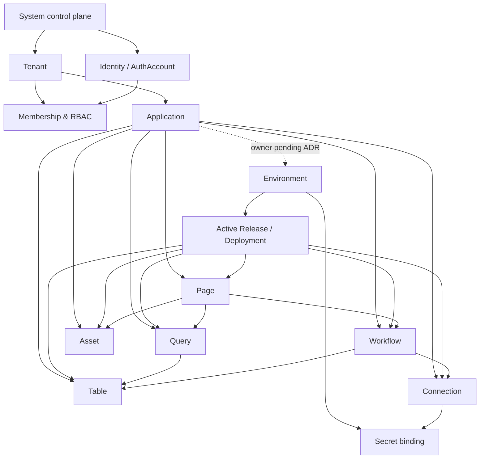
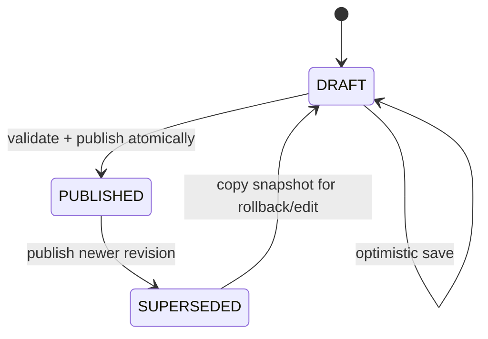
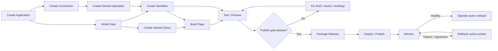

import { Meta } from '@storybook/addon-docs/blocks';
import { Badge, Card } from '../../components/ui';
import { DocumentationTable } from '../DocumentationTable';

<Meta title="Specifications/Product Capability Model/Overview" />

# Product Capability Model hợp nhất

<Card className="mb-lg">
  

    <Badge tone="primary">Target architecture</Badge>
    <Badge tone="warning">Cần ADR trước implementation</Badge>
    <Badge tone="neutral">Baseline: 2026-08-26</Badge>
  

  

    Đây là mô hình năng lực thống nhất cho Flexi. Nội dung “hiện có” được đối
    chiếu với repository; nội dung MVP, Production-ready v1 và Enterprise v2 là
    target contract/backlog, không phải cam kết rằng tính năng đã hoạt động.
  

</Card>

## Executive summary

Flexi được định vị là nền tảng low-code multi-tenant, REST-first, cho phép một
tenant tạo Application, mô hình hóa dữ liệu, dựng Page, kết nối dịch vụ ngoài,
tạo Workflow, kiểm thử, phát hành, quan sát và rollback. Đường găng sản phẩm
không bắt đầu từ canvas; nó bắt đầu từ ranh giới Application/Environment,
versioned artifact contract, dependency registry, IAM/tenant context, Secret và
Audit. Nếu thiếu các nền tảng này, Publish chỉ là thao tác sao chép JSON và
không thể bảo đảm isolation, rollback hoặc production safety.

Baseline đã có JWT/refresh token, permission guard, tenant provisioning theo
schema, queue precedent và Dynamic Tables CRUD/DDL. Pages, Workflows, Scheduler,
Mail Templates, Settings, Wiki, i18n và Logs phần lớn vẫn là stub hoặc metadata
sơ bộ. Application, Environment, Release, Query, Connection, Secret và Asset
chưa có implementation hoàn chỉnh. Vì vậy roadmap dùng vertical slice nhưng
vẫn xếp theo dependency: control plane → artifact/version contract → data và
integration → builders/runtime → test/publish → operations/governance.

Ba mâu thuẫn có ảnh hưởng kiến trúc phải được stakeholder chốt trước khi mở
Epic nền tảng: Environment thuộc Tenant hay Application; MVP dùng một, hai hay
ba environment; và API/error contract dùng envelope hiện tại hay Problem
Details. Những điểm này nằm trong trang **Decisions & Risks** và không được tự
động giải quyết trong tài liệu này.

## Mục tiêu và phạm vi

### In scope

- Control plane đa tenant: identity, membership, RBAC, onboarding, quota và
  policy.
- Application workspace và các artifact có revision: Page, Table schema,
  Query, Workflow, Connection binding, Asset reference và configuration.
- REST management/runtime APIs; queue/worker cho DDL, workflow, scheduler,
  release và tác vụ hậu xử lý.
- Test/preview, immutable Release, publish/promotion, monitoring và rollback.
- Tenant isolation, audit append-only, secret redaction và versioning xuyên
  suốt mọi capability.

### Out of scope mặc định

- GraphQL như public boundary; BPMN 2.0 đầy đủ; arbitrary JavaScript không được
  kiểm soát; public cross-tenant marketplace; CRDT real-time co-editing trong
  MVP; và cam kết hard real-time.
- Việc chọn nhà cung cấp KMS, object storage, log store, workflow engine hoặc
  deployment topology khi ADR tương ứng chưa được duyệt.

## Actors và permission boundaries

Role là bundle có thể cấu hình; permission mới là contract authorization.
Không endpoint nào được kiểm tra bằng tên role cứng, ngoại trừ bootstrap role
được tạo trong onboarding. Scope permission phải đi cùng actor và resource
context.

<DocumentationTable
  columns={[
    { id: 'actor', header: 'Actor', width: 'w-1/5' },
    { id: 'scope', header: 'Scope', width: 'w-1/5' },
    { id: 'capability', header: 'Khả năng mục tiêu', width: 'w-2/5' },
    { id: 'guardrail', header: 'Rào chắn', width: 'w-1/5' },
  ]}
  rows={[
    {
      id: 'system-admin',
      actor: 'System Administrator',
      scope: 'SYSTEM',
      capability: 'Onboard/suspend tenant, xem health và audit cross-tenant.',
      guardrail:
        'Không ghi tenant data nếu không có impersonation/break-glass được audit.',
    },
    {
      id: 'tenant-admin',
      actor: 'Tenant Administrator',
      scope: 'TENANT',
      capability: 'IAM, policy, quota, Application và dữ liệu trong tenant.',
      guardrail: 'Không vượt tenant boundary; không xem secret plaintext.',
    },
    {
      id: 'owner',
      actor: 'Application Owner',
      scope: 'TENANT + APPLICATION',
      capability: 'Ownership, thành viên app, archive, release và rollback.',
      guardrail: 'SoD/approval áp dụng khi bật governance.',
    },
    {
      id: 'builder',
      actor: 'Builder / Developer',
      scope: 'TENANT + APPLICATION',
      capability:
        'Model data, tạo Page/Query/Workflow, test và tạo release candidate.',
      guardrail:
        'Không mặc định có quyền publish production hoặc xem sensitive payload.',
    },
    {
      id: 'reviewer',
      actor: 'Reviewer / Publisher',
      scope: 'APPLICATION + ENVIRONMENT',
      capability:
        'Review diff, approve, deploy, rollback theo permission riêng.',
      guardrail: 'Maker-checker và lý do bắt buộc cho override/break-glass.',
    },
    {
      id: 'operator',
      actor: 'Operator',
      scope: 'APPLICATION + ENVIRONMENT',
      capability:
        'Theo dõi run/deployment, retry thao tác cho phép, xử lý DLQ.',
      guardrail: 'Payload nhạy cảm và config write là permission độc lập.',
    },
    {
      id: 'user',
      actor: 'Authenticated App User',
      scope: 'TENANT + APPLICATION',
      capability: 'Dùng Published Page, named Query/Action được cấp.',
      guardrail: 'Runtime không kế thừa quyền Builder.',
    },
    {
      id: 'anonymous',
      actor: 'Anonymous / Webhook Caller',
      scope: 'PUBLIC ENDPOINT',
      capability: 'Public Page hoặc signed webhook đã công bố.',
      guardrail:
        'Explicit public policy, rate limit, HMAC/idempotency và không resource enumeration.',
    },
    {
      id: 'worker',
      actor: 'System Worker',
      scope: 'DELEGATED CONTEXT',
      capability: 'Thực thi job với tenant/app/environment/revision đã pin.',
      guardrail:
        'Least privilege, expiring context, no ambient tenant và redacted telemetry.',
    },
  ]}
/>

Permission grammar chưa được chốt vì code hiện dùng dấu chấm còn một số target
spec dùng dấu hai chấm. Cho đến khi ADR được duyệt, backlog phải diễn đạt bằng
capability như “Publish Page”, không thêm code permission mới cục bộ.

## Capability matrix

“Trạng thái cần đạt” là outcome của phase, không phải trạng thái hiện tại. Gate
phải có test tenant isolation, RBAC, audit và redaction khi capability xử lý dữ
liệu hoặc execution.

<DocumentationTable
  columns={[
    { id: 'capability', header: 'Capability / mục tiêu', width: 'w-1/5' },
    { id: 'tier', header: 'Target', width: 'w-[12%]' },
    { id: 'state', header: 'Trạng thái cần đạt', width: 'w-1/4' },
    { id: 'dependencies', header: 'Dependencies', width: 'w-1/5' },
    { id: 'security', header: 'Security concerns', width: 'w-[13%]' },
    { id: 'gate', header: 'Acceptance gate', width: 'w-1/5' },
  ]}
  rows={[
    {
      id: 'tenant-iam',
      capability: 'Tenant & IAM — cấp identity và policy cô lập.',
      tier: 'Low-code MVP',
      state:
        'Provisioning idempotent; membership và permission catalog dùng được.',
      dependencies: 'Auth, public DB, tenant schema.',
      security: 'JWT context, token revoke, last-owner rule.',
      gate: 'Cross-tenant negative tests; provisioning compensation; audit hoàn chỉnh.',
    },
    {
      id: 'application',
      capability:
        'Application — workspace và ownership của low-code resources.',
      tier: 'Low-code MVP',
      state:
        'CRUD/archive, membership, stable ID/slug, default execution scope.',
      dependencies: 'Tenant/IAM, config, audit.',
      security: 'App-level authorization; slug enumeration.',
      gate: 'Resource của app A không truy cập từ app B/tenant B; lifecycle được audit.',
    },
    {
      id: 'configuration',
      capability: 'Configuration & Secret — resolve effective value an toàn.',
      tier: 'Low-code MVP',
      state: 'Typed catalog, scoped override, secret reference và redaction.',
      dependencies: 'Application scope, KMS/Vault decision, cache.',
      security: 'Encryption, rotation, no plaintext log/cache.',
      gate: 'Resolution deterministic; invalidation test; secret never appears in API/log.',
    },
    {
      id: 'versioning',
      capability:
        'Artifact Registry & Versioning — mutable draft, immutable revision.',
      tier: 'Low-code MVP',
      state:
        'Common ResourceRef, optimistic lock, revision snapshot và dependency edges.',
      dependencies: 'Application, audit, contract registry.',
      security: 'Tenant/app scoped lookup; immutable checksum.',
      gate: 'Concurrent edit không lost update; revision pin reproducible.',
    },
    {
      id: 'data',
      capability: 'Data Modeling — tạo Table/Field và thao tác row.',
      tier: 'Low-code MVP',
      state:
        'Existing Dynamic Tables được gắn Application/version/dependency contract.',
      dependencies: 'Artifact registry, DDL worker, tenant DB.',
      security: 'Identifier sanitization, RBAC, row/field policy roadmap.',
      gate: 'DDL idempotent; row validation; isolation và destructive-change impact check.',
    },
    {
      id: 'query',
      capability: 'Query — named, bounded data contract cho Page/Workflow.',
      tier: 'Low-code MVP',
      state:
        'Parameterized query, schema output, timeout/limit và test execution.',
      dependencies: 'Data model, policy engine, test sandbox.',
      security: 'No arbitrary unbounded SQL; FLS/RLS enforcement.',
      gate: 'Injection/cost tests; published consumer pin query revision.',
    },
    {
      id: 'connection',
      capability:
        'Connection & Connector — gọi external API qua named operation.',
      tier: 'Low-code MVP',
      state:
        'HTTP connection, credential reference, test và operation mapping.',
      dependencies: 'Secret, egress policy, audit.',
      security: 'SSRF/DNS rebinding, OAuth/API key, response redaction.',
      gate: 'Private target blocked sau resolve/redirect; secret masked; timeout enforced.',
    },
    {
      id: 'asset',
      capability: 'Asset — upload và tham chiếu file có metadata.',
      tier: 'Low-code MVP',
      state: 'Presigned upload, confirm, scoped access URL và usage link.',
      dependencies: 'Object storage, quota, Application.',
      security: 'MIME/content validation, path isolation, signed URL.',
      gate: 'Cross-tenant URL fail closed; orphan cleanup không xóa referenced asset.',
    },
    {
      id: 'page',
      capability: 'Page Builder & Runtime — dựng UI declarative an toàn.',
      tier: 'Low-code MVP',
      state:
        'List/create/canvas/preview/publish; component allowlist; pinned revisions.',
      dependencies: 'Query, Workflow action, Asset, registry/versioning.',
      security: 'No eval/custom JS; runtime re-authorize data/action.',
      gate: 'Broken binding chặn publish; stale draft 409; public policy tested.',
    },
    {
      id: 'workflow',
      capability: 'Workflow — tự động hóa DAG qua queue/worker.',
      tier: 'Low-code MVP',
      state:
        'Manual/table/webhook triggers; core actions; revision/run history.',
      dependencies: 'Data, Connection, Secret, queue, expression contract.',
      security: 'HMAC, dedupe, SSRF, delegated worker context.',
      gate: 'Pinned run; retry/idempotency tests; no cross-tenant execution.',
    },
    {
      id: 'scheduler',
      capability: 'Scheduler — phát trigger đúng thời gian và policy.',
      tier: 'Production-ready v1',
      state: 'Timezone/DST, misfire, overlap, retry/DLQ và leader safety.',
      dependencies: 'Workflow, queue, distributed lock.',
      security: 'Tenant quota; no arbitrary worker payload.',
      gate: 'Restart recovery; duplicate-fire prevention; DST/misfire scenarios pass.',
    },
    {
      id: 'test',
      capability: 'Test/Preview/Debug — kiểm chứng trước publish.',
      tier: 'Low-code MVP',
      state: 'Query test, Page preview, Workflow dry-run và publish gate.',
      dependencies: 'Revision registry, sandbox/mocks, logs.',
      security: 'Rollback writes; outbound mock default; payload permission.',
      gate: 'Test không mutate live data; CRITICAL issue chặn publish.',
    },
    {
      id: 'release',
      capability: 'Release & Rollback — phát hành snapshot có thể tái tạo.',
      tier: 'Low-code MVP',
      state:
        'Immutable manifest, dependency validation, direct publish và rollback pointer.',
      dependencies: 'All artifact revisions, test gate, audit.',
      security:
        'No secret value in bundle; signed checksum; publish permission.',
      gate: 'Partial publish impossible; missing dependency fails; rollback restores known snapshot.',
    },
    {
      id: 'observability',
      capability: 'Logs & Observability — điều tra theo correlation.',
      tier: 'Low-code MVP',
      state:
        'Canonical event envelope, audit trail và basic run/deployment views.',
      dependencies: 'Correlation contract, redaction, retention.',
      security: 'Sensitive payload permission; immutable audit.',
      gate: 'E2E trace từ request đến worker; redaction test corpus passes.',
    },
    {
      id: 'mail',
      capability: 'Mail Templates — nội dung versioned và localized.',
      tier: 'Production-ready v1',
      state:
        'Draft/publish, variable schema, preview/test send và provider delivery.',
      dependencies: 'Asset, i18n, Secret/SMTP, Workflow.',
      security: 'Template injection, recipient policy, PII redaction.',
      gate: 'Undefined variable fails predictably; no secret/PII in delivery log.',
    },
    {
      id: 'governance',
      capability: 'Collaboration & Governance — kiểm soát thay đổi.',
      tier: 'Production-ready v1',
      state: 'Ownership, change request, review, SoD và break-glass.',
      dependencies: 'IAM, dependency diff, release, audit.',
      security: 'Maker-checker, reason/evidence, expiring escalation.',
      gate: 'Maker không tự approve; break-glass luôn alert và audit.',
    },
    {
      id: 'operations',
      capability: 'Operational Architecture — HA, migration và recovery.',
      tier: 'Production-ready v1',
      state:
        'SLO, backup/restore, zero-downtime compatible migration, capacity controls.',
      dependencies: 'All runtimes, telemetry, deployment automation.',
      security: 'Backup encryption; privileged operation isolation.',
      gate: 'Restore drill, failure injection, tenant noisy-neighbor and migration tests.',
    },
    {
      id: 'knowledge-i18n',
      capability: 'Wiki & Dynamic i18n — nội dung vận hành và locale runtime.',
      tier: 'Enterprise v2',
      state:
        'Versioned content, locale fallback, search và release integration.',
      dependencies: 'Application, Asset, Release, permission/search engine.',
      security:
        'Content visibility, HTML sanitization, tenant search isolation.',
      gate: 'Published locale snapshot reproducible; cross-tenant search impossible.',
    },
  ]}
/>

## Functional requirements và business rules xuyên module

1. Mọi mutable artifact phải có optimistic concurrency token; runtime không đọc
   mutable Draft.
2. Publish tạo hoặc chọn immutable revision và pin tất cả HARD dependencies.
   Dependency thiếu hoặc incompatible phải fail trước khi đổi active pointer.
3. Secret value không nằm trong definition, revision, Release bundle, log,
   audit diff, test fixture export hoặc client response. Chỉ SecretRef được đi
   qua boundary.
4. Worker không tự suy ra tenant từ payload tự do. Job envelope phải chứa ID đã
   ký/xác thực và worker phải tái dựng tenant/application/environment context.
5. Xóa/archive resource phải chạy impact analysis. HARD dependency chặn mặc
   định; force/break-glass cần permission, lý do và audit riêng.
6. Runtime access luôn tái kiểm tra RBAC/policy; một Page/Workflow definition
   không thể tự cấp thêm quyền cho người gọi.
7. Release không chứa business row data. Schema/configuration và content
   snapshot phải tách khỏi tenant operational data.
8. Retry chỉ tự động khi operation được phân loại idempotent hoặc có idempotency
   key. Kết quả outbound không xác định phải dừng để xử lý thay vì báo success.
9. Audit là append-only và mô tả ai/lúc nào/resource/revision/outcome; operational
   logs có retention riêng và có thể bị sampling, audit thì không.
10. Không quảng bá capability là production-ready cho đến khi có negative tests
    về tenant isolation, permission, secret redaction và failure recovery.

## Domain và aggregate map

Aggregate boundary dùng để quyết định transaction và ownership, không đồng
nghĩa tất cả entity phải nằm cùng database/schema.

<DocumentationTable
  columns={[
    { id: 'aggregate', header: 'Aggregate root', width: 'w-[14%]' },
    { id: 'owner', header: 'Owner / parent reference', width: 'w-1/5' },
    { id: 'owns', header: 'Nội dung sở hữu', width: 'w-1/3' },
    { id: 'invariant', header: 'Invariant chính', width: 'w-1/3' },
  ]}
  rows={[
    {
      id: 'tenant',
      aggregate: 'Tenant',
      owner: 'System control plane',
      owns: 'Tenant lifecycle, plan/quota, policy và provisioning record.',
      invariant:
        'Một tenant context ánh xạ duy nhất tới schema hợp lệ; suspended tenant fail closed.',
    },
    {
      id: 'user',
      aggregate: 'User',
      owner: 'Identity control plane; Membership thuộc Tenant',
      owns: 'AuthAccount/session và tenant memberships/role assignments tách rời.',
      invariant:
        'Không dùng một tenant membership để truy cập tenant khác; delete/transfer giữ last-owner rule.',
    },
    {
      id: 'application',
      aggregate: 'Application',
      owner: 'Tenant',
      owns: 'Metadata, membership/ownership, resource registry và lifecycle.',
      invariant:
        'Stable ID; slug unique trong tenant; child ResourceRef luôn cùng tenant/app.',
    },
    {
      id: 'environment',
      aggregate: 'Environment',
      owner: 'Chờ ADR: Tenant hoặc Application',
      owns: 'Effective config/secret bindings và active deployment pointer.',
      invariant:
        'Không copy secret giữa environment; deployment chỉ đổi pointer sau preflight.',
    },
    {
      id: 'release',
      aggregate: 'Release',
      owner: 'Application + source scope',
      owns: 'Immutable manifest, artifact refs/checksums, approvals và deployment records.',
      invariant:
        'Packaged manifest bất biến; dependency complete; không chứa secret value/row data.',
    },
    {
      id: 'page',
      aggregate: 'Page',
      owner: 'Application',
      owns: 'Mutable Draft, immutable PageRevision, route metadata và publication pointer.',
      invariant:
        'Route unique trong runtime scope; renderer chỉ dùng Published revision.',
    },
    {
      id: 'table',
      aggregate: 'Table',
      owner: 'Application',
      owns: 'Field definitions, schema revisions, DDL jobs; rows là tenant operational data.',
      invariant:
        'Physical identifier sanitized; schema change serialized; destructive change kiểm tra dependency.',
    },
    {
      id: 'query',
      aggregate: 'Query',
      owner: 'Application',
      owns: 'Typed parameters, policy, query revisions và output schema.',
      invariant:
        'Bounded execution; published consumer pin compatible revision.',
    },
    {
      id: 'workflow',
      aggregate: 'Workflow',
      owner: 'Application',
      owns: 'Draft/Published revisions, triggers, runs, steps và attempts.',
      invariant:
        'Graph hợp lệ; run pin revision; dedupe scoped tenant/app/workflow.',
    },
    {
      id: 'connection',
      aggregate: 'Connection',
      owner: 'Application; binding theo Environment',
      owns: 'Connector type, endpoint policy, named operations và credential refs.',
      invariant:
        'Không sở hữu plaintext credential; egress policy áp dụng cho test và runtime.',
    },
    {
      id: 'secret',
      aggregate: 'Secret',
      owner: 'Tenant/Application + Environment binding',
      owns: 'Encrypted versions, metadata, rotation/revocation state.',
      invariant: 'Write-only value; no read-back; audit không chứa plaintext.',
    },
    {
      id: 'asset',
      aggregate: 'Asset',
      owner: 'Application',
      owns: 'Metadata, object versions, processing status và usage references.',
      invariant:
        'Object key tenant/app scoped; referenced asset không bị orphan cleanup.',
    },
  ]}
/>

## Cross-module contracts

<DocumentationTable
  columns={[
    { id: 'contract', header: 'Contract', width: 'w-1/5' },
    { id: 'required', header: 'Trường/semantics bắt buộc', width: 'w-2/5' },
    { id: 'consumers', header: 'Producer → consumer', width: 'w-1/5' },
    { id: 'rule', header: 'Version/security rule', width: 'w-1/5' },
  ]}
  rows={[
    {
      id: 'request',
      contract: 'ExecutionContext',
      required:
        'requestId, correlationId, actor, tenantId, applicationId, environmentId?, releaseId?, locale.',
      consumers: 'Gateway → service/worker',
      rule: 'Server-derived; IDs không lấy trực tiếp từ untrusted body.',
    },
    {
      id: 'resource',
      contract: 'ResourceRef',
      required:
        'type, resourceId, revisionId/version, schemaVersion, checksum.',
      consumers: 'All artifacts → dependency/release',
      rule: 'Stable ID; immutable target khi publish.',
    },
    {
      id: 'dependency',
      contract: 'DependencyEdge',
      required:
        'sourceRef, targetRef, HARD/SOFT, compatibility constraint, binding path.',
      consumers: 'Builder → impact/publish/release',
      rule: 'HARD missing blocks; SOFT warning requires explicit policy.',
    },
    {
      id: 'secret',
      contract: 'SecretRef',
      required:
        'secretId/key, environment binding, version selector; không có value.',
      consumers: 'Connection/Workflow/Mail → Vault resolver',
      rule: 'Resolve just-in-time; redact before persistence/telemetry.',
    },
    {
      id: 'job',
      contract: 'JobEnvelope',
      required:
        'jobId, type, context IDs, resource/revision ref, idempotencyKey, attempt, createdAt.',
      consumers: 'API/Scheduler → Queue → Worker',
      rule: 'Schema-versioned; payload size bounded; DLQ retains safe metadata.',
    },
    {
      id: 'execution',
      contract: 'ExecutionResult',
      required:
        'status, startedAt/endedAt, outputRef?, safe error, metrics, correlation IDs.',
      consumers: 'Runtime → UI/logs/workflow',
      rule: 'Payload authorization separate from summary authorization.',
    },
    {
      id: 'audit',
      contract: 'AuditEvent',
      required:
        'eventId, actor/context, action, resource/revision, before/after summary, outcome, reason, timestamp.',
      consumers: 'Every write/override → Audit store',
      rule: 'Append-only, schema-versioned, secret/PII redacted.',
    },
    {
      id: 'log',
      contract: 'TelemetryEvent',
      required:
        'timestamp, severity, service, trace/span, context IDs, operation, status, duration.',
      consumers: 'All runtimes → observability pipeline',
      rule: 'Sampling allowed; redaction before export.',
    },
    {
      id: 'error',
      contract: 'ApiError',
      required:
        'stable code, HTTP status, safe message, field/path issues, correlationId, retryable.',
      consumers: 'API/worker → clients/operators',
      rule: 'Wire envelope và prefix chờ ADR; không lộ cross-tenant existence.',
    },
    {
      id: 'release',
      contract: 'ReleaseManifest',
      required:
        'application/source scope, version, artifact refs/checksums, dependency graph, required SecretRefs, creator.',
      consumers: 'Builders → deployment',
      rule: 'Immutable after package; signed/checksummed; no row data or secret values.',
    },
  ]}
/>

### API capability ở mức contract

Tài liệu hợp nhất dùng `{apiBase}`. ADR-003 đã ánh xạ nó tới **`/api/v1`** một
lần cho toàn nền tảng; không module nào tự chọn prefix, và không route path nào
được chứa segment version — version chỉ đến từ `enableVersioning()`. Việc chuyển
code sang `/api/v1` nằm ở Story 0.2.1 (#76). Error envelope vẫn chờ ADR-004.

<DocumentationTable
  columns={[
    { id: 'group', header: 'Capability group', width: 'w-1/5' },
    { id: 'operations', header: 'REST contract tối thiểu', width: 'w-2/5' },
    { id: 'semantics', header: 'Semantics', width: 'w-2/5' },
  ]}
  rows={[
    {
      id: 'apps',
      group: 'Applications',
      operations:
        'Create/list/read/update; archive/restore; members; export/import.',
      semantics:
        'Tenant/app scope; import nguyên tử; slug conflict không overwrite.',
    },
    {
      id: 'artifacts',
      group: 'Artifacts',
      operations: 'CRUD draft; validate; list revisions; dependency/impact.',
      semantics: 'Optimistic version; typed schema; immutable revisions.',
    },
    {
      id: 'data-query',
      group: 'Data & Query',
      operations: 'Manage table/fields; row CRUD; query validate/test/execute.',
      semantics: 'Bounded/paginated; policy checked at execution.',
    },
    {
      id: 'integration',
      group: 'Connections & Assets',
      operations:
        'Manage/test connection/operation; initiate/confirm upload; issue access URL.',
      semantics:
        'Secret write-only; SSRF and object access policy on every path.',
    },
    {
      id: 'runtime',
      group: 'Page & Workflow Runtime',
      operations:
        'Resolve published Page; execute named action; trigger/read/cancel/retry run.',
      semantics: 'Pinned release/revision; idempotency; payload permission.',
    },
    {
      id: 'testing',
      group: 'Test & Preview',
      operations:
        'Validate publish gate; query test; Page preview token; Workflow dry-run.',
      semantics:
        'Sandbox; explicit mock/live mode; test context never becomes production authority.',
    },
    {
      id: 'release',
      group: 'Release & Deployment',
      operations:
        'Compose/validate/package; diff/approve/deploy; status; rollback.',
      semantics:
        'Async 202 for long operations; atomic pointer switch; observable progress.',
    },
    {
      id: 'operations',
      group: 'Operations',
      operations:
        'Search logs/audit; metrics; health; DLQ/retry; configuration resolve.',
      semantics: 'Scoped filters; redacted output; privileged actions audited.',
    },
  ]}
/>

## Lifecycle và state model chuẩn hóa

Không dùng một field `status` để trộn authoring, publication, runtime enablement
và deletion. Các state dimension sau là vocabulary mục tiêu; Application còn
cần ADR riêng vì spec nguồn dùng cả `ACTIVE` và `PUBLISHED`.

<DocumentationTable
  columns={[
    { id: 'dimension', header: 'Dimension', width: 'w-1/5' },
    { id: 'states', header: 'State names', width: 'w-2/5' },
    { id: 'applies', header: 'Áp dụng và quy tắc', width: 'w-2/5' },
  ]}
  rows={[
    {
      id: 'revision',
      dimension: 'Artifact revision',
      states: 'DRAFT → PUBLISHED → SUPERSEDED',
      applies: 'Page/Query/Workflow/Mail; Published bất biến.',
    },
    {
      id: 'runtime',
      dimension: 'Runtime enablement',
      states: 'INACTIVE ↔ ACTIVE',
      applies: 'Workflow/schedule/connection listener; không sửa revision.',
    },
    {
      id: 'retirement',
      dimension: 'Resource retirement',
      states: 'ACTIVE → ARCHIVED → DELETED',
      applies: 'Management aggregate; DELETED là terminal sau retention.',
    },
    {
      id: 'release',
      dimension: 'Release',
      states: 'DRAFT → VALIDATING → PACKAGED → ARCHIVED; VALIDATION_FAILED',
      applies:
        'PACKAGED bất biến; validation failure không thay active release.',
    },
    {
      id: 'deployment',
      dimension: 'Deployment',
      states:
        'PENDING_APPROVAL → PREFLIGHT → DEPLOYING → ACTIVE; FAILED / ROLLING_BACK → ROLLED_BACK / REJECTED',
      applies: 'Mỗi target environment; chỉ một active pointer.',
    },
    {
      id: 'execution',
      dimension: 'Execution',
      states:
        'PENDING → RUNNING → SUCCEEDED / FAILED / CANCELLED / TIMED_OUT; PAUSED khi cần xử lý',
      applies:
        'Workflow/job/test/deployment; terminal state không tái sử dụng cùng execution ID.',
    },
    {
      id: 'tenant',
      dimension: 'Tenant',
      states: 'PROVISIONING → ACTIVE; FAILED / SUSPENDED',
      applies: 'Đã được shared contract hiện tại xác nhận.',
    },
  ]}
/>

## Validation và error cases

Validation phải được phân lớp: UI hỗ trợ sớm; DTO bảo vệ wire contract; domain
giữ invariant; database giữ uniqueness/foreign key; runtime giữ policy/quota và
external safety. Không coi UI validation là security control.

<DocumentationTable
  columns={[
    { id: 'condition', header: 'Condition', width: 'w-1/4' },
    { id: 'layer', header: 'Authoritative layer', width: 'w-1/5' },
    { id: 'canonical', header: 'Tên lỗi chuẩn hóa đề xuất', width: 'w-1/4' },
    { id: 'behavior', header: 'Client-visible behavior', width: 'w-[30%]' },
  ]}
  rows={[
    {
      id: 'context',
      condition: 'Tenant/app/environment mismatch',
      layer: 'Authorization + data access',
      canonical: 'TENANT_CONTEXT_MISMATCH / RESOURCE_NOT_FOUND',
      behavior: '403 khi context sai đã biết; 404 khi cần chống enumeration.',
    },
    {
      id: 'permission',
      condition: 'Thiếu permission/policy',
      layer: 'Guard + runtime policy',
      canonical: 'PERMISSION_DENIED',
      behavior: '403; không chạy side effect.',
    },
    {
      id: 'validation',
      condition: 'DTO/schema/field invalid',
      layer: 'DTO/domain',
      canonical: 'VALIDATION_ERROR / SCHEMA_INVALID',
      behavior:
        '400 cho wire syntax; 422 cho semantic artifact invalid — cần ADR xác nhận.',
    },
    {
      id: 'stale',
      condition: 'Optimistic version cũ',
      layer: 'Domain + DB compare',
      canonical: 'STALE_VERSION_CONFLICT',
      behavior: '409; trả current version an toàn, không overwrite.',
    },
    {
      id: 'dependency',
      condition: 'Thiếu/incompatible dependency',
      layer: 'Dependency engine',
      canonical: 'DEPENDENCY_MISSING / DEPENDENCY_INCOMPATIBLE',
      behavior: '422; trả source binding path và safe target ref.',
    },
    {
      id: 'quota',
      condition: 'Vượt quota/rate',
      layer: 'Policy/quota',
      canonical: 'QUOTA_EXCEEDED / RATE_LIMITED',
      behavior: 'HTTP mapping chờ ADR; kèm retryAfter khi phù hợp.',
    },
    {
      id: 'secret',
      condition: 'Secret thiếu/revoked/unavailable',
      layer: 'Secret resolver',
      canonical: 'SECRET_BINDING_MISSING / SECRET_UNAVAILABLE',
      behavior:
        'Không trả metadata nhạy cảm; publish hoặc execution fail closed.',
    },
    {
      id: 'external',
      condition: 'SSRF, timeout hoặc circuit open',
      layer: 'Egress/runtime',
      canonical: 'EGRESS_TARGET_BLOCKED / EXTERNAL_TIMEOUT / CIRCUIT_OPEN',
      behavior:
        'Không retry mù; đánh dấu retryable và unknown outcome chính xác.',
    },
    {
      id: 'duplicate',
      condition: 'Idempotency/dedupe collision',
      layer: 'Domain unique constraint',
      canonical: 'DUPLICATE_REQUEST / DUPLICATE_TRIGGER',
      behavior: 'Trả original operation ref nếu actor được phép xem.',
    },
  ]}
/>

Các alias `ERR_*`, `pages:*` và Problem Details hiện có trong spec nguồn chưa
phải canonical production contract. Migration map cuối cùng cần được tạo sau
ADR API governance.

## Security, tenant isolation và secret handling

- Data access bắt buộc nhận tenant context từ trusted request/job context; mọi
  query public control plane và tenant schema đều có negative test.
- `tenantId`, `applicationId`, `environmentId` và resource ID phải được kiểm tra
  như một tuple; biết một UUID không cấp quyền truy cập.
- Connection test, Workflow HTTP action và Page data action dùng chung egress
  policy để tránh “test path” trở thành đường vòng SSRF.
- Secret được mã hóa bằng provider sẽ chọn qua ADR, versioned, rotatable và chỉ
  inject just-in-time. API chỉ nhận write/rotate và trả metadata/masked hint.
- Audit/log/error/diff/export/test fixture phải chạy redaction trước persistence
  hoặc egress. Redaction sau khi đã ghi log là không đủ.
- Public Page/Webhook cần explicit enablement, rate limit, abuse controls và
  opaque not-found behavior. Public runtime không được dùng Builder token.
- Release/deployment worker dùng immutable refs và least-privilege delegated
  context; không cho worker dùng global super-admin credential.

## Audit và observability

Mọi create/update/archive/publish/approve/deploy/rollback, permission denial,
secret lifecycle, impersonation, break-glass và manual run resolution phải tạo
AuditEvent. Request, queue job, workflow run, connector call và deployment dùng
cùng `correlationId`/trace context. Operational payload retention và audit
retention là policy riêng; giá trị cụ thể cần stakeholder chốt theo plan và
compliance.

Minimum dashboards cho MVP gồm tenant provisioning, DDL job, Workflow run,
publish/deployment và error rate. Production-ready bổ sung queue lag, saturation,
circuit state, quota pressure, version drift và SLO alerts. Log viewer phải
filter theo tenant/app/environment/resource/revision/run nhưng chỉ trả payload
khi actor có permission riêng.

## End-to-end capability flow

### Acceptance criteria Given/When/Then

**AC-E2E-01 — Create application**  
Given actor thuộc tenant A và có capability tạo Application, when gửi metadata
hợp lệ với slug chưa dùng, then Application và default scope được tạo trong
tenant A, audit có actor/correlation, và tenant B không thể đọc ID đó.

**AC-E2E-02 — Model data**  
Given Application hợp lệ, when Builder tạo Table/Field và DDL worker hoàn tất,
then schema metadata và physical schema đồng bộ; retry cùng idempotency key
không tạo field thứ hai.

**AC-E2E-03 — Build Page với Query**  
Given Query có typed output, when Builder bind Page node vào field hợp lệ và lưu
Draft, then dependency edge được ghi; khi field bị xóa, impact analysis chặn
destructive change hoặc publish.

**AC-E2E-04 — Connect external API**  
Given Connection dùng SecretRef, when Builder Test Connection tới domain được
cho phép, then runtime resolve secret trong memory, chặn private/redirect target
và không ghi credential vào result, log hoặc audit.

**AC-E2E-05 — Create Workflow**  
Given Workflow Draft tham chiếu Table và named operation, when validate/publish,
then graph không cycle, dependencies được pin và mỗi run dùng immutable revision
dù Draft tiếp tục thay đổi.

**AC-E2E-06 — Test**  
Given Page và Workflow Draft, when chạy preview/dry-run mặc định, then data write
rollback hoặc dùng fixture, outbound side effect dùng mock; issue CRITICAL giữ
publish gate ở trạng thái blocked.

**AC-E2E-07 — Publish**  
Given mọi HARD dependency hợp lệ và required SecretRef đã được bind cho target,
when authorized Publisher phát hành, then immutable manifest được tạo và active
pointer chỉ đổi sau khi mọi preflight thành công; không có partial release.

**AC-E2E-08 — Monitor**  
Given request chạy trên release mới, when nó đi qua API và worker, then Operator
có thể truy vết bằng correlation ID qua safe logs/metrics mà không thấy secret
hoặc payload ngoài permission.

**AC-E2E-09 — Rollback**  
Given active release có regression, when authorized actor yêu cầu rollback với
lý do, then hệ thống chuyển về manifest đã biết, giữ run đã pin theo policy được
ADR chốt, ghi audit và tiếp tục phát telemetry cho deployment rollback.

## Dependencies cấp nền tảng

- PostgreSQL public/control-plane data và tenant schema; migration/backup/restore
  strategy.
- Redis và queue/worker với idempotency, DLQ, trace propagation và tenant-aware
  job context.
- Object storage/CDN, malware/content inspection và lifecycle policy cho Asset.
- KMS/Vault provider, rotation, outage policy và envelope encryption.
- Egress proxy/DNS policy cho connectors và Workflow HTTP actions.
- Observability pipeline/store, append-only audit store và retention controls.
- Shared contract registry cho DTO, permission, error, artifact schema và event
  schema versioning.

Roadmap, Decision Log, Risk Register và danh mục specification nằm trong hai
trang kế tiếp của nhóm **Product Capability Model**.
