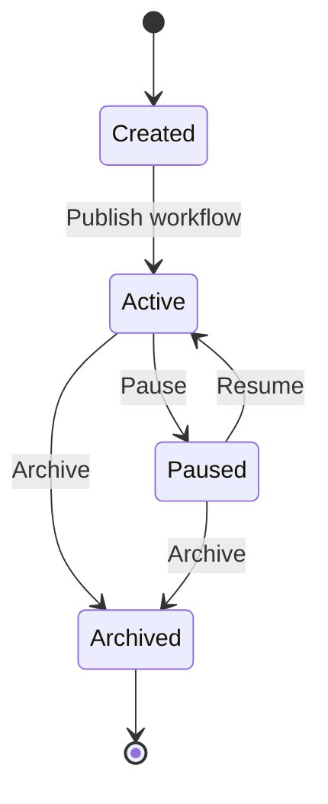
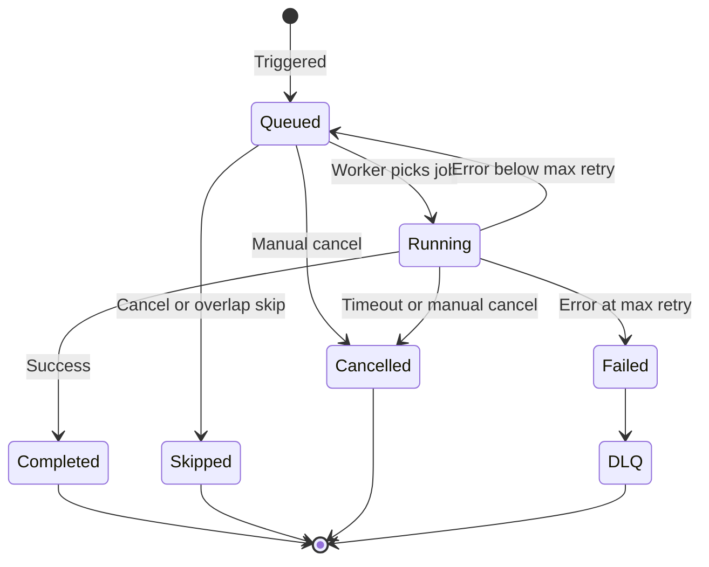
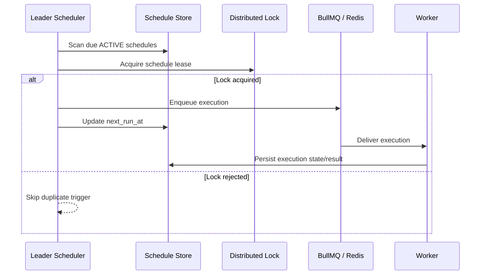

import { Meta } from '@storybook/addon-docs/blocks';
import { DocumentationTable } from '../DocumentationTable';

<Meta title="Specifications/Scheduler Engine" />

# Scheduler Engine

## Trạng thái specification gate

Trang này ghi lại **target specification do stakeholder cung cấp** cho
Scheduler Engine. Các tier, API contract, data model, business rule, kiến trúc
phân tán và acceptance criteria bên dưới là yêu cầu/backlog, chưa phải hành vi
production đã được triển khai.

Implementation hiện tại chỉ có endpoint placeholder `GET /api/cron-jobs`, model
`CronJob` tối thiểu và shared type `CronJobDto`. Chưa có UI khả dụng, permission,
validation, scheduler worker, queue, distributed lock, execution history, DLQ
hoặc workflow lifecycle integration. Những phần đó đều là **Not confirmed from
current implementation** cho đến khi có code và test tương ứng.

## 1. Mục tiêu và phạm vi

Scheduler Engine lập lịch và kích hoạt tự động hai nhóm tác vụ tách biệt:

- **User-facing Workflow Schedules:** lịch do Tenant User cấu hình trong
  Workflow Builder, ví dụ gửi báo cáo lúc 08:00 mỗi ngày. User quản lý trigger
  trong Workflow, không quản lý một Cron Job độc lập ở bảng điều khiển hệ thống.
- **Internal System Jobs:** lịch bảo trì, dọn dẹp và đồng bộ hạ tầng do Platform
  Admin hoặc service nội bộ đăng ký, ví dụ vacuum database, cleanup log hoặc
  đồng bộ license.

### Phân hạng triển khai

<DocumentationTable
  columns={[
    { id: 'tier', header: 'Tier', width: 'w-1/5' },
    { id: 'scope', header: 'Phạm vi', width: 'w-4/5' },
  ]}
  rows={[
    {
      id: 'mvp',
      tier: 'MVP',
      scope:
        'Cron expression cơ bản, interval, timezone IANA, misfire Run Immediately/Skip, overlap Skip/Queue, retry đơn giản và Redis distributed lock.',
    },
    {
      id: 'production',
      tier: 'Production-Ready',
      scope:
        'Fixed-time, DST, Cancel Previous, DLQ, manual run, cancellation, timeout, workflow-version lifecycle auto-sync và log redaction.',
    },
    {
      id: 'enterprise',
      tier: 'Enterprise',
      scope:
        'Priority queue, dynamic tenant quota, adaptive concurrency theo tenant plan, webhook/Slack alerting và cross-region disaster recovery.',
    },
  ]}
/>

## 2. Actors và permissions mục tiêu

RBAC dưới đây là contract đề xuất; chưa có guard hoặc permission constant cho
Scheduler Engine trong implementation hiện tại.

<DocumentationTable
  columns={[
    { id: 'role', header: 'Role', width: 'w-1/5' },
    { id: 'access', header: 'Phạm vi', width: 'w-1/4' },
    { id: 'actions', header: 'Hành động', width: 'w-11/20' },
  ]}
  rows={[
    {
      id: 'platform-admin',
      role: 'Platform Admin',
      access: 'Internal System Jobs',
      actions:
        'Tạo, sửa, xóa, pause/resume, manual trigger mọi System Job và cấu hình quota theo tenant.',
    },
    {
      id: 'tenant-admin',
      role: 'Tenant Admin',
      access: 'Tenant Workflow Schedules',
      actions:
        'Xem và pause/resume mọi Workflow Schedule thuộc tenant; điều chỉnh quota nội bộ trong giới hạn được cấp.',
    },
    {
      id: 'workflow-editor',
      role: 'Workflow Builder / Editor',
      access: 'Tenant Workflow Schedules',
      actions:
        'Tạo/sửa Schedule trigger; publish/archive workflow tự động đăng ký hoặc hủy lịch.',
    },
    {
      id: 'workflow-viewer',
      role: 'Workflow Viewer / Auditor',
      access: 'Tenant Workflow Schedules',
      actions:
        'Xem trạng thái schedule và execution history ở chế độ read-only.',
    },
    {
      id: 'engine',
      role: 'System Worker / Engine',
      access: 'System-wide',
      actions:
        'Quét schedule, chiếm lock, đưa job vào queue và cập nhật state.',
    },
  ]}
/>

## 3. Functional requirements

### 3.1 Scheduling configurations

<DocumentationTable
  columns={[
    { id: 'id', header: 'ID', width: 'w-1/6' },
    { id: 'tier', header: 'Tier', width: 'w-1/6' },
    { id: 'requirement', header: 'Yêu cầu', width: 'w-2/3' },
  ]}
  rows={[
    {
      id: 'FR-SCH-01',
      tier: 'MVP',
      requirement:
        'Hỗ trợ Cron Expression POSIX 5–6 fields và công cụ validate cú pháp.',
    },
    {
      id: 'FR-SCH-02',
      tier: 'MVP',
      requirement:
        'Hỗ trợ interval theo giây/phút/giờ, với ngưỡng kỹ thuật tối thiểu 60 giây.',
    },
    {
      id: 'FR-SCH-03',
      tier: 'Production-Ready',
      requirement:
        'Hỗ trợ fixed-time chạy một lần tại thời điểm tương lai và tự kết thúc sau khi hoàn tất.',
    },
    {
      id: 'FR-SCH-04',
      tier: 'MVP',
      requirement:
        'Timezone bắt buộc theo IANA, ví dụ Asia/Ho_Chi_Minh hoặc UTC.',
    },
    {
      id: 'FR-SCH-05',
      tier: 'Production-Ready',
      requirement:
        'Xử lý DST bằng thư viện timezone chuẩn như Luxon hoặc Moment Timezone.',
    },
  ]}
/>

### 3.2 Workflow lifecycle integration

- **FR-LFC-01 [Production-Ready]:** Khi Workflow chuyển sang `Published`,
  Scheduler Engine nhận payload trigger và kích hoạt schedule.
- **FR-LFC-02 [Production-Ready]:** Khi Workflow `Deactivated` hoặc `Archived`,
  schedule tương ứng phải được unregister hoặc pause ngay.
- **FR-LFC-03 [Production-Ready]:** Sửa `Draft` không làm thay đổi lịch của
  version `Published` hiện tại.

### 3.3 Execution control

- **FR-EXE-01 [MVP]:** Pause, resume hoặc disable một schedule.
- **FR-EXE-02 [Production-Ready]:** `Run Now` từ UI không thay đổi chu kỳ Cron.
- **FR-EXE-03 [Production-Ready]:** Cancel execution đang `RUNNING` hoặc
  `QUEUED`.
- **FR-EXE-04 [Production-Ready]:** Hard timeout mặc định 15 phút, có thể cấu
  hình theo tenant/job.

## 4. Business rules

### 4.1 Timezone và DST

- **Spring Forward:** Nếu Cron rơi vào giờ không tồn tại, đẩy sang thời điểm khả
  thi kế tiếp, ví dụ 03:00, hoặc bỏ qua theo cấu hình.
- **Fall Back:** Nếu một giờ xuất hiện hai lần, chỉ chạy một lần tại occurrence
  đầu tiên, tương ứng UTC instant đầu tiên.

### 4.2 Misfire policy

<DocumentationTable
  columns={[
    { id: 'policy', header: 'Policy', width: 'w-1/4' },
    { id: 'tier', header: 'Tier', width: 'w-1/5' },
    { id: 'behavior', header: 'Hành vi', width: 'w-11/20' },
  ]}
  rows={[
    {
      id: 'fire-immediately',
      policy: 'FIRE_IMMEDIATELY',
      tier: 'MVP',
      behavior:
        'Sau recovery, chạy ngay một instance đại diện rồi tính mốc kế tiếp theo chu kỳ gốc.',
    },
    {
      id: 'skip',
      policy: 'SKIP',
      tier: 'MVP',
      behavior:
        'Bỏ qua mọi lượt đã trôi và tính next_run_at tiếp theo trong tương lai.',
    },
    {
      id: 'fire-all',
      policy: 'FIRE_ALL',
      tier: 'Enterprise',
      behavior:
        'Chỉ dành cho Internal System Jobs; bù tuần tự tất cả lượt đã bỏ lỡ.',
    },
  ]}
/>

### 4.3 Overlap policy

<DocumentationTable
  columns={[
    { id: 'policy', header: 'Policy', width: 'w-1/4' },
    { id: 'tier', header: 'Tier', width: 'w-1/5' },
    { id: 'behavior', header: 'Hành vi', width: 'w-11/20' },
  ]}
  rows={[
    {
      id: 'skip-new',
      policy: 'SKIP_NEW',
      tier: 'MVP',
      behavior: 'Bỏ lượt mới và ghi trạng thái SKIPPED vào audit log.',
    },
    {
      id: 'queue',
      policy: 'QUEUE',
      tier: 'MVP',
      behavior: 'Đưa lượt mới vào buffer để thực thi nối tiếp.',
    },
    {
      id: 'cancel-previous',
      policy: 'CANCEL_PREVIOUS',
      tier: 'Production-Ready',
      behavior:
        'Gửi AbortSignal tới instance đang chạy, dừng lượt cũ rồi chạy lượt mới.',
    },
  ]}
/>

### 4.4 Retry và DLQ

- `max_retries` mặc định là 3.
- Exponential backoff: `delay = base_delay × 2^attempt`, ví dụ 10, 20, 40 giây.
- Hết retry mà vẫn lỗi thì đưa instance vào Dead-Letter Queue và phát cảnh báo.

### 4.5 Tenant resource quota

- Max concurrent jobs theo tenant plan, ví dụ Standard = 5 và Enterprise = 50.
- Min Cron interval theo tenant plan, ví dụ Standard = 5 phút và Enterprise =
  1 phút. Mức cụ thể vẫn là open decision.
- Khi vi phạm quota, execution bị `Rate-limited` và sự kiện được ghi log.

## 5. Conceptual data model

```text
[Tenant] 1 --- * [JobDefinition] 1 --- * [JobSchedule] 1 --- * [JobExecutionHistory]
                       |
                       +--- 1 --- * [DeadLetterJob]
```

Đây là target model, không phải Prisma schema hiện tại.

### 5.1 JobDefinition

- `id`: UUID, primary key.
- `tenant_id`: UUID, indexed; nullable với Internal System Job.
- `scope`: `USER_WORKFLOW` hoặc `INTERNAL_SYSTEM`.
- `source_entity_id`: Workflow ID hoặc service registration ID.
- `name`, `description`, `is_active`, `created_at`, `updated_at`.

### 5.2 JobSchedule

- Identity: `id`, `job_definition_id`.
- Timing: `schedule_type` (`CRON`, `INTERVAL`, `FIXED_TIME`),
  `cron_expression`, `interval_seconds`, `fixed_execute_at`, `timezone`.
- Policy: `misfire_policy`, `overlap_policy`, `max_retries` mặc định 3,
  `timeout_seconds` mặc định 900 và `priority` từ 1–10, mặc định 5.
- Lifecycle: `status` (`ACTIVE`, `PAUSED`, `ARCHIVED`), `next_run_at` indexed và
  `last_run_at` nullable.

### 5.3 JobExecutionHistory

- Identity: `id`, `tenant_id`, `job_schedule_id`.
- Trigger: `SCHEDULED`, `MANUAL` hoặc `MISFIRE_RECOVERY`.
- Status: `QUEUED`, `RUNNING`, `COMPLETED`, `FAILED`, `SKIPPED`, `CANCELLED`.
- Runtime: `started_at`, `finished_at`, `attempt_count`, `worker_node_id`.
- Diagnostic data: redacted `input_payload`, redacted `output_result` và
  nullable `error_stack`.

### Chênh lệch với persistence hiện tại

Prisma hiện chỉ có `CronJob(id, tenantId, name, schedule, targetRef, enabled,
createdAt, updatedAt)`, unique `(tenantId, name)` và index `tenantId`. Không có
JobDefinition, JobSchedule policy fields, execution history hoặc DLQ model.

## 6. Target REST API contracts

Các endpoint dưới đây chưa tồn tại. Base path hiện tại của ứng dụng chỉ expose
placeholder `GET /api/cron-jobs`; target contract dùng namespace
`/api/v1/schedules` và cần quyết định migration/routing trước khi triển khai.

<DocumentationTable
  columns={[
    { id: 'method', header: 'Method', width: 'w-1/8' },
    { id: 'path', header: 'Path', width: 'w-3/8' },
    { id: 'purpose', header: 'Contract mục tiêu', width: 'w-1/2' },
  ]}
  rows={[
    {
      id: 'list-schedules',
      method: 'GET',
      path: '/api/v1/schedules',
      purpose:
        'Lọc theo tenant_id, scope, status; phân trang bằng page/limit; trả schedule cùng next_run_at.',
    },
    {
      id: 'pause',
      method: 'POST',
      path: '/api/v1/schedules/{id}/pause',
      purpose: 'Tạm dừng schedule.',
    },
    {
      id: 'resume',
      method: 'POST',
      path: '/api/v1/schedules/{id}/resume',
      purpose: 'Khôi phục schedule.',
    },
    {
      id: 'run-now',
      method: 'POST',
      path: '/api/v1/schedules/{id}/run-now',
      purpose: 'Tạo manual execution mà không dịch chuyển chu kỳ Cron.',
    },
    {
      id: 'executions',
      method: 'GET',
      path: '/api/v1/schedules/{id}/executions',
      purpose:
        'Lọc theo status/from_date/to_date và trả execution history phân trang.',
    },
    {
      id: 'cancel',
      method: 'POST',
      path: '/api/v1/executions/{execution_id}/cancel',
      purpose: 'Hủy execution QUEUED hoặc RUNNING.',
    },
    {
      id: 'register',
      method: 'POST',
      path: '/api/v1/internal/scheduler/register',
      purpose:
        'Đăng ký {tenant_id, workflow_id, workflow_version, cron_spec, priority}.',
    },
    {
      id: 'unregister',
      method: 'DELETE',
      path: '/api/v1/internal/scheduler/unregister',
      purpose: 'Hủy đăng ký bằng {tenant_id, workflow_id}.',
    },
  ]}
/>

Authentication, authorization, DTO validation, response envelope và error
mapping của target endpoints là **Not confirmed from current implementation**.

## 7. Lifecycle và state machine mục tiêu

### JobSchedule



### Job execution instance



## 8. Validation và error cases

<DocumentationTable
  columns={[
    { id: 'code', header: 'Error code', width: 'w-1/4' },
    { id: 'condition', header: 'Điều kiện', width: 'w-1/3' },
    { id: 'behavior', header: 'Target behavior', width: 'w-5/12' },
  ]}
  rows={[
    {
      id: 'ERR_SCH_INVALID_CRON',
      code: 'ERR_SCH_INVALID_CRON',
      condition: 'Cron expression sai cú pháp.',
      behavior: 'Validation layer reject với 400 Bad Request.',
    },
    {
      id: 'ERR_SCH_INTERVAL_TOO_SMALL',
      code: 'ERR_SCH_INTERVAL_TOO_SMALL',
      condition: 'Interval nhỏ hơn mức tenant plan cho phép.',
      behavior: 'Chặn đăng ký và yêu cầu tăng interval hoặc nâng plan.',
    },
    {
      id: 'ERR_TENANT_QUOTA_EXCEEDED',
      code: 'ERR_TENANT_QUOTA_EXCEEDED',
      condition: 'Tenant vượt max concurrent jobs.',
      behavior:
        'Đưa vào delayed queue hoặc skip theo policy và ghi warning log.',
    },
    {
      id: 'ERR_EXEC_TIMEOUT',
      code: 'ERR_EXEC_TIMEOUT',
      condition: 'Execution vượt timeout_seconds.',
      behavior: 'Phát tín hiệu ngắt, chuyển CANCELLED và ghi timeout log.',
    },
    {
      id: 'ERR_LOCK_ACQUISITION_FAILED',
      code: 'ERR_LOCK_ACQUISITION_FAILED',
      condition: 'Hai scheduler node tranh cùng một schedule.',
      behavior: 'Distributed lock từ chối node chậm hơn; node đó bỏ qua lượt.',
    },
  ]}
/>

## 9. Security và tenant isolation

- **Queue isolation:** Redis key có tenant namespace, ví dụ
  `flexi:tenant:{tenant_id}:queue:scheduler`.
- **Database isolation:** execution history nằm trong tenant schema tương ứng.
- **Secret redaction:** password, JWT, API key và connection string phải được
  mask trước khi persist payload/output hoặc audit log.
- **Execution sandbox:** worker có CPU/RAM limit để một tenant job không làm cạn
  tài nguyên toàn hệ thống.

Các cơ chế này là target controls. Model `CronJob` hiện nằm trong Prisma schema
chung và endpoint stub chưa áp dụng `JwtAuthGuard`/`PermissionsGuard`; tenant
isolation cho Scheduler Engine chưa được xác nhận.

## 10. Audit và observability

### Audit events

- `SCHEDULE_CREATED`.
- `SCHEDULE_PAUSED` và `SCHEDULE_RESUMED`.
- `SCHEDULE_MANUAL_TRIGGERED`.
- `JOB_EXECUTION_FAILED` khi execution hết retry và vào DLQ.

### Metrics và alerts

- Metrics: `scheduler_misfire_total`, `job_execution_duration_seconds`,
  `queue_lag_seconds`, `active_worker_threads`.
- Cảnh báo nếu `queue_lag_seconds > 300` trong năm phút liên tục.
- Thông báo Tenant Admin khi job thất bại liên tiếp `N` lần.

## 11. Acceptance criteria

### AC-01 — Misfire do downtime với policy Skip

**Given** Workflow Schedule chạy lúc 08:00 hằng ngày với policy `SKIP`.

**When** hệ thống downtime từ 07:50 đến 08:15 và recover lúc 08:16.

**Then** lượt 08:00 không được chạy bù và `next_run_at` chuyển thành 08:00 ngày
hôm sau theo timezone của schedule.

### AC-02 — Overlap với policy Skip New

**Given** job chạy mỗi năm phút với policy `SKIP_NEW`, lượt A bắt đầu lúc 10:00
và chạy bảy phút.

**When** mốc 10:05 đến trong lúc A vẫn `RUNNING`.

**Then** tạo execution 10:05 ở trạng thái `SKIPPED`, ghi lý do
`Previous execution still running` và giữ mốc kế tiếp là 10:10.

## 12. Lower-level architecture và resilience

### Leader election và lock

- Dùng Redis Redlock hoặc database leader lock với TTL heartbeat, ví dụ lease
  10 giây và heartbeat 3 giây.
- Chỉ Leader Scheduler Node tính `next_run_at` và đẩy job vào BullMQ/Redis queue.
- Worker Node chỉ nhận và thực thi job, không tính thời điểm Cron.

### Recovery sau deploy hoặc downtime

1. Quét `ACTIVE` schedules có `next_run_at` trước thời điểm hiện tại.
2. Áp dụng Misfire Policy của từng schedule.
3. Tính và cập nhật `next_run_at` kế tiếp.
4. Phát hiện execution `RUNNING` quá timeout trên worker không còn hoạt động và
   chuyển sang `FAILED` hoặc `CANCELLED` theo contract cuối cùng.



Sơ đồ trên mô tả kiến trúc mục tiêu; không có thành phần nào trong flow này được
xác nhận trong implementation Scheduler hiện tại.

## 13. Dependencies mục tiêu

1. **BullMQ / Redis 7+:** distributed queue, pub/sub và distributed lock.
2. **Luxon / Moment Timezone:** tính timezone và DST.
3. **Flexi Workflow Engine:** nhận scheduled trigger để chạy workflow.
4. **Flexi Audit Log Service:** lưu security/audit events.

Package choice, version và integration boundary cuối cùng cần được xác nhận lúc
implementation; repository hiện chưa chứng minh các dependency này cho module
Cron Jobs.

## 14. Open decisions

1. Quota cứng về tổng số Cron Jobs và concurrency cho Free, Standard, Premium.
2. Execution history retention, ví dụ Free 7 ngày và Enterprise 90 ngày.
3. Cross-region theo Active-Passive hay Active-Active per tenant region.
4. Khi recovery thấy orphaned execution, trạng thái cuối là `FAILED` hay
   `CANCELLED`.
5. Chuẩn hóa target route: giữ `/api/cron-jobs` hay chuyển sang
   `/api/v1/schedules`.

## 15. Backlog breakdown

<DocumentationTable
  columns={[
    { id: 'epic', header: 'Epic', width: 'w-1/4' },
    { id: 'feature', header: 'Feature', width: 'w-1/4' },
    { id: 'stories', header: 'Stories', width: 'w-1/2' },
  ]}
  rows={[
    {
      id: 'distributed-framework',
      epic: '1. Core Engine',
      feature: '1.1 Distributed Scheduler',
      stories:
        'Leader election bằng Redis Redlock; Recovery Sweeper xử lý misfire khi restart.',
    },
    {
      id: 'execution-resilience',
      epic: '1. Core Engine',
      feature: '1.2 Execution & Resilience',
      stories:
        'BullMQ retry/backoff/DLQ; overlap policies; timeout enforcement và cancellation signal.',
    },
    {
      id: 'workflow-lifecycle',
      epic: '2. Workflow Integration',
      feature: '2.1 Lifecycle Integration',
      stories:
        'Published tự đăng ký schedule; Deactivated/Archived tự unregister hoặc pause.',
    },
    {
      id: 'history-actions',
      epic: '2. Workflow Integration',
      feature: '2.2 History & Manual Actions',
      stories:
        'Execution History API có tenant/date filter; Run Now cho active schedule.',
    },
    {
      id: 'quota',
      epic: '3. Governance',
      feature: '3.1 Tenant Quota',
      stories:
        'Max concurrency theo tenant; validate min interval theo tenant plan.',
    },
    {
      id: 'security',
      epic: '3. Governance',
      feature: '3.2 Security & Masking',
      stories:
        'Redact/mask dữ liệu nhạy cảm trong payload và execution log trước khi persist.',
    },
  ]}
/>

## Traceability hiện tại

<DocumentationTable
  columns={[
    { id: 'responsibility', header: 'Trách nhiệm hiện có', width: 'w-1/3' },
    { id: 'implementation', header: 'Bằng chứng', width: 'w-2/3' },
  ]}
  rows={[
    {
      id: 'endpoint',
      responsibility: 'Placeholder API và status',
      implementation:
        'apps/backend/src/modules/cron-jobs/cron-jobs.controller.ts; cron-jobs.service.ts — GET /api/cron-jobs trả status: not-implemented.',
    },
    {
      id: 'module',
      responsibility: 'Nest module wiring',
      implementation:
        'apps/backend/src/modules/cron-jobs/cron-jobs.module.ts; apps/backend/src/app.module.ts.',
    },
    {
      id: 'persistence',
      responsibility: 'Cron metadata tối thiểu',
      implementation:
        'apps/backend/prisma/schema.prisma — model CronJob; migration 20260817050823_init.',
    },
    {
      id: 'shared',
      responsibility: 'Shared metadata shape',
      implementation: 'packages/shared-types/src/entities.ts — CronJobDto.',
    },
    {
      id: 'frontend',
      responsibility: 'Frontend availability',
      implementation:
        'apps/frontend/src/modules.ts; router.tsx — cron-jobs có trong catalog/icon map nhưng không có navigation item hoặc route khả dụng.',
    },
    {
      id: 'target',
      responsibility: 'Target Scheduler contract',
      implementation:
        'Not confirmed from current implementation: UI, DTO, guards, policies, worker, queue, lock, history, DLQ, audit và workflow integration.',
    },
  ]}
/>
