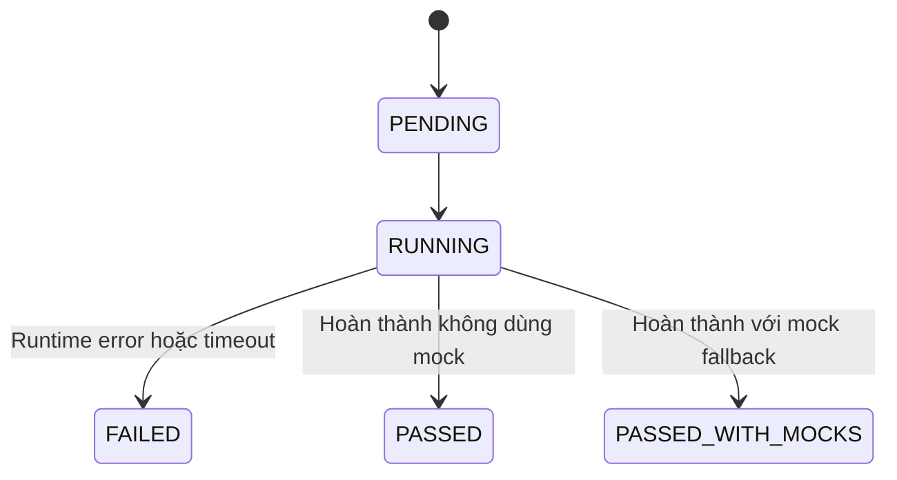
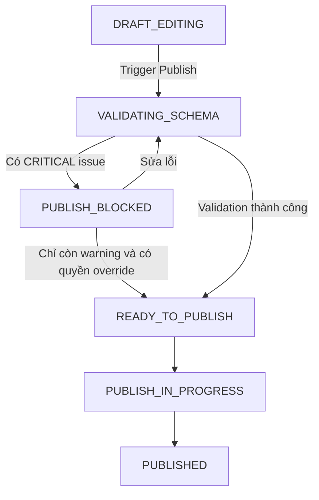
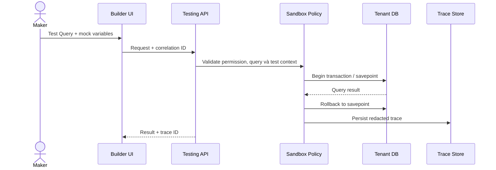

import { Meta } from '@storybook/addon-docs/blocks';
import { DocumentationTable } from '../DocumentationTable';

<Meta title="Specifications/Testing, Preview & Debugging/Architecture & Roadmap" />

# Testing, Preview & Debugging — Architecture & Roadmap

## Trạng thái tài liệu

Trang này ghi lại **target specification do stakeholder cung cấp** cho module
Testing, Preview & Debugging của Flexi. Đây là kiến trúc đề xuất và backlog,
không phải mô tả hành vi production hiện tại.

Implementation hiện chưa có Nest module, route frontend, API contract, Prisma
model hoặc permission dành cho testing. `Pages` và `Workflows` mới có
placeholder `GET /api/pages` và `GET /api/workflows`; model Prisma tương ứng chỉ
lưu metadata cùng `definition` JSON. Mọi capability bên dưới, trừ các điểm được
ghi rõ trong phần **Traceability hiện tại**, là **Not confirmed from current
implementation**.

## 1. Mục tiêu và phạm vi

Module mục tiêu cung cấp môi trường thực thi thử nghiệm an toàn cho visual UI,
biểu thức logic, query và workflow. Trải nghiệm cần phản hồi nhanh cho maker
nhưng không được làm hỏng dữ liệu Published/Production của tenant.

<DocumentationTable
  columns={[
    { id: 'level', header: 'Mức', width: 'w-1/5' },
    { id: 'capabilities', header: 'Capability mục tiêu', width: 'w-4/5' },
  ]}
  rows={[
    {
      id: 'mvp',
      level: 'MVP',
      capabilities:
        'Sandbox Execution Context theo app; Draft Page Preview; SQL/REST Query Test với biến giả lập; Workflow Dry-Run; Expression Evaluator; Correlation Trace ID; Basic Publish Gate.',
    },
    {
      id: 'production',
      level: 'Production-ready',
      capabilities:
        'Static Mock Connectors; rollback/purge dữ liệu test; PII và secret redaction; post-deployment smoke test; quyền xem payload riêng biệt.',
    },
    {
      id: 'enterprise',
      level: 'Enterprise / Advanced',
      capabilities:
        'Workflow debugger có breakpoint/pause/state inspection; API record & replay; regression suite với diff engine; promotion fixture giữa các environment.',
    },
  ]}
/>

## 2. Actors và permissions mục tiêu

<DocumentationTable
  columns={[
    { id: 'actor', header: 'Actor', width: 'w-1/4' },
    { id: 'scope', header: 'Phạm vi mục tiêu', width: 'w-3/4' },
  ]}
  rows={[
    {
      id: 'admin',
      actor: 'Tenant Admin',
      scope:
        'Cấu hình môi trường test và mock endpoint, kích hoạt fixture promotion, override cảnh báo publish được phép bỏ qua.',
    },
    {
      id: 'maker',
      actor: 'Application Creator / Maker',
      scope:
        'Tạo test scenario, chạy query/workflow, xem Draft Preview, debug expression và tạo dữ liệu test.',
    },
    {
      id: 'qa',
      actor: 'QA / App Operator',
      scope:
        'Chạy regression suite và xem report; không chỉnh sửa schema hoặc logic ứng dụng.',
    },
  ]}
/>

<DocumentationTable
  columns={[
    { id: 'permission', header: 'Permission code đề xuất', width: 'w-1/3' },
    { id: 'purpose', header: 'Mục đích', width: 'w-2/3' },
  ]}
  rows={[
    {
      id: 'execute',
      permission: <code>test:execute</code>,
      purpose: 'Chạy Query Test, Workflow Dry-Run và Page Preview.',
    },
    {
      id: 'payload',
      permission: <code>test:view_payload</code>,
      purpose: 'Xem input/output payload; tách riêng vì có nguy cơ lộ PII.',
    },
    {
      id: 'mock',
      permission: <code>test:manage_mock</code>,
      purpose: 'Tạo và quản lý mock connector/fixture.',
    },
    {
      id: 'override',
      permission: <code>publish:override_gate</code>,
      purpose:
        'Bỏ qua cảnh báo không nghiêm trọng; không được bypass lỗi CRITICAL.',
    },
  ]}
/>

Các code trên chưa có trong `packages/shared-types/src/permissions.ts`. Khi
triển khai cần chuẩn hóa theo naming convention hiện tại trước khi dùng trong
guard, seed hoặc UI.

## 3. Functional requirements

### MVP

- **Draft Page Preview:** render Draft Schema mà không đổi Published snapshot.
- **Interactive Query Testing:** chạy SQL hoặc REST query từ Builder với
  `test_inputs`/mock variables.
- **Workflow Dry-Run:** chạy workflow bằng mock payload và trả kết quả từng
  step ở dạng có cấu trúc.
- **Expression Debugger Panel:** hiển thị giá trị expression như
  `{{ Table1.selectedRow.id }}` và lỗi runtime có ngữ cảnh.
- **Basic Publish Gate:** static analysis App Schema để tìm broken binding,
  query chưa bind và missing reference trước khi publish.

### Production-ready

- Chặn outbound HTTP trong test mode và trả Static Mock đã cấu hình.
- Rollback thao tác ghi DB từ Query Test bằng transaction/savepoint; purge dữ
  liệu test không thể rollback theo retention policy.
- Chạy smoke test của các query/API trọng yếu sau deployment.
- Redact token, password và dữ liệu nhạy cảm trước khi persist log/trace.

### Enterprise / Advanced

- Pause workflow tại node, inspect state và resume thủ công.
- Record response thật ở Staging để tạo fixture cho replay.
- Đóng gói và promotion test case/mock data giữa các tenant/environment được
  phép trong cùng tổ chức.
- Chạy regression suite và so sánh actual/expected bằng diff engine.

## 4. Business rules đề xuất

<DocumentationTable
  columns={[
    { id: 'id', header: 'Rule', width: 'w-1/6' },
    { id: 'rule', header: 'Quy tắc mục tiêu', width: 'w-5/6' },
  ]}
  rows={[
    {
      id: 'BR-01',
      rule: 'Mọi test run mang is_test_context = true. Ghi Postgres phải nằm trong transaction có thể rollback, trừ khi maker xác nhận chạy trên DB sandbox riêng.',
    },
    {
      id: 'BR-02',
      rule: 'Không chuyển app từ DRAFT sang PUBLISHED khi Publish Gate còn issue CRITICAL.',
    },
    {
      id: 'BR-03',
      rule: 'Các key password, secret, token, authorization và credit_card phải trở thành ***REDACTED*** trước khi lưu log/trace.',
    },
    {
      id: 'BR-04',
      rule: 'Test run log lưu tối đa 7 ngày ở gói Standard và 30 ngày ở Enterprise.',
    },
  ]}
/>

## 5. Conceptual data model

<DocumentationTable
  columns={[
    { id: 'entity', header: 'Entity đề xuất', width: 'w-1/5' },
    { id: 'fields', header: 'Thuộc tính trọng yếu', width: 'w-2/5' },
    { id: 'purpose', header: 'Mục đích', width: 'w-2/5' },
  ]}
  rows={[
    {
      id: 'environment',
      entity: 'TestEnvironment',
      fields: 'id, tenant_id, app_id, name, variables_json',
      purpose: 'Ngữ cảnh biến và sandbox của một app trong tenant.',
    },
    {
      id: 'suite',
      entity: 'TestSuite',
      fields: 'id, tenant_id, app_id, name, trigger_type',
      purpose: 'Nhóm test case và cách kích hoạt.',
    },
    {
      id: 'case',
      entity: 'TestCase',
      fields:
        'id, suite_id, target_type, target_id, input_payload_json, expected_assert_json',
      purpose: 'Input và assertion cho một target cụ thể.',
    },
    {
      id: 'mock',
      entity: 'MockEndpoint',
      fields:
        'id, tenant_id, connector_id, match_criteria_json, mock_response_json, is_active',
      purpose: 'Match outbound request và cung cấp static response.',
    },
    {
      id: 'log',
      entity: 'TestExecutionLog',
      fields:
        'id, tenant_id, trace_id, test_case_id, status, execution_time_ms, step_traces_jsonb',
      purpose: 'Lưu kết quả và trace đã redact của một lần chạy.',
    },
  ]}
/>

Quan hệ mục tiêu: một `TestEnvironment` và một `TestSuite` đều thuộc tenant/app;
một suite có nhiều case; một case có nhiều execution log. Mock endpoint thuộc
tenant và connector. `step_traces_jsonb` linh hoạt cho SQL, REST, workflow và
expression, đổi lại truy vấn thống kê sâu trong JSONB sẽ tốn tài nguyên hơn.

Toàn bộ entity trên chưa có trong Prisma schema hiện tại.

## 6. API capability contracts đề xuất

### Query Test

- **Method/path:** `POST /api/v1/testing/queries/execute-test`
- **Auth/context mục tiêu:** Bearer JWT và tenant context đã xác thực; tài liệu
  nguồn đề xuất header `X-Tenant-ID` nhưng cách resolve tenant cuối cùng cần
  khớp cơ chế tenancy hiện tại.

```json
{
  "app_id": "uuid",
  "query_id": "uuid",
  "draft_version_id": "uuid",
  "mock_variables": { "userId": "usr_123" },
  "dry_run_options": { "auto_rollback": true }
}
```

```json
{
  "status": "SUCCESS",
  "execution_time_ms": 42,
  "trace_id": "tr-987654321",
  "data": [{ "id": "usr_123", "name": "John Doe" }],
  "logs": [{ "level": "INFO", "message": "Query executed and rolled back." }]
}
```

### Workflow Dry-Run

- **Method/path:** `POST /api/v1/testing/workflows/dry-run`

```json
{
  "workflow_id": "uuid",
  "draft_version_id": "uuid",
  "trigger_payload": { "event": "USER_CREATED" }
}
```

```json
{
  "execution_id": "uuid",
  "status": "COMPLETED",
  "trace_id": "tr-123456789",
  "step_results": [
    { "step_id": "step_1", "status": "PASSED", "output": { "count": 1 } },
    {
      "step_id": "step_2",
      "status": "MOCKED",
      "output": { "http_code": 200 }
    }
  ]
}
```

### Publish Gate Validation

- **Method/path:** `POST /api/v1/testing/publish-gate/validate`

```json
{
  "app_id": "uuid",
  "draft_version_id": "uuid"
}
```

```json
{
  "can_publish": false,
  "summary": { "critical_errors": 1, "warnings": 2 },
  "issues": [
    {
      "severity": "CRITICAL",
      "code": "UNBOUND_EXPRESSION",
      "component_id": "Button_Submit",
      "message": "onClick references non-existing query SubmitOrder_Old"
    }
  ]
}
```

Các response thực tế phải nằm trong envelope chung `{ success, data, error }`
của backend Flexi. DTO, status code, versioning và error envelope chi tiết chưa
được xác nhận từ implementation.

## 7. Lifecycle và execution flow





Luồng Query Test mục tiêu:



Các participant `Testing API`, `Sandbox Policy` và `Trace Store` là thành phần
kiến trúc mục tiêu, chưa phải layer đã tồn tại trong code.

## 8. Validation và error cases

<DocumentationTable
  columns={[
    { id: 'condition', header: 'Điều kiện', width: 'w-1/4' },
    { id: 'rule', header: 'Xử lý mục tiêu', width: 'w-1/2' },
    { id: 'code', header: 'Kết quả / code', width: 'w-1/4' },
  ]}
  rows={[
    {
      id: 'binding',
      condition: 'Unresolved variable / broken binding',
      rule: 'Trả component ID cùng vị trí dòng/cột hoặc JSON path; không biến thành unhandled server error.',
      code: 'UNBOUND_EXPRESSION',
    },
    {
      id: 'mock-required',
      condition: 'Outbound call bị chặn và không có mock',
      rule: 'Không gọi dịch vụ thật; gợi ý tạo Static Mock phù hợp với request.',
      code: 'TEST_MOCK_REQUIRED',
    },
    {
      id: 'unsafe-query',
      condition: 'SQL chứa DDL như DROP TABLE hoặc ALTER TABLE',
      rule: 'Static parse và chặn trước khi gửi câu lệnh tới database.',
      code: 'UNSAFE_QUERY_IN_SANDBOX',
    },
    {
      id: 'timeout',
      condition: 'Expression, query hoặc workflow vượt giới hạn',
      rule: 'Dừng execution, đánh dấu FAILED, lưu trace an toàn và cho phép retry khi phù hợp.',
      code: 'TEST_EXECUTION_TIMEOUT',
    },
    {
      id: 'payload',
      condition: 'Actor thiếu quyền xem payload',
      rule: 'Giữ metadata trace nhưng thay giá trị payload bằng [HIDDEN_PAYLOAD].',
      code: 'Payload hidden',
    },
  ]}
/>

Validation cần được tách theo layer khi triển khai: UI kiểm tra JSON/input cơ
bản; DTO xác thực shape và ID; business logic xác thực reference, permission và
test policy; database constraint bảo vệ tenant ownership và quan hệ dữ liệu.

## 9. Security và tenant isolation

- Mọi lookup và persistence phải có tenant scope lấy từ identity/context đã
  xác thực; không tin trực tiếp tenant ID do client gửi.
- Query Test trên PostgreSQL phải dùng connection có tenant context đúng trước
  khi execute. Tài liệu nguồn đề xuất `SET search_path TO tenant_<tenant_id>,
public`; implementation cần dùng cơ chế identifier an toàn, không nội suy
  header thô vào SQL.
- Dynamic expression phải chạy trong isolate có CPU time mục tiêu tối đa 100 ms
  và memory tối đa 128 MB. Việc chọn runtime như `isolated-vm` vẫn là open
  decision.
- Actor thiếu `test:view_payload` chỉ thấy trace metadata và
  `[HIDDEN_PAYLOAD]`.
- Secret/PII phải được redact trước persistence, không chỉ khi render UI.
- Outbound email, HTTP, file và queue side effect mặc định bị chặn hoặc mock
  trong test context.

## 10. Audit và observability

Audit Trail mục tiêu ghi việc chạy test, tạo/sửa mock và override Publish Gate
với `actor_id`, `tenant_id`, `action`, `resource_id`, `client_ip` và
`timestamp`.

Mỗi action từ frontend mang correlation ID và truyền xuyên suốt API, service,
worker/queue và executor. Tài liệu nguồn gọi header này là `X-Correlation-ID`
theo W3C; cần chốt sử dụng custom header hay chuẩn W3C Trace Context
(`traceparent`) trước khi triển khai.

Trace lưu input/output đã lọc, status từng step, thời gian thực thi, error code
và mock usage. Payload thô không được vượt qua redaction/access-control boundary.

## 11. Acceptance criteria mục tiêu

### AC-01 — SQL Query auto-rollback

- **Given** Maker có quyền execute và đang sửa query xóa các order cancelled
  trong tenant ACME.
- **When** Maker chọn `auto_rollback = true` và chạy Test Query.
- **Then** hệ thống mở transaction/savepoint trong tenant scope, chạy query,
  trả số dòng bị ảnh hưởng, rollback và xác nhận dữ liệu thật không đổi.

### AC-02 — Chặn broken binding khi publish

- **Given** Query `GetCustomerDetail` đã bị xóa nhưng Form vẫn tham chiếu
  `{{ GetCustomerDetail.data.name }}`.
- **When** Maker chọn Publish App.
- **Then** Publish Gate trả issue `CRITICAL`, chỉ rõ component/reference bị lỗi
  và không thay đổi Published snapshot.

### AC-03 — Không gọi outbound service khi thiếu mock

- **Given** Workflow Dry-Run tới một REST connector và test context không có
  mock phù hợp.
- **When** executor tới HTTP step.
- **Then** request thật không được gửi, step thất bại với
  `TEST_MOCK_REQUIRED`, trace gợi ý tạo mock và không lộ secret.

### AC-04 — Ẩn payload theo quyền

- **Given** QA có quyền chạy/xem report nhưng không có `test:view_payload`.
- **When** QA mở execution trace.
- **Then** status, duration và step metadata vẫn hiển thị; mọi payload value là
  `[HIDDEN_PAYLOAD]`.

## 12. Dependencies

<DocumentationTable
  columns={[
    { id: 'module', header: 'Module phụ thuộc', width: 'w-1/3' },
    { id: 'need', header: 'Contract cần cung cấp', width: 'w-2/3' },
  ]}
  rows={[
    {
      id: 'configuration',
      module: 'Configuration / Application Engine',
      need: 'Draft và Published revision bất biến, app identity và reference graph.',
    },
    {
      id: 'page',
      module: 'Page Builder',
      need: 'Draft schema, binding metadata, preview renderer và publish trigger.',
    },
    {
      id: 'workflow',
      module: 'Workflow Automation',
      need: 'Revision, executor, step state, mock interception và pause/resume hook.',
    },
    {
      id: 'dynamic-table',
      module: 'Dynamic Tables & Query Engine',
      need: 'Tenant-safe execution, transaction boundary và query validation.',
    },
    {
      id: 'logs',
      module: 'Logs / Observability',
      need: 'Trace ingestion, correlation, redaction, retention và payload ACL.',
    },
    {
      id: 'release',
      module: 'Environment & Release Management',
      need: 'Promotion event, post-deploy hook và environment-specific fixture binding.',
    },
  ]}
/>

## 13. Open decisions

<DocumentationTable
  columns={[
    { id: 'decision', header: 'Quyết định', width: 'w-1/4' },
    { id: 'optionA', header: 'Phương án A', width: 'w-1/4' },
    { id: 'optionB', header: 'Phương án B', width: 'w-1/4' },
    { id: 'guidance', header: 'Định hướng', width: 'w-1/4' },
  ]}
  rows={[
    {
      id: 'db',
      decision: 'Database testing strategy',
      optionA:
        'Savepoint/rollback trên tenant schema chính: nhanh và nhẹ nhưng không bao phủ external/async side effect.',
      optionB:
        'tenant sandbox schema riêng: cô lập mạnh hơn nhưng phải sync schema và tốn tài nguyên.',
      guidance: 'A cho MVP/Production-ready; đánh giá B cho Enterprise.',
    },
    {
      id: 'worker',
      decision: 'Workflow dry-run worker',
      optionA: 'Dùng chung queue/worker, priority thấp và is_test = true.',
      optionB: 'Tách worker pool chuyên dụng cho debugging.',
      guidance: 'Chốt theo tải, SLO và blast radius dự kiến.',
    },
    {
      id: 'trace',
      decision: 'Tracing header',
      optionA: 'Custom X-Correlation-ID.',
      optionB: 'W3C Trace Context với traceparent/tracestate.',
      guidance:
        'Ưu tiên chuẩn W3C; có thể expose correlation ID thân thiện ở UI.',
    },
    {
      id: 'expression',
      decision: 'Expression runtime',
      optionA: 'JavaScript isolate với resource limits.',
      optionB: 'DSL/JSONata giới hạn capability.',
      guidance:
        'Đánh giá security, compatibility và debug ergonomics trước khi chốt.',
    },
  ]}
/>

## 14. Backlog đề xuất

### Epic 1 — MVP Core Sandbox & Immediate Debugging

- **Sandbox Query Execution Engine**
  - Runner Service nhận query, mock variables và auto-rollback option.
  - Query Test Panel nhập JSON variables và hiển thị response dạng cây.
- **Expression Evaluation & Trace Viewer**
  - Secure evaluator trả value và lỗi có ngữ cảnh.
  - Correlation ID xuyên suốt UI request và execution log.
- **Draft Preview & Basic Publish Gate**
  - Page Preview đọc Draft Configuration State.
  - Static scanner tìm unbound variable và missing query/reference.

### Epic 2 — Production-ready Mocks & Data Safety

- CRUD API/UI cho Static Mock Response và request matcher.
- Outbound interception theo test context.
- Auto-redaction cho JWT, secret, password và PII.
- Scheduled purge cho trace hết hạn.
- Post-deployment smoke test hook và report.

### Epic 3 — Enterprise Debugging & Automation

- Pause execution tại workflow step, inspect state và resume.
- Record & Replay API call.
- Regression suite và actual/expected diff.
- Export/import hoặc promotion fixture giữa environment được phép.

## Traceability hiện tại

<DocumentationTable
  columns={[
    { id: 'responsibility', header: 'Trách nhiệm', width: 'w-1/3' },
    { id: 'implementation', header: 'Bằng chứng hiện tại', width: 'w-2/3' },
  ]}
  rows={[
    {
      id: 'wiring',
      responsibility: 'Testing module/API/frontend route',
      implementation: 'Not confirmed from current implementation',
    },
    {
      id: 'page-api',
      responsibility: 'Pages placeholder API',
      implementation:
        'apps/backend/src/modules/pages/pages.controller.ts; pages.service.ts',
    },
    {
      id: 'workflow-api',
      responsibility: 'Workflows placeholder API',
      implementation:
        'apps/backend/src/modules/workflows/workflows.controller.ts; workflows.service.ts',
    },
    {
      id: 'metadata',
      responsibility: 'Page/Workflow metadata',
      implementation:
        'apps/backend/prisma/schema.prisma — model Page và Workflow',
    },
    {
      id: 'contracts',
      responsibility: 'Shared Page/Workflow metadata shape',
      implementation:
        'packages/shared-types/src/entities.ts — PageDto và WorkflowDto',
    },
    {
      id: 'permissions',
      responsibility: 'Testing permission catalog',
      implementation:
        'Not confirmed; packages/shared-types/src/permissions.ts chưa có test:* hoặc publish override permission',
    },
    {
      id: 'envelope',
      responsibility: 'Global API prefix, validation và response envelope',
      implementation:
        'apps/backend/src/main.ts; common/response.interceptor.ts; common/http-exception.filter.ts',
    },
    {
      id: 'target-data',
      responsibility: 'Test entities, runner, mock, trace và publish gate',
      implementation: 'Not confirmed from current implementation',
    },
  ]}
/>

## Definition of done cho implementation tương lai

Một vertical slice chỉ được coi là hoàn thành khi có UI state cho loading,
validation error, permission denied, timeout và success; DTO/guard/service được
test; tenant isolation và rollback có integration test; secret redaction được
kiểm chứng trước persistence; trace có correlation ID; và Published snapshot
không đổi sau mọi test hoặc publish validation thất bại.
