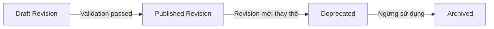
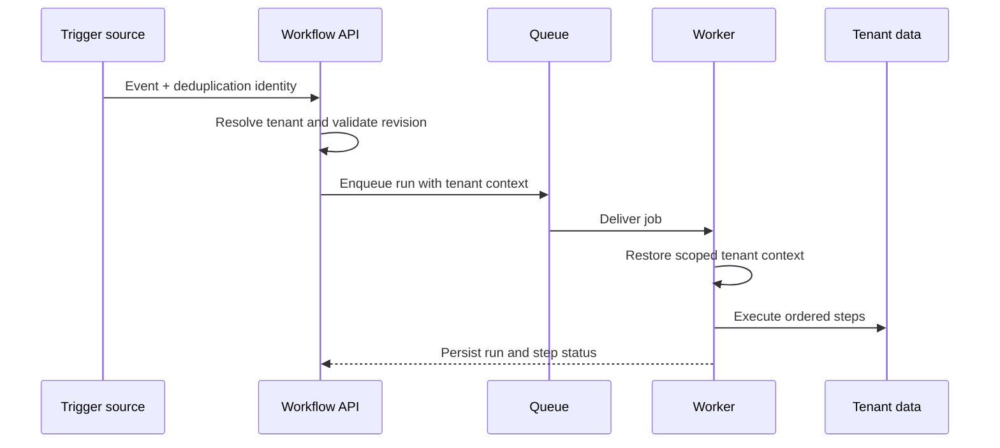

import { Meta } from '@storybook/addon-docs/blocks';
import { DocumentationTable } from '../DocumentationTable';

<Meta title="Specifications/Workflows/Architecture & Roadmap" />

# Workflow Automation — Architecture & Roadmap

## Trạng thái tài liệu

Trang này ghi lại **đề xuất kiến trúc và lộ trình** cho Workflow Automation.
Đây không phải mô tả hành vi production hiện tại và không thay thế contract đã
được ghi tại trang **Specifications/Workflows**.

Implementation hiện tại mới có `GET /api/workflows` trả
`{ status: 'not-implemented' }`, model Prisma `Workflow` lưu metadata cùng
`definition` JSON, và `WorkflowDto` tương ứng. Revision, trigger, run, step,
attempt, connection vault, queue worker và visual designer trong tài liệu này
là **Not confirmed from current implementation**.

## 1. Mục tiêu và phạm vi

Mục tiêu là xây dựng engine xử lý quy trình đa tenant theo mô hình DAG
(Directed Acyclic Graph), linh hoạt hơn luồng tuần tự nhưng đơn giản hơn BPMN
2.0 đầy đủ. Thiết kế ưu tiên tự động hóa liên module, khả năng mở rộng
production và lộ trình nâng cấp mà không đưa sớm các khái niệm vận hành phức
tạp vào MVP.

<DocumentationTable
  columns={[
    { id: 'capability', header: 'Khả năng', width: 'w-1/5' },
    { id: 'mvp', header: 'MVP', width: 'w-[27%]' },
    { id: 'production', header: 'Production-ready', width: 'w-[27%]' },
    { id: 'enterprise', header: 'Enterprise / Advanced', width: 'w-[26%]' },
  ]}
  rows={[
    {
      id: 'triggers',
      capability: 'Triggers',
      mvp: 'Dynamic Table Create/Update/Delete, Webhook, Manual',
      production: 'Schedule / Cron',
      enterprise: 'External Signal, Human Interaction',
    },
    {
      id: 'actions',
      capability: 'Actions',
      mvp: 'Dynamic Table Operations, HTTP Request, Notification',
      production: 'Branching Condition, Delay / Wait',
      enterprise: 'Sub-workflow, Approval Task, Custom Script',
    },
    {
      id: 'control-flow',
      capability: 'Control flow',
      mvp: 'Tuần tự và điều kiện If/Else đơn',
      production: 'Foreach, Try/Catch',
      enterprise: 'Parallel branches, Compensation',
    },
    {
      id: 'execution',
      capability: 'Execution engine',
      mvp: 'Short-running stateless queue worker, execution timeout',
      production: 'Exponential backoff, deduplication và idempotency',
      enterprise: 'Long-running state persistence, Pause / Resume',
    },
    {
      id: 'deployment',
      capability: 'Deployment & environment',
      mvp: 'Một environment, Direct Publish',
      production: 'Environment Variables, Connection Vault',
      enterprise: 'Promotion Development → Staging → Production',
    },
    {
      id: 'observability',
      capability: 'Observability',
      mvp: 'Run/Step history, Replay Run',
      production: 'Dead-letter Queue, metrics dashboard',
      enterprise: 'Breakpoint / Debugger, live canvas tracer',
    },
  ]}
/>

### Vì sao chọn DAG thay vì BPMN

DAG giảm chi phí quản lý trạng thái và giúp visual designer dễ hiểu, đồng thời
phù hợp với mô hình Queue/Worker. Đổi lại, MVP không hỗ trợ sẵn các gateway
phức tạp, message correlation hoặc quy trình nhân sự kéo dài như một BPMN
engine đầy đủ.

## 2. Actors và permissions mục tiêu

<DocumentationTable
  columns={[
    { id: 'actor', header: 'Actor', width: 'w-1/5' },
    { id: 'permissions', header: 'Phạm vi quyền mục tiêu', width: 'w-4/5' },
  ]}
  rows={[
    {
      id: 'tenant-admin',
      actor: 'Tenant Admin',
      permissions:
        'Quản lý workflow, connection secrets, environment, audit log và rate limit trong tenant.',
    },
    {
      id: 'builder',
      actor: 'Workflow Builder',
      permissions:
        'Tạo, sửa, cấu hình, test run và publish workflow; không xem secret plaintext.',
    },
    {
      id: 'app-user',
      actor: 'App User',
      permissions:
        'Kích hoạt Manual Trigger hoặc xử lý Approval Task được giao.',
    },
    {
      id: 'worker',
      actor: 'System Worker',
      permissions:
        'Thực thi nền bằng tenant context tạm thời và chỉ truy cập dữ liệu của tenant tương ứng.',
    },
  ]}
/>

Tên role, permission code, guard và cơ chế cấp context token cụ thể là **Not
confirmed from current implementation**.

## 3. Functional requirements

### Visual Designer

- Canvas kéo thả để tạo đồ thị có hướng không chu trình.
- Inspector Panel cấu hình tham số node, data mapping và retry rule.
- Test Run ngay trong editor bằng Mock Payload hoặc Test Fixture.

### Variable và Expression System

- Truy cập trigger bằng cú pháp như `{{trigger.body.id}}`.
- Truy cập output bước trước bằng cú pháp như
  `{{steps.step_1.output.status}}`.
- Cung cấp hàm xử lý chuỗi, thời gian, ép kiểu và mảng ở mức cơ bản.

### Connection và Secret Resolution

- Tách OAuth, API Key và Basic Auth khỏi workflow definition.
- Cho phép bind connection khác nhau theo Development, Staging và Production.
- Runtime chỉ resolve secret tại thời điểm thực thi; editor và log không hiển
  thị plaintext.

### Error handling và resiliency

- Retry policy riêng cho từng node gồm số lần thử, thời gian chờ và hệ số
  exponential backoff.
- Catch branch xử lý lỗi thay vì luôn kết thúc toàn workflow ngay lập tức.
- Replay một run thất bại từ đầu hoặc tiếp tục từ step lỗi.

## 4. Business rules đề xuất

<DocumentationTable
  columns={[
    { id: 'rule', header: 'Quy tắc', width: 'w-1/4' },
    { id: 'target', header: 'Giá trị / hành vi mục tiêu', width: 'w-3/4' },
  ]}
  rows={[
    {
      id: 'cycle',
      rule: 'Anti-cycle',
      target: 'Chặn tuyệt đối cạnh tạo chu trình trong Visual Designer.',
    },
    {
      id: 'dedupe',
      rule: 'Idempotency / deduplication',
      target:
        'Mọi trigger có deduplication_id hoặc identity sinh từ Tenant ID + Event Type + Resource ID + Timestamp; cửa sổ đề xuất là 5 phút.',
    },
    {
      id: 'workflow-timeout',
      rule: 'Workflow timeout',
      target: 'Short-running workflow tối đa 300 giây.',
    },
    {
      id: 'http-timeout',
      rule: 'HTTP node timeout',
      target: 'Một HTTP Request node tối đa 30 giây.',
    },
    {
      id: 'retention',
      rule: 'Run history retention',
      target: '30 ngày cho gói Standard và 90 ngày cho gói Enterprise.',
    },
    {
      id: 'redaction',
      rule: 'Sensitive data',
      target:
        'Secret/API key trong payload phải được thay bằng ****** trước khi ghi log database.',
    },
  ]}
/>

Các giá trị timeout, dedupe window và retention ở đây là đề xuất của tài liệu
nguồn; chúng cần được chốt cùng contract Workflows hiện hữu trước khi triển
khai vì hiện có các giá trị mục tiêu khác nhau.

## 5. Entity model ở mức khái niệm

<DocumentationTable
  columns={[
    { id: 'entity', header: 'Entity', width: 'w-1/5' },
    { id: 'fields', header: 'Thuộc tính trọng yếu', width: 'w-2/5' },
    { id: 'purpose', header: 'Mục đích', width: 'w-2/5' },
  ]}
  rows={[
    {
      id: 'workflow',
      entity: 'Workflow',
      fields: 'id, tenant_id, name, status, active_revision_id, timestamps',
      purpose: 'Aggregate định danh quy trình và revision đang hoạt động.',
    },
    {
      id: 'revision',
      entity: 'WorkflowRevision',
      fields:
        'id, workflow_id, version_number, definition_graph, is_published, created_by',
      purpose: 'Snapshot được version hóa của graph.',
    },
    {
      id: 'trigger',
      entity: 'WorkflowTrigger',
      fields: 'id, revision_id, type, configuration_json',
      purpose: 'Điểm vào và cấu hình trigger.',
    },
    {
      id: 'run',
      entity: 'WorkflowRun',
      fields:
        'id, tenant_id, revision_id, status, trigger_payload, error_details, timestamps',
      purpose: 'Một lần thực thi revision.',
    },
    {
      id: 'step-run',
      entity: 'StepRun',
      fields:
        'id, run_id, step_id, status, input_data, output_data, error_stack',
      purpose: 'Trạng thái thực thi của một node.',
    },
    {
      id: 'attempt',
      entity: 'StepAttempt',
      fields:
        'id, step_run_id, attempt_number, status, response_raw, executed_at',
      purpose: 'Chi tiết từng lần thử của step.',
    },
    {
      id: 'connection',
      entity: 'Connection Vault',
      fields:
        'id, tenant_id, name, auth_type, encrypted_credentials, environment',
      purpose: 'Credential theo tenant và environment.',
    },
  ]}
/>

Ngoại trừ một phần metadata trong model Prisma `Workflow`, các entity và field
trên chưa tồn tại trong schema hiện tại.

## 6. API capability ở mức contract

<DocumentationTable
  columns={[
    { id: 'endpoint', header: 'Endpoint', width: 'w-2/5' },
    { id: 'method', header: 'Method', width: 'w-[15%]' },
    { id: 'permission', header: 'Quyền', width: 'w-1/5' },
    { id: 'purpose', header: 'Mục đích', width: 'w-1/4' },
  ]}
  rows={[
    {
      id: 'workflows',
      endpoint: '/api/v1/workflows',
      method: 'GET / POST',
      permission: 'Builder',
      purpose: 'Liệt kê hoặc tạo workflow.',
    },
    {
      id: 'revisions',
      endpoint: '/api/v1/workflows/{id}/revisions',
      method: 'POST',
      permission: 'Builder',
      purpose: 'Lưu Draft Revision.',
    },
    {
      id: 'publish',
      endpoint: '/api/v1/workflows/{id}/publish',
      method: 'POST',
      permission: 'Admin / Builder',
      purpose: 'Publish revision thành active.',
    },
    {
      id: 'execute',
      endpoint: '/api/v1/workflows/{id}/execute',
      method: 'POST',
      permission: 'App User / Internal',
      purpose: 'Kích hoạt thủ công.',
    },
    {
      id: 'webhook',
      endpoint: '/api/v1/webhooks/triggers/{token}',
      method: 'POST',
      permission: 'Public',
      purpose: 'Nhận webhook bên ngoài.',
    },
    {
      id: 'run',
      endpoint: '/api/v1/runs/{run_id}',
      method: 'GET',
      permission: 'Builder / Admin',
      purpose: 'Đọc trạng thái và chi tiết run.',
    },
    {
      id: 'replay',
      endpoint: '/api/v1/runs/{run_id}/replay',
      method: 'POST',
      permission: 'Admin',
      purpose: 'Yêu cầu replay run.',
    },
    {
      id: 'connections',
      endpoint: '/api/v1/connections',
      method: 'GET / POST',
      permission: 'Admin',
      purpose: 'Quản lý connection và secret.',
    },
  ]}
/>

Prefix hiện tại của backend là `/api`, không phải `/api/v1`. Toàn bộ endpoint
trên, trừ placeholder `GET /api/workflows`, là **Not confirmed from current
implementation**.

## 7. Lifecycle và execution flow

<DocumentationTable
  columns={[
    { id: 'status', header: 'Run status', width: 'w-1/5' },
    { id: 'meaning', header: 'Ý nghĩa đề xuất', width: 'w-4/5' },
  ]}
  rows={[
    {
      id: 'pending',
      status: 'Pending',
      meaning: 'Đã nhận sự kiện và đang chờ trong queue.',
    },
    {
      id: 'running',
      status: 'Running',
      meaning: 'Worker đang thực thi các step.',
    },
    {
      id: 'succeeded',
      status: 'Succeeded',
      meaning: 'Tất cả step cần thiết đã thành công.',
    },
    {
      id: 'failed',
      status: 'Failed',
      meaning: 'Step thất bại và không phục hồi được bằng Retry hoặc Catch.',
    },
    {
      id: 'cancelled',
      status: 'Cancelled',
      meaning: 'Người dùng hủy hoặc hệ thống dừng do timeout.',
    },
    {
      id: 'paused',
      status: 'Paused',
      meaning: 'Enterprise: chờ Human Task hoặc External Event.',
    },
  ]}
/>

Các participant trên là kiến trúc mục tiêu. Workflow module hiện chưa có queue
producer, processor hay runtime persistence.

## 8. Validation và error cases

<DocumentationTable
  columns={[
    { id: 'condition', header: 'Điều kiện', width: 'w-1/4' },
    { id: 'rule', header: 'Xử lý đề xuất', width: 'w-1/2' },
    { id: 'layer', header: 'Layer mục tiêu', width: 'w-1/4' },
  ]}
  rows={[
    {
      id: 'topology',
      condition: 'Cycle, orphan node, type mismatch',
      rule: 'Chặn Save/Publish và chỉ rõ node hoặc edge không hợp lệ.',
      layer: 'Designer + API validation',
    },
    {
      id: 'expression',
      condition: 'Thuộc tính JSON không tồn tại và không có fallback',
      rule: 'Đánh dấu lỗi expression tại step đang evaluate.',
      layer: 'Runtime expression engine',
    },
    {
      id: 'backpressure',
      condition: 'Tenant vượt rate limit, ví dụ trên 100 events/giây',
      rule: 'Trả 429 hoặc chuyển event sang degraded low-priority queue.',
      layer: 'API gateway / queue admission',
    },
  ]}
/>

Ngưỡng rate limit, cách xử lý orphan node và degraded mode cần quyết định trước
implementation; hiện chưa có user-visible error contract tương ứng.

## 9. Security và tenant isolation

- Mọi Workflow, Revision, Run và Log phải gắn với tenant context.
- Worker phải khôi phục Tenant ID, schema scope và token đặc quyền tối thiểu từ
  job context trước khi truy cập dữ liệu.
- Credential trong Connection Vault được đề xuất mã hóa bằng AES-256-GCM.
- Token, password và Authorization header phải được redact trước khi ghi hoặc
  hiển thị log.
- Webhook token chỉ được resolve tới workflow trong đúng tenant, không cho phép
  lookup chéo tenant.

Tài liệu nguồn đề xuất schema-per-tenant. Prisma hiện tại lưu `tenantId` trên
model `Workflow` trong schema dùng chung; vì vậy chiến lược database isolation
cụ thể là **Not confirmed from current implementation** và cần quyết định kiến
trúc riêng.

## 10. Audit và observability

<DocumentationTable
  columns={[
    { id: 'area', header: 'Bề mặt', width: 'w-1/4' },
    { id: 'target', header: 'Telemetry / audit mục tiêu', width: 'w-3/4' },
  ]}
  rows={[
    {
      id: 'audit',
      area: 'Audit log',
      target:
        'Ghi actor tạo, sửa, publish revision và thay đổi secret; không ghi secret plaintext.',
    },
    {
      id: 'execution',
      area: 'Execution telemetry',
      target:
        'Theo dõi latency từng step và số job thành công/thất bại; xuất Prometheus metrics ở giai đoạn production-ready.',
    },
    {
      id: 'alert',
      area: 'Alerting',
      target:
        'Thông báo Tenant Admin khi tỷ lệ lỗi workflow vượt ngưỡng trong một time window cấu hình.',
    },
  ]}
/>

## 11. Acceptance criteria định hướng

### AC-01 — Dynamic Table trigger

**Given** một workflow đã publish và lắng nghe sự kiện tạo record trên bảng
`Orders`.

**When** một record được chèn thành công vào `Orders`.

**Then** engine tạo `WorkflowRun` ở trạng thái `Pending` và enqueue message có
đúng tenant context.

### AC-02 — Retry HTTP Request

**Given** HTTP Request node có tối đa ba retries và exponential backoff.

**When** endpoint ngoài trả `503 Service Unavailable`.

**Then** engine ghi một `StepAttempt` lỗi, lập lịch attempt kế tiếp và chưa
chuyển `WorkflowRun` thành `Failed`.

### AC-03 — Webhook tenant isolation

**Given** Tenant A và Tenant B đều có webhook workflow.

**When** gateway nhận request bằng endpoint token của Tenant A.

**Then** chỉ workflow của Tenant A được kích hoạt và worker không thể truy cập
tài nguyên của Tenant B.

Ba acceptance criteria trên là mục tiêu backlog, chưa có test hoặc code chứng
minh trong module Workflows hiện tại.

## 12. Dependencies mục tiêu

<DocumentationTable
  columns={[
    { id: 'dependency', header: 'Dependency', width: 'w-1/3' },
    {
      id: 'responsibility',
      header: 'Trách nhiệm đối với Workflow',
      width: 'w-2/3',
    },
  ]}
  rows={[
    {
      id: 'dynamic-tables',
      dependency: 'Dynamic Tables Engine',
      responsibility:
        'Event hooks Create/Update/Delete và data operations cho action node.',
    },
    {
      id: 'queue',
      dependency: 'BullMQ-compatible Queue',
      responsibility: 'Job queue, priority, retry và delay.',
    },
    {
      id: 'configuration',
      dependency: 'Configuration Engine & Vault',
      responsibility: 'Environment variables và secret resolution an toàn.',
    },
    {
      id: 'logging',
      dependency: 'Audit & Logging Module',
      responsibility: 'Audit trail và execution telemetry tập trung.',
    },
  ]}
/>

Repo đã dùng BullMQ-compatible infrastructure cho Dynamic Tables DDL và tenant
provisioning, nhưng điều đó chưa xác nhận queue contract của Workflow runtime.

## 13. Quyết định còn mở

<DocumentationTable
  columns={[
    { id: 'decision', header: 'Quyết định', width: 'w-1/3' },
    { id: 'options', header: 'Phương án đang cân nhắc', width: 'w-2/3' },
  ]}
  rows={[
    {
      id: 'engine',
      decision: 'Long-running engine',
      options:
        'Tiếp tục custom runner trên queue hoặc tích hợp Temporal ở Enterprise.',
    },
    {
      id: 'expression',
      decision: 'Expression engine',
      options:
        'JSONata/Handlebars giới hạn hoặc JavaScript sandbox linh hoạt hơn.',
    },
    {
      id: 'logs',
      decision: 'Log storage',
      options:
        'PostgreSQL tenant data hoặc dịch vụ chuyên dụng như OpenSearch/ClickHouse.',
    },
    {
      id: 'isolation',
      decision: 'Database tenant isolation',
      options:
        'Giữ shared schema + tenantId hay chuyển workflow runtime sang schema-per-tenant.',
    },
    {
      id: 'limits',
      decision: 'Runtime limits',
      options:
        'Chốt một contract duy nhất cho timeout, dedupe window và retention.',
    },
  ]}
/>

## 14. Backlog đề xuất

### Epic 1 — Core Workflow Engine & DAG Runner (MVP)

- **Feature 1.1 — Core Data Model & Structural Management**
  - Tạo schema cho Workflow, Revision và Connection Vault.
  - Xây REST API CRUD workflow và lưu Draft Revision.
- **Feature 1.2 — Short-running Execution Engine**
  - Worker đọc job và khôi phục tenant context.
  - Node executor cho Dynamic Table Action và HTTP Request.
  - Topological Sort và cycle validation cho DAG.

### Epic 2 — Visual Designer & Trigger Integrations (MVP)

- **Feature 2.1 — React Canvas Builder**
  - Canvas kéo thả cho Trigger và Action node.
  - Cycle Detection trên client.
- **Feature 2.2 — Event & Webhook Integration**
  - Dynamic Table Event Bus → Workflow Event Queue.
  - Public Webhook Gateway cùng deduplication.

### Epic 3 — Resiliency, Error Handling & Logging (Production-ready)

- **Feature 3.1 — Retry & Fallback**
  - Exponential backoff theo step.
  - Condition If/Else và Catch Error branch.
- **Feature 3.2 — Observability & Replay**
  - Run History, Step Data và redacted payload.
  - API/UI replay run thất bại.

### Epic 4 — Advanced Flow Control & Operations (Enterprise)

- **Feature 4.1 — Advanced Logic**
  - Loop/Foreach node.
  - Approval Task hỗ trợ Pause/Resume.
- **Feature 4.2 — Governance & Deployment**
  - Connection Vault đa environment.
  - Promotion workflow revision giữa environment.

Ưu tiên ban đầu là Epic 1 và Epic 2: chúng tạo vertical slice tối thiểu cho
Dynamic Table event, manual/webhook trigger và các action phổ biến mà chưa cần
đến state machine dài hạn của BPMN hoặc Human Task.

## Traceability hiện tại

<DocumentationTable
  columns={[
    { id: 'responsibility', header: 'Trách nhiệm', width: 'w-1/3' },
    { id: 'implementation', header: 'Bằng chứng hiện tại', width: 'w-2/3' },
  ]}
  rows={[
    {
      id: 'api',
      responsibility: 'Placeholder API',
      implementation:
        'apps/backend/src/modules/workflows/workflows.controller.ts; workflows.service.ts',
    },
    {
      id: 'wiring',
      responsibility: 'Nest module wiring',
      implementation: 'apps/backend/src/modules/workflows/workflows.module.ts',
    },
    {
      id: 'persistence',
      responsibility: 'Workflow metadata',
      implementation: 'apps/backend/prisma/schema.prisma — model Workflow',
    },
    {
      id: 'contract',
      responsibility: 'Shared metadata shape',
      implementation: 'packages/shared-types/src/entities.ts — WorkflowDto',
    },
    {
      id: 'queue-reference',
      responsibility: 'Queue precedent, không phải Workflow runtime',
      implementation:
        'apps/backend/src/modules/dynamic-tables/ddl-worker.ts; modules/tenants/provisioning.worker.ts',
    },
    {
      id: 'target',
      responsibility:
        'Designer, revisions, triggers, runtime, vault và history',
      implementation: 'Not confirmed from current implementation',
    },
  ]}
/>
