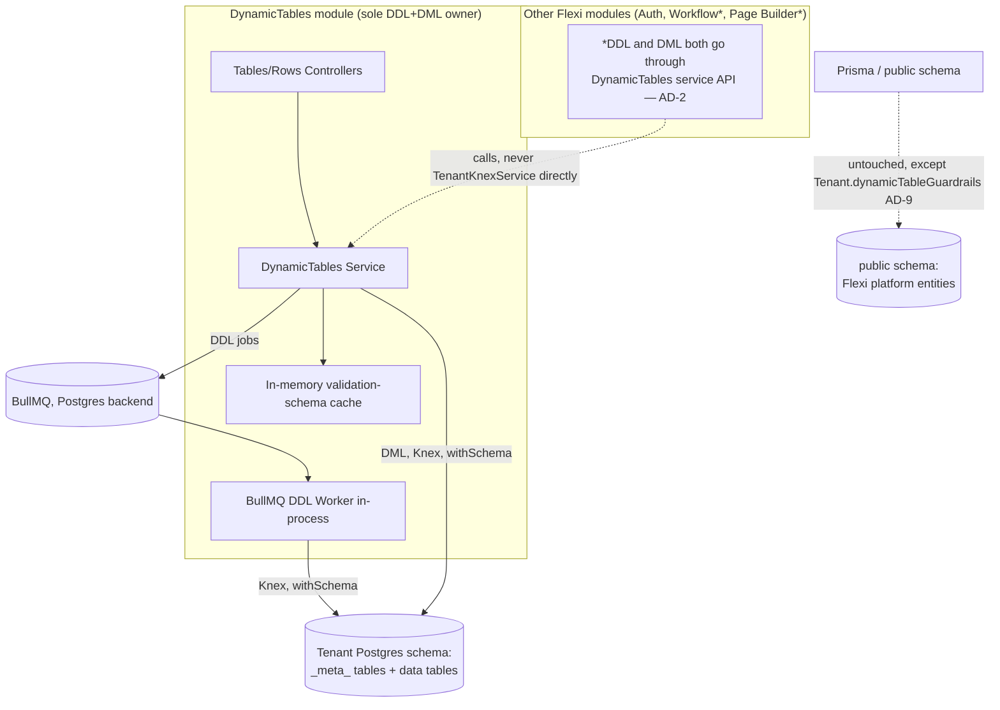
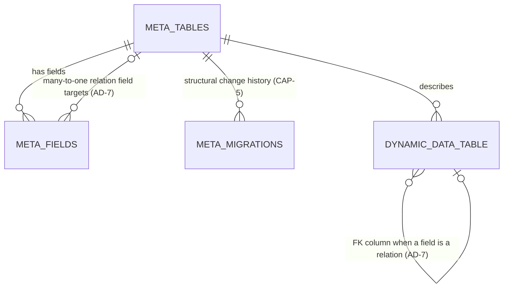

import { Meta } from '@storybook/addon-docs/blocks';

<Meta title="Specs/Architecture/Architecture Spine" />

# Architecture Spine — Dynamic Database / Table Builder

> **Architecture decision record — implementation checked 25/08/2026.** The
> Dynamic Tables backend has implemented metadata, queued DDL, row CRUD and
> many-to-one relations. Guardrails, the builder UI and cross-tenant migration
> orchestration remain incomplete; use Current Product State and code/tests
> for release status.

## Design Paradigm

Single-owner layered module: one NestJS `DynamicTables` module is the exclusive gateway to both **metadata** (table/field definitions) and **DDL/DML execution** against tenant schemas. Everything Flexi's other modules do — Prisma for fixed platform entities, row-level `tenantId` — stays untouched; this module is the one deliberate exception, fully Knex-based, fully tenant-schema-scoped, with no Prisma involvement at all.



## Invariants & Rules

### AD-1 — Metadata lives in tenant schema via Knex, not Prisma `[ADOPTED]`

- **Binds:** CAP-1, CAP-2, CAP-3, CAP-4, CAP-5, CAP-8
- **Prevents:** A split-brain where some metadata reads/writes hit Prisma's `public`-schema `DynamicTable`/`DynamicField` models and others hit tenant-schema Knex tables.
- **Rule:** Table/field definitions (name, slug, dataType, required, config, relation targets) are physical Postgres tables inside each tenant's own schema, created and queried exclusively through `TenantKnexService`. The existing Prisma `DynamicTable`/`DynamicField` models (`schema.prisma:198-237`) are superseded and must be removed in a migration as part of this module's implementation — they are not left running in parallel. Exception, narrowly scoped: CAP-8's guardrail _settings_ (the ceiling values themselves, not table/field definitions) stay in Prisma's `public`-schema `Tenant` model, per AD-9 — a tenant-wide setting, not dynamic-table metadata, and needed before a tenant's first table exists.

### AD-2 — DynamicTables module is the sole owner of both DDL and DML on dynamic tables

- **Binds:** all (platform-wide)
- **Prevents:** Two modules independently touching the same tenant table through different code paths — e.g. one honoring queue/`lock_timeout` discipline for structure changes, another bypassing it; or any module writing rows directly through `TenantKnexService` and skipping CAP-3's validation-schema enforcement entirely.
- **Rule:** Any structural change (DDL) OR row read/write (DML) against a dynamic table — from this module or any future one (Workflow Builder, Page Builder, etc.) — goes through `DynamicTablesService`'s public API (structural changes via its DDL-enqueue methods per AD-4, rows via its validated read/write methods per AD-5). **No module other than `DynamicTables` calls `TenantKnexService.forCurrentTenant()` for anything targeting a dynamic table or its rows** — that call is private to this module's service/worker. A future module needing dynamic-table data consumes `DynamicTablesService`'s API, never the tenancy layer directly, for this data.

### AD-3 — Inside `DynamicTables`, every statement is built from `TenantKnexService`

- **Binds:** CAP-1, CAP-2, CAP-4, CAP-6
- **Prevents:** Reintroducing schema-name string concatenation or a second tenant-resolution path, bypassing `resolveTenantSchema()`'s injection defense. (AD-2 governs _who_ may reach the tenancy layer for dynamic-table data; this AD governs _how_ `DynamicTables` itself does it internally.)
- **Rule:** No raw `pg` client, no new Prisma dynamic-model workaround, anywhere inside `dynamic-tables.service.ts` or `ddl-worker.ts`. Every statement — metadata or data, DDL or DML — is built from `tenantKnexService.forCurrentTenant()`. Every user-supplied table/column name is validated by one shared function, `sanitizeIdentifier()` (new, alongside `resolve-tenant-schema.ts` in `apps/backend/src/tenancy/`, same allowlist discipline: `/^[A-Za-z_][\w$]*$/`, length-capped to Postgres's `NAMEDATALEN`) — `DynamicTablesService` and `ddl-worker.ts` both call it; no second, independently-written sanitizer exists anywhere in this module.

### AD-4 — DDL never executes on the request/response path

- **Binds:** CAP-1, CAP-2, CAP-6
- **Prevents:** A blocked `ALTER`/`CREATE` holding an HTTP request open and cascading a Postgres lock-queue stall onto live reads/writes.
- **Rule:** The API layer validates and enqueues a DDL job to BullMQ, then returns `202 Accepted` with a job id. A worker (registered in-process in the same NestJS app, per AD-8) dequeues, `SET lock_timeout` (config-backed), executes, and records the outcome (success or failure) on the CAP-5 migration record, keyed by job id. A client polls `GET /api/tables/jobs/:jobId` (same `tables.controller.ts`) to learn the outcome — this endpoint is the only place job status is exposed; nothing else queries BullMQ/Redis directly. On failure (including `lock_timeout` exceeded), BullMQ's built-in retry/backoff applies (bounded attempt count, config-backed); after retries are exhausted the migration record is marked failed and no further automatic retry occurs. DML (row reads/writes) is exempt from all of this — it executes synchronously in-request via `forCurrentTenant()`, same as any normal query, never touches the queue.

### AD-5 — Validation schema is generated and cached per table, not rebuilt per request

- **Binds:** CAP-2, CAP-3
- **Prevents:** Validation drift between what CAP-3 promises and what a given request actually checks; a full metadata-table round trip on every row write.
- **Rule:** On table create (CAP-1) and every field edit (CAP-2), `DynamicTablesService` (re)generates a class-validator-compatible validation schema from that table's field definitions and holds it in an in-memory cache keyed by table id. DML handlers read only the cached schema. The same CAP-2 edit that changes a table's fields synchronously invalidates/rebuilds that table's cache entry. Cache is per-backend-instance (not Redis-shared) — a brief cross-instance staleness window after an edit is an accepted tradeoff over pub/sub invalidation complexity.

### AD-6 — Generic, metadata-resolved REST routing

- **Binds:** CAP-1, CAP-2, CAP-4, CAP-7
- **Prevents:** Per-table route generation, which is impossible anyway since tables are created at runtime.
- **Rule:** DML routes are `/api/tables/:tableId/rows` (+ `/:rowId` for single-row ops), where `:tableId` is the metadata table's cuid, resolved against the tenant-schema metadata (AD-1) to find the physical target table. No slug-based routing.

### AD-7 — Relation fields are many-to-one only

- **Binds:** CAP-4
- **Prevents:** Implicit join-table machinery being half-built for a cardinality this spec doesn't support; two implementers choosing different storage shapes (literal FK column vs. JSON pointer) for the same relation concept.
- **Rule:** A linked-record field is a literal foreign-key column on the source table's physical Postgres table (same schema, `REFERENCES` the target table's primary key) — not a JSON/JSONB pointer, not a separate join table. Cross-tenant linking is structurally impossible, not just application-checked: the target table lives in the same tenant schema by construction (AD-1), so a foreign key can never resolve to another tenant's table. Many-to-many is out of scope (see Deferred).

### AD-8 — DDL worker runs in-process, on BullMQ's PostgreSQL backend

- **Binds:** CAP-6
- **Prevents:** Introducing a new deployment unit/topology, and a new datastore/connection (Redis) this module doesn't otherwise need.
- **Rule:** The BullMQ worker is registered as a provider inside the `DynamicTables` module, running in the same process as the API. The job queue uses BullMQ's PostgreSQL backend (available since BullMQ 6.0.0), reusing the existing `DATABASE_URL`/`pg` connection — no `ioredis`, no dependency on the `docker-compose.yml` `redis` service. `env.validation.ts` needs no new required env var for this.

### AD-9 — Per-tenant admin-configurable guardrails with platform defaults

- **Binds:** CAP-8
- **Prevents:** A single hardcoded global ceiling that can't flex per tenant, and unbounded catalog growth if left fully open.
- **Rule:** Max-tables-per-schema and max-columns-per-table are stored as a row in each tenant's own `public.Tenant`-linked settings — specifically, a new nullable `dynamicTableGuardrails: Json?` column added to the existing Prisma `Tenant` model (`public` schema, row-level, matching how every other tenant-wide setting lives today) — never in the tenant's own Knex-managed schema (that would create a bootstrapping problem: the guardrail check must run _before_ CAP-1 creates a tenant's first table, when tenant-schema tables may not exist yet to hold it). `DynamicTablesService` reads this column (falling back to platform defaults when null) before CAP-1/CAP-2 accept a change. Platform-wide defaults when unset: **100 tables/tenant, 50 columns/table** — placeholder starting values, not benchmarked or sign-off-final (SPEC.md's Open Questions already flags this); the storage location and the per-tenant-override-with-default mechanism are the binding parts of this rule, the two numbers are expected to change once real usage data exists.

### AD-10 — Tenant-schema metadata table shapes are pinned

- **Binds:** CAP-1, CAP-2, CAP-3, CAP-5
- **Prevents:** Two implementers independently choosing different column names, different `FieldDataType` storage (native Postgres enum vs. string), or a different migration-record shape for the same metadata concept.
- **Rule:** Every tenant schema provisioned for this module gets three Knex-managed tables, created by this module's own bootstrap migration the first time a tenant creates a dynamic table:
  - `_meta_tables (id cuid pk, name text, slug text unique, description text nullable, created_at, updated_at)`
  - `_meta_fields (id cuid pk, table_id fk -> _meta_tables.id, name text, slug text, data_type text, required boolean default false, relation_target_table_id fk -> _meta_tables.id nullable, config jsonb nullable, created_at, updated_at, unique(table_id, slug))`
  - `_meta_migrations (id cuid pk, table_id fk -> _meta_tables.id nullable, job_id text, operation text, statement text, status text, error text nullable, created_at, completed_at nullable)` — CAP-5's migration/audit record, written by `ddl-worker.ts` (AD-4).
  - `data_type` mirrors the existing Prisma convention (AD-1's exception aside): a plain string, validated at the application layer against the `FieldDataType` enum from `@flexi/shared-types` — not a native Postgres enum — so the allowed set stays defined in one place shared by backend and frontend.
  - Table/column name prefix `_meta_` is reserved: CAP-1 rejects a tenant-chosen table name starting with `_meta_` (prevents a user-created table colliding with this module's own bookkeeping tables in the same schema).

## Consistency Conventions

| Concern                                                         | Convention                                                                                                                                                                                                                                                                                                                                                  |
| --------------------------------------------------------------- | ----------------------------------------------------------------------------------------------------------------------------------------------------------------------------------------------------------------------------------------------------------------------------------------------------------------------------------------------------------- |
| Naming (entities, files, interfaces, events)                    | Follows `apps/backend/src/modules/auth/` layout: `dynamic-tables.module.ts`, `.controller.ts`, `.service.ts`, `dto/*.dto.ts`, `.spec.ts` siblings. Physical Postgres tables/columns named from user input, slug-validated (mirrors `resolveTenantSchema()`'s allowlist discipline, applied to table/column identifiers too).                                |
| Data & formats (ids, dates, error shapes, envelopes)            | Metadata ids are cuids (matches `Tenant.id`, all existing Prisma models). DTOs validated with `class-validator` (matches `auth` module's DTOs) — including the CAP-5-generated per-table schemas.                                                                                                                                                           |
| State & cross-cutting (mutation, errors, logging, config, auth) | All tenant-schema mutation goes through `TenantKnexService`/`resolveTenantSchema()` (AD-3). Config tunables (`lock_timeout`, `statement_timeout`, guardrail defaults, `REDIS_URL`) live in `ConfigService`/`env.validation.ts`, never hardcoded. Auth: existing `JwtAuthGuard`/`PermissionsGuard` apply unchanged — this module adds no new auth mechanism. |

## Stack

| Name                                | Version                                                                                                |
| ----------------------------------- | ------------------------------------------------------------------------------------------------------ |
| knex                                | ^3.3.0 (already installed)                                                                             |
| pg                                  | ^8.23.0 (already installed)                                                                            |
| bullmq                              | ^6.1.2 or later 6.x (new dependency) — Postgres backend, verified current as of this spine's authoring |
| class-validator / class-transformer | already installed, reused for generated per-table schemas                                              |

Note: `@nestjs/bullmq` (the standard NestJS wrapper) peer-depends on `bullmq: ^3\|\|^4\|\|^5` as of its latest published release (11.0.4) — incompatible with BullMQ 6.x at spine-authoring time. Implementation must verify wrapper compatibility before depending on it; falling back to hand-registering BullMQ's own `Queue`/`Worker` as NestJS providers (without the wrapper) is an acceptable fallback if the peer-dep gap isn't closed by build time.

## Structural Seed

`apps/backend/src/modules/dynamic-tables/` already exists as a stub (`DynamicTablesModule`/`Controller`/`Service` returning `{ status: 'not-implemented' }`, per the platform's stub-module convention for unbuilt areas — see `app.module.ts`). This spine's implementation **supersedes the stub in place** — same directory, same module name, real controllers/service/worker replacing the placeholder — not a new parallel module.

```text
apps/backend/src/modules/dynamic-tables/
  dynamic-tables.module.ts       # supersedes stub; registers controllers, service, BullMQ worker provider
  tables.controller.ts           # CAP-1/2/8: table + field definition CRUD (replaces stub's single GET route)
  rows.controller.ts             # CAP-3/4: /api/tables/:tableId/rows DML
  dynamic-tables.service.ts      # sole DDL/metadata owner (AD-2); generates+caches validation schemas (AD-5)
  ddl-worker.ts                  # BullMQ worker: lock_timeout, DDL execution, migration record write (AD-4)
  dto/
    create-table.dto.ts
    update-field.dto.ts
    row-write.dto.ts             # base shape; per-table rules layered from the generated cache (AD-5)
  dynamic-tables.service.spec.ts
  ddl-worker.spec.ts
```



`META_TABLES` = `_meta_tables`, `META_FIELDS` = `_meta_fields`, `META_MIGRATIONS` = `_meta_migrations` (AD-10's pinned shapes). `DYNAMIC_DATA_TABLE` represents any of the tenant's actual runtime-created tables. All of these — metadata and data alike — live inside the tenant's own Postgres schema, no `tenant_id` column on any of them (isolation is schema-level, per AD-1 and the inherited tenancy layer). The one exception is guardrail settings (AD-9), which stay in Prisma's `public.Tenant` row, not shown here.

## Capability → Architecture Map

| Capability / Area           | Lives in                                                                                                                                                                                                                                                                 | Governed by                                                                                                                                                                                |
| --------------------------- | ------------------------------------------------------------------------------------------------------------------------------------------------------------------------------------------------------------------------------------------------------------------------ | ------------------------------------------------------------------------------------------------------------------------------------------------------------------------------------------ |
| CAP-1 (create table)        | `tables.controller.ts` → `dynamic-tables.service.ts` → `ddl-worker.ts`                                                                                                                                                                                                   | AD-1, AD-2, AD-3, AD-4, AD-8, AD-10                                                                                                                                                        |
| CAP-2 (edit fields)         | same as CAP-1                                                                                                                                                                                                                                                            | AD-1, AD-2, AD-3, AD-4, AD-5, AD-10                                                                                                                                                        |
| CAP-3 (validation)          | `dynamic-tables.service.ts` (schema generation) + `rows.controller.ts` (enforcement); rejected writes return a `400` with a `class-validator`-shaped field-error array (matches this codebase's existing DTO validation error format — no new error envelope introduced) | AD-2, AD-5                                                                                                                                                                                 |
| CAP-4 (relations)           | `rows.controller.ts`, `dynamic-tables.service.ts`                                                                                                                                                                                                                        | AD-1, AD-2, AD-3, AD-6, AD-7 — cross-tenant rejection is structural (AD-7: target table physically can't exist outside the caller's own schema), not a runtime check that can be forgotten |
| CAP-5 (migration engine)    | `ddl-worker.ts`                                                                                                                                                                                                                                                          | AD-1, AD-4, AD-10                                                                                                                                                                          |
| CAP-6 (safe concurrent DDL) | `ddl-worker.ts`, BullMQ (Postgres backend)                                                                                                                                                                                                                               | AD-4, AD-8                                                                                                                                                                                 |
| CAP-7 (frontend UI)         | `apps/frontend` table/field builder (consumes CAP-1/2/3 API)                                                                                                                                                                                                             | AD-6 (route shape it calls)                                                                                                                                                                |
| CAP-8 (guardrails)          | `dynamic-tables.service.ts` (check before CAP-1/2 accept) + tenant management settings surface                                                                                                                                                                           | AD-9                                                                                                                                                                                       |

## Deferred

- **Tenant schema provisioning** (creating a tenant's Postgres schema in the first place) — separate deferred-work item; this module assumes the schema already exists.
- **Cross-tenant migration replay tooling** (`migrateAllTenants()` runner) — separate deferred item; this module's migrations are schema-scoped and replayable per-tenant only.
- **Many-to-many relations / join tables** — AD-7 scopes CAP-4 to many-to-one for this first cut.
- **Advanced field types** (computed/formula, file/attachment, lookup/rollup aggregation) — natural follow-up, not this spec's scope.
- **Fleet-wide catalog-object-budget metrics/alerting** — CAP-8 covers per-tenant enforcement only; cross-tenant observability is a separate concern.
- **Redis-shared validation-schema cache** — AD-5 accepts in-memory-per-instance for this first cut; revisit if cross-instance staleness proves operationally painful.
- **Splitting the DDL worker into its own deployment unit** — AD-8 keeps it in-process; revisit if job volume or isolation needs grow.
- **Disposition of the now-superseded Prisma `DynamicTable`/`DynamicField` models** — AD-1 requires their removal as part of this module's migration; the exact migration sequencing (drop vs. deprecate-then-drop) is an implementation detail for `bmad-build`, not fixed here.
