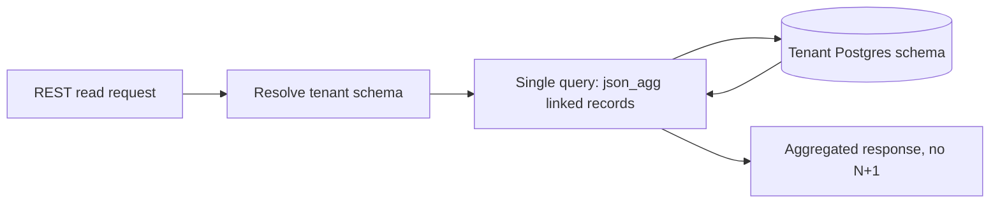

import { Meta } from '@storybook/addon-docs/blocks';

<Meta title="Specs/Dynamic Table Builder/Architecture Diagrams" />

# Architecture Diagrams — Dynamic Table Builder

## DDL request flow (CAP-1, CAP-2, CAP-6)

```mermaid
sequenceDiagram
    participant UI as Frontend builder (CAP-7)
    participant API as Table Builder API
    participant Queue as BullMQ (Redis)
    participant Worker as DDL Worker
    participant PG as Tenant Postgres schema

    UI->>API: create/alter table request
    API->>API: validate request (CAP-3 rules, CAP-8 guardrails)
    API->>Queue: enqueue DDL job (tenant schema, statement plan)
    API-->>UI: 202 accepted, job id
    Queue->>Worker: dispatch job
    Worker->>PG: SET lock_timeout; run DDL via TenantKnexService.forCurrentTenant()
    alt lock acquired within timeout
        PG-->>Worker: DDL applied
        Worker->>PG: write migration record (CAP-5) + metadata row, same transaction
        Worker-->>Queue: job success
    else lock_timeout exceeded
        PG-->>Worker: statement error
        Worker-->>Queue: job failed, retry/backoff
    end
```

Key points this diagram is load-bearing for:

- DDL never executes inline on the request/response path — the API enqueues and returns, the worker executes (CAP-6).
- The worker is the only caller of `TenantKnexService.forCurrentTenant()` for structural changes; DML (row reads/writes) goes through the same tenancy layer but does not require the queue.
- Migration record + metadata row commit in the same transaction as the DDL itself (CAP-1, CAP-5) — a failed DDL never leaves an orphaned metadata row.

## Relation read path (CAP-4)



Linked-record fields resolve in one server-side aggregation query per request, never a per-row follow-up query loop.
