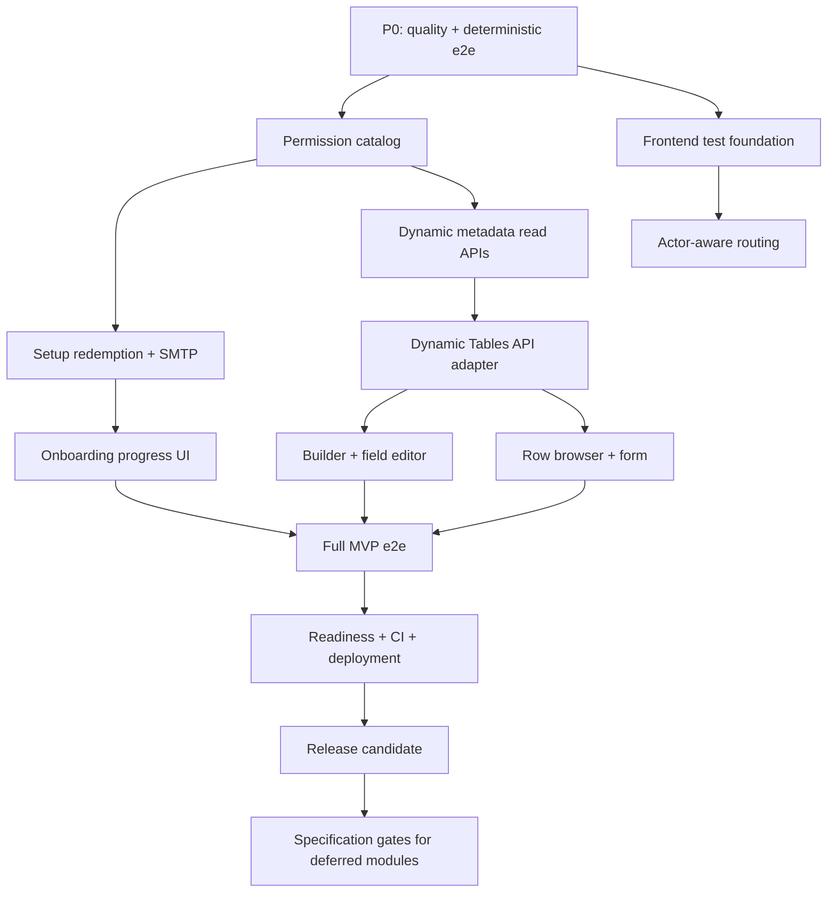

# Phân tích hiện trạng và kế hoạch hoàn thiện Flexi

> Ngày rà soát: 2026-08-25  
> Phạm vi: toàn bộ workspace `Flexi`, không tính dependency và build output.  
> Nguồn sự thật: mã nguồn, migration, test và cấu hình hiện tại. Những yêu cầu
> chưa được code hoặc tài liệu xác nhận được ghi rõ là chưa xác định, không suy
> diễn thành chức năng phải có.

## 1. Kết luận điều hành

Flexi **chưa sẵn sàng phát hành MVP**, dù nền tảng kỹ thuật đã khá tốt. Build
production, Storybook và toàn bộ 318 unit test backend đang qua. Ba vertical
slice có implementation đáng kể là Authentication, Tenant
onboarding/provisioning và Dynamic Tables backend.

Các blocker chính:

1. Tenant-onboarding e2e không ổn định và đang fail thật: concurrent submit có
   thể trả 500 do unique-race; worker tiếp tục chạy sau timeout/cleanup làm
   trạng thái test và dữ liệu bị race.
2. Permission catalog public chưa seed quyền Dynamic Tables. Tenant Admin được
   tạo bởi provisioning chỉ nhận những quyền `TENANT` đã tồn tại, nên trên môi
   trường production mới có thể bị 403 ở toàn bộ API Dynamic Tables.
3. Setup token chỉ được sinh nhưng chưa redeem được; SMTP luôn trả
   `SMTP_NOT_CONFIGURED`. First Admin mới không có đường hoàn tất mật khẩu.
4. Dynamic Tables không có API đọc catalog bảng/field và frontend vẫn là
   placeholder, vì vậy người dùng không thể sử dụng backend đã có.
5. Frontend không có test runner; CI không chạy e2e với Postgres; lint và
   format hiện đang đỏ.
6. Tám module nghiệp vụ vẫn là stub: Workflows, Pages, Cron Jobs, Mail
   Templates, Wiki, dynamic-content i18n, Settings và Logs.

### Ranh giới MVP đề xuất

MVP nên chứng minh được flow hoàn chỉnh:

`System Admin login → onboard tenant → provision → gửi/redeem setup link → Tenant Admin login → tạo/sửa dynamic table → CRUD row`

Các module placeholder không nằm trên critical path này. Trong MVP nên ẩn khỏi
navigation/API công khai thay vì hiển thị chức năng “Not implemented”. Chỉ đưa
từng module trở lại sau khi có specification được duyệt.

## 2. Cách rà soát và số liệu

- 91 file TypeScript backend, 53 file TypeScript/TSX frontend.
- Khoảng 22.104 dòng TypeScript/TSX trong `apps/*/src` và
  `packages/shared-types/src`.
- 20 Prisma model, 12 migration.
- 20 backend unit-test suite; 2 backend e2e suite.
- 18 Storybook story; 0 frontend unit/integration test.
- Quét marker `TODO/FIXME/HACK/TBD`, placeholder, hàm rỗng, route decorator,
  permission, API call, cấu hình môi trường và dependency.
- Đối chiếu flow `UI → API client → controller → service → Prisma/Knex/queue →
response → UI state` cho Authentication, Tenant management và Dynamic
  Tables.

### Kết quả kiểm chứng tự động

| Kiểm tra                                        | Kết quả                 | Nhận xét                                                                                                       |
| ----------------------------------------------- | ----------------------- | -------------------------------------------------------------------------------------------------------------- |
| `pnpm build`                                    | PASS                    | Shared types, Nest và Vite đều build; bundle chính khoảng 497 kB trước gzip.                                   |
| `pnpm test --runInBand`                         | PASS                    | 20/20 suite, 318/318 test. Log ERROR trong một số test là nhánh lỗi có chủ đích.                               |
| `pnpm --filter @flexi/frontend build-storybook` | PASS                    | Storybook build được; có cảnh báo chunk lớn trên 500 kB.                                                       |
| `pnpm lint`                                     | FAIL                    | 4 lỗi trong 3 file: unused params và useless catch.                                                            |
| `pnpm format:check`                             | FAIL                    | 2 spec file chưa đúng Prettier.                                                                                |
| `pnpm editorconfig:check`                       | PASS                    | Quy ước newline/encoding hợp lệ.                                                                               |
| `prisma validate`                               | PASS                    | Prisma schema hợp lệ.                                                                                          |
| `prisma migrate status`                         | FAIL khi chạy trực tiếp | `prisma.config.ts` không tự load `.env`; PASS sau khi source `apps/backend/.env`. DB local có đủ 12 migration. |
| Backend e2e                                     | FAIL                    | 37/40 test qua; 3 test onboarding fail. Dynamic Tables e2e qua.                                                |

Không phát hiện import thiếu hoặc lỗi type vì toàn bộ build đã qua. Không có
hàm production rỗng theo pattern quét; phần chưa làm chủ yếu biểu hiện rõ bằng
`NotImplementedStatus`, placeholder route/page và service trả kết quả cố định.

## 3. Thành phần đã hoàn thành

| Khu vực                    | Trạng thái đã xác nhận                                                                                                                | Bằng chứng chính                                                                                           |
| -------------------------- | ------------------------------------------------------------------------------------------------------------------------------------- | ---------------------------------------------------------------------------------------------------------- |
| Monorepo foundation        | pnpm workspace, shared types CJS/ESM, ESLint, Prettier, EditorConfig, CI cơ bản                                                       | `package.json`, `pnpm-workspace.yaml`, `eslint.config.js`, `.github/workflows/ci.yml`                      |
| Runtime foundation         | Nest global API prefix/envelope/error filter/validation/CORS; Vite React shell; Postgres và Redis compose                             | `apps/backend/src/main.ts`, `apps/backend/src/common/*`, `apps/frontend/src/App.tsx`, `docker-compose.yml` |
| Authentication             | Tenant/system login, JWT access token, rotating refresh token, replay detection, logout, `/auth/me`, throttling                       | `apps/backend/src/modules/auth/*`, `apps/frontend/src/auth/*`, hai login page                              |
| Authorization/tenancy core | JWT actor lookup, permission guard, CLS tenant context, deterministic tenant schema, schema-qualified Knex                            | `apps/backend/src/modules/auth/guards/*`, `apps/backend/src/tenancy/*`                                     |
| Tenant inventory           | System tenant list, status/keyword/date filters, pagination, UI loading/empty/error states                                            | `tenants.service.ts:listTenants`, `TenantsPage.tsx`                                                        |
| Tenant intake              | Slug preflight, validation dùng shared contract, idempotency key, `202 Accepted`, conflict handling                                   | `tenants.controller.ts`, `tenants.service.ts`, `TenantOnboardingPage.tsx`                                  |
| Provisioning               | Postgres-backed BullMQ worker, tenant/schema creation, meta bootstrap, seed, First Admin, setup-token generation, compensation, audit | `provisioning.service.ts`, `provisioning.worker.ts`, `tenant-seed.service.ts`, Prisma onboarding models    |
| Dynamic Tables backend     | Async create/edit DDL, job polling, runtime validation, row CRUD, many-to-one relation, tenant job isolation                          | `dynamic-tables.service.ts`, `ddl-worker.ts`, `tables.controller.ts`, `rows.controller.ts`                 |
| UI foundation              | Responsive shell, design tokens, reusable primitives, EN/VI shell i18n, Storybook states                                              | `apps/frontend/src/components`, `styles/tokens.css`, `src/i18n`, `*.stories.tsx`                           |
| Living specifications      | Authentication, tenant management, Dynamic Tables và current state có traceability                                                    | `apps/frontend/src/docs/specifications/*`, `current-product-state.mdx`                                     |

## 4. Phần dở dang và vấn đề phát hiện

### P0 — Chặn MVP hoặc chặn merge

| Vấn đề                              | Hiện trạng / bằng chứng                                                                                                                                                                     | Ảnh hưởng                                                       |
| ----------------------------------- | ------------------------------------------------------------------------------------------------------------------------------------------------------------------------------------------- | --------------------------------------------------------------- |
| Concurrent idempotency race         | `TenantsService.createOnboardingAttempt()` bắt unique error rồi query winner ngay; e2e nhận Prisma `P2010/23505` nhưng nhánh nhận diện/re-read vẫn có thể không tìm thấy winner và trả 500. | Duplicate click/retry đồng thời không còn idempotent ở mức API. |
| Provisioning timeout không hủy work | Comment tại `provisioning.service.ts:activation()` xác nhận timeout race còn deferred; Promise timeout không hủy flow đang chạy.                                                            | Worker cũ có thể activate trong lúc compensation đánh FAILED.   |
| Onboarding e2e race                 | Test kỳ vọng đúng hai step ngay khi worker đã có thể ghi step thứ ba; cleanup xóa attempt/tenant khi BullMQ job còn chạy, dẫn đến `ECONNRESET` và update record không còn tồn tại.          | CI e2e không deterministic; che khuất race production.          |
| Permission catalog thiếu            | `prisma/seed.ts` chỉ tạo `auth.me.read`, `system.me.read`, `system.tenants.onboard`; Dynamic Tables e2e phải tự tạo ba quyền. Row permissions còn không được e2e seed.                      | User thật bị 403 dù endpoint đã triển khai.                     |
| Lint/format đỏ                      | 4 ESLint error và 2 file lệch Prettier.                                                                                                                                                     | CI hiện tại sẽ fail.                                            |
| Prisma CLI không tự load env        | `prisma.config.ts` đọc `process.env.DATABASE_URL` nhưng không import dotenv.                                                                                                                | Lệnh migration README không chạy trực tiếp trên fresh terminal. |

### P1 — Thiếu để flow MVP chạy end-to-end

| Vấn đề                                    | Hiện trạng / bằng chứng                                                                                                                                                                                                                       | Thành phần cần bổ sung                                                                                                     |
| ----------------------------------------- | --------------------------------------------------------------------------------------------------------------------------------------------------------------------------------------------------------------------------------------------- | -------------------------------------------------------------------------------------------------------------------------- |
| First Admin không claim account được      | `SetupToken` chỉ có `revokedAt`; không endpoint đặt mật khẩu/consume token.                                                                                                                                                                   | `usedAt` hoặc trạng thái tương đương, transaction redeem, DTO/API, public setup page.                                      |
| Không gửi được invite                     | `EmailDeliveryService.sendSetupInvite()` luôn trả `SMTP_NOT_CONFIGURED`; không có `SMTP_*` env. Nghiêm trọng hơn, `generateSetupLink()` đang discard raw token trước khi gọi `sendBackupEmail()`, nên mail service không thể dựng URL redeem. | Giữ token trong memory của đúng job step, truyền thẳng sang SMTP transport, timeout/error mapping và test không rò secret. |
| Không xem tiến trình provisioning         | UI chỉ hiển thị attempt khi submit; không poll attempt/audit.                                                                                                                                                                                 | Read endpoint theo attempt ID và progress page/polling.                                                                    |
| Dynamic Tables không có read metadata API | Chỉ có create, patch field, job status và row CRUD; không `GET /tables`/`GET /tables/:id`.                                                                                                                                                    | Catalog list/detail contract và endpoint; delete/rename cần DDL spec riêng sau MVP.                                        |
| Dynamic Tables frontend là placeholder    | `/dynamic-tables` được map vào `PlaceholderPage`.                                                                                                                                                                                             | API adapter, builder, field editor, row browser/form, job polling states.                                                  |
| Row list không pagination                 | `listRows(tableId)` trả toàn bộ row, không limit/cursor/sort.                                                                                                                                                                                 | Query contract và server-side pagination với max page size.                                                                |
| Guardrail chưa enforce                    | Không giới hạn table/column/page/request; backlog cũng ghi rõ.                                                                                                                                                                                | Env/plan limits và lỗi domain ổn định.                                                                                     |
| Navigation không theo actor/quyền         | System và Tenant actor cùng thấy 11 module; route chỉ kiểm tra đã login.                                                                                                                                                                      | Actor-aware nav và route-level permission gate.                                                                            |
| Frontend không có test runner             | `apps/frontend/package.json` không có `test`; story chỉ kiểm tra render cô lập.                                                                                                                                                               | Vitest + Testing Library, test auth refresh, permissions và API error.                                                     |
| CI không chạy e2e                         | Workflow không có Postgres service, migrate/seed hay `test:e2e`.                                                                                                                                                                              | CI integration job và queue cleanup.                                                                                       |
| Health chỉ là liveness                    | `/health` luôn `{status:'ok'}`, không kiểm tra DB/queue.                                                                                                                                                                                      | Tách liveness/readiness và trả 503 khi dependency lỗi.                                                                     |

### P2 — Nợ kỹ thuật và phạm vi sau MVP

- Comment đầu `schema.prisma` nói row-level, `NOT schema-per-tenant`, trong khi
  runtime Dynamic Tables dùng schema-per-tenant. Đây là tài liệu kiến trúc lỗi
  thời, không phải behavior runtime.
- `AppModule` vẫn gọi tất cả feature là `stub-only` dù Auth/Tenants/Dynamic
  Tables đã có implementation.
- `auth` và `dynamic-tables` vẫn giữ legacy placeholder endpoint bên cạnh API
  thật; tenant cũng giữ `GET /api/tenants` placeholder.
- Redis được compose/start nhưng BullMQ hiện dùng PostgreSQL backend; `REDIS_URL`
  không được module nào dùng.
- Nest package đang lệch major (`@nestjs/core` 11 trong khi common/platform/
  testing 10); React 18 dùng `@types/react-dom` 19. Build hiện qua nhưng nên
  đồng bộ trước release.
- Vite/Storybook báo chunk lớn; router import tất cả page đồng bộ.
- Chưa có production Docker/compose/deployment contract, metrics, structured
  audit/query UI, password reset, user/role/permission administration.
- Workflows, Pages, Cron Jobs, Mail Templates, Wiki, dynamic i18n, Settings và
  Logs chỉ có module/controller/service stub; frontend tương ứng là
  `PlaceholderPage`. Prisma model chỉ chứng minh data shape, không chứng minh
  quy tắc nghiệp vụ hoặc UX.

## 5. Trình tự phụ thuộc

## 6. Task breakdown

Mỗi task dưới đây chỉ chạm tối đa 1–3 file liên quan trực tiếp. `pnpm-lock.yaml`
được tính là một file khi thay dependency. Không gộp task nếu việc gộp làm vượt
giới hạn này.

| Task  | Ưu tiên | Phụ thuộc | Kết quả                                                      |
| ----- | ------- | --------- | ------------------------------------------------------------ |
| 1–3   | P0      | —         | CI quality gate xanh và Prisma CLI dùng được trực tiếp.      |
| 4–6   | P0      | 1–3       | Onboarding idempotency/worker/e2e deterministic.             |
| 7–8   | P0      | 4         | Permission catalog đầy đủ và đúng scope/action.              |
| 9–11  | P0/P1   | 1         | Frontend có test và route/nav đúng actor/quyền.              |
| 12–13 | P1      | 4–8       | Readiness và e2e CI đáng tin cậy.                            |
| 14–17 | P1      | 7         | First Admin redeem setup token từ UI.                        |
| 18–20 | P1      | 14–17     | Invite được gửi qua SMTP có kiểm soát lỗi.                   |
| 21–23 | P1      | 4–6       | Theo dõi provisioning từ UI.                                 |
| 24–28 | P1      | 7, 9      | Contract, metadata API và row pagination cho Dynamic Tables. |
| 29–35 | P1      | 22–28     | Dynamic Tables frontend hoàn chỉnh theo critical path.       |
| 36–37 | P1      | 22–35     | Guardrail và e2e toàn flow.                                  |
| 38–44 | P1/P2   | 12, 37    | Hardening, tài liệu, CI và deployment.                       |
| 45–53 | P2 gate | MVP RC    | Chốt requirement trước khi thay stub bằng code.              |

## 7. Bộ sub-prompts thực thi

### Nhóm A — Ổn định baseline

#### [TASK 1: Sửa toàn bộ lỗi ESLint hiện tại] - DONE

- Target files: `apps/backend/src/modules/tenants/email-delivery.service.ts`, `apps/backend/src/modules/tenants/tenants.service.ts`, `apps/backend/src/modules/tenants/tenant-seed.service.spec.ts`
- Description: Loại bỏ unused parameters mà không che lỗi bằng disable rule; bỏ useless catch trong test; giữ nguyên public method signatures và behavior. Chạy `pnpm lint` và các unit test liên quan.
- Constraints: Không thay đổi logic SMTP, onboarding hoặc tenant seed; không dùng `eslint-disable` để lách lỗi; thêm error handling nếu refactor tạo nhánh bất đồng bộ mới.

#### [TASK 2: Chuẩn hóa hai spec file theo Prettier] - DONE

- Target files: `apps/backend/src/modules/dynamic-tables/dynamic-tables.service.spec.ts`, `apps/backend/src/modules/tenants/provisioning.service.spec.ts`
- Description: Chạy Prettier chỉ trên hai file, kiểm tra diff không đổi assertion/fixture, sau đó chạy `pnpm format:check` và hai test suite.
- Constraints: Không đổi logic test hoặc production; không format hàng loạt file ngoài scope.

#### [TASK 3: Cho Prisma CLI tự load backend env] - DONE

- Target files: `apps/backend/prisma.config.ts`, `apps/backend/package.json`, `pnpm-lock.yaml`
- Description: Thêm dependency dotenv trực tiếp và load `apps/backend/.env` trong Prisma config để `prisma migrate status/dev/deploy` chạy từ script workspace mà không cần source shell thủ công. Xác minh khi `DATABASE_URL` shell không được export.
- Constraints: Không log connection string; không hard-code credential; giữ CI env override hoạt động và không thay Prisma schema/migration.

#### [TASK 4: Sửa race idempotency của concurrent onboarding submit] - DONE

- Target files: `apps/backend/src/modules/tenants/tenants.service.ts`, `apps/backend/src/modules/tenants/tenants.service.spec.ts`, `apps/backend/test/app.e2e-spec.ts`
- Description: Chuẩn hóa nhận diện unique violation từ Prisma raw query, xử lý visibility race bằng chiến lược insert/upsert hoặc bounded re-read, trả cùng attempt cho hai payload giống nhau và 409 cho payload khác. Bổ sung unit/e2e lặp concurrent case để không còn 500.
- Constraints: Không bỏ unique constraint; không tạo duplicate attempt/job; không retry vô hạn; không lộ raw DB error; giữ response `replayed` chính xác.

#### [TASK 5: Loại bỏ provisioning timeout/activation race] - DONE

- Target files: `apps/backend/src/modules/tenants/provisioning.worker.ts`, `apps/backend/src/modules/tenants/provisioning.worker.spec.ts`, `apps/backend/src/modules/tenants/provisioning.service.ts`
- Description: Thiết kế cooperative cancellation/fencing token hoặc persisted lease để flow đã timeout không thể tiếp tục ghi step/activate sau compensation. Test worker timeout, retry và stale activation.
- Constraints: Không chỉ bọc thêm `Promise.race`; phải chặn side effect stale; giữ job idempotent; tenant FAILED không được quay lại ACTIVE; mọi lỗi phải được audit an toàn.

#### [TASK 6: Làm tenant-onboarding e2e deterministic] - DONE

- Target files: `apps/backend/test/app.e2e-spec.ts`
- Description: Thay assertion snapshot step cứng bằng wait/expect phù hợp eventual consistency; theo dõi và chờ toàn bộ job terminal trước cleanup; cleanup theo ID của run hiện tại và đóng app/queue theo thứ tự. Chạy suite nhiều lần liên tiếp.
- Constraints: Không tăng timeout tùy tiện để che race; không làm assertion yếu đi đối với status, idempotency, compensation và dữ liệu nhạy cảm.

#### [TASK 7: Tạo permission catalog chuẩn cho MVP] - DONE

- Target files: `packages/shared-types/src/permissions.ts`, `apps/backend/prisma/seed.ts`, `apps/backend/prisma/migrations/<timestamp>_seed_mvp_permissions/migration.sql`
- Description: Khai báo canonical permission codes cho tenant read/onboard/setup-link và toàn bộ Dynamic Tables table/field/job/row actions; migration idempotent upsert catalog ở production; local seed dùng cùng constants và cấp các quyền tenant cho demo Admin.
- Constraints: SYSTEM permission không được gán cho tenant role; migration không phụ thuộc demo account; không xóa permission hiện có; giữ natural key `Permission.code`.

#### [TASK 8: Tách quyền đọc tenant, onboarding và setup-link]

- Target files: `apps/backend/src/modules/tenants/tenants.controller.ts`, `apps/backend/src/modules/tenants/tenants.controller.spec.ts`, `apps/frontend/src/auth/permissions.ts`
- Description: Dùng permission riêng cho list tenant, onboarding/slug preflight và regenerate setup link; bổ sung helper frontend tương ứng và test 401/403/allowed cho từng endpoint.
- Constraints: Không dùng một quyền onboard cho mọi thao tác; vẫn bắt buộc System actor; không tạo super-admin bypass.

### Nhóm B — Frontend quality và authorization

#### [TASK 9: Thiết lập frontend test runner]

- Target files: `apps/frontend/package.json`, `apps/frontend/vite.config.ts`, `apps/frontend/src/test/setup.ts`
- Description: Thêm Vitest, jsdom và Testing Library; cấu hình alias/environment/setup; thêm scripts `test` và `test:coverage` tương thích `pnpm test` workspace.
- Constraints: Không thay Storybook config; không đưa test dependency vào production bundle; giữ Vite build hiện tại.

#### [TASK 10: Test auth bootstrap, refresh và API error]

- Target files: `apps/frontend/src/lib/api-client.spec.ts`, `apps/frontend/src/auth/AuthContext.spec.tsx`
- Description: Cover single-flight refresh, retry đúng một lần, refresh failure clear session, network/non-JSON error normalization, boot từ refresh token, login tenant/system và logout lỗi vẫn clear local state.
- Constraints: Mock network/localStorage có cleanup; không gọi backend thật; không assert implementation detail không cần thiết; không làm thay đổi production code ngoài task riêng nếu test phát hiện bug.

#### [TASK 11: Ẩn và chặn route theo actor/permission]

- Target files: `apps/frontend/src/modules.ts`, `apps/frontend/src/components/Sidebar.tsx`, `apps/frontend/src/router.tsx`
- Description: Gắn audience/permission metadata vào navigation; System actor chỉ thấy tenant administration, Tenant actor thấy Dynamic Tables; các stub module bị ẩn trong MVP; direct URL sai quyền render PermissionDenied thay vì chỉ dựa vào sidebar.
- Constraints: Không coi ẩn menu là authorization backend; giữ `/login`, `/admin/login`, 404 và mobile navigation ổn định; không hiển thị placeholder như feature khả dụng.

#### [TASK 12: Bổ sung readiness check]

- Target files: `apps/backend/src/modules/health/health.service.ts`, `apps/backend/src/modules/health/health.controller.ts`, `apps/backend/src/modules/health/health.service.spec.ts`
- Description: Giữ liveness nhẹ và thêm readiness kiểm tra Prisma DB cùng queue storage PostgreSQL ở mức an toàn; dependency lỗi trả 503 với status tổng hợp, không lộ connection detail.
- Constraints: Không biến liveness thành DB-dependent; có timeout ngắn; không log credential; test success, timeout và dependency failure.

#### [TASK 13: Chạy integration/e2e trong CI]

- Target files: `.github/workflows/ci.yml`
- Description: Thêm Postgres service/healthcheck, env test secrets, migrate deploy, seed fixture an toàn nếu cần và `pnpm --filter @flexi/backend test:e2e --runInBand`; giữ unit/build/lint/format là gate riêng dễ đọc.
- Constraints: Không dùng production secret; không phụ thuộc Redis khi queue backend là Postgres; luôn cleanup resource/job; chỉ thực hiện sau Task 4–8 để tránh CI flaky.

### Nhóm C — Hoàn tất First Admin handoff

#### [TASK 14: Mở rộng SetupToken cho one-time redemption]

- Target files: `apps/backend/prisma/schema.prisma`, `apps/backend/prisma/migrations/<timestamp>_setup_token_redemption/migration.sql`, `packages/shared-types/src/entities.ts`
- Description: Thêm trạng thái consumption (`usedAt` hoặc field tương đương) và shared request/response types; index phục vụ lookup/revocation; migration tương thích token cũ.
- Constraints: Không lưu raw token; không tái sử dụng token đã used/revoked/expired; migration forward-only và không mất dữ liệu.

#### [TASK 15: Viết domain logic redeem setup token]

- Target files: `apps/backend/src/modules/tenants/setup-link.service.ts`, `apps/backend/src/modules/tenants/setup-link.service.spec.ts`, `apps/backend/src/modules/tenants/dto/redeem-setup-token.dto.ts`
- Description: Hash token input, tìm token còn hiệu lực, validate password, transaction cập nhật bcrypt password + TenantUser từ `pending_setup` sang active + mark used/revoke sibling tokens. Test happy path, invalid, expired, revoked, reused và concurrent redemption.
- Constraints: Response lỗi không tiết lộ token tồn tại hay không; không log token/password; transaction atomic; password policy thống nhất với auth.

#### [TASK 16: Expose public setup redemption endpoint]

- Target files: `apps/backend/src/modules/tenants/tenants.service.ts`, `apps/backend/src/modules/tenants/tenants.controller.ts`, `apps/backend/src/modules/tenants/tenants.controller.spec.ts`
- Description: Thêm public endpoint redeem chỉ nhận DTO đã validate và delegate domain service; trả status/envelope ổn định; invalid/expired/reused token dùng một error contract không tiết lộ identity.
- Constraints: Không yêu cầu JWT vì user chưa claim account; không trả auth token tự động nếu chưa có requirement; không lộ tenant/account identity khi token sai.

#### [TASK 17: Tạo trang hoàn tất tài khoản]

- Target files: `apps/frontend/src/pages/SetupAccountPage.tsx`, `apps/frontend/src/pages/SetupAccountPage.stories.tsx`, `apps/frontend/src/router.tsx`
- Description: Public route đọc token từ URL, form password/confirm, client validation, submit redemption, states loading/success/expired/generic error và link về tenant login.
- Constraints: Không ghi token vào localStorage/log/analytics; không hiển thị token; story cover các trạng thái; không auto-login nếu backend không trả session.

#### [TASK 18: Thêm SMTP dependency và validation]

- Target files: `apps/backend/package.json`, `pnpm-lock.yaml`, `apps/backend/src/config/env.validation.ts`
- Description: Thêm mail transport library và validate SMTP host/port/auth/from/TLS/timeout; production fail-fast khi email bắt buộc, test/development có thể explicit disable.
- Constraints: Không có credential mặc định; không log password; giữ startup testable; package major tương thích Node 20.

#### [TASK 19: Cập nhật mẫu cấu hình SMTP]

- Target files: `.env.example`, `apps/backend/.env.example`
- Description: Tài liệu hóa đầy đủ SMTP vars, chế độ disable local, sender, timeout/TLS và setup URL base dùng để tạo link public.
- Constraints: Chỉ dùng placeholder an toàn; root/backend example phải nhất quán; không commit secret thật.

#### [TASK 20: Truyền setup token an toàn và gửi invite qua SMTP]

- Target files: `apps/backend/src/modules/tenants/provisioning.service.ts`, `apps/backend/src/modules/tenants/email-delivery.service.ts`, `apps/backend/src/modules/tenants/email-delivery.service.spec.ts`
- Description: Không discard kết quả `SetupLinkService.generate()`: chỉ giữ raw token trong memory của lần chạy hiện tại, truyền trực tiếp sang mail service để dựng setup URL; tạo transporter một lần, gửi subject/body tối thiểu, map timeout/auth/rejection thành error code ổn định và giữ email là bước non-blocking. Test delivered, disabled, timeout, provider failure và không log token; chạy thêm provisioning suite để bắt regression orchestration.
- Constraints: Không persist/log raw setup token hoặc URL; không retry vô hạn trong request/worker; escape tenant name; mail failure không được activate/compensate sai contract hiện tại; full-job retry phải rotate token đúng behavior đã định nghĩa.

### Nhóm D — Hiển thị tiến trình provisioning

#### [TASK 21: Thêm API đọc onboarding attempt]

- Target files: `apps/backend/src/modules/tenants/tenants.service.ts`, `apps/backend/src/modules/tenants/tenants.controller.ts`, `apps/backend/src/modules/tenants/tenants.service.spec.ts`
- Description: Thêm System-only endpoint đọc attempt theo ID với step outcomes, terminal status và safe audit summary; 404 khi không tồn tại; dùng permission read phù hợp.
- Constraints: Không trả raw setup token, password, stack, SQL hoặc request secret; không cho Tenant actor đọc; preserve append-only audit semantics.

#### [TASK 22: Test controller cho attempt status API]

- Target files: `apps/backend/src/modules/tenants/tenants.controller.spec.ts`, `apps/backend/test/app.e2e-spec.ts`
- Description: Cover allowed/401/403/404, status chuyển accepted→provisioning→terminal và response redaction; e2e poll bằng bounded timeout.
- Constraints: Không dựa vào số lượng step tại một thời điểm race-prone; cleanup chỉ sau terminal.

#### [TASK 23: Tạo màn hình provisioning progress]

- Target files: `apps/frontend/src/pages/TenantProvisioningPage.tsx`, `apps/frontend/src/pages/TenantProvisioningPage.stories.tsx`, `apps/frontend/src/router.tsx`
- Description: Poll attempt status với backoff/cancel, render timeline từng step, terminal success/failure/manual-cleanup và retry load; điều hướng từ onboarding success bằng attempt ID.
- Constraints: Dừng poll khi unmount/terminal; không hiển thị technical secret; direct URL phải qua System permission gate.

### Nhóm E — Dynamic Tables API còn thiếu

#### [TASK 24: Chuẩn hóa shared Dynamic Tables contracts]

- Target files: `packages/shared-types/src/entities.ts`, `packages/shared-types/src/permissions.ts`
- Description: Thêm DTO cho table catalog/detail, field definition, DDL job, row page/query và mutation result; export permission constants thay literal rải rác.
- Constraints: Contract phản ánh chính xác `_meta_*` runtime, không nhầm với Prisma `DynamicTable/DynamicField` public models; không export internal queue payload.

#### [TASK 25: Thêm metadata list/detail API]

- Target files: `apps/backend/src/modules/dynamic-tables/dynamic-tables.service.ts`, `apps/backend/src/modules/dynamic-tables/tables.controller.ts`, `apps/backend/src/modules/dynamic-tables/dynamic-tables.service.spec.ts`
- Description: Query `_meta_tables/_meta_fields` trong current tenant cho list/detail, pagination catalog và dùng permission read riêng. Trả shared DTO đủ để frontend dựng builder/row form.
- Constraints: Mọi query schema-qualified qua TenantKnexService; không dùng raw tenant header; không đụng Prisma metadata model lỗi thời; không đưa delete/rename vào task khi DDL contract chưa được thiết kế riêng.

#### [TASK 26: Test metadata read controller và tenant isolation]

- Target files: `apps/backend/src/modules/dynamic-tables/tables.controller.spec.ts`, `apps/backend/test/dynamic-tables.e2e-spec.ts`
- Description: Test route/status/permission cho list/detail; e2e xác minh field metadata và tenant A không đọc catalog tenant B.
- Constraints: Không bỏ job tenant check hiện có; cleanup schema/job sau terminal; 404 không tiết lộ cross-tenant existence.

#### [TASK 27: Thêm server-side row pagination]

- Target files: `apps/backend/src/modules/dynamic-tables/dynamic-tables.types.ts`, `apps/backend/src/modules/dynamic-tables/dynamic-tables.service.ts`, `apps/backend/src/modules/dynamic-tables/dynamic-tables.service.spec.ts`
- Description: Đổi list row sang page/cursor contract có stable sort theo primary key, page-size default/max, total hoặc next cursor; reject invalid query; không load toàn bộ table.
- Constraints: Chỉ cho sort/filter field đã có metadata; bindings parameterized; không cho identifier injection; giữ relation shaping và validation cache.

#### [TASK 28: Expose row query contract ở controller]

- Target files: `apps/backend/src/modules/dynamic-tables/rows.controller.ts`, `apps/backend/src/modules/dynamic-tables/rows.controller.spec.ts`
- Description: Parse/validate query pagination/sort/filter, truyền typed query vào service và trả shared page DTO; test default, boundary, invalid và permission.
- Constraints: Không silently clamp giá trị âm/NaN; max page size enforce ở server; giữ CRUD route hiện tại tương thích.

### Nhóm F — Dynamic Tables frontend

#### [TASK 29: Bổ sung HTTP verbs và API adapter Dynamic Tables]

- Target files: `apps/frontend/src/lib/api-client.ts`, `apps/frontend/src/lib/dynamic-tables-api.ts`, `apps/frontend/src/lib/dynamic-tables-api.spec.ts`
- Description: Thêm `apiPatch/apiDelete`, adapter typed cho catalog/job/fields/rows và test URL/body/envelope/error/abort; không để page tự ghép endpoint.
- Constraints: Tái sử dụng refresh single-flight; DELETE 204 xử lý được body rỗng; không duplicate shared DTO.

#### [TASK 30: Thay placeholder bằng Dynamic Tables catalog page]

- Target files: `apps/frontend/src/pages/DynamicTablesPage.tsx`, `apps/frontend/src/pages/DynamicTablesPage.stories.tsx`, `apps/frontend/src/router.tsx`
- Description: Hiển thị table catalog với loading/empty/error/retry, open detail/rows và CTA create theo permission.
- Constraints: Không gọi API trong story; request cũ phải abort; route chỉ cho Tenant actor có quyền read; không ảnh hưởng TenantsPage.

#### [TASK 31: Tạo table builder form]

- Target files: `apps/frontend/src/components/dynamic-tables/TableBuilderForm.tsx`, `apps/frontend/src/components/dynamic-tables/TableBuilderForm.stories.tsx`, `apps/frontend/src/pages/DynamicTablesPage.tsx`
- Description: Form name/description/ít nhất một field, chọn non-relation data type, required/config validation; submit create job và poll đến terminal rồi refresh catalog.
- Constraints: Không cho RELATION lúc create; disable duplicate submit; poll bounded/cancellable; hiển thị error code an toàn.

#### [TASK 32: Tạo field editor]

- Target files: `apps/frontend/src/components/dynamic-tables/FieldEditor.tsx`, `apps/frontend/src/components/dynamic-tables/FieldEditor.stories.tsx`, `apps/frontend/src/pages/DynamicTablesPage.tsx`
- Description: Add/remove/modify field, relation target selector, cảnh báo destructive type change, submit batch edit và theo dõi job.
- Constraints: Tuân thủ backend rule không convert to/from RELATION bằng modify; confirm remove/destructive action; không optimistic-update trước job complete.

#### [TASK 33: Tạo row browser]

- Target files: `apps/frontend/src/pages/DynamicTableRowsPage.tsx`, `apps/frontend/src/pages/DynamicTableRowsPage.stories.tsx`, `apps/frontend/src/router.tsx`
- Description: Render columns từ metadata, server pagination, loading/empty/error, view/edit/delete row và relation display; URL chứa tableId rõ ràng.
- Constraints: Không render JSON/HTML không escape; abort request khi đổi page/table; permission gate read/delete; không load toàn bộ row.

#### [TASK 34: Tạo dynamic row form]

- Target files: `apps/frontend/src/components/dynamic-tables/DynamicRowForm.tsx`, `apps/frontend/src/components/dynamic-tables/DynamicRowForm.stories.tsx`, `apps/frontend/src/pages/DynamicTableRowsPage.tsx`
- Description: Sinh control theo `FieldDataType`, required/config/enum/range validation, relation picker, create/update states và map server field errors.
- Constraints: Không dùng `any`; JSON field parse an toàn; date/datetime timezone rõ; không gửi field không có metadata; preserve false/0/null semantics.

#### [TASK 35: Hoàn thiện EN/VI copy cho MVP flow]

- Target files: `apps/frontend/src/i18n/locales/en.json`, `apps/frontend/src/i18n/locales/vi.json`
- Description: Thêm copy cho setup account, provisioning timeline, Dynamic Tables builder/rows, permission denied và error states; kiểm tra key parity hai locale.
- Constraints: Không hard-code UI text trong component; thuật ngữ tenant/table/field nhất quán; JSON qua Prettier.

#### [TASK 36: Enforce Dynamic Tables guardrails]

- Target files: `apps/backend/src/config/env.validation.ts`, `apps/backend/src/modules/dynamic-tables/dynamic-tables.service.ts`, `apps/backend/src/modules/dynamic-tables/dynamic-tables.service.spec.ts`
- Description: Cấu hình/enforce max tables per tenant, fields per table, mutation payload size/page size và rõ error codes; count trong current tenant schema trước enqueue.
- Constraints: Default hữu hạn, positive integer; không race-create vượt limit (dùng transaction/advisory lock phù hợp); không hard-code plan entitlement chưa có requirement.

#### [TASK 37: Mở rộng Dynamic Tables e2e thành full MVP flow]

- Target files: `apps/backend/test/dynamic-tables.e2e-spec.ts`
- Description: Với permission catalog thật, test create table → job complete → list/detail → edit field → CRUD + paginate row → relation → delete; thêm cross-tenant và guardrail cases.
- Constraints: Không tự seed permission ad hoc khác production; poll bounded; cleanup schema/jobs; không phụ thuộc thứ tự test.

### Nhóm G — Release hardening

#### [TASK 38: Enforce production env/CORS policy]

- Target files: `apps/backend/src/config/env.validation.ts`, `apps/backend/src/config/env.validation.spec.ts`, `apps/backend/src/main.ts`
- Description: Khi `NODE_ENV=production`, bắt buộc CORS allowlist, secret mạnh và email/setup URL theo chính sách MVP; normalize origin và reject config mâu thuẫn lúc startup.
- Constraints: Local/test vẫn dễ chạy; không log secret; không cho wildcard production ngầm định.

#### [TASK 39: Lazy-load page routes]

- Target files: `apps/frontend/src/router.tsx`, `apps/frontend/vite.config.ts`
- Description: Dùng React lazy/Suspense cho page-level routes và manual chunks hợp lý nếu cần; đo lại Vite/Storybook build để giảm main chunk/cảnh báo.
- Constraints: Không lazy-load AuthContext hoặc primitive nhỏ vô ích; có accessible loading fallback; không làm hỏng Storybook.

#### [TASK 40: Đồng bộ major dependency]

- Target files: `apps/backend/package.json`, `apps/frontend/package.json`, `pnpm-lock.yaml`
- Description: Chọn một Nest major đồng nhất cho core/common/platform/testing/schematics, đồng bộ React DOM types với React 18, chạy install/build/unit/e2e.
- Constraints: Không upgrade major ngoài phạm vi; ghi breaking changes; không dùng `--force` để bỏ qua peer mismatch.

#### [TASK 41: Sửa tài liệu kiến trúc lỗi thời]

- Target files: `apps/backend/prisma/schema.prisma`, `apps/backend/src/app.module.ts`, `apps/frontend/src/docs/current-product-state.mdx`
- Description: Mô tả đúng hybrid architecture: public Prisma identity/control plane + per-tenant schema cho dynamic/runtime data; bỏ comment `stub-only` sai; cập nhật trạng thái sau MVP bằng traceability tới code/test.
- Constraints: Không đổi Prisma model trong task docs; dùng Storybook specification conventions; không tuyên bố capability chưa có test.

#### [TASK 42: Chốt CI release gates]

- Target files: `.github/workflows/ci.yml`
- Description: Sau các task trên, chạy editorconfig, build, lint, format, unit, frontend tests, backend e2e và Storybook build; upload coverage/log khi fail; cache pnpm đúng cách.
- Constraints: Job timeout hữu hạn; không che flaky test bằng retry toàn suite; không expose secret; branch protection dựa vào các job rõ tên.

#### [TASK 43: Tạo production container images]

- Target files: `apps/backend/Dockerfile`, `apps/frontend/Dockerfile`, `apps/frontend/nginx.conf`
- Description: Multi-stage build pnpm workspace, runtime non-root, backend production start và frontend static SPA fallback; healthcheck phù hợp.
- Constraints: Không copy `.env`/dev secret vào image; pin base major; minimize image; frontend API base strategy phải được ghi rõ.

#### [TASK 44: Tạo production compose và runbook]

- Target files: `docker-compose.prod.yml`, `docs/deployment.md`
- Description: Wire backend/frontend/Postgres, migration one-shot, volumes, health/readiness dependencies, env contract, backup/restore và rollback migration procedure.
- Constraints: Không dùng credential mặc định; không publish DB ra internet; không chạy demo seed; destructive rollback phải có backup/checkpoint.

### Nhóm H — Specification gates sau MVP

Các task 45–53 là bắt buộc trước khi viết code cho phần còn lại. Code hiện tại
chỉ có model/stub nên chưa đủ bằng chứng để tự quyết workflow, validation,
permission, lifecycle hoặc UX. Sau khi từng spec được duyệt, chia implementation
thành các task backend service/controller/test và frontend page/story/router,
mỗi task vẫn tối đa ba file.

#### [TASK 45: Chốt spec password recovery và account administration]

- Target files: `apps/frontend/src/docs/specifications/authentication.mdx`
- Description: Bổ sung requirement được stakeholder xác nhận cho forgot/reset password, session revocation, user activation/deactivation và account admin; ghi API, permission, expiry, audit và acceptance criteria.
- Constraints: Không invent requirement; đánh dấu `Not confirmed from current implementation` cho quyết định chưa chốt; chưa sửa production code.

#### [TASK 46: Chốt spec Workflows]

- Target files: `apps/frontend/src/docs/specifications/workflows.mdx`
- Description: Xác nhận trigger/action model, draft/publish/run lifecycle, retry/idempotency, permission và audit trước khi thay stub.
- Constraints: Không suy diễn từ cột JSON `definition`; chưa sửa controller/service/page.

#### [TASK 47: Chốt spec Pages]

- Target files: `apps/frontend/src/docs/specifications/pages.mdx`
- Description: Xác nhận page builder schema, route ownership, draft/publish/versioning, component allowlist và permission.
- Constraints: Không biến Prisma `definition` thành contract khi chưa duyệt; chưa sửa production code.

#### [TASK 48: Chốt spec Cron Jobs]

- Target files: `apps/frontend/src/docs/specifications/cron-jobs.mdx`
- Description: Xác nhận timezone, cron validation, target type, overlap policy, retry, disable/run-now, history và permission.
- Constraints: Không tự chọn scheduler/backend; chưa sửa production code.

#### [TASK 49: Chốt spec Mail Templates]

- Target files: `apps/frontend/src/docs/specifications/mail-templates.mdx`
- Description: Xác nhận template language, variable allowlist, preview/test send, localization, versioning và quan hệ với setup SMTP Task 20.
- Constraints: Không cho template thực thi code; không trộn credential management vào content CRUD; chưa sửa production code.

#### [TASK 50: Chốt spec Wiki]

- Target files: `apps/frontend/src/docs/specifications/wiki.mdx`
- Description: Xác nhận hierarchy, slug/path, editor format, draft/publish, search, move/delete behavior và permission.
- Constraints: Không suy diễn cascade từ self relation hiện tại; chưa sửa production code.

#### [TASK 51: Chốt spec dynamic-content i18n]

- Target files: `apps/frontend/src/docs/specifications/dynamic-i18n.mdx`
- Description: Xác nhận tenant/global scope, locale fallback, namespace/key ownership, cache invalidation, import/export và permission.
- Constraints: Phân biệt rõ shell i18next hiện có với DB Translation model; chưa sửa production code.

#### [TASK 52: Chốt spec Settings]

- Target files: `apps/frontend/src/docs/specifications/settings.mdx`
- Description: Xác nhận catalog key/type/default, tenant/system scope, secret handling, validation, effective-value resolution và audit.
- Constraints: Không expose secret qua generic CRUD; không coi tenant-schema seed table là public API; chưa sửa production code.

#### [TASK 53: Chốt spec Logs và observability]

- Target files: `apps/frontend/src/docs/specifications/logs.mdx`
- Description: Xác nhận nguồn log, retention, tenant isolation, filter/pagination/export, PII redaction và quan hệ giữa audit log với operational log.
- Constraints: Không lưu access/setup token, password, raw SQL hoặc stack nhạy cảm; chưa sửa production code.

## 8. Definition of Done cho MVP

Một release candidate chỉ được coi là hoàn tất khi:

- `pnpm build`, `pnpm lint`, `pnpm format:check`, `pnpm editorconfig:check` qua.
- Backend unit test, frontend test và backend e2e qua ổn định nhiều lần.
- Fresh database migrate được bằng command tài liệu hóa, không cần thao tác env
  ẩn; permission catalog có đủ dữ liệu production.
- Flow MVP từ System Admin đến Dynamic Row chạy bằng UI thật, không cần Prisma
  Studio/cURL hoặc sửa DB tay.
- Setup token one-time, hết hạn/revoke/reuse đúng; không có secret trong log,
  response ngoài contract hoặc localStorage.
- Cross-tenant test chứng minh không đọc job/catalog/row của tenant khác.
- Readiness phản ánh DB/queue; production CORS/env fail-fast; container chạy
  non-root và không chứa secret.
- Navigation không quảng bá module placeholder. Tài liệu current state khớp
  code/test tại commit release.

## 9. Thứ tự duyệt đề xuất

1. Duyệt và chạy Task 1–8 trước; đây là baseline và sửa lỗi production/e2e.
2. Chạy song song Task 9–13 sau khi baseline xanh.
3. Chọn hai track độc lập: First Admin handoff (14–20) và Dynamic Tables
   backend contract (24–28); progress API (21–23) có thể chạy cùng.
4. Chỉ bắt đầu UI Dynamic Tables 29–35 khi shared/API contract đã ổn định.
5. Chạy 36–44 để tạo release candidate.
6. Sau MVP, duyệt từng specification gate 45–53 rồi mới tạo implementation
   task chi tiết; không triển khai đồng loạt tám module chưa có requirement.
